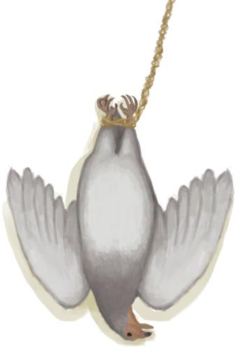
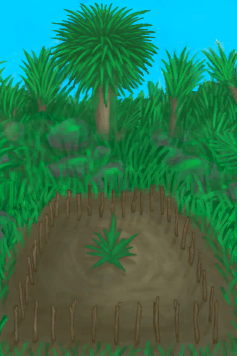

# 成就  
  

<table style="margin-bottom:0px;"><tr><td rowspan=3 style="width:120px"></td><td style="font-size:1.3em"><b>Irresistible</b></td></tr><tr><td>在一轮游戏中同时被鲨鱼、蜥蜴、猕猴咬伤</tr><tr><td><b>达成条件：</b>

[

[鲨鱼咬伤](W_SharkBite.md)](W_SharkBite.md)x1&nbsp;&nbsp;&nbsp;&nbsp;[

[猕猴咬伤](W_MacaqueBite.md)](W_MacaqueBite.md)x1&nbsp;&nbsp;&nbsp;&nbsp;[

[巨蜥咬伤](W_MonitorBite.md)](W_MonitorBite.md)x1

  
  
</td></tr></table>
  

<table style="margin-bottom:0px;"><tr><td rowspan=3 style="width:120px"></td><td style="font-size:1.3em"><b>Not The Bees!</b></td></tr><tr><td>被蜜蜂团团围住</tr><tr><td><b>达成条件：</b>

啊——！ [

[一群蜜蜂！(事件)](Event_BeesSwarming.md)](Event_BeesSwarming.md)

  
  
</td></tr></table>
  

<table style="margin-bottom:0px;"><tr><td rowspan=3 style="width:120px"></td><td style="font-size:1.3em"><b>Complete Collection</b></td></tr><tr><td>雕刻5种不同的木制手办</tr><tr><td><b>达成条件：</b>

[

[山羊木雕](WoodCarving_Goat.md)](WoodCarving_Goat.md)x1&nbsp;&nbsp;&nbsp;&nbsp;[

[小人木雕（男）](WoodCarving_Man.md)](WoodCarving_Man.md)x1&nbsp;&nbsp;&nbsp;&nbsp;[

[神灵木雕](WoodCarving_Monster.md)](WoodCarving_Monster.md)x1&nbsp;&nbsp;&nbsp;&nbsp;[

[海鸥木雕](WoodCarving_Seagull.md)](WoodCarving_Seagull.md)x1&nbsp;&nbsp;&nbsp;&nbsp;[

[小人木雕（女）](WoodCarving_Woman.md)](WoodCarving_Woman.md)x1

  
  
</td></tr></table>
  

<table style="margin-bottom:0px;"><tr><td rowspan=3 style="width:120px"></td><td style="font-size:1.3em"><b>I Don't Feel So Good...</b></td></tr><tr><td>发烧</tr><tr><td><b>达成条件：</b>

[

[发烧](Fever.md)](Fever.md): <b>301～999999</b>

  
  
</td></tr></table>
  

<table style="margin-bottom:0px;"><tr><td rowspan=3 style="width:120px"></td><td style="font-size:1.3em"><b>Survivor A La Carte</b></td></tr><tr><td>创建一名自定义角色</tr></table>
  

<table style="margin-bottom:0px;"><tr><td rowspan=3 style="width:120px"></td><td style="font-size:1.3em"><b>Spiritual Victory</b></td></tr><tr><td>击败猎手</tr><tr><td><b>达成条件：</b>

[

[猎手被击败了！(事件)](Event_HunterFightSuccess.md)](Event_HunterFightSuccess.md)x1

  
  
</td></tr></table>
  

<table style="margin-bottom:0px;"><tr><td rowspan=3 style="width:120px"></td><td style="font-size:1.3em"><b>All Is Love</b></td></tr><tr><td>从圣光中获得灵视</tr><tr><td><b>达成条件：</b>

[

[神圣灵视(事件)](Event_GodExperience1a.md)](Event_GodExperience1a.md)x1

  
  
</td></tr></table>
  

<table style="margin-bottom:0px;"><tr><td rowspan=3 style="width:120px"></td><td style="font-size:1.3em"><b>BOOM!</b></td></tr><tr><td>使用炸‍葯！</tr><tr><td><b>达成条件：</b>

Boom! [

[铜矿脉(洞穴上层)](CopperVein.md)](CopperVein.md)&nbsp;&nbsp;&nbsp;&nbsp;Boom! [

[狭窄通道(洞穴底层)](CrystalChamberEntranceClosed.md)](CrystalChamberEntranceClosed.md)&nbsp;&nbsp;&nbsp;&nbsp;Boom! [

[狭窄通道(潮湿洞穴)](DarkCaveCaveEntranceClosed.md)](DarkCaveCaveEntranceClosed.md)&nbsp;&nbsp;&nbsp;&nbsp;Boom! [

[狭窄通道(洞穴中层)](DarkChamberCaveEntranceClosed.md)](DarkChamberCaveEntranceClosed.md)&nbsp;&nbsp;&nbsp;&nbsp;Boom! [

[狭窄通道(洞穴上层)](FloodedChamberEntranceClosed.md)](FloodedChamberEntranceClosed.md)&nbsp;&nbsp;&nbsp;&nbsp;Boom! [

[狭窄通道(隧道)](HighChamberEntranceClosed.md)](HighChamberEntranceClosed.md)&nbsp;&nbsp;&nbsp;&nbsp;Boom! [

[坍塌的隧道入口(东部高地)](TunnelEntranceClosed.md)](TunnelEntranceClosed.md)&nbsp;&nbsp;&nbsp;&nbsp;Boom! [

[海(环礁)](Sea_Atoll.md)](Sea_Atoll.md)&nbsp;&nbsp;&nbsp;&nbsp;Boom! [

[海(海湾)](Sea_Bay.md)](Sea_Bay.md)&nbsp;&nbsp;&nbsp;&nbsp;Boom! [

[海(沙滩)](Sea_Beach.md)](Sea_Beach.md)&nbsp;&nbsp;&nbsp;&nbsp;Boom! [

[海水(覆溺洞穴)](Sea_Cave.md)](Sea_Cave.md)&nbsp;&nbsp;&nbsp;&nbsp;Boom! [

[海(沙滩)](Sea_Cove.md)](Sea_Cove.md)&nbsp;&nbsp;&nbsp;&nbsp;Boom! [

[海(荒芜沙滩)](Sea_DesolateBeach.md)](Sea_DesolateBeach.md)&nbsp;&nbsp;&nbsp;&nbsp;Boom! [

[海(红树林)](Sea_Mangroves.md)](Sea_Mangroves.md)&nbsp;&nbsp;&nbsp;&nbsp;Boom! [

[海](Sea_Raft.md)](Sea_Raft.md)&nbsp;&nbsp;&nbsp;&nbsp;Boom! [

[海(鸟岩岛)](Sea_Rocks.md)](Sea_Rocks.md)&nbsp;&nbsp;&nbsp;&nbsp;Revenge! [

[猕猴窝(丛林高地)](MacaqueDenEntrance.md)](MacaqueDenEntrance.md)

  
  
</td></tr></table>
  

<table style="margin-bottom:0px;"><tr><td rowspan=3 style="width:120px"></td><td style="font-size:1.3em"><b>Island Gourmet</b></td></tr><tr><td>吃一顿做好的料理</tr><tr><td><b>达成条件：</b>

食用 [

[热带烤鸡](IslandChicken.md)](IslandChicken.md)&nbsp;&nbsp;&nbsp;&nbsp;食用 [

[黄油焗牡蛎](OysterMeatBaked.md)](OysterMeatBaked.md)&nbsp;&nbsp;&nbsp;&nbsp;食用 [

[姜糖](CandiedGinger.md)](CandiedGinger.md)&nbsp;&nbsp;&nbsp;&nbsp;食用 [

[炸鱼薯条](FishNChips.md)](FishNChips.md)&nbsp;&nbsp;&nbsp;&nbsp;食用 [

[鱼肉蛋饼](FishOmelette.md)](FishOmelette.md)&nbsp;&nbsp;&nbsp;&nbsp;食用 [

[炸香蕉](FriedBanana.md)](FriedBanana.md)&nbsp;&nbsp;&nbsp;&nbsp;食用 [

[炖羊汤](GoatStew.md)](GoatStew.md)&nbsp;&nbsp;&nbsp;&nbsp;食用 [

[肉食盛宴](HeartyFeast.md)](HeartyFeast.md)&nbsp;&nbsp;&nbsp;&nbsp;食用 [

[蜜糖](HoneyCandy.md)](HoneyCandy.md)&nbsp;&nbsp;&nbsp;&nbsp;食用 [

[蜜汁火腿](HoneyGlazedPork.md)](HoneyGlazedPork.md)&nbsp;&nbsp;&nbsp;&nbsp;食用 [

[辣炒巨蜥肉](LizardFry.md)](LizardFry.md)&nbsp;&nbsp;&nbsp;&nbsp;食用 [

[猕猴肉串](MacaqueSkewers.md)](MacaqueSkewers.md)&nbsp;&nbsp;&nbsp;&nbsp;食用 [

[蛋白棒](ProteinBar.md)](ProteinBar.md)&nbsp;&nbsp;&nbsp;&nbsp;食用 [

[西米蛋糕](SagoCake.md)](SagoCake.md)&nbsp;&nbsp;&nbsp;&nbsp;饮用 [

[骨头汤](BoneBroth.md)](BoneBroth.md)&nbsp;&nbsp;&nbsp;&nbsp;食用 [

[参薯咖喱](YamCurry.md)](YamCurry.md)&nbsp;&nbsp;&nbsp;&nbsp;食用 [

[参薯酱](YamJam.md)](YamJam.md)&nbsp;&nbsp;&nbsp;&nbsp;食用 [

[椰子鱼](CoconutFish.md)](CoconutFish.md)

  
  
</td></tr></table>
  

<table style="margin-bottom:0px;"><tr><td rowspan=3 style="width:120px"></td><td style="font-size:1.3em"><b>Welcome to the Island!</b></td></tr><tr><td>喝点椰汁吃点椰肉</tr><tr><td><b>达成条件：</b>

食用 [

[椰肉](CoconutMeat.md)](CoconutMeat.md)&nbsp;&nbsp;&nbsp;&nbsp;饮用 [

[椰子水](LQ_CoconutWater.md)](LQ_CoconutWater.md)

  
  
</td></tr></table>
  

<table style="margin-bottom:0px;"><tr><td rowspan=3 style="width:120px"></td><td style="font-size:1.3em"><b>True Spelunker</b></td></tr><tr><td>探索洞穴系统</tr><tr><td><b>达成条件：</b>

[

[覆溺洞穴(环境)](Env_FloodedChamber.md)](Env_FloodedChamber.md)x1&nbsp;&nbsp;&nbsp;&nbsp;[

[晶石洞穴(环境)](Env_CrystalChamber.md)](Env_CrystalChamber.md)x1&nbsp;&nbsp;&nbsp;&nbsp;[

[洞穴上层(环境)](Env_HighChamber.md)](Env_HighChamber.md)x1&nbsp;&nbsp;&nbsp;&nbsp;[

[隧道(环境)](Env_Tunnel.md)](Env_Tunnel.md)x1&nbsp;&nbsp;&nbsp;&nbsp;[

[洞穴中层(环境)](Env_MidChamber.md)](Env_MidChamber.md)x1&nbsp;&nbsp;&nbsp;&nbsp;[

[阴暗洞穴(环境)](Env_DarkChamber.md)](Env_DarkChamber.md)x1&nbsp;&nbsp;&nbsp;&nbsp;[

[洞穴底层(环境)](Env_LowChamber.md)](Env_LowChamber.md)x1&nbsp;&nbsp;&nbsp;&nbsp;[

[狭窄通道(环境)](Env_NarrowTunnel.md)](Env_NarrowTunnel.md)x1&nbsp;&nbsp;&nbsp;&nbsp;[

[潮湿洞穴(环境)](Env_DampChamber.md)](Env_DampChamber.md)x1&nbsp;&nbsp;&nbsp;&nbsp;[

[幽暗洞穴(环境)](Env_CaveDark.md)](Env_CaveDark.md)x1

  
  
</td></tr></table>
  

<table style="margin-bottom:0px;"><tr><td rowspan=3 style="width:120px"></td><td style="font-size:1.3em"><b>True Explorer</b></td></tr><tr><td>探索岛屿</tr><tr><td><b>达成条件：</b>

[

[地区探索完毕(事件)](Event_AcidLakeExplored.md)](Event_AcidLakeExplored.md)x1&nbsp;&nbsp;&nbsp;&nbsp;[

[地区探索完毕(事件)(海湾)](Event_BayExplored.md)](Event_BayExplored.md)x1&nbsp;&nbsp;&nbsp;&nbsp;[

[地区探索完毕(事件)(沙滩)](Event_BeachExplored.md)](Event_BeachExplored.md)x1&nbsp;&nbsp;&nbsp;&nbsp;[

[地区探索完毕(事件)(鸟岩岛)](Event_BirdRockExplored.md)](Event_BirdRockExplored.md)x1&nbsp;&nbsp;&nbsp;&nbsp;[

[地区探索完毕(事件)](Event_CoveExplored.md)](Event_CoveExplored.md)x1&nbsp;&nbsp;&nbsp;&nbsp;[

[地区探索完毕(事件)(丛林深处)](Event_DeepJungleExplored.md)](Event_DeepJungleExplored.md)x1&nbsp;&nbsp;&nbsp;&nbsp;[

[地区探索完毕(事件)(荒芜沙滩)](Event_DesolateBeachExplored.md)](Event_DesolateBeachExplored.md)x1&nbsp;&nbsp;&nbsp;&nbsp;[

[地区探索完毕(事件)(东部草原)](Event_GrasslandsEExplored.md)](Event_GrasslandsEExplored.md)x1&nbsp;&nbsp;&nbsp;&nbsp;[

[地区探索完毕(事件)(西部草原)](Event_GrasslandsWExplored.md)](Event_GrasslandsWExplored.md)x1&nbsp;&nbsp;&nbsp;&nbsp;[

[地区探索完毕(事件)(东部高地)](Event_HighlandsEExplored.md)](Event_HighlandsEExplored.md)x1&nbsp;&nbsp;&nbsp;&nbsp;[

[地区探索完毕(事件)(西部高地)](Event_HighlandsWExplored.md)](Event_HighlandsWExplored.md)x1&nbsp;&nbsp;&nbsp;&nbsp;[

[地区探索完毕(事件)](Event_JungleExplored.md)](Event_JungleExplored.md)x1&nbsp;&nbsp;&nbsp;&nbsp;[

[地区探索完毕(事件)(丛林高地)](Event_JungleHighlandsExplored.md)](Event_JungleHighlandsExplored.md)x1&nbsp;&nbsp;&nbsp;&nbsp;[

[地区探索完毕(事件)(红树林)](Event_MangrovesExplored.md)](Event_MangrovesExplored.md)x1&nbsp;&nbsp;&nbsp;&nbsp;[

[地区探索完毕(事件)](Event_OutskirtsExplored.md)](Event_OutskirtsExplored.md)x1&nbsp;&nbsp;&nbsp;&nbsp;[

[地区探索完毕(事件)](Event_RocksExplored.md)](Event_RocksExplored.md)x1&nbsp;&nbsp;&nbsp;&nbsp;[

[地区探索完毕(事件)(神秘谷)](Event_SecretValleyExplored.md)](Event_SecretValleyExplored.md)x1&nbsp;&nbsp;&nbsp;&nbsp;[

[地区探索完毕(事件)](Event_VolcanoExplored.md)](Event_VolcanoExplored.md)x1&nbsp;&nbsp;&nbsp;&nbsp;[

[地区探索完毕(事件)(湿地)](Event_WetlandsExplored.md)](Event_WetlandsExplored.md)x1

  
  
</td></tr></table>
  

<table style="margin-bottom:0px;"><tr><td rowspan=3 style="width:120px"></td><td style="font-size:1.3em"><b>Reflection</b></td></tr><tr><td>直面监视者</tr><tr><td><b>达成条件：</b>

[

[监视者(事件)](Event_WatchedExperience1gGod.md)](Event_WatchedExperience1gGod.md)x1&nbsp;&nbsp;&nbsp;&nbsp;[

[监视者(事件)](Event_WatchedExperience1gVoid.md)](Event_WatchedExperience1gVoid.md)x1

  
  
</td></tr></table>
  

<table style="margin-bottom:0px;"><tr><td rowspan=3 style="width:120px"></td><td style="font-size:1.3em"><b>Treasure Hunting</b></td></tr><tr><td>发现沉船</tr><tr><td><b>达成条件：</b>

[

[沉船(鸟岩岛)](Shipwreck.md)](Shipwreck.md)x1

  
  
</td></tr></table>
  

<table style="margin-bottom:0px;"><tr><td rowspan=3 style="width:120px"></td><td style="font-size:1.3em"><b>RIP</b></td></tr><tr><td>第一次死去</tr><tr><td><b>达成条件：</b>

游戏失败

  
  
</td></tr></table>
  

<table style="margin-bottom:0px;"><tr><td rowspan=3 style="width:120px"></td><td style="font-size:1.3em"><b>Goat Farmer</b></td></tr><tr><td>繁育山羊</tr><tr><td><b>达成条件：</b>

[

[小羊](GoatEnclosureKid.md)](GoatEnclosureKid.md)x1

  
  
</td></tr></table>
  

<table style="margin-bottom:0px;"><tr><td rowspan=3 style="width:120px"></td><td style="font-size:1.3em"><b>Partridge Farmer</b></td></tr><tr><td>孵化一只灰山鹑蛋</tr><tr><td><b>达成条件：</b>

[

[小灰山鹑](PartridgeChick.md)](PartridgeChick.md)x1

  
  
</td></tr></table>
  

<table style="margin-bottom:0px;"><tr><td rowspan=3 style="width:120px"></td><td style="font-size:1.3em"><b>Big Game</b></td></tr><tr><td>猎杀一头大型动物</tr><tr><td><b>达成条件：</b>

[

[野猪尸体](BoarCarcass.md)](BoarCarcass.md)x1&nbsp;&nbsp;&nbsp;&nbsp;[

[巨蜥尸体](MonitorCarcass.md)](MonitorCarcass.md)x1&nbsp;&nbsp;&nbsp;&nbsp;[

[山羊尸体(母)](GoatCarcassFemale.md)](GoatCarcassFemale.md)x1&nbsp;&nbsp;&nbsp;&nbsp;[

[山羊尸体(公)](GoatCarcassMale.md)](GoatCarcassMale.md)x1&nbsp;&nbsp;&nbsp;&nbsp;[

[母山羊](GoatTiedFemale.md)](GoatTiedFemale.md)x1&nbsp;&nbsp;&nbsp;&nbsp;[

[公山羊](GoatTiedMale.md)](GoatTiedMale.md)x1

  
  
</td></tr></table>
  

<table style="margin-bottom:0px;"><tr><td rowspan=3 style="width:120px"></td><td style="font-size:1.3em"><b>Small Game</b></td></tr><tr><td>猎杀一只小型动物</tr><tr><td><b>达成条件：</b>

[

[眼镜蛇尸体](CobraDead.md)](CobraDead.md)x1&nbsp;&nbsp;&nbsp;&nbsp;[

[灰山鹑尸体](PartridgeDead.md)](PartridgeDead.md)x1&nbsp;&nbsp;&nbsp;&nbsp;[

[海鸥尸体](SeagullDead.md)](SeagullDead.md)x1&nbsp;&nbsp;&nbsp;&nbsp;[

[雌灰山鹑](PartridgeFemaleLive.md)](PartridgeFemaleLive.md)x1&nbsp;&nbsp;&nbsp;&nbsp;[

[雄灰山鹑](PartridgeMaleLive.md)](PartridgeMaleLive.md)x1

  
  
</td></tr></table>
  

<table style="margin-bottom:0px;"><tr><td rowspan=3 style="width:120px"></td><td style="font-size:1.3em"><b>Monkey Business</b></td></tr><tr><td>交个猕猴朋友</tr><tr><td><b>达成条件：</b>

[

[猕猴朋友](MacaqueFriend.md)](MacaqueFriend.md)x1

  
  
</td></tr></table>
  

<table style="margin-bottom:0px;"><tr><td rowspan=3 style="width:120px"></td><td style="font-size:1.3em"><b>Secret of Fire</b></td></tr><tr><td>搭建一个营火</tr><tr><td><b>达成条件：</b>

[

[营火(熄灭)](CampfireExtinguished.md)](CampfireExtinguished.md)x1

  
  
</td></tr></table>
  

<table style="margin-bottom:0px;"><tr><td rowspan=3 style="width:120px"></td><td style="font-size:1.3em"><b>Bronze Age</b></td></tr><tr><td>制作一个铜制工具</tr><tr><td><b>达成条件：</b>

[

[铜斧](AxeCopper.md)](AxeCopper.md)x1&nbsp;&nbsp;&nbsp;&nbsp;[

[铜刀](KnifeCopper.md)](KnifeCopper.md)x1&nbsp;&nbsp;&nbsp;&nbsp;[

[铜铲](ShovelCopper.md)](ShovelCopper.md)x1

  
  
</td></tr></table>
  

<table style="margin-bottom:0px;"><tr><td rowspan=3 style="width:120px"></td><td style="font-size:1.3em"><b>Homo Habilis</b></td></tr><tr><td>制作一个燧石工具</tr><tr><td><b>达成条件：</b>

[

[燧石斧](AxeFlint.md)](AxeFlint.md)x1&nbsp;&nbsp;&nbsp;&nbsp;[

[燧石刀](KnifeFlint.md)](KnifeFlint.md)x1

  
  
</td></tr></table>
  

<table style="margin-bottom:0px;"><tr><td rowspan=3 style="width:120px"></td><td style="font-size:1.3em"><b>Home Sweet Home</b></td></tr><tr><td>建造一座泥屋</tr><tr><td><b>达成条件：</b>

[

[泥屋](MudHutEntrance.md)](MudHutEntrance.md)x1

  
  
</td></tr></table>
  

<table style="margin-bottom:0px;"><tr><td rowspan=3 style="width:120px"></td><td style="font-size:1.3em"><b>High Fashion</b></td></tr><tr><td>制作一条珍珠项链</tr><tr><td><b>达成条件：</b>

[

[珍珠项链](PearlNecklace.md)](PearlNecklace.md)x1

  
  
</td></tr></table>
  

<table style="margin-bottom:0px;"><tr><td rowspan=3 style="width:120px"></td><td style="font-size:1.3em"><b>BFF</b></td></tr><tr><td>交一个朋友</tr><tr><td><b>达成条件：</b>

[

[韦斯顿](Weston.md)](Weston.md)x1

  
  
</td></tr></table>
  

<table style="margin-bottom:0px;"><tr><td rowspan=3 style="width:120px"></td><td style="font-size:1.3em"><b>Master Archer</b></td></tr><tr><td>箭术技能登峰造极</tr><tr><td><b>达成条件：</b>

[

[箭术(技能)](Skill_Archery.md)](Skill_Archery.md): <b>150～999999</b>

  
  
</td></tr></table>
  

<table style="margin-bottom:0px;"><tr><td rowspan=3 style="width:120px"></td><td style="font-size:1.3em"><b>Master Climber</b></td></tr><tr><td>攀爬技能登峰造极</tr><tr><td><b>达成条件：</b>

[

[攀爬(技能)](Skill_Climbing.md)](Skill_Climbing.md): <b>150～999999</b>

  
  
</td></tr></table>
  

<table style="margin-bottom:0px;"><tr><td rowspan=3 style="width:120px"></td><td style="font-size:1.3em"><b>Master Chef</b></td></tr><tr><td>烹饪技能登峰造极</tr><tr><td><b>达成条件：</b>

[

[烹饪(技能)](Skill_Cooking.md)](Skill_Cooking.md): <b>150～999999</b>

  
  
</td></tr></table>
  

<table style="margin-bottom:0px;"><tr><td rowspan=3 style="width:120px"></td><td style="font-size:1.3em"><b>Master Craftsman</b></td></tr><tr><td>制作技能登峰造极</tr><tr><td><b>达成条件：</b>

[

[制作(技能)](Skill_Crafting.md)](Skill_Crafting.md): <b>150～999999</b>

  
  
</td></tr></table>
  

<table style="margin-bottom:0px;"><tr><td rowspan=3 style="width:120px"></td><td style="font-size:1.3em"><b>Explosive Diarrhoea</b></td></tr><tr><td>腹泻值达到最大</tr><tr><td><b>达成条件：</b>

[

[腹泻](Diarrhoea.md)](Diarrhoea.md): <b>300～999999</b>

  
  
</td></tr></table>
  

<table style="margin-bottom:0px;"><tr><td rowspan=3 style="width:120px"></td><td style="font-size:1.3em"><b>Master Percussionist</b></td></tr><tr><td>打鼓技能登峰造极</tr><tr><td><b>达成条件：</b>

[

[击鼓(技能)](Skill_Percussion.md)](Skill_Percussion.md): <b>150～999999</b>

  
  
</td></tr></table>
  

<table style="margin-bottom:0px;"><tr><td rowspan=3 style="width:120px"></td><td style="font-size:1.3em"><b>Master Fisherman</b></td></tr><tr><td>钓鱼技能登峰造极</tr><tr><td><b>达成条件：</b>

[

[钓鱼(技能)](Skill_Fishing.md)](Skill_Fishing.md): <b>150～999999</b>

  
  
</td></tr></table>
  

<table style="margin-bottom:0px;"><tr><td rowspan=3 style="width:120px"></td><td style="font-size:1.3em"><b>Master Herbologist</b></td></tr><tr><td>草薬技能登峰造极</tr><tr><td><b>达成条件：</b>

[

[薬草学(技能)](Skill_Herbology.md)](Skill_Herbology.md): <b>150～999999</b>

  
  
</td></tr></table>
  

<table style="margin-bottom:0px;"><tr><td rowspan=3 style="width:120px"></td><td style="font-size:1.3em"><b>Master Knapper</b></td></tr><tr><td>石工技能登峰造极</tr><tr><td><b>达成条件：</b>

[

[石工(技能)](Skill_Knapping.md)](Skill_Knapping.md): <b>150～999999</b>

  
  
</td></tr></table>
  

<table style="margin-bottom:0px;"><tr><td rowspan=3 style="width:120px"></td><td style="font-size:1.3em"><b>Master Spearman</b></td></tr><tr><td>矛战技能登峰造极</tr><tr><td><b>达成条件：</b>

[

[矛战(技能)](Skill_SpearFighting.md)](Skill_SpearFighting.md): <b>150～999999</b>

  
  
</td></tr></table>
  

<table style="margin-bottom:0px;"><tr><td rowspan=3 style="width:120px"></td><td style="font-size:1.3em"><b>Master Spearfisher</b></td></tr><tr><td>叉鱼技能登峰造极</tr><tr><td><b>达成条件：</b>

[

[叉鱼(技能)](Skill_SpearFishing.md)](Skill_SpearFishing.md): <b>150～999999</b>

  
  
</td></tr></table>
  

<table style="margin-bottom:0px;"><tr><td rowspan=3 style="width:120px"></td><td style="font-size:1.3em"><b>Master Swimmer</b></td></tr><tr><td>游泳技能登峰造极</tr><tr><td><b>达成条件：</b>

[

[游泳(技能)](Skill_Swimming.md)](Skill_Swimming.md): <b>150～999999</b>

  
  
</td></tr></table>
  

<table style="margin-bottom:0px;"><tr><td rowspan=3 style="width:120px"></td><td style="font-size:1.3em"><b>Master Tailor</b></td></tr><tr><td>纺织技能登峰造极</tr><tr><td><b>达成条件：</b>

[

[纺织(技能)](Skill_Tailoring.md)](Skill_Tailoring.md): <b>150～999999</b>

  
  
</td></tr></table>
  

<table style="margin-bottom:0px;"><tr><td rowspan=3 style="width:120px"></td><td style="font-size:1.3em"><b>Master Trapper</b></td></tr><tr><td>陷阱技能登峰造极</tr><tr><td><b>达成条件：</b>

[

[陷阱(技能)](Skill_Trapping.md)](Skill_Trapping.md): <b>150～999999</b>

  
  
</td></tr></table>
  

<table style="margin-bottom:0px;"><tr><td rowspan=3 style="width:120px"></td><td style="font-size:1.3em"><b>Master Carpenter</b></td></tr><tr><td>木工技能登峰造极</tr><tr><td><b>达成条件：</b>

[

[木工(技能)](Skill_Woodworking.md)](Skill_Woodworking.md): <b>150～999999</b>

  
  
</td></tr></table>
  

<table style="margin-bottom:0px;"><tr><td rowspan=3 style="width:120px"></td><td style="font-size:1.3em"><b>Plants For The Future</b></td></tr><tr><td>种植一株作物</tr><tr><td><b>达成条件：</b>

[

[杏仁树田](CropPlotAlmondTree.md)](CropPlotAlmondTree.md)x1&nbsp;&nbsp;&nbsp;&nbsp;[

[芦荟田](CropPlotAloeVera.md)](CropPlotAloeVera.md)x1&nbsp;&nbsp;&nbsp;&nbsp;[

[香蕉树田](CropPlotBananaTree.md)](CropPlotBananaTree.md)x1&nbsp;&nbsp;&nbsp;&nbsp;[

[辣椒田](CropPlotChilies.md)](CropPlotChilies.md)x1&nbsp;&nbsp;&nbsp;&nbsp;[

[月季田](CropPlotChinaRose.md)](CropPlotChinaRose.md)x1&nbsp;&nbsp;&nbsp;&nbsp;[

[金鸡纳树田](CropPlotCinchonaTree.md)](CropPlotCinchonaTree.md)x1&nbsp;&nbsp;&nbsp;&nbsp;[

[咖啡田](CropPlotCoffee.md)](CropPlotCoffee.md)x1&nbsp;&nbsp;&nbsp;&nbsp;[

[姜田](CropPlotGinger.md)](CropPlotGinger.md)x1&nbsp;&nbsp;&nbsp;&nbsp;[

[茉莉花田](CropPlotJasmine.md)](CropPlotJasmine.md)x1&nbsp;&nbsp;&nbsp;&nbsp;[

[卡瓦胡椒田](CropPlotKava.md)](CropPlotKava.md)x1&nbsp;&nbsp;&nbsp;&nbsp;[

[柠檬草田](CropPlotLemonGrass.md)](CropPlotLemonGrass.md)x1&nbsp;&nbsp;&nbsp;&nbsp;[

[芒果树田](CropPlotMangoTree.md)](CropPlotMangoTree.md)x1&nbsp;&nbsp;&nbsp;&nbsp;[

[水椰树田](CropPlotNipaPalm.md)](CropPlotNipaPalm.md)x1&nbsp;&nbsp;&nbsp;&nbsp;[

[棕榈丛田](CropPlotPalmBush.md)](CropPlotPalmBush.md)x1&nbsp;&nbsp;&nbsp;&nbsp;[

[椰子树田](CropPlotPalmTree.md)](CropPlotPalmTree.md)x1&nbsp;&nbsp;&nbsp;&nbsp;[

[稻田](CropPlotRice.md)](CropPlotRice.md)x1&nbsp;&nbsp;&nbsp;&nbsp;[

[西米树田](CropPlotSagoPalm.md)](CropPlotSagoPalm.md)x1&nbsp;&nbsp;&nbsp;&nbsp;[

[蛇草田](CropPlotSnakeGrass.md)](CropPlotSnakeGrass.md)x1&nbsp;&nbsp;&nbsp;&nbsp;[

[蜘蛛兰田](CropPlotSpiderLily.md)](CropPlotSpiderLily.md)x1&nbsp;&nbsp;&nbsp;&nbsp;[

[大叶仙茅田](CropPlotWeevilLily.md)](CropPlotWeevilLily.md)x1&nbsp;&nbsp;&nbsp;&nbsp;[

[野枣田](CropPlotWildJujube.md)](CropPlotWildJujube.md)x1&nbsp;&nbsp;&nbsp;&nbsp;[

[参薯田](CropPlotYam.md)](CropPlotYam.md)x1

  
  
</td></tr></table>
  

<table style="margin-bottom:0px;"><tr><td rowspan=3 style="width:120px"></td><td style="font-size:1.3em"><b>Return To Monke</b></td></tr><tr><td>拥有6位猕猴朋友并使猕猴窝的舒适度达到最大</tr><tr><td><b>达成条件：</b>

[

[舒适度](Comfort.md)](Comfort.md): <b>1751～999999</b>

[

[猕猴朋友](MacaqueFriend.md)](MacaqueFriend.md)x6

  
  
</td></tr></table>
  

<table style="margin-bottom:0px;"><tr><td rowspan=3 style="width:120px"></td><td style="font-size:1.3em"><b>Speedrun</b></td></tr><tr><td>在60天内完成一轮游戏</tr><tr><td><b>达成条件：</b>

[计数](Counter.md): <b>0～5760</b>

通关游戏

  
  
</td></tr></table>
  

<table style="margin-bottom:0px;"><tr><td rowspan=3 style="width:120px"></td><td style="font-size:1.3em"><b>Day 1</b></td></tr><tr><td>存活一天</tr><tr><td><b>达成条件：</b>

[计数](Counter.md): <b>96～999999</b>

  
  
</td></tr></table>
  

<table style="margin-bottom:0px;"><tr><td rowspan=3 style="width:120px"></td><td style="font-size:1.3em"><b>Day 30</b></td></tr><tr><td>存活一月</tr><tr><td><b>达成条件：</b>

[计数](Counter.md): <b>2880～999999</b>

  
  
</td></tr></table>
  

<table style="margin-bottom:0px;"><tr><td rowspan=3 style="width:120px"></td><td style="font-size:1.3em"><b>Day 7</b></td></tr><tr><td>存活一周</tr><tr><td><b>达成条件：</b>

[计数](Counter.md): <b>672～999999</b>

  
  
</td></tr></table>
  

<table style="margin-bottom:0px;"><tr><td rowspan=3 style="width:120px"></td><td style="font-size:1.3em"><b>Hard Mode</b></td></tr><tr><td>用至少1万难度的自定义角色通关一场游戏</tr><tr><td><b>达成条件：</b>

通关游戏

  
  
</td></tr></table>
  

<table style="margin-bottom:0px;"><tr><td rowspan=3 style="width:120px"></td><td style="font-size:1.3em"><b>Farmer Victory</b></td></tr><tr><td>用农妇角色赢得一场游戏</tr><tr><td><b>达成条件：</b>

使用 [农夫](Farmer.md)

通关游戏

  
  
</td></tr></table>
  

<table style="margin-bottom:0px;"><tr><td rowspan=3 style="width:120px"></td><td style="font-size:1.3em"><b>Hunter Victory</b></td></tr><tr><td>用猎人角色赢得一场游戏</tr><tr><td><b>达成条件：</b>

使用 [猎人](Hunter.md)

通关游戏

  
  
</td></tr></table>
  

<table style="margin-bottom:0px;"><tr><td rowspan=3 style="width:120px"></td><td style="font-size:1.3em"><b>Mermaid Victory</b></td></tr><tr><td>用人鱼角色赢得一场游戏</tr><tr><td><b>达成条件：</b>

使用 [人鱼](Mermaid.md)

通关游戏

  
  
</td></tr></table>
  

<table style="margin-bottom:0px;"><tr><td rowspan=3 style="width:120px"></td><td style="font-size:1.3em"><b>Tourist Victory</b></td></tr><tr><td>用游客角色赢得一场游戏</tr><tr><td><b>达成条件：</b>

使用 [游客](Tourist.md)

通关游戏

  
  
</td></tr></table>
  

<table style="margin-bottom:0px;"><tr><td rowspan=3 style="width:120px"></td><td style="font-size:1.3em"><b>All Is Nothing</b></td></tr><tr><td>从虚空中获得灵视</tr><tr><td><b>达成条件：</b>

[

[虚空灵视(事件)](Event_VoidExperience1a.md)](Event_VoidExperience1a.md)x1

  
  
</td></tr></table>
  

<table style="margin-bottom:0px;"><tr><td rowspan=3 style="width:120px"></td><td style="font-size:1.3em"><b>What Just Happened?</b></td></tr><tr><td>韦斯顿回应了你</tr><tr><td><b>达成条件：</b>

[

[韦斯顿(Special1a)(事件)](Event_WestonSpecial1a.md)](Event_WestonSpecial1a.md)x1

  
  
</td></tr></table>
  

