# 区域  
## 室外  
> [室外环境对比](outdoor.md)
  

<a href="Enclosure.md" style="color:black">畜栏</a>

<a href="Jungle.md" style="color:black">丛林</a>

<a href="Outskirts.md" style="color:black">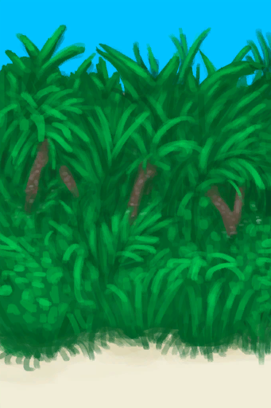丛林边缘</a>

<a href="JungleHighlands.md" style="color:black">丛林高地</a>

<a href="DeepJungle.md" style="color:black">丛林深处</a>

<a href="GrasslandsE.md" style="color:black">东部草原</a>

<a href="HighlandsEastern.md" style="color:black">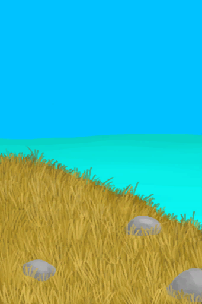东部高地</a>

<a href="HighlandHole.md" style="color:black">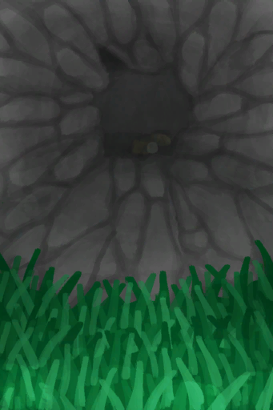高地坑洞</a>

<a href="Bay.md" style="color:black">海湾</a>

<a href="Mangroves.md" style="color:black">红树林</a>

<a href="Atoll.md" style="color:black">环礁</a>

<a href="DesolateBeach.md" style="color:black">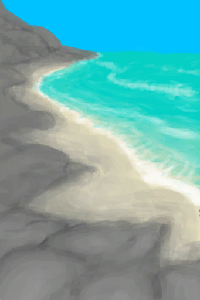荒芜沙滩</a>

<a href="Volcano.md" style="color:black">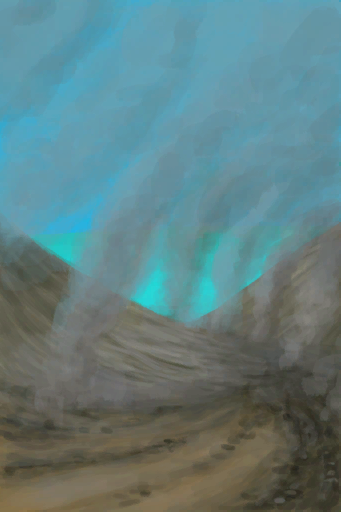火山</a>

<a href="Raft.md" style="color:black">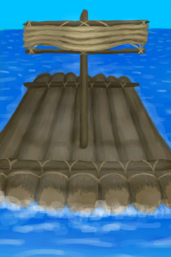木筏</a>

<a href="BirdRock.md" style="color:black">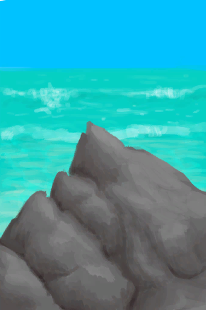鸟岩岛</a>

<a href="Beach.md" style="color:black">沙滩</a>

<a href="SecretValley.md" style="color:black">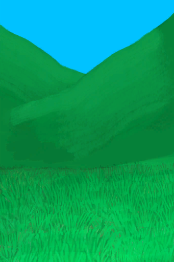神秘谷</a>

<a href="Wetlands.md" style="color:black">湿地丛林</a>

<a href="AcidLake.md" style="color:black">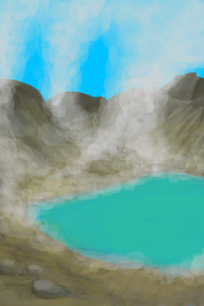酸湖</a>

<a href="GrasslandsW.md" style="color:black">西部草原</a>

<a href="HighlandsWestern.md" style="color:black">西部高地</a>

<a href="Rocks.md" style="color:black">岩滩</a>

<a href="Cove.md" style="color:black">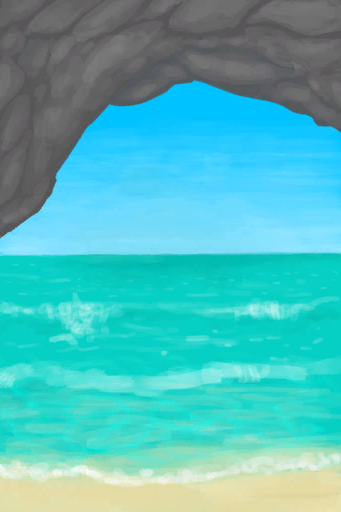隐秘港湾</a>

  
  
## 室内  
> [室内环境对比](tag_EnvIndoors.md)
  

<a href="CaveBats.md" style="color:black">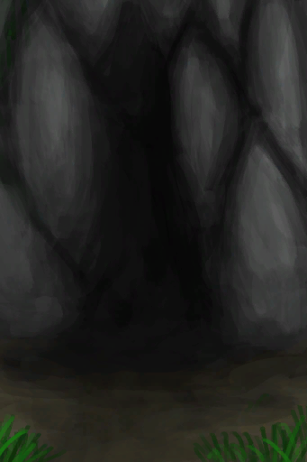蝙蝠洞</a>

<a href="CaveGrasslands.md" style="color:black">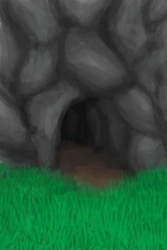草原洞穴</a>

<a href="CaveTidal.md" style="color:black">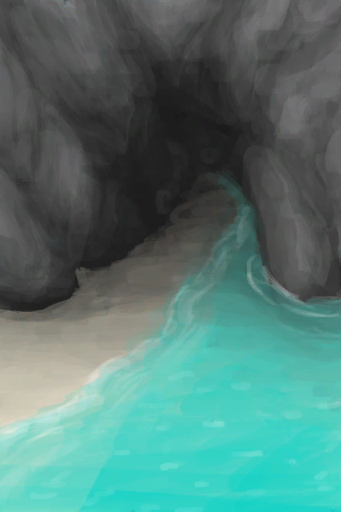潮汐洞</a>

<a href="Cellar.md" style="color:black">地窖</a>

<a href="PlaneCrash.md" style="color:black">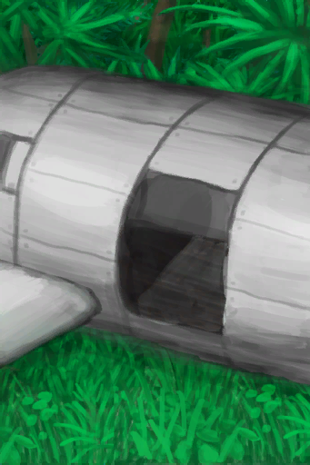飞机残骸</a>

<a href="CaveSea.md" style="color:black">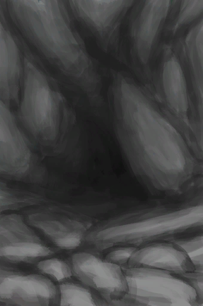海蚀洞</a>

<a href="MacaqueDen.md" style="color:black">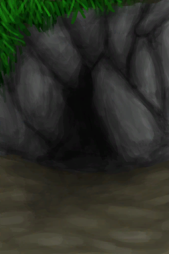猕猴窝</a>

<a href="MudHut.md" style="color:black">泥屋</a>

<a href="MudHutRuins.md" style="color:black">泥屋</a>

<a href="Shed.md" style="color:black">棚屋</a>

<a href="StoneHut.md" style="color:black">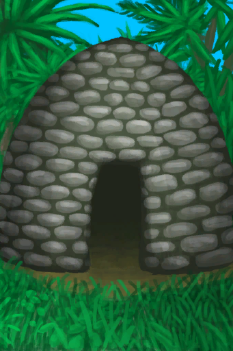石屋</a>

<a href="DarkCave.md" style="color:black">幽暗洞穴</a>

  
  
## 洞穴系统  
  

<a href="DampChamber.md" style="color:black">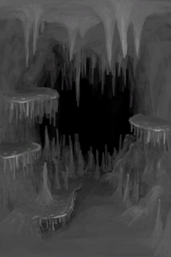潮湿洞穴</a>

<a href="LowChamber.md" style="color:black">洞穴底层</a>

<a href="HighChamber.md" style="color:black">洞穴上层</a>

<a href="MidChamber.md" style="color:black">洞穴中层</a>

<a href="FloodedChamber.md" style="color:black">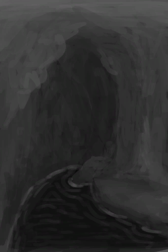覆溺洞穴</a>

<a href="DarkChamber.md" style="color:black">黑暗</a>

<a href="CrystalChamber.md" style="color:black">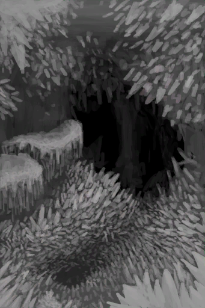晶石洞穴</a>

<a href="Tunnel.md" style="color:black">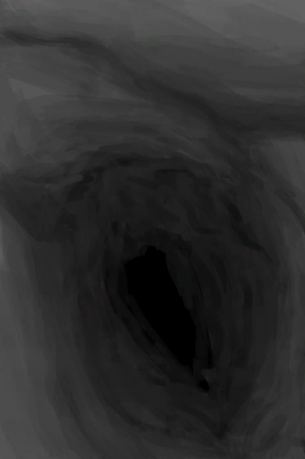隧道</a>

<a href="NarrowTunnel.md" style="color:black">狭窄隧道</a>

  
  

