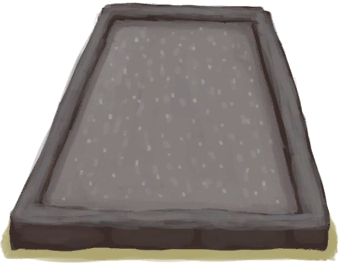
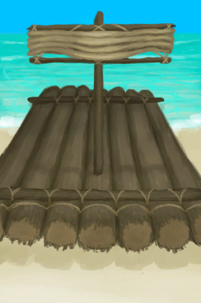

# 蓝图  
## “基地”  
### “营地”  

<a href="Bp_Fire.md" style="color:black">火堆</a>

<a href="Bp_WoodShavings.md" style="color:black">木屑</a>

<a href="Bp_Campfire.md" style="color:black">营火</a>

<a href="Bp_Shelter.md" style="color:black">窝棚</a>

<a href="Bp_MermaidNest.md" style="color:black">人鱼巢</a>

<a href="Bp_Leafbed.md" style="color:black">叶床</a>

<a href="Bp_DryingRack.md" style="color:black">晾晒架</a>

<a href="Bp_WoodCarvings.md" style="color:black">木雕</a>

<a href="Bp_Raincatcher.md" style="color:black">集雨器</a>

<a href="Bp_SolarStill.md" style="color:black">太阳能蒸馏器</a>

<a href="Bp_Shower.md" style="color:black">淋浴器</a>

  
  
  
### “建筑物”  

<a href="Bp_WaterReservoir.md" style="color:black">蓄水池</a>

<a href="Bp_SaltBed.md" style="color:black">盐田</a>

<a href="Bp_WaterFilter.md" style="color:black">滤水器</a>

<a href="Bp_Cistern.md" style="color:black">水窖</a>

<a href="Bp_Shed.md" style="color:black">棚屋</a>

<a href="Bp_MudHut.md" style="color:black">泥屋</a>

<a href="Bp_StoneHut.md" style="color:black">石屋</a>

<a href="Bp_Cellar.md" style="color:black">地窖</a>

<a href="Bp_Raft.md" style="color:black">木筏</a>

<a href="Bp_RaftShelter.md" style="color:black">木筏庇护所</a>

  
  
  
### “存储”  

<a href="Bp_WovenBasket.md" style="color:black">编织篓</a>

<a href="Bp_WovenBackpack.md" style="color:black">背篓</a>

<a href="Bp_Chest.md" style="color:black">储物箱</a>

<a href="Bp_Shelf.md" style="color:black">架子</a>

<a href="Bp_Bookshelf.md" style="color:black">书架</a>

<a href="Bp_SupplyChest.md" style="color:black">补给箱</a>

  
  
  
### “室内设施”  

<a href="Bp_Stove.md" style="color:black">火炉</a>

<a href="Bp_Chair.md" style="color:black">椅子</a>

<a href="Bp_Table.md" style="color:black">木桌</a>

<a href="Bp_BedWooden.md" style="color:black">木床</a>

<a href="Bp_BedRustic.md" style="color:black">简易床</a>

  
  
  
### “材料”  

<a href="Bp_Planks.md" style="color:black">木板</a>

<a href="Bp_Treenails.md" style="color:black">木钉</a>

<a href="Bp_Mortar.md" style="color:black">砂浆</a>

<a href="Bp_Glue.md" style="color:black">胶水</a>

<a href="Bp_Vitriol.md" style="color:black">硫酸</a>

  
  
  
  
## “工具”  
### “基础”  

<a href="Bp_SharpenedStone.md" style="color:black">石刀</a>

<a href="Bp_FlintKnife.md" style="color:black">燧石刀</a>

<a href="Bp_StoneAxe.md" style="color:black">石斧</a>

<a href="Bp_BoneKnife.md" style="color:black">骨刀</a>

<a href="Bp_ObsidianKnife.md" style="color:black">黑曜石刀</a>

<a href="Bp_FlintAxe.md" style="color:black">燧石斧</a>

<a href="Bp_WoodenShovel.md" style="color:black">木铲</a>

  
  
  
### “火”  

<a href="Bp_HandDrill.md" style="color:black">手钻</a>

<a href="Bp_BowDrill.md" style="color:black">弓钻</a>

<a href="Bp_Torch.md" style="color:black">火把</a>

<a href="Bp_Candles.md" style="color:black">蜡烛</a>

<a href="Bp_CandlesCitronella.md" style="color:black">香茅蜡烛</a>

<a href="Bp_CandlesJasmine.md" style="color:black">茉莉蜡烛</a>

<a href="Bp_Bellows.md" style="color:black">风箱</a>

<a href="Bp_Dynamite.md" style="color:black">炸药</a>

  
  
  
### “金属”  

<a href="Bp_CopperAxe.md" style="color:black">铜斧</a>

<a href="Bp_CopperShovel.md" style="color:black">铜铲</a>

<a href="Bp_ScrapKnife.md" style="color:black">废金属刀</a>

<a href="Bp_ScrapAxe.md" style="color:black">废金属斧</a>

<a href="Bp_ScrapShovel.md" style="color:black">废金属铲</a>

  
  
  
### “杂项”  

<a href="Bp_Broom.md" style="color:black">扫帚</a>

<a href="Bp_Travois.md" style="color:black">小拉车</a>

<a href="Bp_EatingUtensilsWooden.md" style="color:black">木质餐具</a>

<a href="Bp_Drum.md" style="color:black">鼓</a>

<a href="Bp_FluteBone.md" style="color:black">骨笛</a>

<a href="Bp_FluteWooden.md" style="color:black">木笛</a>

  
  
  
  
## “狩猎”  
### “捕鱼”  

<a href="Bp_FishingLine.md" style="color:black">钓鱼线</a>

<a href="Bp_FishingSpear.md" style="color:black">鱼叉</a>

<a href="Bp_FishBait.md" style="color:black">鱼饵</a>

<a href="Bp_FishingRod.md" style="color:black">钓鱼竿</a>

<a href="Bp_FishTrap.md" style="color:black">捕鱼陷阱</a>

<a href="Bp_Harpoon.md" style="color:black">鱼镖</a>

  
  
  
### “陷阱”  

<a href="Bp_DeadfallTrap.md" style="color:black">落石陷阱</a>

<a href="Bp_SnareTrap.md" style="color:black">套索陷阱</a>

<a href="Bp_FishTrap.md" style="color:black">捕鱼陷阱</a>

<a href="Bp_LogTrap.md" style="color:black">原木陷阱</a>

<a href="Bp_CageTrap.md" style="color:black">诱捕笼</a>

<a href="Bp_TrappingPit.md" style="color:black">陷坑</a>

<a href="Bp_RaftFishTrap.md" style="color:black">捕捞拖网</a>

  
  
  
### “近战”  

<a href="Bp_RusticSpear.md" style="color:black">简易长矛</a>

<a href="Bp_FlintSpear.md" style="color:black">燧石长矛</a>

<a href="Bp_ScrapSpear.md" style="color:black">废金属长矛</a>

<a href="Bp_CopperSpear.md" style="color:black">铜长矛</a>

<a href="Bp_ObsidianSpear.md" style="color:black">黑曜石长矛</a>

<a href="Bp_Shield.md" style="color:black">盾牌</a>

  
  
  
### “远程”  

<a href="Bp_Arrow.md" style="color:black">箭矢</a>

<a href="Bp_Bow.md" style="color:black">弓</a>

<a href="Bp_Quiver.md" style="color:black">箭筒</a>

<a href="Bp_Sling.md" style="color:black">投石索</a>

  
  
  
  
## “纺织”  
### “基础”  

<a href="Bp_CoconutSandals.md" style="color:black">椰子凉鞋</a>

<a href="Bp_LeafSkirt.md" style="color:black">草裙</a>

<a href="Bp_SeashellNecklace.md" style="color:black">贝壳项链</a>

<a href="Bp_FlowerNecklace.md" style="color:black">鲜花项链</a>

<a href="Bp_WovenHat.md" style="color:black">棕榈编织帽</a>

<a href="Bp_PearlNecklace.md" style="color:black">珍珠项链</a>

  
  
  
### “高级”  

<a href="Bp_Shirt.md" style="color:black">衬衫</a>

<a href="Bp_LeatherShoes.md" style="color:black">皮革鞋子</a>

<a href="Bp_LeatherGloves.md" style="color:black">皮革手套</a>

<a href="Bp_LeatherPants.md" style="color:black">皮裤</a>

<a href="Bp_StrawCape.md" style="color:black">蓑衣</a>

<a href="Bp_Raincoat.md" style="color:black">雨衣</a>

  
  
  
### “实用”  

<a href="Bp_Sack.md" style="color:black">布袋</a>

<a href="Bp_Waterskin.md" style="color:black">水袋</a>

<a href="Bp_Satchel.md" style="color:black">挎包</a>

<a href="Bp_LeatherBackpack.md" style="color:black">皮革背包</a>

<a href="Bp_Hammock.md" style="color:black">吊床</a>

<a href="Bp_Bedroll.md" style="color:black">睡袋</a>

  
  
  
### “特殊”  

<a href="Bp_WoodenNeedles.md" style="color:black">木针</a>

<a href="Bp_Spindle.md" style="color:black">纺锤</a>

<a href="Bp_Loom.md" style="color:black">织布机</a>

  
  
  
  
## “冶金 & 制陶”  
### “容器”  

<a href="Bp_ClayBowl.md" style="color:black">陶碗</a>

<a href="Bp_ClayJar.md" style="color:black">小陶罐</a>

<a href="Bp_ClayVase.md" style="color:black">陶罐</a>

<a href="Bp_CookingPot.md" style="color:black">烹饪锅</a>

<a href="Bp_GlazedVase.md" style="color:black">釉面陶罐</a>

<a href="Bp_CopperJar.md" style="color:black">铜罐</a>

<a href="Bp_CopperBottle.md" style="color:black">铜瓶</a>

  
  
  
### “实用”  

<a href="Bp_CopperSheet.md" style="color:black">铜板</a>

<a href="Bp_CopperNeedles.md" style="color:black">铜针</a>

<a href="Bp_EatingUtensilsCopper.md" style="color:black">铜制餐具</a>

<a href="Bp_ClayPotCooler.md" style="color:black">保鲜罐</a>

<a href="Bp_Alembic.md" style="color:black">蒸馏器</a>

<a href="Bp_ClayFirePit.md" style="color:black">粘土火盆</a>

<a href="Bp_Kiln.md" style="color:black">窑炉</a>

<a href="Bp_Forge.md" style="color:black">熔炉</a>

<a href="Bp_PotteryWheel.md" style="color:black">陶轮</a>

<a href="Bp_KilnAdvanced.md" style="color:black">高级窑炉</a>

<a href="Bp_CopperNecklace.md" style="color:black">铜项链</a>

  
  
  
### “模具”  

<a href="Bp_MoldKnife.md" style="color:black">刀模具</a>

<a href="Bp_MoldAxe.md" style="color:black">斧头模具</a>

<a href="Bp_MoldShovel.md" style="color:black">铲头模具</a>

<a href="Bp_MoldSpear.md" style="color:black">矛头模具</a>

<a href="Bp_MoldDecoration.md" style="color:black">装饰品模具</a>

  
  
  
  
## “烹饪”  
### “基础”  

<a href="Bp_ChickenSandwich.md" style="color:black">鸡肉三明治</a>

<a href="Bp_CoconutFish.md" style="color:black">椰子鱼</a>

<a href="Bp_IslandChicken.md" style="color:black">热带烤鸡</a>

<a href="Bp_FriedPuffballs.md" style="color:black">炒菇球</a>

<a href="Bp_FishNChips.md" style="color:black">炸鱼薯条</a>

<a href="Bp_MacaqueSkewers.md" style="color:black">猕猴肉串</a>

<a href="Bp_LizardFry.md" style="color:black">辣炒巨蜥肉</a>

<a href="Bp_SagoSlime.md" style="color:black">西米糕</a>

<a href="Bp_FishTaco.md" style="color:black">鱼肉塔可</a>

  
  
  
### “高级”  

<a href="Bp_SeafoodCup.md" style="color:black">海鲜杂烩</a>

<a href="Bp_DrunkenCrab.md" style="color:black">醉蟹</a>

<a href="Bp_EggFriedRice.md" style="color:black">蛋炒饭</a>

<a href="Bp_Sushi.md" style="color:black">寿司</a>

<a href="Bp_ButterBakedOysters.md" style="color:black">黄油焗牡蛎</a>

<a href="Bp_JungleSalad.md" style="color:black">丛林沙拉</a>

<a href="Bp_FishOmelette.md" style="color:black">鱼肉煎蛋饼</a>

<a href="Bp_HoneyGlazedPork.md" style="color:black">蜜汁火腿</a>

<a href="Bp_GoatStew.md" style="color:black">炖羊肉</a>

<a href="Bp_YamCurry.md" style="color:black">参薯咖喱</a>

<a href="Bp_HeartyFeast.md" style="color:black">肉食盛宴</a>

  
  
  
### “甜品”  

<a href="Bp_CandiedGinger.md" style="color:black">姜糖</a>

<a href="Bp_HoneyCandy.md" style="color:black">蜜糖</a>

<a href="Bp_YamJam.md" style="color:black">参薯酱</a>

<a href="Bp_FriedBananas.md" style="color:black">炸香蕉</a>

<a href="Bp_SagoCake.md" style="color:black">西米蛋糕</a>

  
  
  
### “特殊”  

<a href="Bp_CoconutMilk.md" style="color:black">椰奶</a>

<a href="Bp_Honey.md" style="color:black">蜂蜜</a>

<a href="Bp_FishSalted.md" style="color:black">咸鱼</a>

<a href="Bp_MeatSalted.md" style="color:black">腌肉</a>

<a href="Bp_BoneBroth.md" style="color:black">骨头汤</a>

<a href="Bp_TonicWater.md" style="color:black">汤力水</a>

<a href="Bp_Cheese.md" style="color:black">奶酪</a>

<a href="Bp_Butter.md" style="color:black">黄油</a>

<a href="Bp_ProteinBar.md" style="color:black">蛋白棒</a>

  
  
  
  
## “医疗”  
### “药”  

<a href="Bp_AloeGel.md" style="color:black">芦荟膏</a>

<a href="Bp_BrimstoneGel.md" style="color:black">硫磺膏</a>

<a href="Bp_BugRepellent.md" style="color:black">驱虫膏</a>

<a href="Bp_Soap.md" style="color:black">肥皂</a>

<a href="Bp_Quinine.md" style="color:black">金鸡纳树皮粉</a>

<a href="Bp_QuinineSulfate.md" style="color:black">硫酸奎宁</a>

  
  
  
### “医疗器械”  

<a href="Bp_AshDressing.md" style="color:black">草木灰敷料</a>

<a href="Bp_TourniquetRustic.md" style="color:black">简易止血带</a>

<a href="Bp_Tourniquet.md" style="color:black">止血带</a>

<a href="Bp_Splint.md" style="color:black">夹板</a>

<a href="Bp_GasMask.md" style="color:black">防毒面具</a>

  
  
  
### “灵视物”  

<a href="Bp_Weston.md" style="color:black">韦斯顿</a>

<a href="Bp_LizardDrum.md" style="color:black">蜥蜴皮手鼓</a>

<a href="Bp_SeagullCharm.md" style="color:black">海鸥护符</a>

<a href="Bp_CeremonialDagger.md" style="color:black">仪式匕首</a>

<a href="Bp_SharkHeadpiece.md" style="color:black">鲨鱼头饰</a>

  
  
  
  
## “农牧”  
### “农业”  

<a href="Bp_CropPlot.md" style="color:black">农田</a>

<a href="Bp_MushroomBed.md" style="color:black">菌床</a>

<a href="Bp_RicePaddy.md" style="color:black">水稻田</a>

<a href="Bp_PesticideChilli.md" style="color:black">辣椒农药</a>

<a href="Bp_PesticideBrimstone.md" style="color:black">硫磺农药</a>

<a href="Bp_CompostBin.md" style="color:black">堆肥箱</a>

<a href="Bp_NiterBed.md" style="color:black">硝石矿床</a>

<a href="Bp_Scarecrow.md" style="color:black">稻草人</a>

<a href="Bp_Well.md" style="color:black">水井</a>

  
  
  
### “畜牧”  

<a href="Bp_FeedBird.md" style="color:black">鸟食</a>

<a href="Bp_FeedGoat.md" style="color:black">山羊饲料</a>

<a href="Bp_FeedBoar.md" style="color:black">猪食</a>

<a href="Bp_Enclosure.md" style="color:black">畜栏</a>

<a href="Bp_PartridgeFeeder.md" style="color:black">灰山鹑喂食器</a>

<a href="Bp_GoatFeeder.md" style="color:black">羊食槽</a>

<a href="Bp_WateringTrough.md" style="color:black">水槽</a>

<a href="Bp_BoarFeeder.md" style="color:black">猪食槽</a>

<a href="Bp_BeeSkepEmpty.md" style="color:black">空蜂箱</a>

<a href="Bp_BeeSkep.md" style="color:black">蜂箱</a>

<a href="Bp_BeeSuit.md" style="color:black">防蜂服</a>

<a href="Bp_BeeSmoker.md" style="color:black">熏蜂器</a>

  
  
  
  

