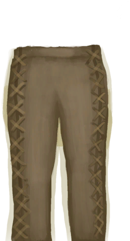
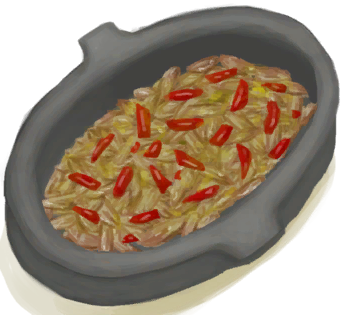
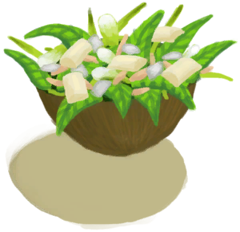

# 蓝图  
## 基地  
### 营地  
   |     |     |     
 :----:    |   :----:    |   :----:    |   :----:    
[ [火堆(蓝图)](Bp_Fire.md)](Bp_Fire.md)  |  [ [木屑(蓝图)](Bp_WoodShavings.md)](Bp_WoodShavings.md)  |  [ [营火(蓝图)](Bp_Campfire.md)](Bp_Campfire.md)  |  [ [窝棚(蓝图)](Bp_Shelter.md)](Bp_Shelter.md)  
[ [人鱼巢(蓝图)](Bp_MermaidNest.md)](Bp_MermaidNest.md)  |  [ [叶床(蓝图)](Bp_Leafbed.md)](Bp_Leafbed.md)  |  [ [晾晒架(蓝图)](Bp_DryingRack.md)](Bp_DryingRack.md)  |  [ [木雕(蓝图)](Bp_WoodCarvings.md)](Bp_WoodCarvings.md)  
[ [集雨器(蓝图)](Bp_Raincatcher.md)](Bp_Raincatcher.md)  |  [ [太阳能蒸馏器(蓝图)](Bp_SolarStill.md)](Bp_SolarStill.md)  |    |    
  
### 建筑物  
   |     |     |     
 :----:    |   :----:    |   :----:    |   :----:    
[ [蓄水池(蓝图)](Bp_WaterReservoir.md)](Bp_WaterReservoir.md)  |  [ [滤水器(蓝图)](Bp_WaterFilter.md)](Bp_WaterFilter.md)  |  [ [水窖(蓝图)](Bp_Cistern.md)](Bp_Cistern.md)  |  [ [棚屋(蓝图)](Bp_Shed.md)](Bp_Shed.md)  
[ [泥屋(蓝图)](Bp_MudHut.md)](Bp_MudHut.md)  |  [ [石屋(蓝图)](Bp_StoneHut.md)](Bp_StoneHut.md)  |  [ [地窖(蓝图)](Bp_Cellar.md)](Bp_Cellar.md)  |  [ [木筏(蓝图)](Bp_Raft.md)](Bp_Raft.md)  
[ [木筏庇护所(蓝图)](Bp_RaftShelter.md)](Bp_RaftShelter.md)  |    |    |    
  
### 存储  
   |     |     |     
 :----:    |   :----:    |   :----:    |   :----:    
[ [编织篓(蓝图)](Bp_WovenBasket.md)](Bp_WovenBasket.md)  |  [ [背篓(蓝图)](Bp_WovenBackpack.md)](Bp_WovenBackpack.md)  |  [ [储物箱(蓝图)](Bp_Chest.md)](Bp_Chest.md)  |  [ [架子(蓝图)](Bp_Shelf.md)](Bp_Shelf.md)  
[ [书架(蓝图)](Bp_Bookshelf.md)](Bp_Bookshelf.md)  |  [ [补给箱(蓝图)](Bp_SupplyChest.md)](Bp_SupplyChest.md)  |    |    
  
### 室内设施  
   |     |     |     
 :----:    |   :----:    |   :----:    |   :----:    
[ [火炉(蓝图)](Bp_Stove.md)](Bp_Stove.md)  |  [ [椅子(蓝图)](Bp_Chair.md)](Bp_Chair.md)  |  [ [木桌(蓝图)](Bp_Table.md)](Bp_Table.md)  |  [ [木床(蓝图)](Bp_BedWooden.md)](Bp_BedWooden.md)  
[ [简易床(蓝图)](Bp_BedRustic.md)](Bp_BedRustic.md)  |    |    |    
  
### 材料  
   |     |     |     
 :----:    |   :----:    |   :----:    |   :----:    
[ [木板(蓝图)](Bp_Planks.md)](Bp_Planks.md)  |  [ [木钉(蓝图)](Bp_Treenails.md)](Bp_Treenails.md)  |  [ [砂浆(蓝图)](Bp_Mortar.md)](Bp_Mortar.md)  |  [ [胶水(蓝图)](Bp_Glue.md)](Bp_Glue.md)  
[ [硫酸(蓝图)](Bp_Vitriol.md)](Bp_Vitriol.md)  |    |    |    
  
  
## 工具  
### 基础  
   |     |     |     
 :----:    |   :----:    |   :----:    |   :----:    
[ [石刀(蓝图)](Bp_SharpenedStone.md)](Bp_SharpenedStone.md)  |  [ [燧石刀(蓝图)](Bp_FlintKnife.md)](Bp_FlintKnife.md)  |  [ [石斧(蓝图)](Bp_StoneAxe.md)](Bp_StoneAxe.md)  |  [ [骨刀(蓝图)](Bp_BoneKnife.md)](Bp_BoneKnife.md)  
[ [黑曜石刀(蓝图)](Bp_ObsidianKnife.md)](Bp_ObsidianKnife.md)  |  [ [燧石斧(蓝图)](Bp_FlintAxe.md)](Bp_FlintAxe.md)  |  [ [木铲(蓝图)](Bp_WoodenShovel.md)](Bp_WoodenShovel.md)  |    
  
### 火  
   |     |     |     
 :----:    |   :----:    |   :----:    |   :----:    
[ [手钻(蓝图)](Bp_HandDrill.md)](Bp_HandDrill.md)  |  [ [弓钻(蓝图)](Bp_BowDrill.md)](Bp_BowDrill.md)  |  [ [火把(蓝图)](Bp_Torch.md)](Bp_Torch.md)  |  [ [蜡烛(蓝图)](Bp_Candles.md)](Bp_Candles.md)  
[ [香茅蜡烛(蓝图)](Bp_CandlesCitronella.md)](Bp_CandlesCitronella.md)  |  [ [茉莉蜡烛(蓝图)](Bp_CandlesJasmine.md)](Bp_CandlesJasmine.md)  |  [ [风箱(蓝图)](Bp_Bellows.md)](Bp_Bellows.md)  |  [ [炸药(蓝图)](Bp_Dynamite.md)](Bp_Dynamite.md)  
  
### 金属  
   |     |     |     
 :----:    |   :----:    |   :----:    |   :----:    
[ [铜斧(蓝图)](Bp_CopperAxe.md)](Bp_CopperAxe.md)  |  [ [铜铲(蓝图)](Bp_CopperShovel.md)](Bp_CopperShovel.md)  |  [ [废金属刀(蓝图)](Bp_ScrapKnife.md)](Bp_ScrapKnife.md)  |  [ [废金属斧(蓝图)](Bp_ScrapAxe.md)](Bp_ScrapAxe.md)  
[ [废金属铲(蓝图)](Bp_ScrapShovel.md)](Bp_ScrapShovel.md)  |    |    |    
  
### 杂项  
   |     |     |     
 :----:    |   :----:    |   :----:    |   :----:    
[ [扫帚(蓝图)](Bp_Broom.md)](Bp_Broom.md)  |  [ [小拉车(蓝图)](Bp_Travois.md)](Bp_Travois.md)  |  [ [木质餐具(蓝图)](Bp_EatingUtensilsWooden.md)](Bp_EatingUtensilsWooden.md)  |  [ [鼓(蓝图)](Bp_Drum.md)](Bp_Drum.md)  
  
  
## 狩猎  
### 捕鱼  
   |     |     |     
 :----:    |   :----:    |   :----:    |   :----:    
[ [钓鱼线(蓝图)](Bp_FishingLine.md)](Bp_FishingLine.md)  |  [ [鱼叉(蓝图)](Bp_FishingSpear.md)](Bp_FishingSpear.md)  |  [ [鱼饵(蓝图)](Bp_FishBait.md)](Bp_FishBait.md)  |  [ [钓鱼竿(蓝图)](Bp_FishingRod.md)](Bp_FishingRod.md)  
[ [捕鱼陷阱(蓝图)](Bp_FishTrap.md)](Bp_FishTrap.md)  |  [ [鱼镖(蓝图)](Bp_Harpoon.md)](Bp_Harpoon.md)  |    |    
  
### 陷阱  
   |     |     |     
 :----:    |   :----:    |   :----:    |   :----:    
[ [落石陷阱(蓝图)](Bp_DeadfallTrap.md)](Bp_DeadfallTrap.md)  |  [ [套索陷阱(蓝图)](Bp_SnareTrap.md)](Bp_SnareTrap.md)  |  [ [捕鱼陷阱(蓝图)](Bp_FishTrap.md)](Bp_FishTrap.md)  |  [ [原木陷阱(蓝图)](Bp_LogTrap.md)](Bp_LogTrap.md)  
[ [诱捕笼(蓝图)](Bp_CageTrap.md)](Bp_CageTrap.md)  |  [ [陷坑(蓝图)](Bp_TrappingPit.md)](Bp_TrappingPit.md)  |  [ [捕捞拖网(蓝图)](Bp_RaftFishTrap.md)](Bp_RaftFishTrap.md)  |    
  
### 近战  
   |     |     |     
 :----:    |   :----:    |   :----:    |   :----:    
[ [简易长矛(蓝图)](Bp_RusticSpear.md)](Bp_RusticSpear.md)  |  [ [燧石长矛(蓝图)](Bp_FlintSpear.md)](Bp_FlintSpear.md)  |  [ [废金属长矛(蓝图)](Bp_ScrapSpear.md)](Bp_ScrapSpear.md)  |  [ [铜长矛(蓝图)](Bp_CopperSpear.md)](Bp_CopperSpear.md)  
[ [黑曜石长矛(蓝图)](Bp_ObsidianSpear.md)](Bp_ObsidianSpear.md)  |  [ [盾牌(蓝图)](Bp_Shield.md)](Bp_Shield.md)  |    |    
  
### 远程  
   |     |     |     
 :----:    |   :----:    |   :----:    |   :----:    
[ [箭矢(蓝图)](Bp_Arrow.md)](Bp_Arrow.md)  |  [ [弓(蓝图)](Bp_Bow.md)](Bp_Bow.md)  |  [ [箭筒(蓝图)](Bp_Quiver.md)](Bp_Quiver.md)  |  [ [投石索(蓝图)](Bp_Sling.md)](Bp_Sling.md)  
  
  
## 纺织  
### 基础  
   |     |     |     
 :----:    |   :----:    |   :----:    |   :----:    
[ [椰子凉鞋(蓝图)](Bp_CoconutSandals.md)](Bp_CoconutSandals.md)  |  [ [草裙(蓝图)](Bp_LeafSkirt.md)](Bp_LeafSkirt.md)  |  [ [贝壳项链(蓝图)](Bp_SeashellNecklace.md)](Bp_SeashellNecklace.md)  |  [ [鲜花项链(蓝图)](Bp_FlowerNecklace.md)](Bp_FlowerNecklace.md)  
[ [棕榈编织帽(蓝图)](Bp_WovenHat.md)](Bp_WovenHat.md)  |  [ [珍珠项链(蓝图)](Bp_PearlNecklace.md)](Bp_PearlNecklace.md)  |    |    
  
### 高级  
   |     |     |     
 :----:    |   :----:    |   :----:    |   :----:    
[ [衬衫(蓝图)](Bp_Shirt.md)](Bp_Shirt.md)  |  [ [皮革鞋子(蓝图)](Bp_LeatherShoes.md)](Bp_LeatherShoes.md)  |  [ [皮革手套(蓝图)](Bp_LeatherGloves.md)](Bp_LeatherGloves.md)  |  [ [皮裤(蓝图)](Bp_LeatherPants.md)](Bp_LeatherPants.md)  
[ [蓑衣(蓝图)](Bp_StrawCape.md)](Bp_StrawCape.md)  |  [ [雨衣(蓝图)](Bp_Raincoat.md)](Bp_Raincoat.md)  |    |    
  
### 实用  
   |     |     |     
 :----:    |   :----:    |   :----:    |   :----:    
[ [布袋(蓝图)](Bp_Sack.md)](Bp_Sack.md)  |  [ [水袋(蓝图)](Bp_Waterskin.md)](Bp_Waterskin.md)  |  [ [挎包(蓝图)](Bp_Satchel.md)](Bp_Satchel.md)  |  [ [皮革背包(蓝图)](Bp_LeatherBackpack.md)](Bp_LeatherBackpack.md)  
[ [吊床(蓝图)](Bp_Hammock.md)](Bp_Hammock.md)  |  [ [睡袋(蓝图)](Bp_Bedroll.md)](Bp_Bedroll.md)  |    |    
  
### 特殊  
   |     |     |     
 :----:    |   :----:    |   :----:    |   :----:    
[ [木针(蓝图)](Bp_WoodenNeedles.md)](Bp_WoodenNeedles.md)  |  [ [纺锤(蓝图)](Bp_Spindle.md)](Bp_Spindle.md)  |  [ [织布机(蓝图)](Bp_Loom.md)](Bp_Loom.md)  |    
  
  
## 冶金 & 制陶  
### 容器  
   |     |     |     
 :----:    |   :----:    |   :----:    |   :----:    
[ [陶碗(蓝图)](Bp_ClayBowl.md)](Bp_ClayBowl.md)  |  [ [小陶罐(蓝图)](Bp_ClayJar.md)](Bp_ClayJar.md)  |  [ [陶罐(蓝图)](Bp_ClayVase.md)](Bp_ClayVase.md)  |  [ [烹饪锅(蓝图)](Bp_CookingPot.md)](Bp_CookingPot.md)  
[ [釉面陶罐(蓝图)](Bp_GlazedVase.md)](Bp_GlazedVase.md)  |  [ [铜罐(蓝图)](Bp_CopperJar.md)](Bp_CopperJar.md)  |  [ [铜瓶(蓝图)](Bp_CopperBottle.md)](Bp_CopperBottle.md)  |    
  
### 实用  
   |     |     |     
 :----:    |   :----:    |   :----:    |   :----:    
[ [铜板(蓝图)](Bp_CopperSheet.md)](Bp_CopperSheet.md)  |  [ [铜针(蓝图)](Bp_CopperNeedles.md)](Bp_CopperNeedles.md)  |  [ [铜制餐具(蓝图)](Bp_EatingUtensilsCopper.md)](Bp_EatingUtensilsCopper.md)  |  [ [保鲜罐(蓝图)](Bp_ClayPotCooler.md)](Bp_ClayPotCooler.md)  
[ [蒸馏器(蓝图)](Bp_Alembic.md)](Bp_Alembic.md)  |  [ [粘土火盆(蓝图)](Bp_ClayFirePit.md)](Bp_ClayFirePit.md)  |  [ [窑炉(蓝图)](Bp_Kiln.md)](Bp_Kiln.md)  |  [ [熔炉(蓝图)](Bp_Forge.md)](Bp_Forge.md)  
[ [陶轮(蓝图)](Bp_PotteryWheel.md)](Bp_PotteryWheel.md)  |  [ [高级窑炉(蓝图)](Bp_KilnAdvanced.md)](Bp_KilnAdvanced.md)  |  [ [铜项链(蓝图)](Bp_CopperNecklace.md)](Bp_CopperNecklace.md)  |    
  
### 模具  
   |     |     |     
 :----:    |   :----:    |   :----:    |   :----:    
[ [刀模具(蓝图)](Bp_MoldKnife.md)](Bp_MoldKnife.md)  |  [ [斧头模具(蓝图)](Bp_MoldAxe.md)](Bp_MoldAxe.md)  |  [ [铲头模具(蓝图)](Bp_MoldShovel.md)](Bp_MoldShovel.md)  |  [ [矛头模具(蓝图)](Bp_MoldSpear.md)](Bp_MoldSpear.md)  
[ [装饰品模具(蓝图)](Bp_MoldDecoration.md)](Bp_MoldDecoration.md)  |    |    |    
  
  
## 烹饪  
### 基础  
   |     |     |     
 :----:    |   :----:    |   :----:    |   :----:    
[ [鸡肉三明治(蓝图)](Bp_ChickenSandwich.md)](Bp_ChickenSandwich.md)  |  [ [椰子鱼(蓝图)](Bp_CoconutFish.md)](Bp_CoconutFish.md)  |  [ [热带烤鸡(蓝图)](Bp_IslandChicken.md)](Bp_IslandChicken.md)  |  [ [炒菇球(蓝图)](Bp_FriedPuffballs.md)](Bp_FriedPuffballs.md)  
[ [炸鱼薯条(蓝图)](Bp_FishNChips.md)](Bp_FishNChips.md)  |  [ [猕猴肉串(蓝图)](Bp_MacaqueSkewers.md)](Bp_MacaqueSkewers.md)  |  [ [辣炒巨蜥肉(蓝图)](Bp_LizardFry.md)](Bp_LizardFry.md)  |  [ [西米糕(蓝图)](Bp_SagoSlime.md)](Bp_SagoSlime.md)  
[ [鱼肉塔可(蓝图)](Bp_FishTaco.md)](Bp_FishTaco.md)  |    |    |    
  
### 高级  
   |     |     |     
 :----:    |   :----:    |   :----:    |   :----:    
[ [海鲜杂烩(蓝图)](Bp_SeafoodCup.md)](Bp_SeafoodCup.md)  |  [ [醉蟹(蓝图)](Bp_DrunkenCrab.md)](Bp_DrunkenCrab.md)  |  [ [蛋炒饭(蓝图)](Bp_EggFriedRice.md)](Bp_EggFriedRice.md)  |  [ [寿司(蓝图)](Bp_Sushi.md)](Bp_Sushi.md)  
[ [黄油焗牡蛎(蓝图)](Bp_ButterBakedOysters.md)](Bp_ButterBakedOysters.md)  |  [ [丛林沙拉(蓝图)](Bp_JungleSalad.md)](Bp_JungleSalad.md)  |  [ [鱼肉煎蛋饼(蓝图)](Bp_FishOmelette.md)](Bp_FishOmelette.md)  |  [ [蜜汁火腿(蓝图)](Bp_HoneyGlazedPork.md)](Bp_HoneyGlazedPork.md)  
[ [炖羊肉(蓝图)](Bp_GoatStew.md)](Bp_GoatStew.md)  |  [ [参薯咖喱(蓝图)](Bp_YamCurry.md)](Bp_YamCurry.md)  |  [ [肉食盛宴(蓝图)](Bp_HeartyFeast.md)](Bp_HeartyFeast.md)  |    
  
### 甜品  
   |     |     |     
 :----:    |   :----:    |   :----:    |   :----:    
[ [姜糖(蓝图)](Bp_CandiedGinger.md)](Bp_CandiedGinger.md)  |  [ [蜜糖(蓝图)](Bp_HoneyCandy.md)](Bp_HoneyCandy.md)  |  [ [参薯酱(蓝图)](Bp_YamJam.md)](Bp_YamJam.md)  |  [ [炸香蕉(蓝图)](Bp_FriedBananas.md)](Bp_FriedBananas.md)  
[ [西米蛋糕(蓝图)](Bp_SagoCake.md)](Bp_SagoCake.md)  |    |    |    
  
### 特殊  
   |     |     |     
 :----:    |   :----:    |   :----:    |   :----:    
[ [椰奶(蓝图)](Bp_CoconutMilk.md)](Bp_CoconutMilk.md)  |  [ [蜂蜜(蓝图)](Bp_Honey.md)](Bp_Honey.md)  |  [ [汤力水(蓝图)](Bp_TonicWater.md)](Bp_TonicWater.md)  |  [ [奶酪(蓝图)](Bp_Cheese.md)](Bp_Cheese.md)  
[ [黄油(蓝图)](Bp_Butter.md)](Bp_Butter.md)  |  [ [骨头汤(蓝图)](Bp_BoneBroth.md)](Bp_BoneBroth.md)  |  [ [蛋白棒(蓝图)](Bp_ProteinBar.md)](Bp_ProteinBar.md)  |    
  
  
## 医疗  
### 药  
   |     |     |     
 :----:    |   :----:    |   :----:    |   :----:    
[ [芦荟膏(蓝图)](Bp_AloeGel.md)](Bp_AloeGel.md)  |  [ [硫磺膏(蓝图)](Bp_BrimstoneGel.md)](Bp_BrimstoneGel.md)  |  [ [驱虫膏(蓝图)](Bp_BugRepellent.md)](Bp_BugRepellent.md)  |  [ [肥皂(蓝图)](Bp_Soap.md)](Bp_Soap.md)  
[ [金鸡纳树皮粉(蓝图)](Bp_Quinine.md)](Bp_Quinine.md)  |  [ [硫酸奎宁(蓝图)](Bp_QuinineSulfate.md)](Bp_QuinineSulfate.md)  |    |    
  
### 医疗器械  
   |     |     |     
 :----:    |   :----:    |   :----:    |   :----:    
[ [草木灰敷料(蓝图)](Bp_AshDressing.md)](Bp_AshDressing.md)  |  [ [简易止血带(蓝图)](Bp_TourniquetRustic.md)](Bp_TourniquetRustic.md)  |  [ [止血带(蓝图)](Bp_Tourniquet.md)](Bp_Tourniquet.md)  |  [ [夹板(蓝图)](Bp_Splint.md)](Bp_Splint.md)  
[ [防毒面具(蓝图)](Bp_GasMask.md)](Bp_GasMask.md)  |    |    |    
  
### 灵视物  
   |     |     |     
 :----:    |   :----:    |   :----:    |   :----:    
[ [韦斯顿(蓝图)](Bp_Weston.md)](Bp_Weston.md)  |  [ [蜥蜴皮手鼓(蓝图)](Bp_LizardDrum.md)](Bp_LizardDrum.md)  |  [ [海鸥护符(蓝图)](Bp_SeagullCharm.md)](Bp_SeagullCharm.md)  |  [ [仪式匕首(蓝图)](Bp_CeremonialDagger.md)](Bp_CeremonialDagger.md)  
[ [鲨鱼头饰(蓝图)](Bp_SharkHeadpiece.md)](Bp_SharkHeadpiece.md)  |    |    |    
  
  
## 农牧  
### 农业  
   |     |     |     
 :----:    |   :----:    |   :----:    |   :----:    
[ [农田(蓝图)](Bp_CropPlot.md)](Bp_CropPlot.md)  |  [ [菌床(蓝图)](Bp_MushroomBed.md)](Bp_MushroomBed.md)  |  [ [水稻田(蓝图)](Bp_RicePaddy.md)](Bp_RicePaddy.md)  |  [ [辣椒农药(蓝图)](Bp_PesticideChilli.md)](Bp_PesticideChilli.md)  
[ [硫磺农药(蓝图)](Bp_PesticideBrimstone.md)](Bp_PesticideBrimstone.md)  |  [ [堆肥箱(蓝图)](Bp_CompostBin.md)](Bp_CompostBin.md)  |  [ [硝石矿床(蓝图)](Bp_NiterBed.md)](Bp_NiterBed.md)  |  [ [稻草人(蓝图)](Bp_Scarecrow.md)](Bp_Scarecrow.md)  
[ [水井(蓝图)](Bp_Well.md)](Bp_Well.md)  |    |    |    
  
### 畜牧  
   |     |     |     
 :----:    |   :----:    |   :----:    |   :----:    
[ [鸟食(蓝图)](Bp_FeedBird.md)](Bp_FeedBird.md)  |  [ [山羊饲料(蓝图)](Bp_FeedGoat.md)](Bp_FeedGoat.md)  |  [ [猪食(蓝图)](Bp_FeedBoar.md)](Bp_FeedBoar.md)  |  [ [畜栏(蓝图)](Bp_Enclosure.md)](Bp_Enclosure.md)  
[ [灰山鹑喂食器(蓝图)](Bp_PartridgeFeeder.md)](Bp_PartridgeFeeder.md)  |  [ [羊食槽(蓝图)](Bp_GoatFeeder.md)](Bp_GoatFeeder.md)  |  [ [水槽(蓝图)](Bp_WateringTrough.md)](Bp_WateringTrough.md)  |  [ [猪食槽(蓝图)](Bp_BoarFeeder.md)](Bp_BoarFeeder.md)  
[ [空蜂箱(蓝图)](Bp_BeeSkepEmpty.md)](Bp_BeeSkepEmpty.md)  |  [ [蜂箱(蓝图)](Bp_BeeSkep.md)](Bp_BeeSkep.md)  |  [ [防蜂服(蓝图)](Bp_BeeSuit.md)](Bp_BeeSuit.md)  |  [ [熏蜂器(蓝图)](Bp_BeeSmoker.md)](Bp_BeeSmoker.md)  
  
  
