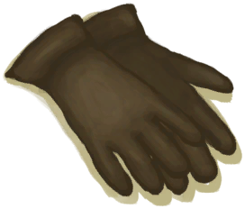
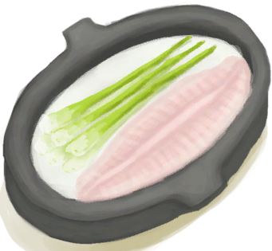

# 蓝图  
## “基地”  
### “营地”  

[

 [火堆](Bp_Fire.md)](Bp_Fire.md)

[

 [木屑](Bp_WoodShavings.md)](Bp_WoodShavings.md)

[

 [营火](Bp_Campfire.md)](Bp_Campfire.md)

[

 [窝棚](Bp_Shelter.md)](Bp_Shelter.md)

[

 [人鱼巢](Bp_MermaidNest.md)](Bp_MermaidNest.md)

[

 [叶床](Bp_Leafbed.md)](Bp_Leafbed.md)

[

 [晾晒架](Bp_DryingRack.md)](Bp_DryingRack.md)

[

 [木雕](Bp_WoodCarvings.md)](Bp_WoodCarvings.md)

[

 [集雨器](Bp_Raincatcher.md)](Bp_Raincatcher.md)

[

 [太阳能蒸馏器](Bp_SolarStill.md)](Bp_SolarStill.md)

  
  
  
### “建筑物”  

[

 [蓄水池](Bp_WaterReservoir.md)](Bp_WaterReservoir.md)

[

 [滤水器](Bp_WaterFilter.md)](Bp_WaterFilter.md)

[

 [水窖](Bp_Cistern.md)](Bp_Cistern.md)

[

 [棚屋](Bp_Shed.md)](Bp_Shed.md)

[

 [泥屋](Bp_MudHut.md)](Bp_MudHut.md)

[

 [石屋](Bp_StoneHut.md)](Bp_StoneHut.md)

[

 [地窖](Bp_Cellar.md)](Bp_Cellar.md)

[

 [木筏](Bp_Raft.md)](Bp_Raft.md)

[

 [木筏庇护所](Bp_RaftShelter.md)](Bp_RaftShelter.md)

  
  
  
### “存储”  

[

 [编织篓](Bp_WovenBasket.md)](Bp_WovenBasket.md)

[

 [背篓](Bp_WovenBackpack.md)](Bp_WovenBackpack.md)

[

 [储物箱](Bp_Chest.md)](Bp_Chest.md)

[

 [架子](Bp_Shelf.md)](Bp_Shelf.md)

[

 [书架](Bp_Bookshelf.md)](Bp_Bookshelf.md)

[

 [补给箱](Bp_SupplyChest.md)](Bp_SupplyChest.md)

  
  
  
### “室内设施”  

[

 [火炉](Bp_Stove.md)](Bp_Stove.md)

[

 [椅子](Bp_Chair.md)](Bp_Chair.md)

[

 [木桌](Bp_Table.md)](Bp_Table.md)

[

 [木床](Bp_BedWooden.md)](Bp_BedWooden.md)

[

 [简易床](Bp_BedRustic.md)](Bp_BedRustic.md)

  
  
  
### “材料”  

[

 [木板](Bp_Planks.md)](Bp_Planks.md)

[

 [木钉](Bp_Treenails.md)](Bp_Treenails.md)

[

 [砂浆](Bp_Mortar.md)](Bp_Mortar.md)

[

 [胶水](Bp_Glue.md)](Bp_Glue.md)

[

 [硫酸](Bp_Vitriol.md)](Bp_Vitriol.md)

  
  
  
  
## “工具”  
### “基础”  

[

 [石刀](Bp_SharpenedStone.md)](Bp_SharpenedStone.md)

[

 [燧石刀](Bp_FlintKnife.md)](Bp_FlintKnife.md)

[

 [石斧](Bp_StoneAxe.md)](Bp_StoneAxe.md)

[

 [骨刀](Bp_BoneKnife.md)](Bp_BoneKnife.md)

[

 [黑曜石刀](Bp_ObsidianKnife.md)](Bp_ObsidianKnife.md)

[

 [燧石斧](Bp_FlintAxe.md)](Bp_FlintAxe.md)

[

 [木铲](Bp_WoodenShovel.md)](Bp_WoodenShovel.md)

  
  
  
### “火”  

[

 [手钻](Bp_HandDrill.md)](Bp_HandDrill.md)

[

 [弓钻](Bp_BowDrill.md)](Bp_BowDrill.md)

[

 [火把](Bp_Torch.md)](Bp_Torch.md)

[

 [蜡烛](Bp_Candles.md)](Bp_Candles.md)

[

 [香茅蜡烛](Bp_CandlesCitronella.md)](Bp_CandlesCitronella.md)

[

 [茉莉蜡烛](Bp_CandlesJasmine.md)](Bp_CandlesJasmine.md)

[

 [风箱](Bp_Bellows.md)](Bp_Bellows.md)

[

 [炸药](Bp_Dynamite.md)](Bp_Dynamite.md)

  
  
  
### “金属”  

[

 [铜斧](Bp_CopperAxe.md)](Bp_CopperAxe.md)

[

 [铜铲](Bp_CopperShovel.md)](Bp_CopperShovel.md)

[

 [废金属刀](Bp_ScrapKnife.md)](Bp_ScrapKnife.md)

[

 [废金属斧](Bp_ScrapAxe.md)](Bp_ScrapAxe.md)

[

 [废金属铲](Bp_ScrapShovel.md)](Bp_ScrapShovel.md)

  
  
  
### “杂项”  

[

 [扫帚](Bp_Broom.md)](Bp_Broom.md)

[

 [小拉车](Bp_Travois.md)](Bp_Travois.md)

[

 [木质餐具](Bp_EatingUtensilsWooden.md)](Bp_EatingUtensilsWooden.md)

[

 [鼓](Bp_Drum.md)](Bp_Drum.md)

  
  
  
  
## “狩猎”  
### “捕鱼”  

[

 [钓鱼线](Bp_FishingLine.md)](Bp_FishingLine.md)

[

 [鱼叉](Bp_FishingSpear.md)](Bp_FishingSpear.md)

[

 [鱼饵](Bp_FishBait.md)](Bp_FishBait.md)

[

 [钓鱼竿](Bp_FishingRod.md)](Bp_FishingRod.md)

[

 [捕鱼陷阱](Bp_FishTrap.md)](Bp_FishTrap.md)

[

 [鱼镖](Bp_Harpoon.md)](Bp_Harpoon.md)

  
  
  
### “陷阱”  

[

 [落石陷阱](Bp_DeadfallTrap.md)](Bp_DeadfallTrap.md)

[

 [套索陷阱](Bp_SnareTrap.md)](Bp_SnareTrap.md)

[

 [捕鱼陷阱](Bp_FishTrap.md)](Bp_FishTrap.md)

[

 [原木陷阱](Bp_LogTrap.md)](Bp_LogTrap.md)

[

 [诱捕笼](Bp_CageTrap.md)](Bp_CageTrap.md)

[

 [陷坑](Bp_TrappingPit.md)](Bp_TrappingPit.md)

[

 [捕捞拖网](Bp_RaftFishTrap.md)](Bp_RaftFishTrap.md)

  
  
  
### “近战”  

[

 [简易长矛](Bp_RusticSpear.md)](Bp_RusticSpear.md)

[

 [燧石长矛](Bp_FlintSpear.md)](Bp_FlintSpear.md)

[

 [废金属长矛](Bp_ScrapSpear.md)](Bp_ScrapSpear.md)

[

 [铜长矛](Bp_CopperSpear.md)](Bp_CopperSpear.md)

[

 [黑曜石长矛](Bp_ObsidianSpear.md)](Bp_ObsidianSpear.md)

[

 [盾牌](Bp_Shield.md)](Bp_Shield.md)

  
  
  
### “远程”  

[

 [箭矢](Bp_Arrow.md)](Bp_Arrow.md)

[

 [弓](Bp_Bow.md)](Bp_Bow.md)

[

 [箭筒](Bp_Quiver.md)](Bp_Quiver.md)

[

 [投石索](Bp_Sling.md)](Bp_Sling.md)

  
  
  
  
## “纺织”  
### “基础”  

[

 [椰子凉鞋](Bp_CoconutSandals.md)](Bp_CoconutSandals.md)

[

 [草裙](Bp_LeafSkirt.md)](Bp_LeafSkirt.md)

[

 [贝壳项链](Bp_SeashellNecklace.md)](Bp_SeashellNecklace.md)

[

 [鲜花项链](Bp_FlowerNecklace.md)](Bp_FlowerNecklace.md)

[

 [棕榈编织帽](Bp_WovenHat.md)](Bp_WovenHat.md)

[

 [珍珠项链](Bp_PearlNecklace.md)](Bp_PearlNecklace.md)

  
  
  
### “高级”  

[

 [衬衫](Bp_Shirt.md)](Bp_Shirt.md)

[

 [皮革鞋子](Bp_LeatherShoes.md)](Bp_LeatherShoes.md)

[

 [皮革手套](Bp_LeatherGloves.md)](Bp_LeatherGloves.md)

[

 [皮裤](Bp_LeatherPants.md)](Bp_LeatherPants.md)

[

 [蓑衣](Bp_StrawCape.md)](Bp_StrawCape.md)

[

 [雨衣](Bp_Raincoat.md)](Bp_Raincoat.md)

  
  
  
### “实用”  

[

 [布袋](Bp_Sack.md)](Bp_Sack.md)

[

 [水袋](Bp_Waterskin.md)](Bp_Waterskin.md)

[

 [挎包](Bp_Satchel.md)](Bp_Satchel.md)

[

 [皮革背包](Bp_LeatherBackpack.md)](Bp_LeatherBackpack.md)

[

 [吊床](Bp_Hammock.md)](Bp_Hammock.md)

[

 [睡袋](Bp_Bedroll.md)](Bp_Bedroll.md)

  
  
  
### “特殊”  

[

 [木针](Bp_WoodenNeedles.md)](Bp_WoodenNeedles.md)

[

 [纺锤](Bp_Spindle.md)](Bp_Spindle.md)

[

 [织布机](Bp_Loom.md)](Bp_Loom.md)

  
  
  
  
## “冶金 & 制陶”  
### “容器”  

[

 [陶碗](Bp_ClayBowl.md)](Bp_ClayBowl.md)

[

 [小陶罐](Bp_ClayJar.md)](Bp_ClayJar.md)

[

 [陶罐](Bp_ClayVase.md)](Bp_ClayVase.md)

[

 [烹饪锅](Bp_CookingPot.md)](Bp_CookingPot.md)

[

 [釉面陶罐](Bp_GlazedVase.md)](Bp_GlazedVase.md)

[

 [铜罐](Bp_CopperJar.md)](Bp_CopperJar.md)

[

 [铜瓶](Bp_CopperBottle.md)](Bp_CopperBottle.md)

  
  
  
### “实用”  

[

 [铜板](Bp_CopperSheet.md)](Bp_CopperSheet.md)

[

 [铜针](Bp_CopperNeedles.md)](Bp_CopperNeedles.md)

[

 [铜制餐具](Bp_EatingUtensilsCopper.md)](Bp_EatingUtensilsCopper.md)

[

 [保鲜罐](Bp_ClayPotCooler.md)](Bp_ClayPotCooler.md)

[

 [蒸馏器](Bp_Alembic.md)](Bp_Alembic.md)

[

 [粘土火盆](Bp_ClayFirePit.md)](Bp_ClayFirePit.md)

[

 [窑炉](Bp_Kiln.md)](Bp_Kiln.md)

[

 [熔炉](Bp_Forge.md)](Bp_Forge.md)

[

 [陶轮](Bp_PotteryWheel.md)](Bp_PotteryWheel.md)

[

 [高级窑炉](Bp_KilnAdvanced.md)](Bp_KilnAdvanced.md)

[

 [铜项链](Bp_CopperNecklace.md)](Bp_CopperNecklace.md)

  
  
  
### “模具”  

[

 [刀模具](Bp_MoldKnife.md)](Bp_MoldKnife.md)

[

 [斧头模具](Bp_MoldAxe.md)](Bp_MoldAxe.md)

[

 [铲头模具](Bp_MoldShovel.md)](Bp_MoldShovel.md)

[

 [矛头模具](Bp_MoldSpear.md)](Bp_MoldSpear.md)

[

 [装饰品模具](Bp_MoldDecoration.md)](Bp_MoldDecoration.md)

  
  
  
  
## “烹饪”  
### “基础”  

[

 [鸡肉三明治](Bp_ChickenSandwich.md)](Bp_ChickenSandwich.md)

[

 [椰子鱼](Bp_CoconutFish.md)](Bp_CoconutFish.md)

[

 [热带烤鸡](Bp_IslandChicken.md)](Bp_IslandChicken.md)

[

 [炒菇球](Bp_FriedPuffballs.md)](Bp_FriedPuffballs.md)

[

 [炸鱼薯条](Bp_FishNChips.md)](Bp_FishNChips.md)

[

 [猕猴肉串](Bp_MacaqueSkewers.md)](Bp_MacaqueSkewers.md)

[

 [辣炒巨蜥肉](Bp_LizardFry.md)](Bp_LizardFry.md)

[

 [西米糕](Bp_SagoSlime.md)](Bp_SagoSlime.md)

[

 [鱼肉塔可](Bp_FishTaco.md)](Bp_FishTaco.md)

  
  
  
### “高级”  

[

 [海鲜杂烩](Bp_SeafoodCup.md)](Bp_SeafoodCup.md)

[

 [醉蟹](Bp_DrunkenCrab.md)](Bp_DrunkenCrab.md)

[

 [蛋炒饭](Bp_EggFriedRice.md)](Bp_EggFriedRice.md)

[

 [寿司](Bp_Sushi.md)](Bp_Sushi.md)

[

 [黄油焗牡蛎](Bp_ButterBakedOysters.md)](Bp_ButterBakedOysters.md)

[

 [丛林沙拉](Bp_JungleSalad.md)](Bp_JungleSalad.md)

[

 [鱼肉煎蛋饼](Bp_FishOmelette.md)](Bp_FishOmelette.md)

[

 [蜜汁火腿](Bp_HoneyGlazedPork.md)](Bp_HoneyGlazedPork.md)

[

 [炖羊肉](Bp_GoatStew.md)](Bp_GoatStew.md)

[

 [参薯咖喱](Bp_YamCurry.md)](Bp_YamCurry.md)

[

 [肉食盛宴](Bp_HeartyFeast.md)](Bp_HeartyFeast.md)

  
  
  
### “甜品”  

[

 [姜糖](Bp_CandiedGinger.md)](Bp_CandiedGinger.md)

[

 [蜜糖](Bp_HoneyCandy.md)](Bp_HoneyCandy.md)

[

 [参薯酱](Bp_YamJam.md)](Bp_YamJam.md)

[

 [炸香蕉](Bp_FriedBananas.md)](Bp_FriedBananas.md)

[

 [西米蛋糕](Bp_SagoCake.md)](Bp_SagoCake.md)

  
  
  
### “特殊”  

[

 [椰奶](Bp_CoconutMilk.md)](Bp_CoconutMilk.md)

[

 [蜂蜜](Bp_Honey.md)](Bp_Honey.md)

[

 [汤力水](Bp_TonicWater.md)](Bp_TonicWater.md)

[

 [奶酪](Bp_Cheese.md)](Bp_Cheese.md)

[

 [黄油](Bp_Butter.md)](Bp_Butter.md)

[

 [骨头汤](Bp_BoneBroth.md)](Bp_BoneBroth.md)

[

 [蛋白棒](Bp_ProteinBar.md)](Bp_ProteinBar.md)

  
  
  
  
## “医疗”  
### “药”  

[

 [芦荟膏](Bp_AloeGel.md)](Bp_AloeGel.md)

[

 [硫磺膏](Bp_BrimstoneGel.md)](Bp_BrimstoneGel.md)

[

 [驱虫膏](Bp_BugRepellent.md)](Bp_BugRepellent.md)

[

 [肥皂](Bp_Soap.md)](Bp_Soap.md)

[

 [金鸡纳树皮粉](Bp_Quinine.md)](Bp_Quinine.md)

[

 [硫酸奎宁](Bp_QuinineSulfate.md)](Bp_QuinineSulfate.md)

  
  
  
### “医疗器械”  

[

 [草木灰敷料](Bp_AshDressing.md)](Bp_AshDressing.md)

[

 [简易止血带](Bp_TourniquetRustic.md)](Bp_TourniquetRustic.md)

[

 [止血带](Bp_Tourniquet.md)](Bp_Tourniquet.md)

[

 [夹板](Bp_Splint.md)](Bp_Splint.md)

[

 [防毒面具](Bp_GasMask.md)](Bp_GasMask.md)

  
  
  
### “灵视物”  

[

 [韦斯顿](Bp_Weston.md)](Bp_Weston.md)

[

 [蜥蜴皮手鼓](Bp_LizardDrum.md)](Bp_LizardDrum.md)

[

 [海鸥护符](Bp_SeagullCharm.md)](Bp_SeagullCharm.md)

[

 [仪式匕首](Bp_CeremonialDagger.md)](Bp_CeremonialDagger.md)

[

 [鲨鱼头饰](Bp_SharkHeadpiece.md)](Bp_SharkHeadpiece.md)

  
  
  
  
## “农牧”  
### “农业”  

[

 [农田](Bp_CropPlot.md)](Bp_CropPlot.md)

[

 [菌床](Bp_MushroomBed.md)](Bp_MushroomBed.md)

[

 [水稻田](Bp_RicePaddy.md)](Bp_RicePaddy.md)

[

 [辣椒农药](Bp_PesticideChilli.md)](Bp_PesticideChilli.md)

[

 [硫磺农药](Bp_PesticideBrimstone.md)](Bp_PesticideBrimstone.md)

[

 [堆肥箱](Bp_CompostBin.md)](Bp_CompostBin.md)

[

 [硝石矿床](Bp_NiterBed.md)](Bp_NiterBed.md)

[

 [稻草人](Bp_Scarecrow.md)](Bp_Scarecrow.md)

[

 [水井](Bp_Well.md)](Bp_Well.md)

  
  
  
### “畜牧”  

[

 [鸟食](Bp_FeedBird.md)](Bp_FeedBird.md)

[

 [山羊饲料](Bp_FeedGoat.md)](Bp_FeedGoat.md)

[

 [猪食](Bp_FeedBoar.md)](Bp_FeedBoar.md)

[

 [畜栏](Bp_Enclosure.md)](Bp_Enclosure.md)

[

 [灰山鹑喂食器](Bp_PartridgeFeeder.md)](Bp_PartridgeFeeder.md)

[

 [羊食槽](Bp_GoatFeeder.md)](Bp_GoatFeeder.md)

[

 [水槽](Bp_WateringTrough.md)](Bp_WateringTrough.md)

[

 [猪食槽](Bp_BoarFeeder.md)](Bp_BoarFeeder.md)

[

 [空蜂箱](Bp_BeeSkepEmpty.md)](Bp_BeeSkepEmpty.md)

[

 [蜂箱](Bp_BeeSkep.md)](Bp_BeeSkep.md)

[

 [防蜂服](Bp_BeeSuit.md)](Bp_BeeSuit.md)

[

 [熏蜂器](Bp_BeeSmoker.md)](Bp_BeeSmoker.md)

  
  
  
  

