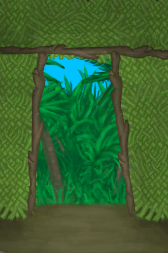
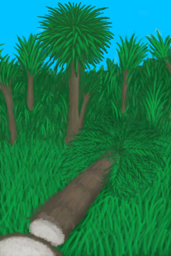
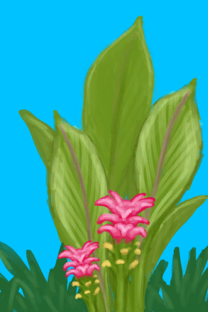
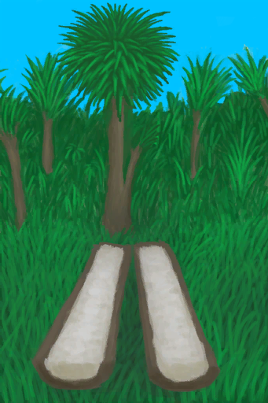
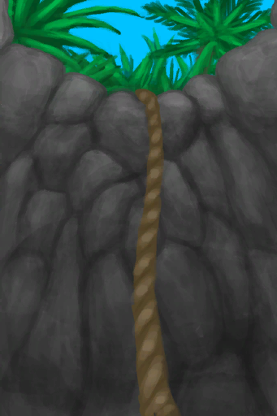
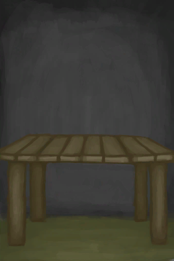

# 建筑  
## 内部区域  

[

 [畜栏](EnclosureEntrance.md)](EnclosureEntrance.md)

[

 [地窖](CellarEntrance.md)](CellarEntrance.md)

[

 [洞穴](CaveSeaEntrance.md)](CaveSeaEntrance.md)

[

 [飞机残骸](PlaneCrashEntrance.md)](PlaneCrashEntrance.md)

[

 [离开](MudHutExitDoor.md)](MudHutExitDoor.md)

[

 [离开木筏](RaftExit.md)](RaftExit.md)

[

 [离开木筏](RaftExitAtoll.md)](RaftExitAtoll.md)

[

 [猕猴窝](MacaqueDenEntranceClear.md)](MacaqueDenEntranceClear.md)

[

 [木筏](RaftEntrance.md)](RaftEntrance.md)

[

 [泥屋](MudHutEntrance.md)](MudHutEntrance.md)

[

 [泥屋](MudHutEntranceRuins.md)](MudHutEntranceRuins.md)

[

 [棚屋](ShedEntrance.md)](ShedEntrance.md)

[

 [石屋](StoneHutEntrance.md)](StoneHutEntrance.md)

[

 [幽暗洞穴](DarkCaveEntrance.md)](DarkCaveEntrance.md)

  
  
## 农田  

[

 [参薯田](CropPlotYam.md)](CropPlotYam.md)

[

 [大叶仙茅田](CropPlotWeevilLily.md)](CropPlotWeevilLily.md)

[

 [稻田](CropPlotRice.md)](CropPlotRice.md)

[

 [毁坏的田地](CropPlotRuined.md)](CropPlotRuined.md)

[

 [姜田](CropPlotGinger.md)](CropPlotGinger.md)

[

 [金鸡纳树田](CropPlotCinchonaTree.md)](CropPlotCinchonaTree.md)

[

 [咖啡田](CropPlotCoffee.md)](CropPlotCoffee.md)

[

 [卡瓦胡椒田](CropPlotKava.md)](CropPlotKava.md)

[

 [辣椒田](CropPlotChilies.md)](CropPlotChilies.md)

[

 [芦荟田](CropPlotAloeVera.md)](CropPlotAloeVera.md)

[

 [马勃菌菌床](MushroomBedPuffballs.md)](MushroomBedPuffballs.md)

[

 [芒果树田](CropPlotMangoTree.md)](CropPlotMangoTree.md)

[

 [迷幻菇菌床](MushroomBedMagic.md)](MushroomBedMagic.md)

[

 [茉莉花田](CropPlotJasmine.md)](CropPlotJasmine.md)

[

 [柠檬草田](CropPlotLemonGrass.md)](CropPlotLemonGrass.md)

[

 [蛇草田](CropPlotSnakeGrass.md)](CropPlotSnakeGrass.md)

[

 [水椰树田](CropPlotNipaPalm.md)](CropPlotNipaPalm.md)

[

 [未栽种的农田](CropPlotEmpty.md)](CropPlotEmpty.md)

[

 [未种植的菌床](MushroomBedEmpty.md)](MushroomBedEmpty.md)

[

 [西米树田](CropPlotSagoPalm.md)](CropPlotSagoPalm.md)

[

 [香蕉树田](CropPlotBananaTree.md)](CropPlotBananaTree.md)

[

 [杏仁树田](CropPlotAlmondTree.md)](CropPlotAlmondTree.md)

[

 [椰子树田](CropPlotPalmTree.md)](CropPlotPalmTree.md)

[

 [野枣田](CropPlotWildJujube.md)](CropPlotWildJujube.md)

[

 [月季田](CropPlotChinaRose.md)](CropPlotChinaRose.md)

[

 [杂菌菌床](MushroomBedAssorted.md)](MushroomBedAssorted.md)

[

 [蜘蛛兰田](CropPlotSpiderLily.md)](CropPlotSpiderLily.md)

[

 [棕榈丛田](CropPlotPalmBush.md)](CropPlotPalmBush.md)

  
  
## 地点  

[

 [被淹没的潮汐池](TidePoolFlooded.md)](TidePoolFlooded.md)

[

 [蝙蝠洞](CaveBatsEntrance.md)](CaveBatsEntrance.md)

[

 [蝙蝠群](BatColony.md)](BatColony.md)

[

 [草原洞穴](CaveGrasslandsEntrance.md)](CaveGrasslandsEntrance.md)

[

 [潮湿洞穴](DampChamberEntrance.md)](DampChamberEntrance.md)

[

 [潮湿洞穴](DarkCaveCaveExit.md)](DarkCaveCaveExit.md)

[

 [潮汐池](TidePool.md)](TidePool.md)

[

 [潮汐洞](CaveTidalEntrance.md)](CaveTidalEntrance.md)

[

 [沉船](Shipwreck.md)](Shipwreck.md)

[

 [洞穴底层](CrystalChamberExit.md)](CrystalChamberExit.md)

[

 [洞穴底层](NarrowTunnelExit.md)](NarrowTunnelExit.md)

[

 [洞穴中层](DarkChamberCaveExit.md)](DarkChamberCaveExit.md)

[

 [废墟](Debris.md)](Debris.md)

[

 [干涸的洞穴水潭](CavePond.md)](CavePond.md)

[

 [干涸的小水坑](CavePuddle.md)](CavePuddle.md)

[

 [干涸的小水塘](Puddle.md)](Puddle.md)

[

 [干涸酸湖](AcidLakePuddle.md)](AcidLakePuddle.md)

[

 [海](Sea_Atoll.md)](Sea_Atoll.md)

[

 [海](Sea_Bay.md)](Sea_Bay.md)

[

 [海](Sea_Beach.md)](Sea_Beach.md)

[

 [海](Sea_Cove.md)](Sea_Cove.md)

[

 [海](Sea_DesolateBeach.md)](Sea_DesolateBeach.md)

[

 [海](Sea_Mangroves.md)](Sea_Mangroves.md)

[

 [海](Sea_Rocks.md)](Sea_Rocks.md)

[

 [海水](Sea_Cave.md)](Sea_Cave.md)

[

 [荒芜沙滩](Path_BirdRockToDesolateBeach.md)](Path_BirdRockToDesolateBeach.md)

[

 [晶石洞穴](CrystalChamberEntrance.md)](CrystalChamberEntrance.md)

[

 [坑洞](HighlandHoleEntrance.md)](HighlandHoleEntrance.md)

[

 [坑洞](HighlandHoleNoRope.md)](HighlandHoleNoRope.md)

[

 [骷髅](Skeleton.md)](Skeleton.md)

[

 [离开](CaveBatsExit.md)](CaveBatsExit.md)

[

 [离开](CaveGrasslandsExit.md)](CaveGrasslandsExit.md)

[

 [离开](CaveSeaExit.md)](CaveSeaExit.md)

[

 [离开](DarkChamberExit.md)](DarkChamberExit.md)

[

 [离开](HighChamberExit.md)](HighChamberExit.md)

[

 [离开](TunnelExit.md)](TunnelExit.md)

[

 [离开](CaveTidalExit.md)](CaveTidalExit.md)

[

 [离开](CellarExit.md)](CellarExit.md)

[

 [离开](DarkCaveExit.md)](DarkCaveExit.md)

[

 [离开](EnclosureExit.md)](EnclosureExit.md)

[

 [离开](MacaqueDenExit.md)](MacaqueDenExit.md)

[

 [离开](MudHutExit.md)](MudHutExit.md)

[

 [离开](MudHutExitRuins.md)](MudHutExitRuins.md)

[

 [离开](PlaneCrashExit.md)](PlaneCrashExit.md)

[

 [离开](ShedExit.md)](ShedExit.md)

[

 [离开](StoneHutExit.md)](StoneHutExit.md)

[

 [硫磺喷口](VentBrimstone.md)](VentBrimstone.md)

[

 [猕猴窝](MacaqueDenEntrance.md)](MacaqueDenEntrance.md)

[

 [木筏](RaftEntranceAtoll.md)](RaftEntranceAtoll.md)

[

 [鸟岩岛](Path_CoveToBirdRock.md)](Path_CoveToBirdRock.md)

[

 [鸟岩岛](Path_DesolateBeachToBirdRock.md)](Path_DesolateBeachToBirdRock.md)

[

 [墙上的划痕](WallScratchings.md)](WallScratchings.md)

[

 [沙堆](SandSource.md)](SandSource.md)

[

 [竖井](ShaftCrystalChamberToFloodedChamber.md)](ShaftCrystalChamberToFloodedChamber.md)

[

 [竖井](ShaftHighChamberToMidChamber.md)](ShaftHighChamberToMidChamber.md)

[

 [竖井](ShaftMidChamberToLowChamber.md)](ShaftMidChamberToLowChamber.md)

[

 [水下出口](UnderwaterExit.md)](UnderwaterExit.md)

[

 [隧道入口](TunnelEntrance.md)](TunnelEntrance.md)

[

 [坍塌的隧道入口](TunnelEntranceClosed.md)](TunnelEntranceClosed.md)

[

 [铜矿脉](CopperVein.md)](CopperVein.md)

[

 [狭窄隧道](DampChamberExit.md)](DampChamberExit.md)

[

 [狭窄隧道](NarrowTunnelEntrance.md)](NarrowTunnelEntrance.md)

[

 [狭窄通道](CrystalChamberEntranceClosed.md)](CrystalChamberEntranceClosed.md)

[

 [狭窄通道](DarkCaveCaveEntranceClosed.md)](DarkCaveCaveEntranceClosed.md)

[

 [狭窄通道](DarkChamberCaveEntranceClosed.md)](DarkChamberCaveEntranceClosed.md)

[

 [狭窄通道](FloodedChamberEntranceClosed.md)](FloodedChamberEntranceClosed.md)

[

 [狭窄通道](HighChamberEntrance.md)](HighChamberEntrance.md)

[

 [狭窄通道](HighChamberEntranceClosed.md)](HighChamberEntranceClosed.md)

[

 [小型通道](DarkChamberCaveEntrance.md)](DarkChamberCaveEntrance.md)

[

 [岩滩](Path_BirdRockToRocks.md)](Path_BirdRockToRocks.md)

[

 [阴暗裂隙](DarkChamberEntrance.md)](DarkChamberEntrance.md)

[

 [幽暗洞穴](DarkCaveCaveEntrance.md)](DarkCaveCaveEntrance.md)

  
  
## 容器  

[

 [保鲜罐](ClayPotCoolerOff.md)](ClayPotCoolerOff.md)

[

 [保鲜罐](ClayPotCoolerOn.md)](ClayPotCoolerOn.md)

[

 [编织篓](BasketPlaced.md)](BasketPlaced.md)

[

 [编织篓](LuggagePlacedReference.md)](LuggagePlacedReference.md)

[

 [补给箱](SupplyChestRaft.md)](SupplyChestRaft.md)

[

 [超级生存箱 2000](TrunkPerkPlaced.md)](TrunkPerkPlaced.md)

[

 [储物箱](Chest.md)](Chest.md)

[

 [储物箱](ChestFarmer.md)](ChestFarmer.md)

[

 [储物箱](PlaneStorage.md)](PlaneStorage.md)

[

 [架子](Shelf.md)](Shelf.md)

[

 [没气的救生筏](LifeRaftDeflated.md)](LifeRaftDeflated.md)

[

 [收纳箱](TrunkPlaced.md)](TrunkPlaced.md)

[

 [书架](Bookshelf.md)](Bookshelf.md)

[

 [行李箱](LuggageAPlaced.md)](LuggageAPlaced.md)

[

 [行李箱](LuggageCPlaced.md)](LuggageCPlaced.md)

[

 [帐篷](TentDeployed.md)](TentDeployed.md)

  
  
## 植物  

[

 [剥净的金鸡纳树](CinchonaTreeCleared.md)](CinchonaTreeCleared.md)

[

 [大树](LargeTree.md)](LargeTree.md)

[

 [大叶仙茅](WeevilLily.md)](WeevilLily.md)

[

 [倒下的大树](LargeTreeFelled.md)](LargeTreeFelled.md)

[

 [倒下的热带杏仁树](TropicalAlmondTreeFelled.md)](TropicalAlmondTreeFelled.md)

[

 [倒下的西米树](SagoPalmFelled.md)](SagoPalmFelled.md)

[

 [倒下的棕榈树](PalmTreeFelled.md)](PalmTreeFelled.md)

[

 [稻草人](Scarecrow.md)](Scarecrow.md)

[

 [姜株](GingerPlant.md)](GingerPlant.md)

[

 [金鸡纳树](CinchonaTree.md)](CinchonaTree.md)

[

 [咖啡丛](CoffeePlant.md)](CoffeePlant.md)

[

 [卡瓦胡椒株](KavaPlant.md)](KavaPlant.md)

[

 [辣椒丛](ChiliPlant.md)](ChiliPlant.md)

[

 [芦荟](AloeVera.md)](AloeVera.md)

[

 [马勃菌](PuffballsPlant.md)](PuffballsPlant.md)

[

 [芒果树](MangoTree.md)](MangoTree.md)

[

 [迷幻菇](MagicMushroomsPlant.md)](MagicMushroomsPlant.md)

[

 [茉莉花](JasminePlant.md)](JasminePlant.md)

[

 [柠檬草](Lemongrass.md)](Lemongrass.md)

[

 [劈开的西米树干](SagoSplitLog.md)](SagoSplitLog.md)

[

 [热带杏仁树](TropicalAlmondTree.md)](TropicalAlmondTree.md)

[

 [蛇草丛](SnakegrassPatch.md)](SnakegrassPatch.md)

[

 [盛开的外星植物](AlienGrowth.md)](AlienGrowth.md)

[

 [树液补给点](PalmTreeSapStationEmpty.md)](PalmTreeSapStationEmpty.md)

[

 [树液收集处](PalmTreeSapStation.md)](PalmTreeSapStation.md)

[

 [水稻](RicePlant.md)](RicePlant.md)

[

 [水稻田](RicePaddy.md)](RicePaddy.md)

[

 [水椰](NipaPalm.md)](NipaPalm.md)

[

 [水椰树](NipaSapStation.md)](NipaSapStation.md)

[

 [外星植物](AlienGrowthCleared.md)](AlienGrowthCleared.md)

[

 [西米树](SagoPalm.md)](SagoPalm.md)

[

 [香蕉树](BananaTree.md)](BananaTree.md)

[

 [香蕉树桩](BananaStump.md)](BananaStump.md)

[

 [小芒果树](MangoTreeYoung.md)](MangoTreeYoung.md)

[

 [小树](SmallTree.md)](SmallTree.md)

[

 [小杏仁树](TropicalAlmondTreeYoung.md)](TropicalAlmondTreeYoung.md)

[

 [小棕榈树](SmallPalm.md)](SmallPalm.md)

[

 [椰子树](PalmTreeNew.md)](PalmTreeNew.md)

[

 [椰子树](PalmTreeNewMultiEventOld.md)](PalmTreeNewMultiEventOld.md)

[

 [椰子树](PalmTreeOld.md)](PalmTreeOld.md)

[

 [椰子树](PalmTree_IH.md)](PalmTree_IH.md)

[

 [椰子树](PalmTree_Unique.md)](PalmTree_Unique.md)

[

 [野参薯](YamPlant.md)](YamPlant.md)

[

 [野枣丛](WildJujube.md)](WildJujube.md)

[

 [幼年椰子树](PalmTreeYoung.md)](PalmTreeYoung.md)

[

 [月季丛](ChinaRosePlant.md)](ChinaRosePlant.md)

[

 [杂菌](AssortedMushroomsPlant.md)](AssortedMushroomsPlant.md)

[

 [摘光的芒果树](MangoTreeCleared.md)](MangoTreeCleared.md)

[

 [摘光的热带杏仁树](TropicalAlmondTreeCleared.md)](TropicalAlmondTreeCleared.md)

[

 [摘光的香蕉树](BananaTreeCleared.md)](BananaTreeCleared.md)

[

 [摘光的野枣从](WildJujubeCleared.md)](WildJujubeCleared.md)

[

 [摘完的椰子树](PalmTreeCleared.md)](PalmTreeCleared.md)

[

 [蜘蛛兰](SpiderLily.md)](SpiderLily.md)

[

 [棕榈丛](PalmBush.md)](PalmBush.md)

  
  
## 移动  

[

 [丛林边缘](Path_BeachToOutskirts.md)](Path_BeachToOutskirts.md)

[

 [丛林边缘](Path_JungleToOutskirts.md)](Path_JungleToOutskirts.md)

[

 [丛林高地](Path_CoveToJungleHighlands.md)](Path_CoveToJungleHighlands.md)

[

 [丛林高地](Path_DeepJungleToJungleHighlands.md)](Path_DeepJungleToJungleHighlands.md)

[

 [丛林高地](Path_HighlandsWToJungleHighlands.md)](Path_HighlandsWToJungleHighlands.md)

[

 [丛林高地](Path_ValleyToJungleHighlands.md)](Path_ValleyToJungleHighlands.md)

[

 [丛林高地](Path_WetlandsToJungleHighlands.md)](Path_WetlandsToJungleHighlands.md)

[

 [丛林深处](Path_JungleHighlandsToDeepJungle.md)](Path_JungleHighlandsToDeepJungle.md)

[

 [丛林深处](Path_ValleyToDeepJungle.md)](Path_ValleyToDeepJungle.md)

[

 [丛林深处](Path_WetlandsToDeepJungle.md)](Path_WetlandsToDeepJungle.md)

[

 [丛林小径](Path_BayToJungle.md)](Path_BayToJungle.md)

[

 [丛林小径](Path_GrasslandsWToJungle.md)](Path_GrasslandsWToJungle.md)

[

 [丛林小径](Path_OutskirtsToJungle.md)](Path_OutskirtsToJungle.md)

[

 [丛林小径](Path_WetlandsToJungle.md)](Path_WetlandsToJungle.md)

[

 [东部草原](Path_DesolateBeachToGrasslandsE.md)](Path_DesolateBeachToGrasslandsE.md)

[

 [东部草原](Path_GrasslandsWToGrasslandsE.md)](Path_GrasslandsWToGrasslandsE.md)

[

 [东部草原](Path_HighlandsEToGrasslandsE.md)](Path_HighlandsEToGrasslandsE.md)

[

 [东部高地](Path_GrasslandsEToHighlandsE.md)](Path_GrasslandsEToHighlandsE.md)

[

 [东部高地](Path_HighlandsWToHighlandsE.md)](Path_HighlandsWToHighlandsE.md)

[

 [东部高地](Path_VolcanoToHighlandsE.md)](Path_VolcanoToHighlandsE.md)

[

 [海湾](Path_BeachToBay.md)](Path_BeachToBay.md)

[

 [海湾](Path_JungleToBay.md)](Path_JungleToBay.md)

[

 [海湾](Path_MangrovesToBay.md)](Path_MangrovesToBay.md)

[

 [红树林](Path_BayToMangroves.md)](Path_BayToMangroves.md)

[

 [红树林](Path_DesolateBeachToMangroves.md)](Path_DesolateBeachToMangroves.md)

[

 [红树林](Path_GrasslandsWToMangroves.md)](Path_GrasslandsWToMangroves.md)

[

 [荒芜沙滩](Path_GrasslandsEToDesolateBeach.md)](Path_GrasslandsEToDesolateBeach.md)

[

 [荒芜沙滩](Path_MangrovesToDesolateBeach.md)](Path_MangrovesToDesolateBeach.md)

[

 [荒芜沙滩](Path_VolcanoToDesolateBeach.md)](Path_VolcanoToDesolateBeach.md)

[

 [火山](Path_AcidLakeToVolcano.md)](Path_AcidLakeToVolcano.md)

[

 [火山](Path_DesolateBeachToVolcano.md)](Path_DesolateBeachToVolcano.md)

[

 [火山](Path_HighlandsEToVolcano.md)](Path_HighlandsEToVolcano.md)

[

 [沙滩](Path_BayToBeach.md)](Path_BayToBeach.md)

[

 [沙滩](Path_OutskirtsToBeach.md)](Path_OutskirtsToBeach.md)

[

 [沙滩](Path_RocksToBeach.md)](Path_RocksToBeach.md)

[

 [山谷悬崖](Path_JungleHighlandsToValley.md)](Path_JungleHighlandsToValley.md)

[

 [神秘谷](Path_DeepJungleToValley.md)](Path_DeepJungleToValley.md)

[

 [湿地](Path_DeepJungleToWetlands.md)](Path_DeepJungleToWetlands.md)

[

 [湿地](Path_JungleToWetlands.md)](Path_JungleToWetlands.md)

[

 [湿地悬崖](Path_JungleHighlandsToWetlands.md)](Path_JungleHighlandsToWetlands.md)

[

 [酸湖](Path_VolcanoToAcidLake.md)](Path_VolcanoToAcidLake.md)

[

 [西部草原](Path_GrasslandsEToGrasslandsW.md)](Path_GrasslandsEToGrasslandsW.md)

[

 [西部草原](Path_HighlandsWToGrasslandsW.md)](Path_HighlandsWToGrasslandsW.md)

[

 [西部草原](Path_JungleToGrasslandsW.md)](Path_JungleToGrasslandsW.md)

[

 [西部草原](Path_MangrovesToGrasslandsW.md)](Path_MangrovesToGrasslandsW.md)

[

 [西部高地](Path_GrasslandsWToHighlandsW.md)](Path_GrasslandsWToHighlandsW.md)

[

 [西部高地](Path_HighlandsEToHighlandsW.md)](Path_HighlandsEToHighlandsW.md)

[

 [西部高地](Path_JungleHighlandsToHighlandsW.md)](Path_JungleHighlandsToHighlandsW.md)

[

 [岩滩](Path_BeachToRocks.md)](Path_BeachToRocks.md)

[

 [隐秘港湾](Path_JungleHighlandsToCove.md)](Path_JungleHighlandsToCove.md)

  
  
## 其他  

[

 [捕捞拖网](RaftFishTrap.md)](RaftFishTrap.md)

[

 [捕鱼陷阱](FishTrapDeployed.md)](FishTrapDeployed.md)

[

 [打开的降落伞](ParachuteDeployed.md)](ParachuteDeployed.md)

[

 [吊床](Hammock.md)](Hammock.md)

[

 [堆肥箱](CompostBin.md)](CompostBin.md)

[

 [繁殖中的蜂群](BeeSkepSwarming.md)](BeeSkepSwarming.md)

[

 [粪池](Cesspool.md)](Cesspool.md)

[

 [蜂巢](Beehive.md)](Beehive.md)

[

 [蜂箱](BeeSkep.md)](BeeSkep.md)

[

 [高处](HighPoint.md)](HighPoint.md)

[

 [高级窑炉](KilnAdvanced.md)](KilnAdvanced.md)

[

 [高级窑炉](KilnAdvancedExtinguished.md)](KilnAdvancedExtinguished.md)

[

 [过路的船只](PassingShip.md)](PassingShip.md)

[

 [海](Sea_Raft.md)](Sea_Raft.md)

[

 [海鸥巢](SeagullNest.md)](SeagullNest.md)

[

 [灰山鹑喂食器](PartridgeFeeder.md)](PartridgeFeeder.md)

[

 [灰山鹑喂食器](PartridgeFeederEmpty.md)](PartridgeFeederEmpty.md)

[

 [火堆](Fire.md)](Fire.md)

[

 [火堆](FireExtinguished.md)](FireExtinguished.md)

[

 [火炉](Stove.md)](Stove.md)

[

 [火炉](StoveExtinguished.md)](StoveExtinguished.md)

[

 [简易床](BedRustic.md)](BedRustic.md)

[

 [解除陷阱](CageTrapPlacedTriggered.md)](CageTrapPlacedTriggered.md)

[

 [解除陷阱](CageTrapPlacedTriggeredPartridgeFemale.md)](CageTrapPlacedTriggeredPartridgeFemale.md)

[

 [解除陷阱](CageTrapPlacedTriggeredPartridgeMale.md)](CageTrapPlacedTriggeredPartridgeMale.md)

[

 [解除陷阱](CageTrapPlacedTriggeredSeagull.md)](CageTrapPlacedTriggeredSeagull.md)

[

 [开始冒险](Start_Raft.md)](Start_Raft.md)

[

 [开始冒险](Start_RaftAtoll.md)](Start_RaftAtoll.md)

[

 [控制台](ControlPanelOff.md)](ControlPanelOff.md)

[

 [控制台](ControlPanelOn.md)](ControlPanelOn.md)

[

 [离开](HighlandHoleExit.md)](HighlandHoleExit.md)

[

 [晾晒架](DryingRack.md)](DryingRack.md)

[

 [滤水器](WaterFilter.md)](WaterFilter.md)

[

 [落石陷阱](DeadfallTrap.md)](DeadfallTrap.md)

[

 [落石陷阱](DeadfallTrapTriggered.md)](DeadfallTrapTriggered.md)

[

 [木床](BedWooden.md)](BedWooden.md)

[

 [木筏庇护所](RaftShelter.md)](RaftShelter.md)

[

 [木桌](Table.md)](Table.md)

[

 [泥滩](MudDeposit.md)](MudDeposit.md)

[

 [鸟岩岛](Path_RocksToBirdRock.md)](Path_RocksToBirdRock.md)

[

 [漂浮的残骸](FloatingDebris.md)](FloatingDebris.md)

[

 [人鱼巢](MermaidNest.md)](MermaidNest.md)

[

 [熔炉](Forge.md)](Forge.md)

[

 [熔炉](ForgeExtinguished.md)](ForgeExtinguished.md)

[

 [鲨鱼](SharkVisitor.md)](SharkVisitor.md)

[

 [收起的帆](SailDown_Raft.md)](SailDown_Raft.md)

[

 [竖井](ShaftFloodedChamberToCrystalChamber.md)](ShaftFloodedChamberToCrystalChamber.md)

[

 [竖井](ShaftLowChamberToMidChamber.md)](ShaftLowChamberToMidChamber.md)

[

 [竖井](ShaftMidChamberToHighChamber.md)](ShaftMidChamberToHighChamber.md)

[

 [水槽](WateringTrough.md)](WateringTrough.md)

[

 [水窖](Cistern.md)](Cistern.md)

[

 [水井](Well.md)](Well.md)

[

 [水下洞穴](UnderwaterEntrance.md)](UnderwaterEntrance.md)

[

 [损坏的帆](SailBroken_Raft.md)](SailBroken_Raft.md)

[

 [太阳能蒸馏器](SolarStill.md)](SolarStill.md)

[

 [陶轮](PotteryWheel.md)](PotteryWheel.md)

[

 [套索陷阱](SnareTrap.md)](SnareTrap.md)

[

 [套索陷阱](SnareTrapTriggered.md)](SnareTrapTriggered.md)

[

 [未浇灌的菌床](MushroomBedDry.md)](MushroomBedDry.md)

[

 [未浇灌的农田](CropPlotDry.md)](CropPlotDry.md)

[

 [未栽种的稻田](RicePaddyEmpty.md)](RicePaddyEmpty.md)

[

 [窝棚](Shelter.md)](Shelter.md)

[

 [陷坑](TrappingPit.md)](TrappingPit.md)

[

 [陷坑](TrappingPitTriggered.md)](TrappingPitTriggered.md)

[

 [硝石矿床](NiterBed.md)](NiterBed.md)

[

 [蓄水池](WaterReservoir.md)](WaterReservoir.md)

[

 [蓄水池](WaterReservoirFull.md)](WaterReservoirFull.md)

[

 [蓄水池（灌溉中）](WaterReservoirIrrigating.md)](WaterReservoirIrrigating.md)

[

 [扬起的帆](SailUp_Raft.md)](SailUp_Raft.md)

[

 [羊食槽](GoatFeeder.md)](GoatFeeder.md)

[

 [羊食槽](GoatFeederEmpty.md)](GoatFeederEmpty.md)

[

 [窑炉](Kiln.md)](Kiln.md)

[

 [窑炉](KilnExtinguished.md)](KilnExtinguished.md)

[

 [叶床](LeafBed.md)](LeafBed.md)

[

 [椅子](ChairPlaced.md)](ChairPlaced.md)

[

 [引擎](Engine1Closed.md)](Engine1Closed.md)

[

 [引擎](Engine2Closed.md)](Engine2Closed.md)

[

 [引擎（启动）](Engine1Open.md)](Engine1Open.md)

[

 [引擎（启动）](Engine2Open.md)](Engine2Open.md)

[

 [引擎（修理）](Engine1Repaired.md)](Engine1Repaired.md)

[

 [引擎（已拆分）](Engine2Dissassembled.md)](Engine2Dissassembled.md)

[

 [隐秘港湾](Path_BirdRockToCove.md)](Path_BirdRockToCove.md)

[

 [营火](Campfire.md)](Campfire.md)

[

 [营火](CampfireExtinguished.md)](CampfireExtinguished.md)

[

 [营火](GasCookerEmpty.md)](GasCookerEmpty.md)

[

 [有遮蔽的叶床](ShelteredLeafBed.md)](ShelteredLeafBed.md)

[

 [诱捕笼](CageTrapPlaced.md)](CageTrapPlaced.md)

[

 [雨水收集器](RainCatcher.md)](RainCatcher.md)

[

 [原木陷阱](LogTrap.md)](LogTrap.md)

[

 [原木陷阱](LogTrapTriggered.md)](LogTrapTriggered.md)

[

 [陨石坑](AlienCrater.md)](AlienCrater.md)

[

 [蒸馏器](AlembicOff.md)](AlembicOff.md)

[

 [蒸馏器](AlembicOn.md)](AlembicOn.md)

[

 [织布机](Loom.md)](Loom.md)

[

 [织布机（空）](LoomEmpty.md)](LoomEmpty.md)

[

 [猪食槽](BoarFeeder.md)](BoarFeeder.md)

[

 [猪食槽](BoarFeederEmpty.md)](BoarFeederEmpty.md)

[

 [祖父](Grandfather.md)](Grandfather.md)

[

 [祖父(健康)](GrandfatherHealthy.md)](GrandfatherHealthy.md)

[

 [座椅](SeatAttached.md)](SeatAttached.md)

[

 [座椅](SeatPlaced.md)](SeatPlaced.md)

  
  

