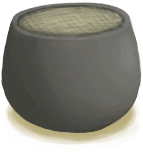
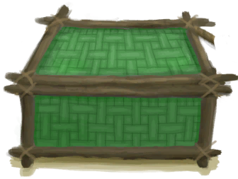
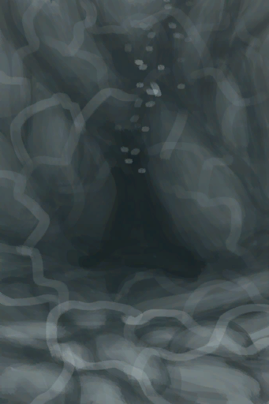
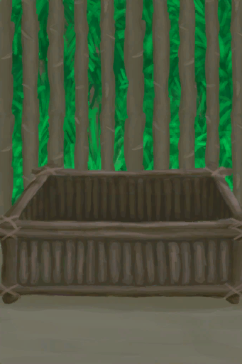
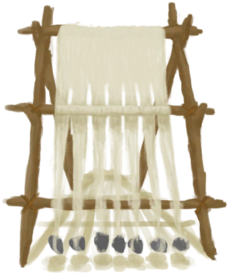

# 建筑  
## 内部区域  
   |     |     |     
 :----:    |   :----:    |   :----:    |   :----:    
[ [畜栏](EnclosureEntrance.md)](EnclosureEntrance.md)  |  [ [地窖](CellarEntrance.md)](CellarEntrance.md)  |  [ [洞穴](CaveSeaEntrance.md)](CaveSeaEntrance.md)  |  [ [飞机残骸](PlaneCrashEntrance.md)](PlaneCrashEntrance.md)  
[ [离开](MudHutExitDoor.md)](MudHutExitDoor.md)  |  [ [离开木筏](RaftExit.md)](RaftExit.md)  |  [ [离开木筏](RaftExitAtoll.md)](RaftExitAtoll.md)  |  [ [猕猴窝(空)](MacaqueDenEntranceClear.md)](MacaqueDenEntranceClear.md)  
[ [木筏](RaftEntrance.md)](RaftEntrance.md)  |  [ [泥屋](MudHutEntrance.md)](MudHutEntrance.md)  |  [ [泥屋](MudHutEntranceRuins.md)](MudHutEntranceRuins.md)  |  [ [棚屋](ShedEntrance.md)](ShedEntrance.md)  
[ [石屋](StoneHutEntrance.md)](StoneHutEntrance.md)  |  [ [幽暗洞穴](DarkCaveEntrance.md)](DarkCaveEntrance.md)  |    |    
## 农田  
   |     |     |     
 :----:    |   :----:    |   :----:    |   :----:    
[ [参薯田](CropPlotYam.md)](CropPlotYam.md)  |  [ [大叶仙茅田](CropPlotWeevilLily.md)](CropPlotWeevilLily.md)  |  [ [稻田](CropPlotRice.md)](CropPlotRice.md)  |  [ [毁坏的田地](CropPlotRuined.md)](CropPlotRuined.md)  
[ [姜田](CropPlotGinger.md)](CropPlotGinger.md)  |  [ [金鸡纳树田](CropPlotCinchonaTree.md)](CropPlotCinchonaTree.md)  |  [ [咖啡田](CropPlotCoffee.md)](CropPlotCoffee.md)  |  [ [卡瓦胡椒田](CropPlotKava.md)](CropPlotKava.md)  
[ [辣椒田](CropPlotChilies.md)](CropPlotChilies.md)  |  [ [芦荟田](CropPlotAloeVera.md)](CropPlotAloeVera.md)  |  [ [马勃菌菌床](MushroomBedPuffballs.md)](MushroomBedPuffballs.md)  |  [ [芒果树田](CropPlotMangoTree.md)](CropPlotMangoTree.md)  
[ [迷幻菇菌床](MushroomBedMagic.md)](MushroomBedMagic.md)  |  [ [茉莉花田](CropPlotJasmine.md)](CropPlotJasmine.md)  |  [ [柠檬草田](CropPlotLemonGrass.md)](CropPlotLemonGrass.md)  |  [ [蛇草田](CropPlotSnakeGrass.md)](CropPlotSnakeGrass.md)  
[ [水稻田](RicePaddy.md)](RicePaddy.md)  |  [ [水椰树田](CropPlotNipaPalm.md)](CropPlotNipaPalm.md)  |  [ [未浇灌的菌床](MushroomBedDry.md)](MushroomBedDry.md)  |  [ [未浇灌的农田](CropPlotDry.md)](CropPlotDry.md)  
[ [未栽种的稻田(空)](RicePaddyEmpty.md)](RicePaddyEmpty.md)  |  [ [未栽种的农田(空)](CropPlotEmpty.md)](CropPlotEmpty.md)  |  [ [未种植的菌床(空)](MushroomBedEmpty.md)](MushroomBedEmpty.md)  |  [ [西米树田](CropPlotSagoPalm.md)](CropPlotSagoPalm.md)  
[ [香蕉树田](CropPlotBananaTree.md)](CropPlotBananaTree.md)  |  [ [杏仁树田](CropPlotAlmondTree.md)](CropPlotAlmondTree.md)  |  [ [椰子树田](CropPlotPalmTree.md)](CropPlotPalmTree.md)  |  [ [野枣田](CropPlotWildJujube.md)](CropPlotWildJujube.md)  
[ [月季田](CropPlotChinaRose.md)](CropPlotChinaRose.md)  |  [ [杂菌菌床](MushroomBedAssorted.md)](MushroomBedAssorted.md)  |  [ [蜘蛛兰田](CropPlotSpiderLily.md)](CropPlotSpiderLily.md)  |  [ [棕榈丛田](CropPlotPalmBush.md)](CropPlotPalmBush.md)  
## 地点  
   |     |     |     
 :----:    |   :----:    |   :----:    |   :----:    
[ [被淹没的潮汐池(岩滩)](TidePoolFlooded.md)](TidePoolFlooded.md)  |  [ [蝙蝠洞(丛林高地)](CaveBatsEntrance.md)](CaveBatsEntrance.md)  |  [ [蝙蝠群(蝙蝠洞)](BatColony.md)](BatColony.md)  |  [ [草原洞穴(西部草原)](CaveGrasslandsEntrance.md)](CaveGrasslandsEntrance.md)  
[ [潮湿洞穴(洞穴上层)](DampChamberEntrance.md)](DampChamberEntrance.md)  |  [ [潮湿洞穴(幽暗洞穴)](DarkCaveCaveExit.md)](DarkCaveCaveExit.md)  |  [ [潮汐池(岩滩)](TidePool.md)](TidePool.md)  |  [ [潮汐洞(荒芜沙滩)](CaveTidalEntrance.md)](CaveTidalEntrance.md)  
[ [沉船(鸟岩岛)](Shipwreck.md)](Shipwreck.md)  |  [ [洞穴底层(洞穴上层)](CrystalChamberExit.md)](CrystalChamberExit.md)  |  [ [洞穴底层(洞穴上层)](NarrowTunnelExit.md)](NarrowTunnelExit.md)  |  [ [洞穴中层(阴暗洞穴)](DarkChamberCaveExit.md)](DarkChamberCaveExit.md)  
[ [废墟(泥屋)](Debris.md)](Debris.md)  |  [ [干涸的洞穴水潭(潮湿洞穴)](CavePond.md)](CavePond.md)  |  [ [干涸的小水坑(幽暗洞穴)](CavePuddle.md)](CavePuddle.md)  |  [ [干涸的小水塘(湿地)](Puddle.md)](Puddle.md)  
[ [干涸酸湖(火山)](AcidLakePuddle.md)](AcidLakePuddle.md)  |  [ [海(环礁)](Sea_Atoll.md)](Sea_Atoll.md)  |  [ [海(海湾)](Sea_Bay.md)](Sea_Bay.md)  |  [ [海(沙滩)](Sea_Beach.md)](Sea_Beach.md)  
[ [海(沙滩)](Sea_Cove.md)](Sea_Cove.md)  |  [ [海(荒芜沙滩)](Sea_DesolateBeach.md)](Sea_DesolateBeach.md)  |  [ [海(红树林)](Sea_Mangroves.md)](Sea_Mangroves.md)  |  [ [海(鸟岩岛)](Sea_Rocks.md)](Sea_Rocks.md)  
[ [海水(覆溺洞穴)](Sea_Cave.md)](Sea_Cave.md)  |  [ [荒芜沙滩(鸟岩岛)](Path_BirdRockToDesolateBeach.md)](Path_BirdRockToDesolateBeach.md)  |  [ [晶石洞穴(洞穴底层)](CrystalChamberEntrance.md)](CrystalChamberEntrance.md)  |  [ [坑洞(西部高地)](HighlandHoleEntrance.md)](HighlandHoleEntrance.md)  
[ [坑洞(无绳子)(西部高地)](HighlandHoleNoRope.md)](HighlandHoleNoRope.md)  |  [ [骷髅(坑洞)](Skeleton.md)](Skeleton.md)  |  [ [离开(蝙蝠洞)](CaveBatsExit.md)](CaveBatsExit.md)  |  [ [离开(洞穴)](CaveGrasslandsExit.md)](CaveGrasslandsExit.md)  
[ [离开(洞穴)](CaveSeaExit.md)](CaveSeaExit.md)  |  [ [离开(阴暗洞穴)](DarkChamberExit.md)](DarkChamberExit.md)  |  [ [离开(洞穴上层)](HighChamberExit.md)](HighChamberExit.md)  |  [ [离开(隧道)](TunnelExit.md)](TunnelExit.md)  
[ [离开(潮汐洞)](CaveTidalExit.md)](CaveTidalExit.md)  |  [ [离开(地窖)](CellarExit.md)](CellarExit.md)  |  [ [离开(幽暗洞穴)](DarkCaveExit.md)](DarkCaveExit.md)  |  [ [离开(畜栏)](EnclosureExit.md)](EnclosureExit.md)  
[ [离开(猕猴窝)](MacaqueDenExit.md)](MacaqueDenExit.md)  |  [ [离开(泥屋)](MudHutExit.md)](MudHutExit.md)  |  [ [离开(泥屋)](MudHutExitRuins.md)](MudHutExitRuins.md)  |  [ [离开(坠毁的飞机)](PlaneCrashExit.md)](PlaneCrashExit.md)  
[ [离开(棚屋)](ShedExit.md)](ShedExit.md)  |  [ [离开(石屋)](StoneHutExit.md)](StoneHutExit.md)  |  [ [硫磺喷口(火山)](VentBrimstone.md)](VentBrimstone.md)  |  [ [猕猴窝(丛林高地)](MacaqueDenEntrance.md)](MacaqueDenEntrance.md)  
[ [木筏(环礁)](RaftEntranceAtoll.md)](RaftEntranceAtoll.md)  |  [ [鸟岩岛(沙滩)](Path_CoveToBirdRock.md)](Path_CoveToBirdRock.md)  |  [ [鸟岩岛(荒芜沙滩)](Path_DesolateBeachToBirdRock.md)](Path_DesolateBeachToBirdRock.md)  |  [ [墙上的划痕(洞穴)](WallScratchings.md)](WallScratchings.md)  
[ [沙堆(环礁)](SandSource.md)](SandSource.md)  |  [ [竖井(洞穴上层)](ShaftCrystalChamberToFloodedChamber.md)](ShaftCrystalChamberToFloodedChamber.md)  |  [ [竖井(洞穴上层)](ShaftHighChamberToMidChamber.md)](ShaftHighChamberToMidChamber.md)  |  [ [竖井(洞穴中层)](ShaftMidChamberToLowChamber.md)](ShaftMidChamberToLowChamber.md)  
[ [水下出口(覆溺洞穴)](UnderwaterExit.md)](UnderwaterExit.md)  |  [ [隧道入口(东部高地)](TunnelEntrance.md)](TunnelEntrance.md)  |  [ [坍塌的隧道入口(东部高地)](TunnelEntranceClosed.md)](TunnelEntranceClosed.md)  |  [ [铜矿脉(洞穴上层)](CopperVein.md)](CopperVein.md)  
[ [狭窄隧道(潮湿洞穴)](DampChamberExit.md)](DampChamberExit.md)  |  [ [狭窄隧道(洞穴底层)](NarrowTunnelEntrance.md)](NarrowTunnelEntrance.md)  |  [ [狭窄通道(洞穴底层)](CrystalChamberEntranceClosed.md)](CrystalChamberEntranceClosed.md)  |  [ [狭窄通道(潮湿洞穴)](DarkCaveCaveEntranceClosed.md)](DarkCaveCaveEntranceClosed.md)  
[ [狭窄通道(洞穴中层)](DarkChamberCaveEntranceClosed.md)](DarkChamberCaveEntranceClosed.md)  |  [ [狭窄通道(洞穴上层)](FloodedChamberEntranceClosed.md)](FloodedChamberEntranceClosed.md)  |  [ [狭窄通道(隧道)](HighChamberEntrance.md)](HighChamberEntrance.md)  |  [ [狭窄通道(隧道)](HighChamberEntranceClosed.md)](HighChamberEntranceClosed.md)  
[ [小型通道(洞穴中层)](DarkChamberCaveEntrance.md)](DarkChamberCaveEntrance.md)  |  [ [岩滩(鸟岩岛)](Path_BirdRockToRocks.md)](Path_BirdRockToRocks.md)  |  [ [阴暗裂隙(坑洞)](DarkChamberEntrance.md)](DarkChamberEntrance.md)  |  [ [幽暗洞穴(潮湿洞穴)](DarkCaveCaveEntrance.md)](DarkCaveCaveEntrance.md)  
## 容器  
   |     |     |     
 :----:    |   :----:    |   :----:    |   :----:    
[ [保鲜罐(关)](ClayPotCoolerOff.md)](ClayPotCoolerOff.md)  |  [ [保鲜罐(开)](ClayPotCoolerOn.md)](ClayPotCoolerOn.md)  |  [ [编织篓(已放置)](BasketPlaced.md)](BasketPlaced.md)  |  [ [编织篓](LuggagePlacedReference.md)](LuggagePlacedReference.md)  
[ [补给箱](SupplyChestRaft.md)](SupplyChestRaft.md)  |  [ [超级生存箱 2000(已放置)](TrunkPerkPlaced.md)](TrunkPerkPlaced.md)  |  [ [储物箱](Chest.md)](Chest.md)  |  [ [储物箱(农夫专有)](ChestFarmer.md)](ChestFarmer.md)  
[ [储物箱](PlaneStorage.md)](PlaneStorage.md)  |  [ [架子](Shelf.md)](Shelf.md)  |  [ [没气的救生筏](LifeRaftDeflated.md)](LifeRaftDeflated.md)  |  [ [收纳箱](TrunkPlaced.md)](TrunkPlaced.md)  
[ [书架](Bookshelf.md)](Bookshelf.md)  |  [ [行李箱](LuggageAPlaced.md)](LuggageAPlaced.md)  |  [ [行李箱](LuggageCPlaced.md)](LuggageCPlaced.md)  |  [ [帐篷](TentDeployed.md)](TentDeployed.md)  
## 植物  
   |     |     |     
 :----:    |   :----:    |   :----:    |   :----:    
[ [剥净的金鸡纳树](CinchonaTreeCleared.md)](CinchonaTreeCleared.md)  |  [ [大树](LargeTree.md)](LargeTree.md)  |  [ [倒下的大树](LargeTreeFelled.md)](LargeTreeFelled.md)  |  [ [倒下的热带杏仁树](TropicalAlmondTreeFelled.md)](TropicalAlmondTreeFelled.md)  
[ [倒下的西米树](SagoPalmFelled.md)](SagoPalmFelled.md)  |  [ [倒下的棕榈树](PalmTreeFelled.md)](PalmTreeFelled.md)  |  [ [稻草人](Scarecrow.md)](Scarecrow.md)  |  [ [姜株](GingerPlant.md)](GingerPlant.md)  
[ [金鸡纳树](CinchonaTree.md)](CinchonaTree.md)  |  [ [咖啡丛](CoffeePlant.md)](CoffeePlant.md)  |  [ [卡瓦胡椒株](KavaPlant.md)](KavaPlant.md)  |  [ [辣椒丛](ChiliPlant.md)](ChiliPlant.md)  
[ [芦荟](AloeVera.md)](AloeVera.md)  |  [ [芒果树](MangoTree.md)](MangoTree.md)  |  [ [迷幻菇](MagicMushroomsPlant.md)](MagicMushroomsPlant.md)  |  [ [茉莉花](JasminePlant.md)](JasminePlant.md)  
[ [柠檬草](Lemongrass.md)](Lemongrass.md)  |  [ [劈开的西米树干](SagoSplitLog.md)](SagoSplitLog.md)  |  [ [热带杏仁树](TropicalAlmondTree.md)](TropicalAlmondTree.md)  |  [ [蛇草丛](SnakegrassPatch.md)](SnakegrassPatch.md)  
[ [盛开的外星植物](AlienGrowth.md)](AlienGrowth.md)  |  [ [树液补给点(空)](PalmTreeSapStationEmpty.md)](PalmTreeSapStationEmpty.md)  |  [ [树液收集处](PalmTreeSapStation.md)](PalmTreeSapStation.md)  |  [ [水稻](RicePlant.md)](RicePlant.md)  
[ [水椰树](NipaSapStation.md)](NipaSapStation.md)  |  [ [外星植物](AlienGrowthCleared.md)](AlienGrowthCleared.md)  |  [ [西米树](SagoPalm.md)](SagoPalm.md)  |  [ [香蕉树](BananaTree.md)](BananaTree.md)  
[ [香蕉树桩](BananaStump.md)](BananaStump.md)  |  [ [小芒果树](MangoTreeYoung.md)](MangoTreeYoung.md)  |  [ [小树](SmallTree.md)](SmallTree.md)  |  [ [小杏仁树](TropicalAlmondTreeYoung.md)](TropicalAlmondTreeYoung.md)  
[ [小棕榈树](SmallPalm.md)](SmallPalm.md)  |  [ [椰子树(新)](PalmTreeNew.md)](PalmTreeNew.md)  |  [ [椰子树](PalmTreeNewMultiEventOld.md)](PalmTreeNewMultiEventOld.md)  |  [ [椰子树(旧)](PalmTreeOld.md)](PalmTreeOld.md)  
[ [椰子树](PalmTree_IH.md)](PalmTree_IH.md)  |  [ [椰子树(特殊)](PalmTree_Unique.md)](PalmTree_Unique.md)  |  [ [野枣丛](WildJujube.md)](WildJujube.md)  |  [ [幼年椰子树](PalmTreeYoung.md)](PalmTreeYoung.md)  
[ [月季丛](ChinaRosePlant.md)](ChinaRosePlant.md)  |  [ [摘光的芒果树](MangoTreeCleared.md)](MangoTreeCleared.md)  |  [ [摘光的热带杏仁树](TropicalAlmondTreeCleared.md)](TropicalAlmondTreeCleared.md)  |  [ [摘光的香蕉树](BananaTreeCleared.md)](BananaTreeCleared.md)  
[ [摘光的野枣从](WildJujubeCleared.md)](WildJujubeCleared.md)  |  [ [摘完的椰子树](PalmTreeCleared.md)](PalmTreeCleared.md)  |  [ [蜘蛛兰](SpiderLily.md)](SpiderLily.md)  |  [ [棕榈丛](PalmBush.md)](PalmBush.md)  
## 移动  
   |     |     |     
 :----:    |   :----:    |   :----:    |   :----:    
[ [前往丛林边缘(沙滩)](Path_BeachToOutskirts.md)](Path_BeachToOutskirts.md)  |  [ [前往丛林边缘(丛林)](Path_JungleToOutskirts.md)](Path_JungleToOutskirts.md)  |  [ [前往丛林高地(沙滩)](Path_CoveToJungleHighlands.md)](Path_CoveToJungleHighlands.md)  |  [ [前往丛林高地(丛林深处)](Path_DeepJungleToJungleHighlands.md)](Path_DeepJungleToJungleHighlands.md)  
[ [前往丛林高地(西部高地)](Path_HighlandsWToJungleHighlands.md)](Path_HighlandsWToJungleHighlands.md)  |  [ [前往丛林高地](Path_ValleyToJungleHighlands.md)](Path_ValleyToJungleHighlands.md)  |  [ [前往丛林高地(湿地)](Path_WetlandsToJungleHighlands.md)](Path_WetlandsToJungleHighlands.md)  |  [ [前往丛林深处(丛林高地)](Path_JungleHighlandsToDeepJungle.md)](Path_JungleHighlandsToDeepJungle.md)  
[ [前往丛林深处(神秘谷)](Path_ValleyToDeepJungle.md)](Path_ValleyToDeepJungle.md)  |  [ [前往丛林深处(湿地)](Path_WetlandsToDeepJungle.md)](Path_WetlandsToDeepJungle.md)  |  [ [前往丛林小径(海湾)](Path_BayToJungle.md)](Path_BayToJungle.md)  |  [ [前往丛林小径](Path_GrasslandsWToJungle.md)](Path_GrasslandsWToJungle.md)  
[ [前往丛林小径](Path_OutskirtsToJungle.md)](Path_OutskirtsToJungle.md)  |  [ [前往丛林小径(湿地)](Path_WetlandsToJungle.md)](Path_WetlandsToJungle.md)  |  [ [前往东部草原(荒芜沙滩)](Path_DesolateBeachToGrasslandsE.md)](Path_DesolateBeachToGrasslandsE.md)  |  [ [前往东部草原(西部草原)](Path_GrasslandsWToGrasslandsE.md)](Path_GrasslandsWToGrasslandsE.md)  
[ [前往东部草原(东部高地)](Path_HighlandsEToGrasslandsE.md)](Path_HighlandsEToGrasslandsE.md)  |  [ [前往东部高地(东部草原)](Path_GrasslandsEToHighlandsE.md)](Path_GrasslandsEToHighlandsE.md)  |  [ [前往东部高地(西部高地)](Path_HighlandsWToHighlandsE.md)](Path_HighlandsWToHighlandsE.md)  |  [ [前往东部高地(火山)](Path_VolcanoToHighlandsE.md)](Path_VolcanoToHighlandsE.md)  
[ [前往海湾](Path_BeachToBay.md)](Path_BeachToBay.md)  |  [ [前往海湾(丛林)](Path_JungleToBay.md)](Path_JungleToBay.md)  |  [ [前往海湾](Path_MangrovesToBay.md)](Path_MangrovesToBay.md)  |  [ [前往红树林](Path_BayToMangroves.md)](Path_BayToMangroves.md)  
[ [前往红树林(荒芜沙滩)](Path_DesolateBeachToMangroves.md)](Path_DesolateBeachToMangroves.md)  |  [ [前往红树林(西部草原)](Path_GrasslandsWToMangroves.md)](Path_GrasslandsWToMangroves.md)  |  [ [前往荒芜沙滩(东部草原)](Path_GrasslandsEToDesolateBeach.md)](Path_GrasslandsEToDesolateBeach.md)  |  [ [前往荒芜沙滩](Path_MangrovesToDesolateBeach.md)](Path_MangrovesToDesolateBeach.md)  
[ [前往荒芜沙滩(火山)](Path_VolcanoToDesolateBeach.md)](Path_VolcanoToDesolateBeach.md)  |  [ [前往火山](Path_AcidLakeToVolcano.md)](Path_AcidLakeToVolcano.md)  |  [ [前往火山(荒芜沙滩)](Path_DesolateBeachToVolcano.md)](Path_DesolateBeachToVolcano.md)  |  [ [前往火山(东部高地)](Path_HighlandsEToVolcano.md)](Path_HighlandsEToVolcano.md)  
[ [前往沙滩(海湾)](Path_BayToBeach.md)](Path_BayToBeach.md)  |  [ [前往沙滩(丛林边缘)](Path_OutskirtsToBeach.md)](Path_OutskirtsToBeach.md)  |  [ [前往沙滩(岩滩)](Path_RocksToBeach.md)](Path_RocksToBeach.md)  |  [ [前往山谷悬崖](Path_JungleHighlandsToValley.md)](Path_JungleHighlandsToValley.md)  
[ [前往神秘谷(丛林深处)](Path_DeepJungleToValley.md)](Path_DeepJungleToValley.md)  |  [ [前往湿地(丛林深处)](Path_DeepJungleToWetlands.md)](Path_DeepJungleToWetlands.md)  |  [ [前往湿地(丛林)](Path_JungleToWetlands.md)](Path_JungleToWetlands.md)  |  [ [前往湿地悬崖](Path_JungleHighlandsToWetlands.md)](Path_JungleHighlandsToWetlands.md)  
[ [前往酸湖(火山)](Path_VolcanoToAcidLake.md)](Path_VolcanoToAcidLake.md)  |  [ [前往西部草原(东部草原)](Path_GrasslandsEToGrasslandsW.md)](Path_GrasslandsEToGrasslandsW.md)  |  [ [前往西部草原(西部高地)](Path_HighlandsWToGrasslandsW.md)](Path_HighlandsWToGrasslandsW.md)  |  [ [前往西部草原(丛林)](Path_JungleToGrasslandsW.md)](Path_JungleToGrasslandsW.md)  
[ [前往西部草原(红树林)](Path_MangrovesToGrasslandsW.md)](Path_MangrovesToGrasslandsW.md)  |  [ [前往西部高地(西部草原)](Path_GrasslandsWToHighlandsW.md)](Path_GrasslandsWToHighlandsW.md)  |  [ [前往西部高地](Path_HighlandsEToHighlandsW.md)](Path_HighlandsEToHighlandsW.md)  |  [ [前往西部高地(丛林高地)](Path_JungleHighlandsToHighlandsW.md)](Path_JungleHighlandsToHighlandsW.md)  
[ [前往岩滩(沙滩)](Path_BeachToRocks.md)](Path_BeachToRocks.md)  |  [ [前往隐秘港湾(丛林高地)](Path_JungleHighlandsToCove.md)](Path_JungleHighlandsToCove.md)  |    |    
## 其他  
   |     |     |     
 :----:    |   :----:    |   :----:    |   :----:    
[ [捕捞拖网](RaftFishTrap.md)](RaftFishTrap.md)  |  [ [捕鱼陷阱](FishTrapDeployed.md)](FishTrapDeployed.md)  |  [ [打开的降落伞](ParachuteDeployed.md)](ParachuteDeployed.md)  |  [ [大叶仙茅](WeevilLily.md)](WeevilLily.md)  
[ [吊床](Hammock.md)](Hammock.md)  |  [ [堆肥箱](CompostBin.md)](CompostBin.md)  |  [ [繁殖中的蜂群](BeeSkepSwarming.md)](BeeSkepSwarming.md)  |  [ [粪池](Cesspool.md)](Cesspool.md)  
[ [蜂巢](Beehive.md)](Beehive.md)  |  [ [蜂箱](BeeSkep.md)](BeeSkep.md)  |  [ [高处](HighPoint.md)](HighPoint.md)  |  [ [高级窑炉](KilnAdvanced.md)](KilnAdvanced.md)  
[ [高级窑炉(熄灭)](KilnAdvancedExtinguished.md)](KilnAdvancedExtinguished.md)  |  [ [过路的船只](PassingShip.md)](PassingShip.md)  |  [ [海](Sea_Raft.md)](Sea_Raft.md)  |  [ [海鸥巢](SeagullNest.md)](SeagullNest.md)  
[ [灰山鹑喂食器](PartridgeFeeder.md)](PartridgeFeeder.md)  |  [ [灰山鹑喂食器(空)](PartridgeFeederEmpty.md)](PartridgeFeederEmpty.md)  |  [ [火堆](Fire.md)](Fire.md)  |  [ [火堆(熄灭)](FireExtinguished.md)](FireExtinguished.md)  
[ [火炉](Stove.md)](Stove.md)  |  [ [火炉(熄灭)](StoveExtinguished.md)](StoveExtinguished.md)  |  [ [简易床](BedRustic.md)](BedRustic.md)  |  [ [解除陷阱](CageTrapPlacedTriggered.md)](CageTrapPlacedTriggered.md)  
[ [解除陷阱(雌灰山鹑)](CageTrapPlacedTriggeredPartridgeFemale.md)](CageTrapPlacedTriggeredPartridgeFemale.md)  |  [ [解除陷阱(雄灰山鹑)](CageTrapPlacedTriggeredPartridgeMale.md)](CageTrapPlacedTriggeredPartridgeMale.md)  |  [ [解除陷阱(海鸥)](CageTrapPlacedTriggeredSeagull.md)](CageTrapPlacedTriggeredSeagull.md)  |  [ [开始冒险](Start_Raft.md)](Start_Raft.md)  
[ [开始冒险](Start_RaftAtoll.md)](Start_RaftAtoll.md)  |  [ [控制台(关)](ControlPanelOff.md)](ControlPanelOff.md)  |  [ [控制台(开)](ControlPanelOn.md)](ControlPanelOn.md)  |  [ [离开](HighlandHoleExit.md)](HighlandHoleExit.md)  
[ [晾晒架](DryingRack.md)](DryingRack.md)  |  [ [滤水器](WaterFilter.md)](WaterFilter.md)  |  [ [落石陷阱](DeadfallTrap.md)](DeadfallTrap.md)  |  [ [落石陷阱](DeadfallTrapTriggered.md)](DeadfallTrapTriggered.md)  
[ [马勃菌](PuffballsPlant.md)](PuffballsPlant.md)  |  [ [木床](BedWooden.md)](BedWooden.md)  |  [ [木筏庇护所](RaftShelter.md)](RaftShelter.md)  |  [ [木桌](Table.md)](Table.md)  
[ [泥滩](MudDeposit.md)](MudDeposit.md)  |  [ [鸟岩岛](Path_RocksToBirdRock.md)](Path_RocksToBirdRock.md)  |  [ [漂浮的残骸](FloatingDebris.md)](FloatingDebris.md)  |  [ [人鱼巢](MermaidNest.md)](MermaidNest.md)  
[ [熔炉](Forge.md)](Forge.md)  |  [ [熔炉(熄灭)](ForgeExtinguished.md)](ForgeExtinguished.md)  |  [ [鲨鱼](SharkVisitor.md)](SharkVisitor.md)  |  [ [收起的帆](SailDown_Raft.md)](SailDown_Raft.md)  
[ [竖井](ShaftFloodedChamberToCrystalChamber.md)](ShaftFloodedChamberToCrystalChamber.md)  |  [ [竖井(洞穴中层)](ShaftLowChamberToMidChamber.md)](ShaftLowChamberToMidChamber.md)  |  [ [竖井](ShaftMidChamberToHighChamber.md)](ShaftMidChamberToHighChamber.md)  |  [ [水槽](WateringTrough.md)](WateringTrough.md)  
[ [水窖](Cistern.md)](Cistern.md)  |  [ [水井](Well.md)](Well.md)  |  [ [水下洞穴](UnderwaterEntrance.md)](UnderwaterEntrance.md)  |  [ [水椰](NipaPalm.md)](NipaPalm.md)  
[ [损坏的帆](SailBroken_Raft.md)](SailBroken_Raft.md)  |  [ [太阳能蒸馏器](SolarStill.md)](SolarStill.md)  |  [ [陶轮](PotteryWheel.md)](PotteryWheel.md)  |  [ [套索陷阱](SnareTrap.md)](SnareTrap.md)  
[ [套索陷阱](SnareTrapTriggered.md)](SnareTrapTriggered.md)  |  [ [窝棚](Shelter.md)](Shelter.md)  |  [ [陷坑](TrappingPit.md)](TrappingPit.md)  |  [ [陷坑](TrappingPitTriggered.md)](TrappingPitTriggered.md)  
[ [硝石矿床](NiterBed.md)](NiterBed.md)  |  [ [蓄水池](WaterReservoir.md)](WaterReservoir.md)  |  [ [蓄水池(满)](WaterReservoirFull.md)](WaterReservoirFull.md)  |  [ [蓄水池（灌溉中）](WaterReservoirIrrigating.md)](WaterReservoirIrrigating.md)  
[ [扬起的帆](SailUp_Raft.md)](SailUp_Raft.md)  |  [ [羊食槽](GoatFeeder.md)](GoatFeeder.md)  |  [ [羊食槽(空)](GoatFeederEmpty.md)](GoatFeederEmpty.md)  |  [ [窑炉](Kiln.md)](Kiln.md)  
[ [窑炉(熄灭)](KilnExtinguished.md)](KilnExtinguished.md)  |  [ [野参薯](YamPlant.md)](YamPlant.md)  |  [ [叶床](LeafBed.md)](LeafBed.md)  |  [ [椅子](ChairPlaced.md)](ChairPlaced.md)  
[ [引擎](Engine1Closed.md)](Engine1Closed.md)  |  [ [引擎](Engine2Closed.md)](Engine2Closed.md)  |  [ [引擎（启动）](Engine1Open.md)](Engine1Open.md)  |  [ [引擎（启动）](Engine2Open.md)](Engine2Open.md)  
[ [引擎（修理）](Engine1Repaired.md)](Engine1Repaired.md)  |  [ [引擎（已拆分）](Engine2Dissassembled.md)](Engine2Dissassembled.md)  |  [ [隐秘港湾](Path_BirdRockToCove.md)](Path_BirdRockToCove.md)  |  [ [营火](Campfire.md)](Campfire.md)  
[ [营火(熄灭)](CampfireExtinguished.md)](CampfireExtinguished.md)  |  [ [营火(空)](GasCookerEmpty.md)](GasCookerEmpty.md)  |  [ [有遮蔽的叶床](ShelteredLeafBed.md)](ShelteredLeafBed.md)  |  [ [诱捕笼](CageTrapPlaced.md)](CageTrapPlaced.md)  
[ [雨水收集器](RainCatcher.md)](RainCatcher.md)  |  [ [原木陷阱](LogTrap.md)](LogTrap.md)  |  [ [原木陷阱](LogTrapTriggered.md)](LogTrapTriggered.md)  |  [ [陨石坑](AlienCrater.md)](AlienCrater.md)  
[ [杂菌](AssortedMushroomsPlant.md)](AssortedMushroomsPlant.md)  |  [ [蒸馏器(关)](AlembicOff.md)](AlembicOff.md)  |  [ [蒸馏器(开)](AlembicOn.md)](AlembicOn.md)  |  [ [织布机](Loom.md)](Loom.md)  
[ [织布机（空）](LoomEmpty.md)](LoomEmpty.md)  |  [ [猪食槽](BoarFeeder.md)](BoarFeeder.md)  |  [ [猪食槽(空)](BoarFeederEmpty.md)](BoarFeederEmpty.md)  |  [ [祖父](Grandfather.md)](Grandfather.md)  
[ [祖父(健康)](GrandfatherHealthy.md)](GrandfatherHealthy.md)  |  [ [座椅](SeatAttached.md)](SeatAttached.md)  |  [ [座椅](SeatPlaced.md)](SeatPlaced.md)  |    

