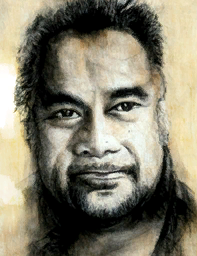
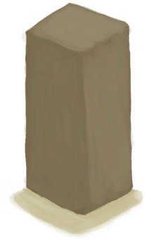
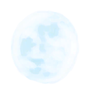

## 初始角色  
> 你独自一人在一个荒岛上迷茫地醒了过来……  
  
### 猎人  
<table class="table table-bordered"><thead><tr ><th  style="width:30%;text-align:left;vertical-align:top;" >图像</th><th  style="width:30%;text-align:left;vertical-align:top;" >初始特性</th><th  style="text-align:left;vertical-align:top;" >初始卡</th></tr></thead><tr ><td  style="width:30%;text-align:left;vertical-align:top;" ></td><td  style="width:30%;text-align:left;vertical-align:top;" >

[岛民](Pk_2_Islander.md) 

[皮肤黝黑](Pk_3_DarkSkin.md) 

[乐观主义](Pk_4_Optimist.md) 

[独来独往](Pk_4_Loner.md) 

[攀岩者](Pk_5_Climber.md) 

[游泳健将](Pk_5_Swimmer.md) 

[石匠](Pk_5_Knapper.md) 

[鼓手](Pk_5_Drummer.md) 

[水手](Pk_4_Sailor.md) 

[鱼叉手](Pk_5_SpearFisher.md) 

[长矛手](Pk_5_SpearFighter.md) 

[潜行大师](Pk_5_StealthMaster.md) 

[天生免疫](Pk_4_Immunized.md) 

[强免疫系统](Pk_4_ImmuneSystemStrong.md) 

[抗虫体质](Pk_4_BugResistant.md) 

[席地而睡](Pk_4_RoughSleeper.md)</td><td  style="text-align:left;vertical-align:top;" >[

[海鸥护符(蓝图)](Bp_SeagullCharm.md)](Bp_SeagullCharm.md) [

[仪式匕首(蓝图)](Bp_CeremonialDagger.md)](Bp_CeremonialDagger.md) [

[蜥蜴皮手鼓(蓝图)](Bp_LizardDrum.md)](Bp_LizardDrum.md) [

[鲨鱼头饰(蓝图)](Bp_SharkHeadpiece.md)](Bp_SharkHeadpiece.md)</td></tr></tbody></table>  
  
### 农夫  
<table class="table table-bordered"><thead><tr ><th  style="width:30%;text-align:left;vertical-align:top;" >图像</th><th  style="width:30%;text-align:left;vertical-align:top;" >初始特性</th><th  style="text-align:left;vertical-align:top;" >初始卡</th></tr></thead><tr ><td  style="width:30%;text-align:left;vertical-align:top;" ></td><td  style="width:30%;text-align:left;vertical-align:top;" >

[皮肤黝黑](Pk_3_DarkSkin.md) 

[乐观主义](Pk_4_Optimist.md) 

[独来独往](Pk_4_Loner.md) 

[药草学者](Pk_5_Herbologist.md) 

[陷阱能手](Pk_5_Trapper.md) 

[厨师](Pk_5_Cook.md) 

[木匠](Pk_5_Woodworker.md) 

[潜行大师](Pk_5_StealthMaster.md) 

[天生免疫](Pk_4_Immunized.md) 

[强免疫系统](Pk_4_ImmuneSystemStrong.md) 

[抗虫体质](Pk_4_BugResistant.md) 

[席地而睡](Pk_4_RoughSleeper.md) 

[祖父](Pk_6_Grandfather.md)</td><td  style="text-align:left;vertical-align:top;" >[

[祖父](Grandfather.md)](Grandfather.md) [

[储物箱(农夫专有)](ChestFarmer.md)](ChestFarmer.md) , [

[陶碗](ClayBowl.md)](ClayBowl.md)(3) , [

[陶罐](ClayVase.md)](ClayVase.md) , [

[手钻](HandDrill.md)](HandDrill.md) , [

[祖父的钝刀](KnifeGrandpaBlunt.md)](KnifeGrandpaBlunt.md) , [

[T恤](T-Shirt.md)](T-Shirt.md) , [

[塑料瓶](PlasticBottle.md)](PlasticBottle.md) , [

[扫帚](Broom.md)](Broom.md) [

[介绍(事件)](Event_IntroFarmer.md)](Event_IntroFarmer.md)</td></tr></tbody></table>  
  
### 游客  
<table class="table table-bordered"><thead><tr ><th  style="width:30%;text-align:left;vertical-align:top;" >图像</th><th  style="width:30%;text-align:left;vertical-align:top;" >初始特性</th><th  style="text-align:left;vertical-align:top;" >初始卡</th></tr></thead><tr ><td  style="width:30%;text-align:left;vertical-align:top;" ></td><td  style="width:30%;text-align:left;vertical-align:top;" >

[坠机](Pk_1_PlaneCrash.md) 

[游客](Pk_2_Tourist.md) 

[过度肥胖](Pk_3_Obese.md) 

[胃口大开](Pk_4_Gluttonous.md) 

[正在流血](Pk_3_BleedingWound.md) 

[皮肤白皙](Pk_3_PaleSkin.md) 

[免疫系统脆弱](Pk_4_ImmuneSystemWeak.md) 

[招虫体质](Pk_4_BugAttractant.md) 

[近视](Pk_3_Shortsighted.md) 

[钓鱼佬](Pk_5_Fisher.md) 

[猕猴诅咒](Pk_1_MacaqueCurse.md)</td><td  style="text-align:left;vertical-align:top;" >[

[坠机(事件)](Event_IntroTourist1.md)](Event_IntroTourist1.md) [

[止血带(蓝图)](Bp_Tourniquet.md)](Bp_Tourniquet.md) [

[相机](Camera.md)](Camera.md) [

[腰包](BeltBag.md)](BeltBag.md) , [

[护照](Passport.md)](Passport.md) , [

[纸](Papers.md)](Papers.md) [

[擦伤](W_Abrasion.md)](W_Abrasion.md) [

[擦伤](W_Abrasion.md)](W_Abrasion.md)</td></tr></tbody></table>  
  
### 人鱼  
<table class="table table-bordered"><thead><tr ><th  style="width:30%;text-align:left;vertical-align:top;" >图像</th><th  style="width:30%;text-align:left;vertical-align:top;" >初始特性</th><th  style="text-align:left;vertical-align:top;" >初始卡</th></tr></thead><tr ><td  style="width:30%;text-align:left;vertical-align:top;" ></td><td  style="width:30%;text-align:left;vertical-align:top;" >

[荒芜沙滩](Pk_1_LocationDesolateBeach.md) 

[海怪来袭](Pk_1_Seahounds.md) 

[夜视](Pk_3_NightVision.md) 

[夜晚开局](Pk_1_NightStart.md) 

[超级肾脏](Pk_3_SpecializedKidneys.md) 

[鱼人皮肤](Pk_3_PermeableSkin.md) 

[紫外线过敏](Pk_3_SunAllergy.md) 

[野人](Pk_4_Feral.md) 

[胃口大开](Pk_4_Gluttonous.md) 

[超级代谢](Pk_4_HyperMetabolism.md) 

[强免疫系统](Pk_4_ImmuneSystemStrong.md) 

[内陆恐惧症](Pk_4_LandSickness.md) 

[肉食主义者](Pk_4_Carnivore.md) 

[怀孕](Pk_6_Pregnancy.md) 

[游泳健将](Pk_5_Swimmer.md) 

[鱼叉手](Pk_5_SpearFisher.md)</td><td  style="text-align:left;vertical-align:top;" >[

[人鱼巢(蓝图)](Bp_MermaidNest.md)](Bp_MermaidNest.md)</td></tr></tbody></table>  
  
## 其他角色  
### 体验版人物  
<table class="table table-bordered"><thead><tr ><th  style="width:30%;text-align:left;vertical-align:top;" >图像</th><th  style="width:30%;text-align:left;vertical-align:top;" >初始特性</th><th  style="text-align:left;vertical-align:top;" >初始卡</th></tr></thead><tr ><td  style="width:30%;text-align:left;vertical-align:top;" ></td><td  style="width:30%;text-align:left;vertical-align:top;" >

[救生筏](Pk_1_LifeRaft.md) 

[超级生存箱 2000](Pk_2_SurvivalTrunk.md) 

[乐观主义](Pk_4_Optimist.md) 

[脚踏实地](Pk_4_DownToEarth.md) 

[独来独往](Pk_4_Loner.md) 

[攀岩者](Pk_5_Climber.md) 

[游泳健将](Pk_5_Swimmer.md) 

[钓鱼佬](Pk_5_Fisher.md) 

[药草学者](Pk_5_Herbologist.md) 

[陷阱能手](Pk_5_Trapper.md) 

[天生免疫](Pk_4_Immunized.md) 

[强免疫系统](Pk_4_ImmuneSystemStrong.md) 

[抗虫体质](Pk_4_BugResistant.md) 

[席地而睡](Pk_4_RoughSleeper.md) 

[海湾](Pk_1_LocationBay.md)</td><td  style="text-align:left;vertical-align:top;" ></td></tr></tbody></table>  
  
### 平平无奇的人  
<table class="table table-bordered"><thead><tr ><th  style="width:30%;text-align:left;vertical-align:top;" >图像</th><th  style="width:30%;text-align:left;vertical-align:top;" >初始特性</th><th  style="text-align:left;vertical-align:top;" >初始卡</th></tr></thead><tr ><td  style="width:30%;text-align:left;vertical-align:top;" ></td><td  style="width:30%;text-align:left;vertical-align:top;" ></td><td  style="text-align:left;vertical-align:top;" ></td></tr></tbody></table>  
  
### 生存专家  
<table class="table table-bordered"><thead><tr ><th  style="width:30%;text-align:left;vertical-align:top;" >图像</th><th  style="width:30%;text-align:left;vertical-align:top;" >初始特性</th><th  style="text-align:left;vertical-align:top;" >初始卡</th></tr></thead><tr ><td  style="width:30%;text-align:left;vertical-align:top;" ></td><td  style="width:30%;text-align:left;vertical-align:top;" >

[超级生存箱 2000](Pk_2_SurvivalTrunk.md) 

[生存专家](Pk_2_Survivalist.md) 

[乐观主义](Pk_4_Optimist.md) 

[脚踏实地](Pk_4_DownToEarth.md) 

[独来独往](Pk_4_Loner.md) 

[攀岩者](Pk_5_Climber.md) 

[游泳健将](Pk_5_Swimmer.md) 

[钓鱼佬](Pk_5_Fisher.md) 

[药草学者](Pk_5_Herbologist.md) 

[陷阱能手](Pk_5_Trapper.md) 

[天生免疫](Pk_4_Immunized.md) 

[强免疫系统](Pk_4_ImmuneSystemStrong.md) 

[抗虫体质](Pk_4_BugResistant.md)</td><td  style="text-align:left;vertical-align:top;" >[

[手机(关)](PhoneOff.md)](PhoneOff.md)</td></tr></tbody></table>  
  

