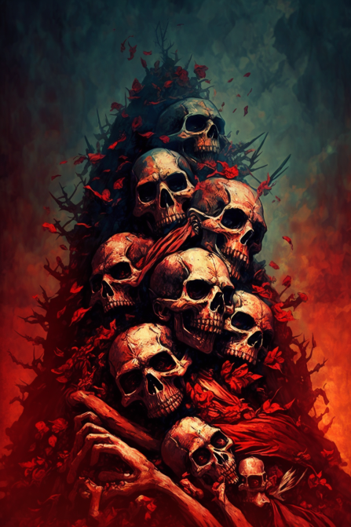

# 血疫(COD-废城)  
> 迷雾粘稠如水，一声撕裂的惨叫迸发而出！下一刻整座肉山炸成碎肉四处横飞，不再动弹。  
  
<table class="table table-bordered" data-toggle="table"  data-show-header="false"><thead style="display:none"><tr ><th  style="width:50%;text-align:left;vertical-align:top;"  >title</th><th  style="width:50%;text-align:left;vertical-align:top;"  ></th></tr></thead><tr ><td  style="width:50%;text-align:left;vertical-align:top;"  >**重量：**100</td><td  style="width:50%;text-align:left;vertical-align:top;"  >

<a href="cod_Event_BloodHeart_Death.md" style="color:black">血疫</a>

</td></tr></tbody></table>  
  
## 动作  

<table><tr><td rowspan="2" style="width:200px;text-align:center;font-size:1.3em;font-weight:bold">

咳咳咳..

</td><td></td></tr><tr><td><b>自身：</b>→消失</td></tr><tr><td colspan="2"><b>状态变化：</b>[

[情绪](Morale.md)](Morale.md)<b>-5</b>, [

[血疫](cod_Gs_Ruins_BloodPlague.md)](cod_Gs_Ruins_BloodPlague.md)<b>+96</b>, [

[噪声系数](cod_Gs_NoiseLevel.md)](cod_Gs_NoiseLevel.md)<b>+20</b>, [

[区域热度](cod_Gs_NoiseFactor.md)](cod_Gs_NoiseFactor.md)<b>+40</b>, [

[清醒度](Wakefulness.md)](Wakefulness.md)<b>+96</b>, [Gs_BloodHeart_Macy_ExistCount](cod_Gs_BloodHeart_Macy_ExistCount.md)<b>-1</b></td></tr><tr><td colspan="2">

<table style="margin-bottom:3px;"><tr><td rowspan=2 style="text-align:center" width="80px">
基础权重

1
</td><td style="font-size:0.6em;line-height:0.6em;font-weight:bold">Carcass</td></tr><tr><td>[

[僵尸(废弃锯木厂)](cod_Nc_OrdinaryZombie.md)](cod_Nc_OrdinaryZombie.md)(<b>+3</b>), [

[迅猛(神秘小镇)](cod_Nc_SwiftZombie.md)](cod_Nc_SwiftZombie.md)(<b>+1</b>), [

[利爪(神秘小镇)](cod_Nc_SharpClawZombies.md)](cod_Nc_SharpClawZombies.md)(<b>+1</b>)</td></tr></table>

<table style="margin-bottom:3px;"><tr><td rowspan=2 style="text-align:center" width="80px">
基础权重

3
</td><td style="font-size:0.6em;line-height:0.6em;font-weight:bold">Wounded</td></tr><tr><td>[

[僵尸(废弃锯木厂)](cod_Nc_OrdinaryZombie.md)](cod_Nc_OrdinaryZombie.md)(<b>+3</b>), [

[污秽(废弃锯木厂)](cod_Nc_FilthyZombie.md)](cod_Nc_FilthyZombie.md)(<b>+1</b>), [

[石化(废弃矿区)](cod_Nc_PetrifiedZombie.md)](cod_Nc_PetrifiedZombie.md)(<b>+1</b>)</td></tr></table>

<table style="margin-bottom:3px;"><tr><td rowspan=2 style="text-align:center" width="80px">
基础权重

1
</td><td style="font-size:0.6em;line-height:0.6em;font-weight:bold">Debris</td></tr><tr><td>[

[僵尸(废弃锯木厂)](cod_Nc_OrdinaryZombie.md)](cod_Nc_OrdinaryZombie.md)(<b>+3</b>), [

[巨霸(摩登街道)](cod_Nc_GiantBusterZombie.md)](cod_Nc_GiantBusterZombie.md)(<b>+1</b>), [

[污秽(废弃锯木厂)](cod_Nc_FilthyZombie.md)](cod_Nc_FilthyZombie.md)(<b>+1</b>)</td></tr></table>

<table style="margin-bottom:3px;"><tr><td rowspan=2 style="text-align:center" width="80px">
基础权重

1
</td><td style="font-size:0.6em;line-height:0.6em;font-weight:bold">YoYo</td></tr><tr><td>[

[僵尸(废弃锯木厂)](cod_Nc_OrdinaryZombie.md)](cod_Nc_OrdinaryZombie.md)(<b>+2</b>), [

[迅猛(神秘小镇)](cod_Nc_SwiftZombie.md)](cod_Nc_SwiftZombie.md)(<b>+1</b>), [

[利爪(神秘小镇)](cod_Nc_SharpClawZombies.md)](cod_Nc_SharpClawZombies.md)(<b>+1</b>), [

[石化(废弃矿区)](cod_Nc_PetrifiedZombie.md)](cod_Nc_PetrifiedZombie.md)(<b>+1</b>)</td></tr></table>

</td></tr></table>
  
  
  

