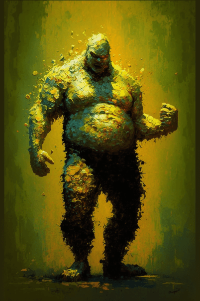
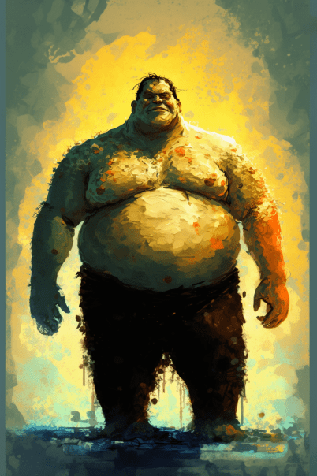
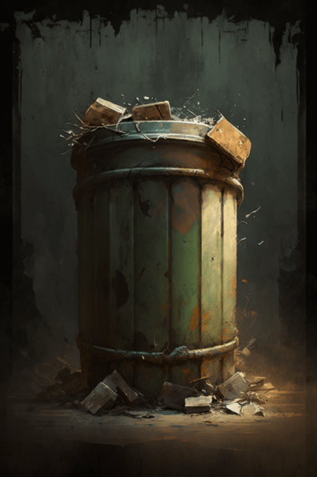
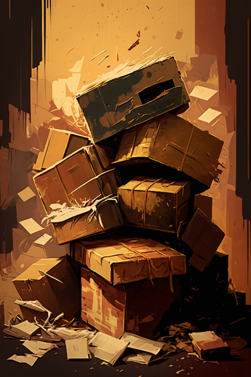
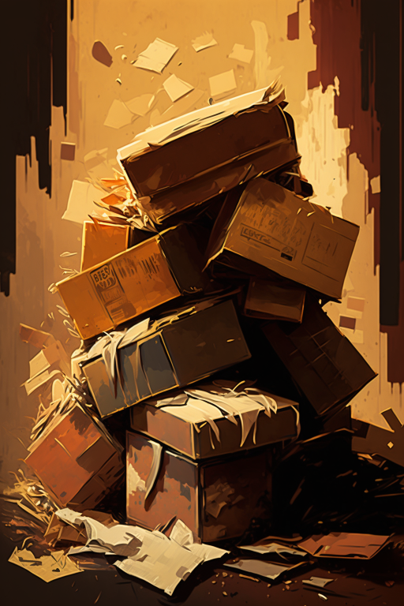
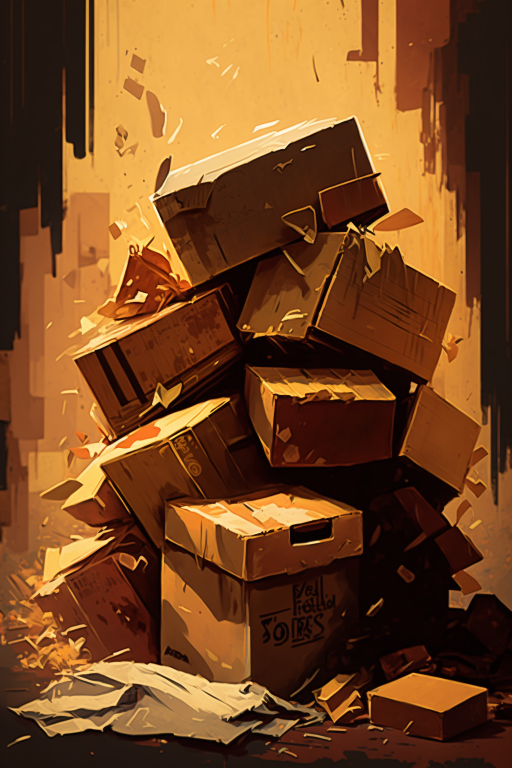

# 摩登街道(COD-废城)  
> 可以依稀看到曾经繁华的身影..如今它被红雾所弥漫。  
  

<a href="cod_Exp_ModernStreet.md" style="color:black">摩登街道</a>

<a href="cod_Exp_腐败之城.md" style="color:black">破败轮船</a>

<a href="cod_Exp_Macy.md" style="color:black">梅西百货</a>

<a href="cod_Nc_OrdinaryZombie.md" style="color:black">僵尸x3</a>

<a href="cod_Nc_ScreamingZombies.md" style="color:black">尖啸x2</a>

<a href="cod_Nc_FilthyZombie.md" style="color:black">污秽x2</a>

<a href="cod_Nc_GiantBusterZombie.md" style="color:black">巨霸</a>

<a href="cod_Nc_PetrifiedZombie.md" style="color:black">石化</a>

<a href="cod_Path_ModernStreetToPortCity.md" style="color:black">腐败之城</a>

<a href="cod_Nc_BloodHeart_BloodMist.md" style="color:black">血雾</a>

  
  
<table class="table table-bordered" data-toggle="table"  data-show-header="false"><thead style="display:none"><tr ><th  style="width:50%;text-align:left;vertical-align:top;"  >title</th><th  style="width:50%;text-align:left;vertical-align:top;"  data-sortable="true"  ></th></tr></thead><tr ><td  style="width:50%;text-align:left;vertical-align:top;"  >** 区域唯一 **  ** 不可删除 **  **环境：**[摩登街道(环境)](cod_Env_ModernStreet.md)  ** 环境效果: ** [

[光亮](Light.md)](Light.md)<b>+10</b> [

[体感温度](TemperaturePerceived.md)](TemperaturePerceived.md)<b>-5</b> [

[内陆恐惧症](LandSickness.md)](LandSickness.md)加成<b>-8</b> [Ruins_MapCount](cod_Gs_Ruins_MapCount.md)<b>+1</b></td><td  style="width:50%;text-align:left;vertical-align:top;"  ></td></tr></tbody></table>  
  
## 探索  
<table class="table table-bordered" data-toggle="table"  ><thead style=""><tr ><th  style="text-align:left;vertical-align:top;"  >进度</th><th  style="text-align:left;vertical-align:top;"  >目的地</th></tr></thead><tr ><td  style="text-align:left;vertical-align:top;"  >25%</td><td  style="text-align:left;vertical-align:top;"  >[前往梅西百货(摩登街道)](cod_Path_ModernStreetToMacy.md)</td></tr></tbody></table>  
  
## 动作  

<table><tr><td rowspan="2" style="width:200px;text-align:center;font-size:1.3em;font-weight:bold">

探索

15分

</td><td>[“腿部动作(组)”](LegAction.md)</td></tr><tr><td></td></tr><tr><td colspan="2"><b>需求：</b>[

[光亮](Light.md)](Light.md): <b>10-100</b></td></tr><tr><td colspan="2"><b>状态变化：</b>[

[足部损伤](FootDamage.md)](FootDamage.md)<b>+15</b>, [

[耐力](Stamina.md)](Stamina.md)<b>-2</b>, [

[压力](Stress.md)](Stress.md)<b>-10</b></td></tr><tr><td colspan="2">

<table style="margin-bottom:3px;"><tr><td rowspan=2 style="text-align:center" width="80px">
基础权重

8
</td><td style="font-size:0.6em;line-height:0.6em;font-weight:bold">Exp_CorruptionCity_ProducedCard_1</td></tr><tr><td>[

[尸群(事件)(腐败之城)](cod_eve_尸群来了.md)](cod_eve_尸群来了.md)(<b>+1</b>)</td></tr></table>

<table style="margin-bottom:3px;"><tr><td rowspan=2 style="text-align:center" width="80px">
基础权重

5
</td><td style="font-size:0.6em;line-height:0.6em;font-weight:bold">Exp_CorruptionCity_ProducedCard_2</td></tr><tr><td>[

[破败轮船](cod_城市垃圾桶.md)](cod_城市垃圾桶.md)(<b>+1</b>)</td></tr></table>

<table style="margin-bottom:3px;"><tr><td rowspan=2 style="text-align:center" width="80px">
基础权重

8
</td><td style="font-size:0.6em;line-height:0.6em;font-weight:bold">Exp_CorruptionCity_ProducedCard_3</td></tr><tr><td>[

[尸群(事件)](cod_eve_城市僵尸攻击事件1.md)](cod_eve_城市僵尸攻击事件1.md)(<b>+0～+1</b>)</td></tr></table>

<table style="margin-bottom:3px;"><tr><td rowspan=2 style="text-align:center" width="80px">
基础权重

8
</td><td style="font-size:0.6em;line-height:0.6em;font-weight:bold">Exp_CorruptionCity_ProducedCard_4</td></tr><tr><td>[

[尸群(事件)](cod_eve_城市僵尸攻击事件2.md)](cod_eve_城市僵尸攻击事件2.md)(<b>+0～+1</b>)</td></tr></table>

<table style="margin-bottom:3px;"><tr><td rowspan=2 style="text-align:center" width="80px">
基础权重

5
</td><td style="font-size:0.6em;line-height:0.6em;font-weight:bold">Exp_CorruptionCity_ProducedCard_5</td></tr><tr><td>[

[破败轮船](cod_城市长椅.md)](cod_城市长椅.md)(<b>+1</b>)</td></tr></table>

<table style="margin-bottom:3px;"><tr><td rowspan=2 style="text-align:center" width="80px">
基础权重

8
</td><td style="font-size:0.6em;line-height:0.6em;font-weight:bold">Exp_CorruptionCity_ProducedCard_6</td></tr><tr><td>[

[污秽(破败轮船)](cod_Nc_FilthyZombie.md)](cod_Nc_FilthyZombie.md)(<b>+1</b>)</td></tr></table>

<table style="margin-bottom:3px;"><tr><td rowspan=2 style="text-align:center" width="80px">
基础权重

8
</td><td style="font-size:0.6em;line-height:0.6em;font-weight:bold">Exp_CorruptionCity_ProducedCard_7</td></tr><tr><td>[

[巨霸(摩登街道)](cod_Nc_GiantBusterZombie.md)](cod_Nc_GiantBusterZombie.md)(<b>+1</b>)</td></tr></table>

<table style="margin-bottom:3px;"><tr><td rowspan=2 style="text-align:center" width="80px">
基础权重

8
</td><td style="font-size:0.6em;line-height:0.6em;font-weight:bold">Exp_CorruptionCity_ProducedCard_8</td></tr><tr><td>[

[僵尸(破败轮船)](cod_Nc_OrdinaryZombie.md)](cod_Nc_OrdinaryZombie.md)(<b>+1</b>)</td></tr></table>

<table style="margin-bottom:3px;"><tr><td rowspan=2 style="text-align:center" width="80px">
基础权重

8
</td><td style="font-size:0.6em;line-height:0.6em;font-weight:bold">Exp_CorruptionCity_ProducedCard_9</td></tr><tr><td>[

[石化(破败轮船)](cod_Nc_PetrifiedZombie.md)](cod_Nc_PetrifiedZombie.md)(<b>+1</b>)</td></tr></table>

<table style="margin-bottom:3px;"><tr><td rowspan=2 style="text-align:center" width="80px">
基础权重

8
</td><td style="font-size:0.6em;line-height:0.6em;font-weight:bold">Exp_CorruptionCity_ProducedCard_10</td></tr><tr><td>[

[尖啸(腐败之城)](cod_Nc_ScreamingZombies.md)](cod_Nc_ScreamingZombies.md)(<b>+1</b>)</td></tr></table>

<table style="margin-bottom:3px;"><tr><td rowspan=2 style="text-align:center" width="80px">
基础权重

8
</td><td style="font-size:0.6em;line-height:0.6em;font-weight:bold">Exp_CorruptionCity_ProducedCard_11</td></tr><tr><td>[

[利爪(腐败之城)](cod_Nc_SharpClawZombies.md)](cod_Nc_SharpClawZombies.md)(<b>+1</b>)</td></tr></table>

<table style="margin-bottom:3px;"><tr><td rowspan=2 style="text-align:center" width="80px">
基础权重

8
</td><td style="font-size:0.6em;line-height:0.6em;font-weight:bold">Exp_CorruptionCity_ProducedCard_12</td></tr><tr><td>[

[迅猛(腐败之城)](cod_Nc_SwiftZombie.md)](cod_Nc_SwiftZombie.md)(<b>+1</b>)</td></tr></table>

<table style="margin-bottom:3px;"><tr><td rowspan=2 style="text-align:center" width="80px">
基础权重

2
</td><td style="font-size:0.6em;line-height:0.6em;font-weight:bold">Exp_CorruptionCity_ProducedCard_13</td></tr><tr><td>[

[物品堆](cod_Nc_ScavengingSupplies_Location_PileItems_TypeOne.md)](cod_Nc_ScavengingSupplies_Location_PileItems_TypeOne.md)(<b>+1</b>)</td></tr></table>

<table style="margin-bottom:3px;"><tr><td rowspan=2 style="text-align:center" width="80px">
基础权重

2
</td><td style="font-size:0.6em;line-height:0.6em;font-weight:bold">Exp_CorruptionCity_ProducedCard_14</td></tr><tr><td>[

[物品堆](cod_Nc_ScavengingSupplies_Location_PileItems_TypeTwo.md)](cod_Nc_ScavengingSupplies_Location_PileItems_TypeTwo.md)(<b>+1</b>)</td></tr></table>

<table style="margin-bottom:3px;"><tr><td rowspan=2 style="text-align:center" width="80px">
基础权重

2
</td><td style="font-size:0.6em;line-height:0.6em;font-weight:bold">Exp_CorruptionCity_ProducedCard_15</td></tr><tr><td>[

[物品堆](cod_Nc_ScavengingSupplies_Location_PileItems_TypeThree.md)](cod_Nc_ScavengingSupplies_Location_PileItems_TypeThree.md)(<b>+1</b>)</td></tr></table>

<table style="margin-bottom:3px;"><tr><td rowspan=2 style="text-align:center" width="80px">
基础权重

2
</td><td style="font-size:0.6em;line-height:0.6em;font-weight:bold">Exp_CorruptionCity_ProducedCard_16</td></tr><tr><td>[

[物品堆](cod_Nc_ScavengingSupplies_Location_PileItems_TypeFour.md)](cod_Nc_ScavengingSupplies_Location_PileItems_TypeFour.md)(<b>+1</b>)</td></tr></table>

<table style="margin-bottom:3px;"><tr><td rowspan=2 style="text-align:center" width="80px">
基础权重

2
</td><td style="font-size:0.6em;line-height:0.6em;font-weight:bold">Exp_CorruptionCity_ProducedCard_17</td></tr><tr><td>[

[物品堆](cod_Nc_ScavengingSupplies_Location_PileItems_TypeFive.md)](cod_Nc_ScavengingSupplies_Location_PileItems_TypeFive.md)(<b>+1</b>)</td></tr></table>

</td></tr></table>
  
  
  

