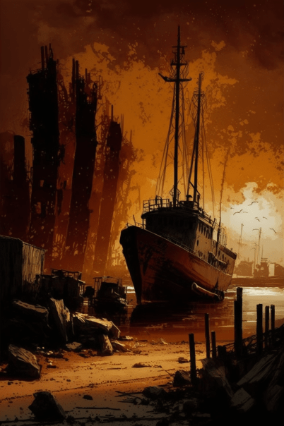
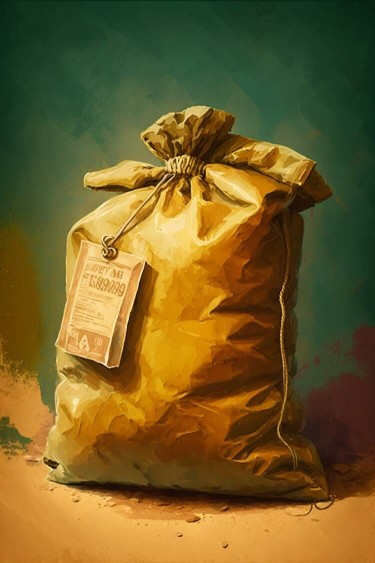

# 维生(COD-废城)  
> 门口有着被人为破坏的痕迹，也许仍有零星的物资。  
  

<a href="cod_Exp_Pharmacy.md" style="color:black">维生</a>

<a href="cod_Exp_破败港口.md" style="color:black">破败轮船</a>

<a href="cod_Path_PharmacyToBrokenPort.md" style="color:black">破败港口</a>

<a href="cod_Nc_OrdinaryZombie.md" style="color:black">僵尸</a>

  
  
<table class="table table-bordered" data-toggle="table"  data-show-header="false"><thead style="display:none"><tr ><th  style="width:50%;text-align:left;vertical-align:top;"  >title</th><th  style="width:50%;text-align:left;vertical-align:top;"  data-sortable="true"  ></th></tr></thead><tr ><td  style="width:50%;text-align:left;vertical-align:top;"  >** 区域唯一 **  **环境：**[饭馆(环境)](cod_Env_Pharmacy.md)  ** 环境效果: ** [

[雨水防护](RainProtection.md)](RainProtection.md)<b>+5</b> [

[绝热](InsulationHeat.md)](InsulationHeat.md)<b>+2</b> [

[阳光防护](SunProtection.md)](SunProtection.md)<b>+20</b> [

[遮蔽](Sheltered.md)](Sheltered.md)<b>+2</b> [

[蚊虫数量](BugPopulation.md)](BugPopulation.md) [Ruins_MapCount](cod_Gs_Ruins_MapCount.md)<b>+1</b>  ** 容量： **30000</td><td  style="width:50%;text-align:left;vertical-align:top;"  ></td></tr></tbody></table>  
  
## 探索  
<table class="table table-bordered" data-toggle="table"  ><thead style=""><tr ><th  style="text-align:left;vertical-align:top;"  >进度</th><th  style="text-align:left;vertical-align:top;"  >目的地</th></tr></thead><tr ><td  style="text-align:left;vertical-align:top;"  >25%</td><td  style="text-align:left;vertical-align:top;"  >[货架(饭馆)](cod_Pharmacy_GoodsShelves_TypeOne.md)</td></tr><tr ><td  style="text-align:left;vertical-align:top;"  >50%</td><td  style="text-align:left;vertical-align:top;"  >[货架(饭馆)](cod_Pharmacy_GoodsShelves_TypeTwo.md)</td></tr><tr ><td  style="text-align:left;vertical-align:top;"  >75%</td><td  style="text-align:left;vertical-align:top;"  >[货架(饭馆)](cod_Pharmacy_GoodsShelves_TypeThree.md)</td></tr><tr ><td  style="text-align:left;vertical-align:top;"  >100%</td><td  style="text-align:left;vertical-align:top;"  >[货架(饭馆)](cod_Pharmacy_GoodsShelves_TypeFour.md)</td></tr></tbody></table>  
  
## 动作  

<table><tr><td rowspan="2" style="width:200px;text-align:center;font-size:1.3em;font-weight:bold">

探索

15分

</td><td>[“手部动作(组)”](HandAction.md), </td></tr><tr><td></td></tr><tr><td colspan="2"><b>需求：</b>[

[光亮](Light.md)](Light.md): <b>10-100</b>, [Gs_Pharmacy_ExplorationCount](cod_Gs_Pharmacy_ExplorationCount.md): <b>0-19</b></td></tr><tr><td colspan="2"><b>状态变化：</b>[

[耐力](Stamina.md)](Stamina.md)<b>-4</b>, [

[压力](Stress.md)](Stress.md)<b>-10</b>, [Gs_Pharmacy_ExplorationCount](cod_Gs_Pharmacy_ExplorationCount.md)<b>+1</b></td></tr><tr><td colspan="2">

<table style="margin-bottom:3px;"><tr><td rowspan=2 style="text-align:center" width="80px">
基础权重

80
</td><td style="font-size:0.6em;line-height:0.6em;font-weight:bold">Nothing</td></tr><tr><td></td></tr></table>

<table style="margin-bottom:3px;"><tr><td rowspan=2 style="text-align:center" width="80px">
基础权重

1
</td><td style="font-size:0.6em;line-height:0.6em;font-weight:bold">YoYo</td></tr><tr><td>[

[铁箱(破败轮船)](cod_Nc_ScavengingSupplies_Location_Box_TypeOne.md)](cod_Nc_ScavengingSupplies_Location_Box_TypeOne.md)(<b>+1</b>)</td></tr></table>

<table style="margin-bottom:3px;"><tr><td rowspan=2 style="text-align:center" width="80px">
基础权重

1
</td><td style="font-size:0.6em;line-height:0.6em;font-weight:bold">YoYo</td></tr><tr><td>[

[铁箱](cod_Nc_ScavengingSupplies_Location_Box_TypeTwo.md)](cod_Nc_ScavengingSupplies_Location_Box_TypeTwo.md)(<b>+1</b>)</td></tr></table>

<table style="margin-bottom:3px;"><tr><td rowspan=2 style="text-align:center" width="80px">
基础权重

1
</td><td style="font-size:0.6em;line-height:0.6em;font-weight:bold">YoYo</td></tr><tr><td>[

[铁箱](cod_Nc_ScavengingSupplies_Location_Box_TypeThree.md)](cod_Nc_ScavengingSupplies_Location_Box_TypeThree.md)(<b>+1</b>)</td></tr></table>

<table style="margin-bottom:3px;"><tr><td rowspan=2 style="text-align:center" width="80px">
基础权重

1
</td><td style="font-size:0.6em;line-height:0.6em;font-weight:bold">YoYo</td></tr><tr><td>[

[支架](cod_Nc_ScavengingSupplies_Location_Brackets_TypeOne.md)](cod_Nc_ScavengingSupplies_Location_Brackets_TypeOne.md)(<b>+1</b>)</td></tr></table>

<table style="margin-bottom:3px;"><tr><td rowspan=2 style="text-align:center" width="80px">
基础权重

1
</td><td style="font-size:0.6em;line-height:0.6em;font-weight:bold">YoYo</td></tr><tr><td>[

[支架](cod_Nc_ScavengingSupplies_Location_Brackets_TypeTwo.md)](cod_Nc_ScavengingSupplies_Location_Brackets_TypeTwo.md)(<b>+1</b>)</td></tr></table>

<table style="margin-bottom:3px;"><tr><td rowspan=2 style="text-align:center" width="80px">
基础权重

1
</td><td style="font-size:0.6em;line-height:0.6em;font-weight:bold">YoYo</td></tr><tr><td>[

[支架](cod_Nc_ScavengingSupplies_Location_Brackets_TypeThree.md)](cod_Nc_ScavengingSupplies_Location_Brackets_TypeThree.md)(<b>+1</b>)</td></tr></table>

<table style="margin-bottom:3px;"><tr><td rowspan=2 style="text-align:center" width="80px">
基础权重

1
</td><td style="font-size:0.6em;line-height:0.6em;font-weight:bold">YoYo</td></tr><tr><td>[

[支架](cod_Nc_ScavengingSupplies_Location_Brackets_TypeFour.md)](cod_Nc_ScavengingSupplies_Location_Brackets_TypeFour.md)(<b>+1</b>)</td></tr></table>

<table style="margin-bottom:3px;"><tr><td rowspan=2 style="text-align:center" width="80px">
基础权重

1
</td><td style="font-size:0.6em;line-height:0.6em;font-weight:bold">YoYo</td></tr><tr><td>[

[支架](cod_Nc_ScavengingSupplies_Location_Brackets_TypeFive.md)](cod_Nc_ScavengingSupplies_Location_Brackets_TypeFive.md)(<b>+1</b>)</td></tr></table>

<table style="margin-bottom:3px;"><tr><td rowspan=2 style="text-align:center" width="80px">
基础权重

1
</td><td style="font-size:0.6em;line-height:0.6em;font-weight:bold">YoYo</td></tr><tr><td>[

[铁柜](cod_Nc_ScavengingSupplies_Location_Cabinet_TypeOne.md)](cod_Nc_ScavengingSupplies_Location_Cabinet_TypeOne.md)(<b>+1</b>)</td></tr></table>

<table style="margin-bottom:3px;"><tr><td rowspan=2 style="text-align:center" width="80px">
基础权重

1
</td><td style="font-size:0.6em;line-height:0.6em;font-weight:bold">YoYo</td></tr><tr><td>[

[铁柜](cod_Nc_ScavengingSupplies_Location_Cabinet_TypeTwo.md)](cod_Nc_ScavengingSupplies_Location_Cabinet_TypeTwo.md)(<b>+1</b>)</td></tr></table>

<table style="margin-bottom:3px;"><tr><td rowspan=2 style="text-align:center" width="80px">
基础权重

1
</td><td style="font-size:0.6em;line-height:0.6em;font-weight:bold">YoYo</td></tr><tr><td>[

[铁柜](cod_Nc_ScavengingSupplies_Location_Cabinet_TypeThree.md)](cod_Nc_ScavengingSupplies_Location_Cabinet_TypeThree.md)(<b>+1</b>)</td></tr></table>

<table style="margin-bottom:3px;"><tr><td rowspan=2 style="text-align:center" width="80px">
基础权重

1
</td><td style="font-size:0.6em;line-height:0.6em;font-weight:bold">YoYo</td></tr><tr><td>[

[包囊](cod_Nc_ScavengingSupplies_AmmunitionWrapping.md)](cod_Nc_ScavengingSupplies_AmmunitionWrapping.md)(<b>+1</b>)</td></tr></table>

<table style="margin-bottom:3px;"><tr><td rowspan=2 style="text-align:center" width="80px">
基础权重

1
</td><td style="font-size:0.6em;line-height:0.6em;font-weight:bold">YoYo</td></tr><tr><td>[

[包囊](cod_Nc_ScavengingSupplies_BuildingMaterialWrapping.md)](cod_Nc_ScavengingSupplies_BuildingMaterialWrapping.md)(<b>+1</b>)</td></tr></table>

<table style="margin-bottom:3px;"><tr><td rowspan=2 style="text-align:center" width="80px">
基础权重

1
</td><td style="font-size:0.6em;line-height:0.6em;font-weight:bold">YoYo</td></tr><tr><td>[

[包囊](cod_Nc_ScavengingSupplies_FoodWrapping.md)](cod_Nc_ScavengingSupplies_FoodWrapping.md)(<b>+1</b>)</td></tr></table>

<table style="margin-bottom:3px;"><tr><td rowspan=2 style="text-align:center" width="80px">
基础权重

1
</td><td style="font-size:0.6em;line-height:0.6em;font-weight:bold">YoYo</td></tr><tr><td>[

[包囊](cod_Nc_ScavengingSupplies_MaterialWrapping.md)](cod_Nc_ScavengingSupplies_MaterialWrapping.md)(<b>+1</b>)</td></tr></table>

<table style="margin-bottom:3px;"><tr><td rowspan=2 style="text-align:center" width="80px">
基础权重

5
</td><td style="font-size:0.6em;line-height:0.6em;font-weight:bold">YoYo</td></tr><tr><td>[

[包囊](cod_Nc_ScavengingSupplies_MedicineWrapping.md)](cod_Nc_ScavengingSupplies_MedicineWrapping.md)(<b>+1</b>)</td></tr></table>

</td></tr></table>
  
  
  

