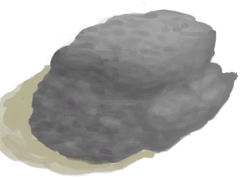

# 破败轮船(COD-废城)  
> 一个破败的轮船  
  

<a href="cod_Exp_废弃农场.md" style="color:black">破败轮船</a>

<a href="cod_Exp_腐败之城.md" style="color:black">破败轮船</a>

<a href="cod_Exp_神秘小镇.md" style="color:black">破败轮船</a>

<a href="cod_eve_farmAlert.md" style="color:black">港口危险</a>

  
  
<table class="table table-bordered" data-toggle="table"  data-show-header="false"><thead style="display:none"><tr ><th  style="width:50%;text-align:left;vertical-align:top;"  >title</th><th  style="width:50%;text-align:left;vertical-align:top;"  data-sortable="true"  ></th></tr></thead><tr ><td  style="width:50%;text-align:left;vertical-align:top;"  >** 区域唯一 **  **环境：**[腐败之城(环境)](cod_Env_废弃农场.md)  **标签：**	[“可布置陷阱的地点”](tag_SnareCompatible.md)  ** 环境效果: ** [

[光亮](Light.md)](Light.md)<b>+10</b> [Ruins_MapCount](cod_Gs_Ruins_MapCount.md)<b>+1</b>  ** 可改造项目: ** [小径](Imp_Path.md) , [灌溉系统](Imp_Irrigation.md)</td><td  style="width:50%;text-align:left;vertical-align:top;"  ></td></tr></tbody></table>  
  
## 探索  
<table class="table table-bordered" data-toggle="table"  ><thead style=""><tr ><th  style="text-align:left;vertical-align:top;"  >进度</th><th  style="text-align:left;vertical-align:top;"  >目的地</th></tr></thead><tr ><td  style="text-align:left;vertical-align:top;"  >65%</td><td  style="text-align:left;vertical-align:top;"  >[前往船舱(腐败之城)](cod_Path_进入谷仓.md)</td></tr><tr ><td  style="text-align:left;vertical-align:top;"  >50%</td><td  style="text-align:left;vertical-align:top;"  >[尸群(事件)(腐败之城)](cod_eve_尸群来了.md)</td></tr><tr ><td  style="text-align:left;vertical-align:top;"  >95%</td><td  style="text-align:left;vertical-align:top;"  >[腐败城市(腐败之城)](cod_Path_农场到腐败之城.md)</td></tr><tr ><td  style="text-align:left;vertical-align:top;"  >75%</td><td  style="text-align:left;vertical-align:top;"  >[腐败城市(腐败之城)](cod_Path_废弃农场到神秘小镇.md)</td></tr><tr ><td  style="text-align:left;vertical-align:top;"  >10%</td><td  style="text-align:left;vertical-align:top;"  >[干涸的小水塘(湿地)](Puddle.md)</td></tr><tr ><td  style="text-align:left;vertical-align:top;"  >100%</td><td  style="text-align:left;vertical-align:top;"  >[地区探索完毕(事件)(基地)](cod_探索地区完毕.md)</td></tr></tbody></table>  
  
## 动作  

<table><tr><td rowspan="2" style="width:200px;text-align:center;font-size:1.3em;font-weight:bold">

探索

15分

</td><td>[“腿部动作(组)”](LegAction.md)</td></tr><tr><td></td></tr><tr><td colspan="2"><b>需求：</b>[

[光亮](Light.md)](Light.md): <b>10-100</b></td></tr><tr><td colspan="2"><b>状态变化：</b>[

[足部损伤](FootDamage.md)](FootDamage.md)<b>+20</b>, [

[耐力](Stamina.md)](Stamina.md)<b>-4</b>, [

[压力](Stress.md)](Stress.md)<b>-10</b>, [

[污垢](Filth.md)](Filth.md)<b>+1</b></td></tr><tr><td colspan="2">

<table style="margin-bottom:3px;"><tr><td rowspan=2 style="text-align:center" width="80px">
基础权重

200
</td><td style="font-size:0.6em;line-height:0.6em;font-weight:bold">Dry Leaves</td></tr><tr><td>[

[枯叶](LeavesDry.md)](LeavesDry.md)(<b>+1～+2</b>)</td></tr></table>

<table style="margin-bottom:3px;"><tr><td rowspan=2 style="text-align:center" width="80px">
基础权重

100
</td><td style="font-size:0.6em;line-height:0.6em;font-weight:bold">Stone First</td></tr><tr><td>[

[石头](Stone.md)](Stone.md)(<b>+1</b>)</td></tr></table>

<table style="margin-bottom:3px;"><tr><td rowspan=2 style="text-align:center" width="80px">
基础权重

50
</td><td style="font-size:0.6em;line-height:0.6em;font-weight:bold">Heavy Stone</td></tr><tr><td>[

[大石块](StoneHeavy.md)](StoneHeavy.md)(<b>+1</b>)</td></tr></table>

<table style="margin-bottom:3px;"><tr><td rowspan=2 style="text-align:center" width="80px">
基础权重

20
</td><td style="font-size:0.6em;line-height:0.6em;font-weight:bold">Dry Leaves</td></tr><tr><td>[

[一只灰山鹑！(事件)](Event_PartridgeFight.md)](Event_PartridgeFight.md)(<b>+1</b>)</td></tr></table>

<table style="margin-bottom:3px;"><tr><td rowspan=2 style="text-align:center" width="80px">
基础权重

400
</td><td style="font-size:0.6em;line-height:0.6em;font-weight:bold">Dry Leaves</td></tr><tr><td>[

[小树](SmallTree.md)](SmallTree.md)(<b>+1</b>)</td></tr></table>

<table style="margin-bottom:3px;"><tr><td rowspan=2 style="text-align:center" width="80px">
基础权重

50
</td><td style="font-size:0.6em;line-height:0.6em;font-weight:bold">Dry Leaves</td></tr><tr><td>[

[柠檬草](Lemongrass.md)](Lemongrass.md)(<b>+1～+2</b>)</td></tr></table>

<table style="margin-bottom:3px;"><tr><td rowspan=2 style="text-align:center" width="80px">
基础权重

10
</td><td style="font-size:0.6em;line-height:0.6em;font-weight:bold">Dry Leaves</td></tr><tr><td>[

[芦荟](AloeVera.md)](AloeVera.md)(<b>+1～+2</b>)</td></tr></table>

<table style="margin-bottom:3px;"><tr><td rowspan=2 style="text-align:center" width="80px">
基础权重

100
</td><td style="font-size:0.6em;line-height:0.6em;font-weight:bold">Dry Leaves</td></tr><tr><td>[

[小树枝](Sticks.md)](Sticks.md)(<b>+1～+2</b>)</td></tr></table>

<table style="margin-bottom:3px;"><tr><td rowspan=2 style="text-align:center" width="80px">
基础权重

10000
</td><td style="font-size:0.6em;line-height:0.6em;font-weight:bold"> Rope</td></tr><tr><td>[

[尸群(事件)](cod_eve_一些普通僵尸来了.md)](cod_eve_一些普通僵尸来了.md)(<b>+1</b>)</td></tr></table>

<table style="margin-bottom:3px;"><tr><td rowspan=2 style="text-align:center" width="80px">
基础权重

1000
</td><td style="font-size:0.6em;line-height:0.6em;font-weight:bold"> Rope</td></tr><tr><td>[

[巨霸(摩登街道)](cod_Nc_GiantBusterZombie.md)](cod_Nc_GiantBusterZombie.md)(<b>+1</b>)</td></tr></table>

<table style="margin-bottom:3px;"><tr><td rowspan=2 style="text-align:center" width="80px">
基础权重

5000
</td><td style="font-size:0.6em;line-height:0.6em;font-weight:bold"> Rope</td></tr><tr><td>[

[污秽(破败轮船)](cod_Nc_FilthyZombie.md)](cod_Nc_FilthyZombie.md)(<b>+1</b>)</td></tr></table>

</td></tr></table>
  
  
  
## 可拖入  

<table style="margin-bottom:0px;"><tr><td style="width:40%;text-align:left; background-color:#FEFEFE"><b>拖入：</b>[“铲子”](tag_Shovel.md)</td><td style="width:40%;font-size:1em;font-weight:bold;background-color:#FEFEFE">挖土 (30分) [“手部动作(组)”](HandAction.md)</td></tr><tr><td colspan="2"><b>需求：</b>[

[光亮](Light.md)](Light.md): <b>10-100</b>, [

[耐力](Stamina.md)](Stamina.md): <b>11-32</b></td></tr><tr style="background-color:#FFFFFF"><td style=""><b>使用物：</b>使用次数  <b>-1(-2%)</b></td><td style=""><b>自身：</b></td></tr><tr><td colspan="2"><b>状态变化：</b>[

[耐力](Stamina.md)](Stamina.md)<b>-4</b>, [

[手掌损伤](HandDamage.md)](HandDamage.md)<b>+20</b></td></tr><tr><td colspan="2">[

[干土堆](DirtPile.md)](DirtPile.md)(<b>+3</b>), [

[虫子](Bugs.md)](Bugs.md)(<b>+0～+1</b>)</td></tr></table>
  
  

