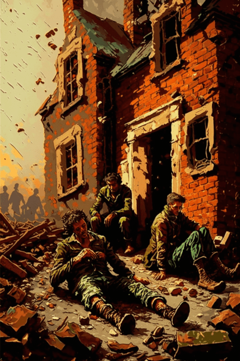
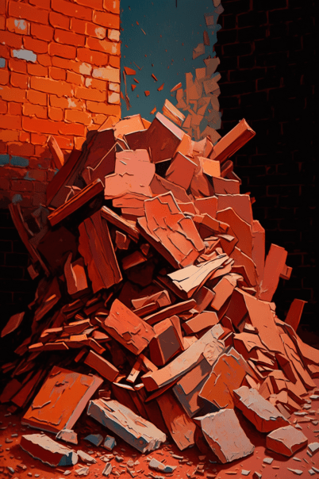
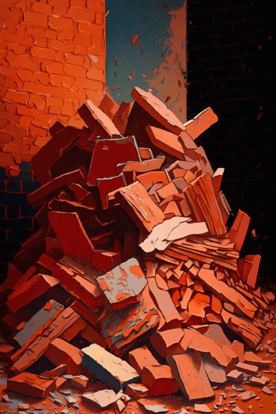

# 破败轮船(COD-废城)  
> 一个破败的轮船  
  

<a href="cod_Exp_深入小镇.md" style="color:black">破败轮船</a>

<a href="cod_Exp_神秘小镇.md" style="color:black">破败轮船</a>

<a href="cod_Exp_红色砖房.md" style="color:black">破败轮船</a>

  
  
<table class="table table-bordered" data-toggle="table"  data-show-header="false"><thead style="display:none"><tr ><th  style="width:50%;text-align:left;vertical-align:top;"  >title</th><th  style="width:50%;text-align:left;vertical-align:top;"  data-sortable="true"  ></th></tr></thead><tr ><td  style="width:50%;text-align:left;vertical-align:top;"  >** 区域唯一 **  **环境：**[腐败之城(环境)](cod_Env_深入小镇.md)  **标签：**	[“可布置陷阱的地点”](tag_SnareCompatible.md)  ** 环境效果: ** [

[光亮](Light.md)](Light.md) [Ruins_MapCount](cod_Gs_Ruins_MapCount.md)<b>+1</b>  ** 可改造项目: ** [小径](Imp_Path.md)</td><td  style="width:50%;text-align:left;vertical-align:top;"  ></td></tr></tbody></table>  
  
## 探索  
<table class="table table-bordered" data-toggle="table"  ><thead style=""><tr ><th  style="text-align:left;vertical-align:top;"  >进度</th><th  style="text-align:left;vertical-align:top;"  >目的地</th></tr></thead><tr ><td  style="text-align:left;vertical-align:top;"  >50%</td><td  style="text-align:left;vertical-align:top;"  >[前往船舱(腐败之城)](cod_Path_红色砖房入口.md)</td></tr><tr ><td  style="text-align:left;vertical-align:top;"  >75%</td><td  style="text-align:left;vertical-align:top;"  >[破败轮船(腐败之城)](cod_小镇垃圾箱2.md)</td></tr><tr ><td  style="text-align:left;vertical-align:top;"  >100%</td><td  style="text-align:left;vertical-align:top;"  >[地区探索完毕(事件)(基地)](cod_探索地区完毕.md)</td></tr></tbody></table>  
  
## 动作  

<table><tr><td rowspan="2" style="width:200px;text-align:center;font-size:1.3em;font-weight:bold">

探索

15分

</td><td>[“腿部动作(组)”](LegAction.md)</td></tr><tr><td></td></tr><tr><td colspan="2"><b>需求：</b>[

[光亮](Light.md)](Light.md): <b>10-100</b></td></tr><tr><td colspan="2"><b>状态变化：</b>[

[足部损伤](FootDamage.md)](FootDamage.md)<b>+20</b>, [

[耐力](Stamina.md)](Stamina.md)<b>-4</b>, [

[压力](Stress.md)](Stress.md)<b>-10</b>, [

[污垢](Filth.md)](Filth.md)<b>+1</b></td></tr><tr><td colspan="2">

<table style="margin-bottom:3px;"><tr><td rowspan=2 style="text-align:center" width="80px">
基础权重

100
</td><td style="font-size:0.6em;line-height:0.6em;font-weight:bold">Dry Leaves</td></tr><tr><td>[

[枯叶](LeavesDry.md)](LeavesDry.md)(<b>+1～+2</b>)</td></tr></table>

<table style="margin-bottom:3px;"><tr><td rowspan=2 style="text-align:center" width="80px">
基础权重

0
</td><td style="font-size:0.6em;line-height:0.6em;font-weight:bold">Lemon Grass</td></tr><tr><td>[

[柠檬草](Lemongrass.md)](Lemongrass.md)(<b>+1</b>)[高地柠檬草种群数量](LemonGrass_HighlandsPop.md)<b>-1000</b></td></tr><tr><td colspan=2><li>[

[药草学(技能)](Skill_Herbology.md)](Skill_Herbology.md)为<b>0～150(0%～100%)</b>时权重<b>-400～+0</b></li><li>[高地柠檬草种群数量](LemonGrass_HighlandsPop.md)为<b>1000～20000</b>时权重<b>+100～+600</b></li><li>[

[视力](Myopia.md)](Myopia.md)为<b>1～3</b>时权重限定为<b>-100～-200</b></li></td></tr></table>

<table style="margin-bottom:3px;"><tr><td rowspan=2 style="text-align:center" width="80px">
基础权重

5
</td><td style="font-size:0.6em;line-height:0.6em;font-weight:bold">Debris</td></tr><tr><td>[

[大石块](StoneHeavy.md)](StoneHeavy.md)(<b>+0～+1</b>)</td></tr></table>

<table style="margin-bottom:3px;"><tr><td rowspan=2 style="text-align:center" width="80px">
基础权重

35
</td><td style="font-size:0.6em;line-height:0.6em;font-weight:bold">Debris</td></tr><tr><td>[

[破败轮船](cod_石块堆.md)](cod_石块堆.md)(<b>+0～+1</b>)</td></tr></table>

<table style="margin-bottom:3px;"><tr><td rowspan=2 style="text-align:center" width="80px">
基础权重

35
</td><td style="font-size:0.6em;line-height:0.6em;font-weight:bold">Debris</td></tr><tr><td>[

[破败轮船](cod_建筑废墟.md)](cod_建筑废墟.md)(<b>+0～+1</b>)</td></tr></table>

<table style="margin-bottom:3px;"><tr><td rowspan=2 style="text-align:center" width="80px">
基础权重

0
</td><td style="font-size:0.6em;line-height:0.6em;font-weight:bold"></td></tr><tr><td></td></tr></table>

<table style="margin-bottom:3px;"><tr><td rowspan=2 style="text-align:center" width="80px">
基础权重

0
</td><td style="font-size:0.6em;line-height:0.6em;font-weight:bold"></td></tr><tr><td></td></tr></table>

<table style="margin-bottom:3px;"><tr><td rowspan=2 style="text-align:center" width="80px">
基础权重

0
</td><td style="font-size:0.6em;line-height:0.6em;font-weight:bold"></td></tr><tr><td></td></tr></table>

<table style="margin-bottom:3px;"><tr><td rowspan=2 style="text-align:center" width="80px">
基础权重

50
</td><td style="font-size:0.6em;line-height:0.6em;font-weight:bold"> Rope</td></tr><tr><td>[

[破败轮船](cod_大建筑废墟.md)](cod_大建筑废墟.md)(<b>+1</b>)</td></tr></table>

<table style="margin-bottom:3px;"><tr><td rowspan=2 style="text-align:center" width="80px">
基础权重

10
</td><td style="font-size:0.6em;line-height:0.6em;font-weight:bold">Dry Leaves</td></tr><tr><td>[

[尸群(事件)](cod_eve_小镇僵尸袭击事件.md)](cod_eve_小镇僵尸袭击事件.md)(<b>+1</b>)</td></tr></table>

<table style="margin-bottom:3px;"><tr><td rowspan=2 style="text-align:center" width="80px">
基础权重

50
</td><td style="font-size:0.6em;line-height:0.6em;font-weight:bold">zmb</td></tr><tr><td>[

[尸群(事件)](cod_eve_小镇骸骨事件2.md)](cod_eve_小镇骸骨事件2.md)(<b>+1</b>)</td></tr></table>

<table style="margin-bottom:3px;"><tr><td rowspan=2 style="text-align:center" width="80px">
基础权重

10
</td><td style="font-size:0.6em;line-height:0.6em;font-weight:bold">Dry Leaves</td></tr><tr><td>[

[尸群(事件)](cod_eve_小镇僵尸埋伏事件.md)](cod_eve_小镇僵尸埋伏事件.md)(<b>+1</b>)</td></tr></table>

<table style="margin-bottom:3px;"><tr><td rowspan=2 style="text-align:center" width="80px">
基础权重

15
</td><td style="font-size:0.6em;line-height:0.6em;font-weight:bold">Dry Leaves</td></tr><tr><td>[

[尸群(事件)](cod_eve_小镇骸骨事件.md)](cod_eve_小镇骸骨事件.md)(<b>+1</b>)</td></tr></table>

<table style="margin-bottom:3px;"><tr><td rowspan=2 style="text-align:center" width="80px">
基础权重

3
</td><td style="font-size:0.6em;line-height:0.6em;font-weight:bold">Dry Leaves</td></tr><tr><td>[

[迅猛(腐败之城)](cod_Nc_SwiftZombie.md)](cod_Nc_SwiftZombie.md)(<b>+1～+2</b>)</td></tr></table>

<table style="margin-bottom:3px;"><tr><td rowspan=2 style="text-align:center" width="80px">
基础权重

50
</td><td style="font-size:0.6em;line-height:0.6em;font-weight:bold">Stone</td></tr><tr><td>[

[破败轮船](cod_废墟1.md)](cod_废墟1.md)(<b>+1</b>), [

[破败轮船](cod_废墟2.md)](cod_废墟2.md)(<b>+1</b>), [

[破败轮船](cod_废墟3.md)](cod_废墟3.md)(<b>+1</b>), [

[破败轮船](cod_废墟4.md)](cod_废墟4.md)(<b>+1</b>)</td></tr></table>
<button class="btn btn-secondary btn-sm" style="" data-toggle="modal" onclick="setCollectionDataBase64('eyJ0aXRsZSI6IuamgueOh+aooeaLnzog5o6i57SiICjnoLTotKXova7oiLkpIiwiY29sbGVjdGlvbnMiOlt7ImRyb3AiOiI8ZGl2IHN0eWxlPVwid2lkdGg6MjVweDtkaXNwbGF5OmlubGluZS1ibG9jazt0ZXh0LWFsaWduOmNlbnRlclwiPjxpbWcgZGVjb2Rpbmc9XCJhc3luY1wiIHNyYz1cIlNwcml0ZS9UaW5kZXIucG5nXCIgaHJlZj1cImEubWRcIiBzdHlsZT1cIm1heC13aWR0aDoyNXB4O21heC1oZWlnaHQ6MjVweDtcIj48L2Rpdj7mnq/lj7YiLCJiYXNlIjoxMDAsImNvbmRpdGlvbiI6W119LHsiZHJvcCI6IjxkaXYgc3R5bGU9XCJ3aWR0aDoyNXB4O2Rpc3BsYXk6aW5saW5lLWJsb2NrO3RleHQtYWxpZ246Y2VudGVyXCI+PGltZyBkZWNvZGluZz1cImFzeW5jXCIgc3JjPVwiU3ByaXRlL0xlbW9uR3Jhc3MucG5nXCIgaHJlZj1cImEubWRcIiBzdHlsZT1cIm1heC13aWR0aDoyNXB4O21heC1oZWlnaHQ6MjVweDtcIj48L2Rpdj7mn6DmqqzojYkiLCJiYXNlIjowLCJjb25kaXRpb24iOlt7ImtleSI6IlNraWxsX0hlcmJvbG9neSIsInRpdGxlIjoi6I2v6I2J5a2mKOaKgOiDvSkiLCJ0eXBlIjoicmFuZ2UiLCJtYXgiOlswLDE1MF0sInJhbmdlIjpbMCwxNTBdLCJ3ZWlnaHQiOlstNDAwLDBdLCJkZWZhdWx0VmFsdWUiOjAsIndoZW5PdXRPZlJhbmdlIjowfSx7ImtleSI6IkxlbW9uR3Jhc3NfSGlnaGxhbmRzUG9wIiwidGl0bGUiOiLpq5jlnLDmn6DmqqzojYnnp43nvqTmlbDph48iLCJ0eXBlIjoicmFuZ2UiLCJtYXgiOlswLDIwMDAwXSwicmFuZ2UiOlsxMDAwLDIwMDAwXSwid2VpZ2h0IjpbMTAwLDYwMF0sImRlZmF1bHRWYWx1ZSI6MjAwMDAsIndoZW5PdXRPZlJhbmdlIjowfSx7ImtleSI6Ik15b3BpYSIsInRpdGxlIjoi6KeG5YqbIiwidHlwZSI6InJhbmdlIiwibWF4IjpbMCwzXSwicmFuZ2UiOlsxLDNdLCJ3ZWlnaHQiOlstMTAwLC0yMDBdLCJkZWZhdWx0VmFsdWUiOjAsIndoZW5PdXRPZlJhbmdlIjoxfV19LHsiZHJvcCI6IjxkaXYgc3R5bGU9XCJ3aWR0aDoyNXB4O2Rpc3BsYXk6aW5saW5lLWJsb2NrO3RleHQtYWxpZ246Y2VudGVyXCI+PGltZyBkZWNvZGluZz1cImFzeW5jXCIgc3JjPVwiU3ByaXRlL1NhbmRzdG9uZS5wbmdcIiBocmVmPVwiYS5tZFwiIHN0eWxlPVwibWF4LXdpZHRoOjI1cHg7bWF4LWhlaWdodDoyNXB4O1wiPjwvZGl2PuWkp+efs+WdlyIsImJhc2UiOjUsImNvbmRpdGlvbiI6W119LHsiZHJvcCI6IjxkaXYgc3R5bGU9XCJ3aWR0aDoyNXB4O2Rpc3BsYXk6aW5saW5lLWJsb2NrO3RleHQtYWxpZ246Y2VudGVyXCI+PGltZyBkZWNvZGluZz1cImFzeW5jXCIgc3JjPVwiU3ByaXRlL2NvZC9hbF/nn7PlnZfloIYucG5nXCIgaHJlZj1cImEubWRcIiBzdHlsZT1cIm1heC13aWR0aDoyNXB4O21heC1oZWlnaHQ6MjVweDtcIj48L2Rpdj7noLTotKXova7oiLkoY29kX+efs+Wdl+Wghi5tZCkoY29kX+efs+Wdl+Wghi5tZCkiLCJiYXNlIjozNSwiY29uZGl0aW9uIjpbXX0seyJkcm9wIjoiPGRpdiBzdHlsZT1cIndpZHRoOjI1cHg7ZGlzcGxheTppbmxpbmUtYmxvY2s7dGV4dC1hbGlnbjpjZW50ZXJcIj48aW1nIGRlY29kaW5nPVwiYXN5bmNcIiBzcmM9XCJTcHJpdGUvY29kL2FsX+e6ouW7uuetkeW6n+Winy5wbmdcIiBocmVmPVwiYS5tZFwiIHN0eWxlPVwibWF4LXdpZHRoOjI1cHg7bWF4LWhlaWdodDoyNXB4O1wiPjwvZGl2PuegtOi0pei9ruiIuShjb2Rf5bu6562R5bqf5aKfLm1kKShjb2Rf5bu6562R5bqf5aKfLm1kKSIsImJhc2UiOjM1LCJjb25kaXRpb24iOltdfSx7ImRyb3AiOiLml6AiLCJiYXNlIjowLCJjb25kaXRpb24iOltdfSx7ImRyb3AiOiLml6AiLCJiYXNlIjowLCJjb25kaXRpb24iOltdfSx7ImRyb3AiOiLml6AiLCJiYXNlIjowLCJjb25kaXRpb24iOltdfSx7ImRyb3AiOiI8ZGl2IHN0eWxlPVwid2lkdGg6MjVweDtkaXNwbGF5OmlubGluZS1ibG9jazt0ZXh0LWFsaWduOmNlbnRlclwiPjxpbWcgZGVjb2Rpbmc9XCJhc3luY1wiIHNyYz1cIlNwcml0ZS9jb2QvYWxf5aSn5bu6562R5bqf5aKfLnBuZ1wiIGhyZWY9XCJhLm1kXCIgc3R5bGU9XCJtYXgtd2lkdGg6MjVweDttYXgtaGVpZ2h0OjI1cHg7XCI+PC9kaXY+56C06LSl6L2u6Ii5KGNvZF/lpKflu7rnrZHlup/lop8ubWQpKGNvZF/lpKflu7rnrZHlup/lop8ubWQpIiwiYmFzZSI6NTAsImNvbmRpdGlvbiI6W119LHsiZHJvcCI6IjxkaXYgc3R5bGU9XCJ3aWR0aDoyNXB4O2Rpc3BsYXk6aW5saW5lLWJsb2NrO3RleHQtYWxpZ246Y2VudGVyXCI+PGltZyBkZWNvZGluZz1cImFzeW5jXCIgc3JjPVwiU3ByaXRlL2NvZC9hbF/lsI/plYflg7XlsLjooq3lh7vkuovku7YucG5nXCIgaHJlZj1cImEubWRcIiBzdHlsZT1cIm1heC13aWR0aDoyNXB4O21heC1oZWlnaHQ6MjVweDtcIj48L2Rpdj7lsLjnvqQo5LqL5Lu2KShjb2RfZXZlX+Wwj+mVh+WDteWwuOiireWHu+S6i+S7ti5tZCkoY29kX2V2ZV/lsI/plYflg7XlsLjooq3lh7vkuovku7YubWQpIiwiYmFzZSI6MTAsImNvbmRpdGlvbiI6W119LHsiZHJvcCI6IjxkaXYgc3R5bGU9XCJ3aWR0aDoyNXB4O2Rpc3BsYXk6aW5saW5lLWJsb2NrO3RleHQtYWxpZ246Y2VudGVyXCI+PGltZyBkZWNvZGluZz1cImFzeW5jXCIgc3JjPVwiU3ByaXRlL2NvZC9hbF/lsI/plYfpqrjpqqjkuovku7YyLnBuZ1wiIGhyZWY9XCJhLm1kXCIgc3R5bGU9XCJtYXgtd2lkdGg6MjVweDttYXgtaGVpZ2h0OjI1cHg7XCI+PC9kaXY+5bC4576kKOS6i+S7tikoY29kX2V2ZV/lsI/plYfpqrjpqqjkuovku7YyLm1kKShjb2RfZXZlX+Wwj+mVh+mquOmqqOS6i+S7tjIubWQpIiwiYmFzZSI6NTAsImNvbmRpdGlvbiI6W119LHsiZHJvcCI6IjxkaXYgc3R5bGU9XCJ3aWR0aDoyNXB4O2Rpc3BsYXk6aW5saW5lLWJsb2NrO3RleHQtYWxpZ246Y2VudGVyXCI+PGltZyBkZWNvZGluZz1cImFzeW5jXCIgc3JjPVwiU3ByaXRlL2NvZC9hbF/lsI/plYflg7XlsLjln4vkvI/kuovku7YucG5nXCIgaHJlZj1cImEubWRcIiBzdHlsZT1cIm1heC13aWR0aDoyNXB4O21heC1oZWlnaHQ6MjVweDtcIj48L2Rpdj7lsLjnvqQo5LqL5Lu2KShjb2RfZXZlX+Wwj+mVh+WDteWwuOWfi+S8j+S6i+S7ti5tZCkoY29kX2V2ZV/lsI/plYflg7XlsLjln4vkvI/kuovku7YubWQpIiwiYmFzZSI6MTAsImNvbmRpdGlvbiI6W119LHsiZHJvcCI6IjxkaXYgc3R5bGU9XCJ3aWR0aDoyNXB4O2Rpc3BsYXk6aW5saW5lLWJsb2NrO3RleHQtYWxpZ246Y2VudGVyXCI+PGltZyBkZWNvZGluZz1cImFzeW5jXCIgc3JjPVwiU3ByaXRlL2NvZC9hbF/lsI/plYfpqrjpqqjkuovku7YucG5nXCIgaHJlZj1cImEubWRcIiBzdHlsZT1cIm1heC13aWR0aDoyNXB4O21heC1oZWlnaHQ6MjVweDtcIj48L2Rpdj7lsLjnvqQo5LqL5Lu2KShjb2RfZXZlX+Wwj+mVh+mquOmqqOS6i+S7ti5tZCkoY29kX2V2ZV/lsI/plYfpqrjpqqjkuovku7YubWQpIiwiYmFzZSI6MTUsImNvbmRpdGlvbiI6W119LHsiZHJvcCI6IjxkaXYgc3R5bGU9XCJ3aWR0aDoyNXB4O2Rpc3BsYXk6aW5saW5lLWJsb2NrO3RleHQtYWxpZ246Y2VudGVyXCI+PGltZyBkZWNvZGluZz1cImFzeW5jXCIgc3JjPVwiU3ByaXRlL2NvZC9hbF/ov4XnjJvlg7XlsLgucG5nXCIgaHJlZj1cImEubWRcIiBzdHlsZT1cIm1heC13aWR0aDoyNXB4O21heC1oZWlnaHQ6MjVweDtcIj48L2Rpdj7ov4XnjJso6IWQ6LSl5LmL5Z+OKSIsImJhc2UiOjMsImNvbmRpdGlvbiI6W119LHsiZHJvcCI6IjxkaXYgc3R5bGU9XCJ3aWR0aDoyNXB4O2Rpc3BsYXk6aW5saW5lLWJsb2NrO3RleHQtYWxpZ246Y2VudGVyXCI+PGltZyBkZWNvZGluZz1cImFzeW5jXCIgc3JjPVwiU3ByaXRlL2NvZC9hbF/kuIDlj7flu7rnu4Tlup/lop8ucG5nXCIgaHJlZj1cImEubWRcIiBzdHlsZT1cIm1heC13aWR0aDoyNXB4O21heC1oZWlnaHQ6MjVweDtcIj48L2Rpdj7noLTotKXova7oiLkoY29kX+W6n+WinzEubWQpKGNvZF/lup/lop8xLm1kKTxkaXYgc3R5bGU9XCJ3aWR0aDoyNXB4O2Rpc3BsYXk6aW5saW5lLWJsb2NrO3RleHQtYWxpZ246Y2VudGVyXCI+PGltZyBkZWNvZGluZz1cImFzeW5jXCIgc3JjPVwiU3ByaXRlL2NvZC9hbF/kuozlj7flu7rnu4Tlup/lop8ucG5nXCIgaHJlZj1cImEubWRcIiBzdHlsZT1cIm1heC13aWR0aDoyNXB4O21heC1oZWlnaHQ6MjVweDtcIj48L2Rpdj7noLTotKXova7oiLkoY29kX+W6n+WinzIubWQpKGNvZF/lup/lop8yLm1kKTxkaXYgc3R5bGU9XCJ3aWR0aDoyNXB4O2Rpc3BsYXk6aW5saW5lLWJsb2NrO3RleHQtYWxpZ246Y2VudGVyXCI+PGltZyBkZWNvZGluZz1cImFzeW5jXCIgc3JjPVwiU3ByaXRlL2NvZC9hbF/kuInlj7flu7rnu4Tlup/lop8ucG5nXCIgaHJlZj1cImEubWRcIiBzdHlsZT1cIm1heC13aWR0aDoyNXB4O21heC1oZWlnaHQ6MjVweDtcIj48L2Rpdj7noLTotKXova7oiLkoY29kX+W6n+WinzMubWQpKGNvZF/lup/lop8zLm1kKTxkaXYgc3R5bGU9XCJ3aWR0aDoyNXB4O2Rpc3BsYXk6aW5saW5lLWJsb2NrO3RleHQtYWxpZ246Y2VudGVyXCI+PGltZyBkZWNvZGluZz1cImFzeW5jXCIgc3JjPVwiU3ByaXRlL2NvZC9hbF/lm5vlj7flu7rnu4Tlup/lop8ucG5nXCIgaHJlZj1cImEubWRcIiBzdHlsZT1cIm1heC13aWR0aDoyNXB4O21heC1oZWlnaHQ6MjVweDtcIj48L2Rpdj7noLTotKXova7oiLkoY29kX+W6n+WinzQubWQpKGNvZF/lup/lop80Lm1kKSIsImJhc2UiOjUwLCJjb25kaXRpb24iOltdfV19')" data-target="#modelCollectionSimulator">概率模拟</button>
</td></tr></table>
  
  
  

