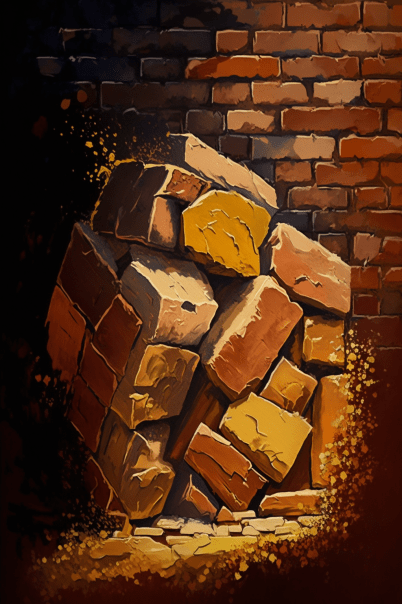
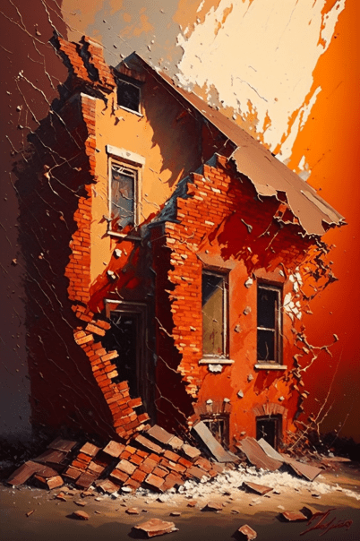
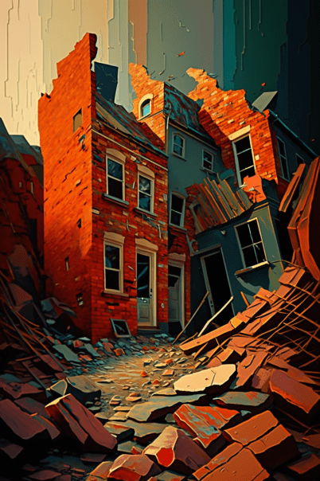
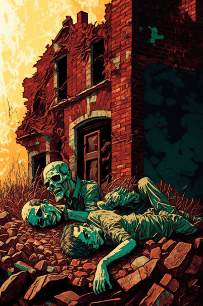
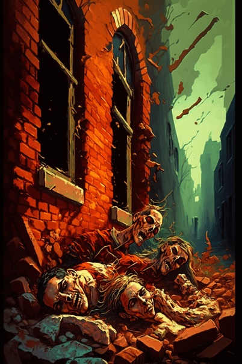
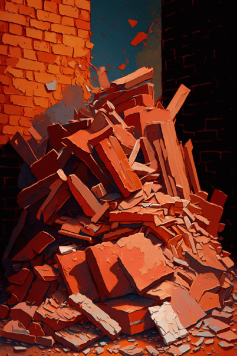

# 深入小镇(COD-废城)  
> 深入小镇  
  

<a href="cod_Exp_深入小镇.md" style="color:black">深入小镇</a>

<a href="cod_Exp_神秘小镇.md" style="color:black">神秘小镇</a>

<a href="cod_Exp_红色砖房.md" style="color:black">红色砖房</a>

  
  
<table class="table table-bordered" data-toggle="table"  data-show-header="false"><thead style="display:none"><tr ><th  style="width:50%;text-align:left;vertical-align:top;"  >title</th><th  style="width:50%;text-align:left;vertical-align:top;"  data-sortable="true"  ></th></tr></thead><tr ><td  style="width:50%;text-align:left;vertical-align:top;"  >** 区域唯一 **  **环境：**[深入小镇(环境)](cod_Env_深入小镇.md)  **标签：**	[“可布置陷阱的地点”](tag_SnareCompatible.md)  ** 环境效果: ** [

[光亮](Light.md)](Light.md) [Ruins_MapCount](cod_Gs_Ruins_MapCount.md)<b>+1</b>  ** 可改造项目: ** [小径](Imp_Path.md)</td><td  style="width:50%;text-align:left;vertical-align:top;"  ></td></tr></tbody></table>  
  
## 探索  
<table class="table table-bordered" data-toggle="table"  ><thead style=""><tr ><th  style="text-align:left;vertical-align:top;"  >进度</th><th  style="text-align:left;vertical-align:top;"  >目的地</th></tr></thead><tr ><td  style="text-align:left;vertical-align:top;"  >50%</td><td  style="text-align:left;vertical-align:top;"  >[前往红色砖房(深入小镇)](cod_Path_红色砖房入口.md)</td></tr><tr ><td  style="text-align:left;vertical-align:top;"  >75%</td><td  style="text-align:left;vertical-align:top;"  >[垃圾箱(深入小镇)](cod_小镇垃圾箱2.md)</td></tr><tr ><td  style="text-align:left;vertical-align:top;"  >100%</td><td  style="text-align:left;vertical-align:top;"  >[Area Explored(事件)(红色砖房)](cod_探索地区完毕.md)</td></tr></tbody></table>  
  
## 动作  

<table><tr><td rowspan="2" style="width:200px;text-align:center;font-size:1.3em;font-weight:bold">

Explore

15分

</td><td>[“腿部动作(组)”](LegAction.md)</td></tr><tr><td></td></tr><tr><td colspan="2"><b>需求：</b>[

[光亮](Light.md)](Light.md): <b>10-100</b></td></tr><tr><td colspan="2"><b>状态变化：</b>[

[足部损伤](FootDamage.md)](FootDamage.md)<b>+20</b>, [

[耐力](Stamina.md)](Stamina.md)<b>-4</b>, [

[压力](Stress.md)](Stress.md)<b>-10</b>, [

[污垢](Filth.md)](Filth.md)<b>+1</b></td></tr><tr><td colspan="2">

<table style="margin-bottom:3px;"><tr><td rowspan=2 style="text-align:center" width="80px">
基础权重

100
</td><td style="font-size:0.6em;line-height:0.6em;font-weight:bold">Dry Leaves</td></tr><tr><td>[

[枯叶](LeavesDry.md)](LeavesDry.md)(<b>+1～+2</b>)</td></tr></table>

<table style="margin-bottom:3px;"><tr><td rowspan=2 style="text-align:center" width="80px">
基础权重

0
</td><td style="font-size:0.6em;line-height:0.6em;font-weight:bold">Lemon Grass</td></tr><tr><td>[

[柠檬草](Lemongrass.md)](Lemongrass.md)(<b>+1</b>)[高地柠檬草种群数量](LemonGrass_HighlandsPop.md)<b>-1000</b></td></tr><tr><td colspan=2><li>[

[药草学(技能)](Skill_Herbology.md)](Skill_Herbology.md)为<b>0～150(0%～100%)</b>时权重<b>-400～+0</b></li><li>[高地柠檬草种群数量](LemonGrass_HighlandsPop.md)为<b>1000～20000</b>时权重<b>+100～+600</b></li><li>[

[视力](Myopia.md)](Myopia.md)为<b>1～3</b>时权重限定为<b>-100～-200</b></li></td></tr></table>

<table style="margin-bottom:3px;"><tr><td rowspan=2 style="text-align:center" width="80px">
基础权重

5
</td><td style="font-size:0.6em;line-height:0.6em;font-weight:bold">Debris</td></tr><tr><td>[

[大石块](StoneHeavy.md)](StoneHeavy.md)(<b>+0～+1</b>)</td></tr></table>

<table style="margin-bottom:3px;"><tr><td rowspan=2 style="text-align:center" width="80px">
基础权重

35
</td><td style="font-size:0.6em;line-height:0.6em;font-weight:bold">Debris</td></tr><tr><td>[

[石块堆](cod_石块堆.md)](cod_石块堆.md)(<b>+0～+1</b>)</td></tr></table>

<table style="margin-bottom:3px;"><tr><td rowspan=2 style="text-align:center" width="80px">
基础权重

35
</td><td style="font-size:0.6em;line-height:0.6em;font-weight:bold">Debris</td></tr><tr><td>[

[建筑废墟](cod_建筑废墟.md)](cod_建筑废墟.md)(<b>+0～+1</b>)</td></tr></table>

<table style="margin-bottom:3px;"><tr><td rowspan=2 style="text-align:center" width="80px">
基础权重

0
</td><td style="font-size:0.6em;line-height:0.6em;font-weight:bold"></td></tr><tr><td></td></tr></table>

<table style="margin-bottom:3px;"><tr><td rowspan=2 style="text-align:center" width="80px">
基础权重

0
</td><td style="font-size:0.6em;line-height:0.6em;font-weight:bold"></td></tr><tr><td></td></tr></table>

<table style="margin-bottom:3px;"><tr><td rowspan=2 style="text-align:center" width="80px">
基础权重

0
</td><td style="font-size:0.6em;line-height:0.6em;font-weight:bold"></td></tr><tr><td></td></tr></table>

<table style="margin-bottom:3px;"><tr><td rowspan=2 style="text-align:center" width="80px">
基础权重

50
</td><td style="font-size:0.6em;line-height:0.6em;font-weight:bold"> Rope</td></tr><tr><td>[

[大建筑废墟](cod_大建筑废墟.md)](cod_大建筑废墟.md)(<b>+1</b>)</td></tr></table>

<table style="margin-bottom:3px;"><tr><td rowspan=2 style="text-align:center" width="80px">
基础权重

10
</td><td style="font-size:0.6em;line-height:0.6em;font-weight:bold">Dry Leaves</td></tr><tr><td>[

[他们来了(事件)](cod_eve_小镇僵尸袭击事件.md)](cod_eve_小镇僵尸袭击事件.md)(<b>+1</b>)</td></tr></table>

<table style="margin-bottom:3px;"><tr><td rowspan=2 style="text-align:center" width="80px">
基础权重

50
</td><td style="font-size:0.6em;line-height:0.6em;font-weight:bold">zmb</td></tr><tr><td>[

[一些风干的骸骨(事件)](cod_eve_小镇骸骨事件2.md)](cod_eve_小镇骸骨事件2.md)(<b>+1</b>)</td></tr></table>

<table style="margin-bottom:3px;"><tr><td rowspan=2 style="text-align:center" width="80px">
基础权重

10
</td><td style="font-size:0.6em;line-height:0.6em;font-weight:bold">Dry Leaves</td></tr><tr><td>[

[站在墙后的僵尸(事件)](cod_eve_小镇僵尸埋伏事件.md)](cod_eve_小镇僵尸埋伏事件.md)(<b>+1</b>)</td></tr></table>

<table style="margin-bottom:3px;"><tr><td rowspan=2 style="text-align:center" width="80px">
基础权重

15
</td><td style="font-size:0.6em;line-height:0.6em;font-weight:bold">Dry Leaves</td></tr><tr><td>[

[一些骸骨(事件)](cod_eve_小镇骸骨事件.md)](cod_eve_小镇骸骨事件.md)(<b>+1</b>)</td></tr></table>

<table style="margin-bottom:3px;"><tr><td rowspan=2 style="text-align:center" width="80px">
基础权重

3
</td><td style="font-size:0.6em;line-height:0.6em;font-weight:bold">Dry Leaves</td></tr><tr><td>[

[迅猛(神秘小镇)](cod_Nc_SwiftZombie.md)](cod_Nc_SwiftZombie.md)(<b>+1～+2</b>)</td></tr></table>

<table style="margin-bottom:3px;"><tr><td rowspan=2 style="text-align:center" width="80px">
基础权重

50
</td><td style="font-size:0.6em;line-height:0.6em;font-weight:bold">Stone</td></tr><tr><td>[

[建筑废墟](cod_废墟1.md)](cod_废墟1.md)(<b>+1</b>), [

[建筑废墟](cod_废墟2.md)](cod_废墟2.md)(<b>+1</b>), [

[建筑废墟](cod_废墟3.md)](cod_废墟3.md)(<b>+1</b>), [

[建筑废墟](cod_废墟4.md)](cod_废墟4.md)(<b>+1</b>)</td></tr></table>
<button class="btn btn-secondary btn-sm" style="" data-toggle="modal" onclick="setCollectionDataBase64('eyJ0aXRsZSI6IuamgueOh+aooeaLnzogRXhwbG9yZSAo5rex5YWl5bCP6ZWHKSIsImNvbGxlY3Rpb25zIjpbeyJkcm9wIjoiPGRpdiBzdHlsZT1cIndpZHRoOjI1cHg7ZGlzcGxheTppbmxpbmUtYmxvY2s7dGV4dC1hbGlnbjpjZW50ZXJcIj48aW1nIGRlY29kaW5nPVwiYXN5bmNcIiBzcmM9XCJTcHJpdGUvVGluZGVyLnBuZ1wiIGhyZWY9XCJhLm1kXCIgc3R5bGU9XCJtYXgtd2lkdGg6MjVweDttYXgtaGVpZ2h0OjI1cHg7XCI+PC9kaXY+5p6v5Y+2IiwiYmFzZSI6MTAwLCJjb25kaXRpb24iOltdfSx7ImRyb3AiOiI8ZGl2IHN0eWxlPVwid2lkdGg6MjVweDtkaXNwbGF5OmlubGluZS1ibG9jazt0ZXh0LWFsaWduOmNlbnRlclwiPjxpbWcgZGVjb2Rpbmc9XCJhc3luY1wiIHNyYz1cIlNwcml0ZS9MZW1vbkdyYXNzLnBuZ1wiIGhyZWY9XCJhLm1kXCIgc3R5bGU9XCJtYXgtd2lkdGg6MjVweDttYXgtaGVpZ2h0OjI1cHg7XCI+PC9kaXY+5p+g5qqs6I2JIiwiYmFzZSI6MCwiY29uZGl0aW9uIjpbeyJrZXkiOiJTa2lsbF9IZXJib2xvZ3kiLCJ0aXRsZSI6IuiNr+iNieWtpijmioDog70pIiwidHlwZSI6InJhbmdlIiwibWF4IjpbMCwxNTBdLCJyYW5nZSI6WzAsMTUwXSwid2VpZ2h0IjpbLTQwMCwwXSwiZGVmYXVsdFZhbHVlIjowLCJ3aGVuT3V0T2ZSYW5nZSI6MH0seyJrZXkiOiJMZW1vbkdyYXNzX0hpZ2hsYW5kc1BvcCIsInRpdGxlIjoi6auY5Zyw5p+g5qqs6I2J56eN576k5pWw6YePIiwidHlwZSI6InJhbmdlIiwibWF4IjpbMCwyMDAwMF0sInJhbmdlIjpbMTAwMCwyMDAwMF0sIndlaWdodCI6WzEwMCw2MDBdLCJkZWZhdWx0VmFsdWUiOjIwMDAwLCJ3aGVuT3V0T2ZSYW5nZSI6MH0seyJrZXkiOiJNeW9waWEiLCJ0aXRsZSI6IuinhuWKmyIsInR5cGUiOiJyYW5nZSIsIm1heCI6WzAsM10sInJhbmdlIjpbMSwzXSwid2VpZ2h0IjpbLTEwMCwtMjAwXSwiZGVmYXVsdFZhbHVlIjowLCJ3aGVuT3V0T2ZSYW5nZSI6MX1dfSx7ImRyb3AiOiI8ZGl2IHN0eWxlPVwid2lkdGg6MjVweDtkaXNwbGF5OmlubGluZS1ibG9jazt0ZXh0LWFsaWduOmNlbnRlclwiPjxpbWcgZGVjb2Rpbmc9XCJhc3luY1wiIHNyYz1cIlNwcml0ZS9TYW5kc3RvbmUucG5nXCIgaHJlZj1cImEubWRcIiBzdHlsZT1cIm1heC13aWR0aDoyNXB4O21heC1oZWlnaHQ6MjVweDtcIj48L2Rpdj7lpKfnn7PlnZciLCJiYXNlIjo1LCJjb25kaXRpb24iOltdfSx7ImRyb3AiOiI8ZGl2IHN0eWxlPVwid2lkdGg6MjVweDtkaXNwbGF5OmlubGluZS1ibG9jazt0ZXh0LWFsaWduOmNlbnRlclwiPjxpbWcgZGVjb2Rpbmc9XCJhc3luY1wiIHNyYz1cIlNwcml0ZS9jb2QvYWxf55+z5Z2X5aCGLnBuZ1wiIGhyZWY9XCJhLm1kXCIgc3R5bGU9XCJtYXgtd2lkdGg6MjVweDttYXgtaGVpZ2h0OjI1cHg7XCI+PC9kaXY+55+z5Z2X5aCGKGNvZF/nn7PlnZfloIYubWQpKGNvZF/nn7PlnZfloIYubWQpIiwiYmFzZSI6MzUsImNvbmRpdGlvbiI6W119LHsiZHJvcCI6IjxkaXYgc3R5bGU9XCJ3aWR0aDoyNXB4O2Rpc3BsYXk6aW5saW5lLWJsb2NrO3RleHQtYWxpZ246Y2VudGVyXCI+PGltZyBkZWNvZGluZz1cImFzeW5jXCIgc3JjPVwiU3ByaXRlL2NvZC9hbF/nuqLlu7rnrZHlup/lop8ucG5nXCIgaHJlZj1cImEubWRcIiBzdHlsZT1cIm1heC13aWR0aDoyNXB4O21heC1oZWlnaHQ6MjVweDtcIj48L2Rpdj7lu7rnrZHlup/lop8oY29kX+W7uuetkeW6n+Winy5tZCkoY29kX+W7uuetkeW6n+Winy5tZCkiLCJiYXNlIjozNSwiY29uZGl0aW9uIjpbXX0seyJkcm9wIjoi5pegIiwiYmFzZSI6MCwiY29uZGl0aW9uIjpbXX0seyJkcm9wIjoi5pegIiwiYmFzZSI6MCwiY29uZGl0aW9uIjpbXX0seyJkcm9wIjoi5pegIiwiYmFzZSI6MCwiY29uZGl0aW9uIjpbXX0seyJkcm9wIjoiPGRpdiBzdHlsZT1cIndpZHRoOjI1cHg7ZGlzcGxheTppbmxpbmUtYmxvY2s7dGV4dC1hbGlnbjpjZW50ZXJcIj48aW1nIGRlY29kaW5nPVwiYXN5bmNcIiBzcmM9XCJTcHJpdGUvY29kL2FsX+Wkp+W7uuetkeW6n+Winy5wbmdcIiBocmVmPVwiYS5tZFwiIHN0eWxlPVwibWF4LXdpZHRoOjI1cHg7bWF4LWhlaWdodDoyNXB4O1wiPjwvZGl2PuWkp+W7uuetkeW6n+Winyhjb2Rf5aSn5bu6562R5bqf5aKfLm1kKShjb2Rf5aSn5bu6562R5bqf5aKfLm1kKSIsImJhc2UiOjUwLCJjb25kaXRpb24iOltdfSx7ImRyb3AiOiI8ZGl2IHN0eWxlPVwid2lkdGg6MjVweDtkaXNwbGF5OmlubGluZS1ibG9jazt0ZXh0LWFsaWduOmNlbnRlclwiPjxpbWcgZGVjb2Rpbmc9XCJhc3luY1wiIHNyYz1cIlNwcml0ZS9jb2QvYWxf5bCP6ZWH5YO15bC46KKt5Ye75LqL5Lu2LnBuZ1wiIGhyZWY9XCJhLm1kXCIgc3R5bGU9XCJtYXgtd2lkdGg6MjVweDttYXgtaGVpZ2h0OjI1cHg7XCI+PC9kaXY+5LuW5Lus5p2l5LqGKOS6i+S7tikoY29kX2V2ZV/lsI/plYflg7XlsLjooq3lh7vkuovku7YubWQpKGNvZF9ldmVf5bCP6ZWH5YO15bC46KKt5Ye75LqL5Lu2Lm1kKSIsImJhc2UiOjEwLCJjb25kaXRpb24iOltdfSx7ImRyb3AiOiI8ZGl2IHN0eWxlPVwid2lkdGg6MjVweDtkaXNwbGF5OmlubGluZS1ibG9jazt0ZXh0LWFsaWduOmNlbnRlclwiPjxpbWcgZGVjb2Rpbmc9XCJhc3luY1wiIHNyYz1cIlNwcml0ZS9jb2QvYWxf5bCP6ZWH6aq46aqo5LqL5Lu2Mi5wbmdcIiBocmVmPVwiYS5tZFwiIHN0eWxlPVwibWF4LXdpZHRoOjI1cHg7bWF4LWhlaWdodDoyNXB4O1wiPjwvZGl2PuS4gOS6m+mjjuW5sueahOmquOmqqCjkuovku7YpKGNvZF9ldmVf5bCP6ZWH6aq46aqo5LqL5Lu2Mi5tZCkoY29kX2V2ZV/lsI/plYfpqrjpqqjkuovku7YyLm1kKSIsImJhc2UiOjUwLCJjb25kaXRpb24iOltdfSx7ImRyb3AiOiI8ZGl2IHN0eWxlPVwid2lkdGg6MjVweDtkaXNwbGF5OmlubGluZS1ibG9jazt0ZXh0LWFsaWduOmNlbnRlclwiPjxpbWcgZGVjb2Rpbmc9XCJhc3luY1wiIHNyYz1cIlNwcml0ZS9jb2QvYWxf5bCP6ZWH5YO15bC45Z+L5LyP5LqL5Lu2LnBuZ1wiIGhyZWY9XCJhLm1kXCIgc3R5bGU9XCJtYXgtd2lkdGg6MjVweDttYXgtaGVpZ2h0OjI1cHg7XCI+PC9kaXY+56uZ5Zyo5aKZ5ZCO55qE5YO15bC4KOS6i+S7tikoY29kX2V2ZV/lsI/plYflg7XlsLjln4vkvI/kuovku7YubWQpKGNvZF9ldmVf5bCP6ZWH5YO15bC45Z+L5LyP5LqL5Lu2Lm1kKSIsImJhc2UiOjEwLCJjb25kaXRpb24iOltdfSx7ImRyb3AiOiI8ZGl2IHN0eWxlPVwid2lkdGg6MjVweDtkaXNwbGF5OmlubGluZS1ibG9jazt0ZXh0LWFsaWduOmNlbnRlclwiPjxpbWcgZGVjb2Rpbmc9XCJhc3luY1wiIHNyYz1cIlNwcml0ZS9jb2QvYWxf5bCP6ZWH6aq46aqo5LqL5Lu2LnBuZ1wiIGhyZWY9XCJhLm1kXCIgc3R5bGU9XCJtYXgtd2lkdGg6MjVweDttYXgtaGVpZ2h0OjI1cHg7XCI+PC9kaXY+5LiA5Lqb6aq46aqoKOS6i+S7tikoY29kX2V2ZV/lsI/plYfpqrjpqqjkuovku7YubWQpKGNvZF9ldmVf5bCP6ZWH6aq46aqo5LqL5Lu2Lm1kKSIsImJhc2UiOjE1LCJjb25kaXRpb24iOltdfSx7ImRyb3AiOiI8ZGl2IHN0eWxlPVwid2lkdGg6MjVweDtkaXNwbGF5OmlubGluZS1ibG9jazt0ZXh0LWFsaWduOmNlbnRlclwiPjxpbWcgZGVjb2Rpbmc9XCJhc3luY1wiIHNyYz1cIlNwcml0ZS9jb2QvYWxf6L+F54yb5YO15bC4LnBuZ1wiIGhyZWY9XCJhLm1kXCIgc3R5bGU9XCJtYXgtd2lkdGg6MjVweDttYXgtaGVpZ2h0OjI1cHg7XCI+PC9kaXY+6L+F54ybKOelnuenmOWwj+mVhykiLCJiYXNlIjozLCJjb25kaXRpb24iOltdfSx7ImRyb3AiOiI8ZGl2IHN0eWxlPVwid2lkdGg6MjVweDtkaXNwbGF5OmlubGluZS1ibG9jazt0ZXh0LWFsaWduOmNlbnRlclwiPjxpbWcgZGVjb2Rpbmc9XCJhc3luY1wiIHNyYz1cIlNwcml0ZS9jb2QvYWxf5LiA5Y+35bu657uE5bqf5aKfLnBuZ1wiIGhyZWY9XCJhLm1kXCIgc3R5bGU9XCJtYXgtd2lkdGg6MjVweDttYXgtaGVpZ2h0OjI1cHg7XCI+PC9kaXY+5bu6562R5bqf5aKfKGNvZF/lup/lop8xLm1kKShjb2Rf5bqf5aKfMS5tZCk8ZGl2IHN0eWxlPVwid2lkdGg6MjVweDtkaXNwbGF5OmlubGluZS1ibG9jazt0ZXh0LWFsaWduOmNlbnRlclwiPjxpbWcgZGVjb2Rpbmc9XCJhc3luY1wiIHNyYz1cIlNwcml0ZS9jb2QvYWxf5LqM5Y+35bu657uE5bqf5aKfLnBuZ1wiIGhyZWY9XCJhLm1kXCIgc3R5bGU9XCJtYXgtd2lkdGg6MjVweDttYXgtaGVpZ2h0OjI1cHg7XCI+PC9kaXY+5bu6562R5bqf5aKfKGNvZF/lup/lop8yLm1kKShjb2Rf5bqf5aKfMi5tZCk8ZGl2IHN0eWxlPVwid2lkdGg6MjVweDtkaXNwbGF5OmlubGluZS1ibG9jazt0ZXh0LWFsaWduOmNlbnRlclwiPjxpbWcgZGVjb2Rpbmc9XCJhc3luY1wiIHNyYz1cIlNwcml0ZS9jb2QvYWxf5LiJ5Y+35bu657uE5bqf5aKfLnBuZ1wiIGhyZWY9XCJhLm1kXCIgc3R5bGU9XCJtYXgtd2lkdGg6MjVweDttYXgtaGVpZ2h0OjI1cHg7XCI+PC9kaXY+5bu6562R5bqf5aKfKGNvZF/lup/lop8zLm1kKShjb2Rf5bqf5aKfMy5tZCk8ZGl2IHN0eWxlPVwid2lkdGg6MjVweDtkaXNwbGF5OmlubGluZS1ibG9jazt0ZXh0LWFsaWduOmNlbnRlclwiPjxpbWcgZGVjb2Rpbmc9XCJhc3luY1wiIHNyYz1cIlNwcml0ZS9jb2QvYWxf5Zub5Y+35bu657uE5bqf5aKfLnBuZ1wiIGhyZWY9XCJhLm1kXCIgc3R5bGU9XCJtYXgtd2lkdGg6MjVweDttYXgtaGVpZ2h0OjI1cHg7XCI+PC9kaXY+5bu6562R5bqf5aKfKGNvZF/lup/lop80Lm1kKShjb2Rf5bqf5aKfNC5tZCkiLCJiYXNlIjo1MCwiY29uZGl0aW9uIjpbXX1dfQ==')" data-target="#modelCollectionSimulator">概率模拟</button>
</td></tr></table>
  
  
  

