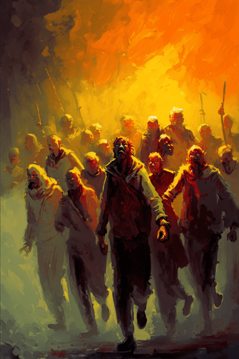

# 废弃矿洞(COD-废城)  
> 废弃的矿洞  
  

<a href="cod_Exp_矿洞.md" style="color:black">废弃矿洞</a>

<a href="cod_Exp_矿区.md" style="color:black">矿区</a>

<a href="cod_Path_矿洞到矿区.md" style="color:black">废弃矿区</a>

<a href="cod_eve_石化僵尸攻击.md" style="color:black">石化僵尸</a>

<a href="cod_Nc_PetrifiedZombie.md" style="color:black">石化</a>

  
  
<table class="table table-bordered" data-toggle="table"  data-show-header="false"><thead style="display:none"><tr ><th  style="width:50%;text-align:left;vertical-align:top;"  >title</th><th  style="width:50%;text-align:left;vertical-align:top;"  data-sortable="true"  ></th></tr></thead><tr ><td  style="width:50%;text-align:left;vertical-align:top;"  >**环境：**[废弃矿洞(环境)](cod_Env_矿洞.md)  ** 环境效果: ** [

[雨水防护](RainProtection.md)](RainProtection.md)<b>+3</b> [

[绝热](InsulationHeat.md)](InsulationHeat.md)<b>+3</b> [

[阳光防护](SunProtection.md)](SunProtection.md)<b>+20</b> [

[遮蔽](Sheltered.md)](Sheltered.md)<b>+1</b> [

[不适](Discomfort.md)](Discomfort.md)<b>+800</b> [Ruins_MapCount](cod_Gs_Ruins_MapCount.md)<b>+1</b>  ** 容量： **30000</td><td  style="width:50%;text-align:left;vertical-align:top;"  ></td></tr></tbody></table>  
  
## 探索  
<table class="table table-bordered" data-toggle="table"  ><thead style=""><tr ><th  style="text-align:left;vertical-align:top;"  >进度</th><th  style="text-align:left;vertical-align:top;"  >目的地</th></tr></thead><tr ><td  style="text-align:left;vertical-align:top;"  >95%</td><td  style="text-align:left;vertical-align:top;"  >[大木箱(船舱)](cod_大箱子placed.md)</td></tr><tr ><td  style="text-align:left;vertical-align:top;"  >100%</td><td  style="text-align:left;vertical-align:top;"  >[Area Explored(事件)(红色砖房)](cod_探索地区完毕.md)</td></tr></tbody></table>  
  
## 动作  

<table><tr><td rowspan="2" style="width:200px;text-align:center;font-size:1.3em;font-weight:bold">

Explore

15分

</td><td>[“腿部动作(组)”](LegAction.md)</td></tr><tr><td></td></tr><tr><td colspan="2"><b>需求：</b>[

[光亮](Light.md)](Light.md): <b>10-100</b></td></tr><tr><td colspan="2"><b>状态变化：</b>[

[足部损伤](FootDamage.md)](FootDamage.md)<b>+20</b>, [

[耐力](Stamina.md)](Stamina.md)<b>-4</b>, [

[压力](Stress.md)](Stress.md)<b>-10</b>, [

[污垢](Filth.md)](Filth.md)<b>+1</b></td></tr><tr><td colspan="2">

<table style="margin-bottom:3px;"><tr><td rowspan=2 style="text-align:center" width="80px">
基础权重

10
</td><td style="font-size:0.6em;line-height:0.6em;font-weight:bold">Stone</td></tr><tr><td>[

[石头](Stone.md)](Stone.md)(<b>+1</b>)</td></tr></table>

<table style="margin-bottom:3px;"><tr><td rowspan=2 style="text-align:center" width="80px">
基础权重

10
</td><td style="font-size:0.6em;line-height:0.6em;font-weight:bold">Heavy Stone</td></tr><tr><td>[

[铜矿脉(洞穴上层)](CopperVein.md)](CopperVein.md)(<b>+1</b>)</td></tr></table>

<table style="margin-bottom:3px;"><tr><td rowspan=2 style="text-align:center" width="80px">
基础权重

2
</td><td style="font-size:0.6em;line-height:0.6em;font-weight:bold">Dry Leaves</td></tr><tr><td>[

[石化(废弃矿区)](cod_Nc_PetrifiedZombie.md)](cod_Nc_PetrifiedZombie.md)(<b>+1</b>)</td></tr></table>

<table style="margin-bottom:3px;"><tr><td rowspan=2 style="text-align:center" width="80px">
基础权重

1
</td><td style="font-size:0.6em;line-height:0.6em;font-weight:bold">zbb</td></tr><tr><td>[

[尸群(事件)(废弃农场)](cod_eve_尸群来了.md)](cod_eve_尸群来了.md)(<b>+1</b>)</td></tr></table>

<table style="margin-bottom:3px;"><tr><td rowspan=2 style="text-align:center" width="80px">
基础权重

10
</td><td style="font-size:0.6em;line-height:0.6em;font-weight:bold">woodenbox</td></tr><tr><td>[

[木箱子](cod_尼根任务箱子1.md)](cod_尼根任务箱子1.md)(<b>+1</b>)</td></tr></table>

<table style="margin-bottom:3px;"><tr><td rowspan=2 style="text-align:center" width="80px">
基础权重

10
</td><td style="font-size:0.6em;line-height:0.6em;font-weight:bold">Nothing</td></tr><tr><td></td></tr></table>

<table style="margin-bottom:3px;"><tr><td rowspan=2 style="text-align:center" width="80px">
基础权重

3
</td><td style="font-size:0.6em;line-height:0.6em;font-weight:bold">mei</td></tr><tr><td>[

[煤矿脉](cod_煤矿脉.md)](cod_煤矿脉.md)(<b>+1</b>)</td></tr></table>

</td></tr></table>
  
  
  

