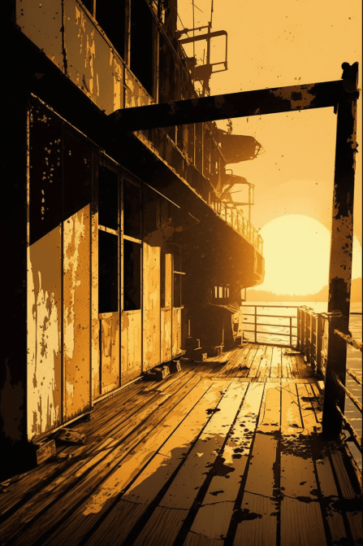
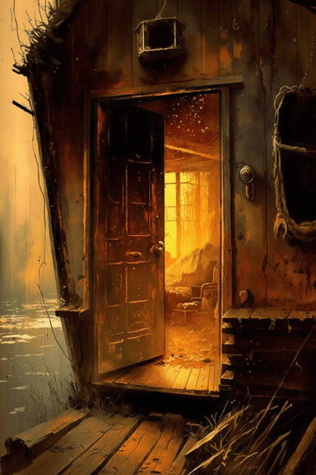
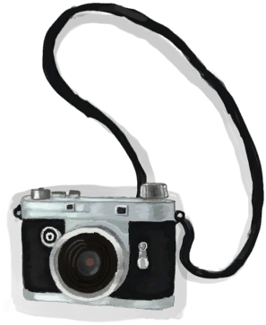

# 破败轮船(COD-废城)  
> 一个破败的轮船  
  

<a href="cod_Exp_破旧轮船.md" style="color:black">破败轮船</a>

<a href="cod_Exp_破败港口.md" style="color:black">破败港口</a>

<a href="cod_Exp_船舱.md" style="color:black">船舱</a>

<a href="cod_Nc_OrdinaryZombie.md" style="color:black">僵尸</a>

<a href="cod_Path_进入船舱.md" style="color:black">船舱</a>

  
  
<table class="table table-bordered" data-toggle="table"  data-show-header="false"><thead style="display:none"><tr ><th  style="width:50%;text-align:left;vertical-align:top;"  >title</th><th  style="width:50%;text-align:left;vertical-align:top;"  data-sortable="true"  ></th></tr></thead><tr ><td  style="width:50%;text-align:left;vertical-align:top;"  >** 区域唯一 **  **环境：**[破败轮船(环境)](cod_Env_破旧轮船.md)  ** 环境效果: ** [

[光亮](Light.md)](Light.md)<b>+10</b> [

[体感温度](TemperaturePerceived.md)](TemperaturePerceived.md)<b>-5</b> [

[内陆恐惧症](LandSickness.md)](LandSickness.md)加成<b>-8</b> [Ruins_MapCount](cod_Gs_Ruins_MapCount.md)<b>+1</b></td><td  style="width:50%;text-align:left;vertical-align:top;"  ></td></tr></tbody></table>  
  
## 探索  
<table class="table table-bordered" data-toggle="table"  ><thead style=""><tr ><th  style="text-align:left;vertical-align:top;"  >进度</th><th  style="text-align:left;vertical-align:top;"  >目的地</th></tr></thead><tr ><td  style="text-align:left;vertical-align:top;"  >40%</td><td  style="text-align:left;vertical-align:top;"  >[破旧邮轮酒吧(破败轮船)](cod_邮轮酒吧.md)</td></tr><tr ><td  style="text-align:left;vertical-align:top;"  >30%</td><td  style="text-align:left;vertical-align:top;"  >[甲板(破败轮船)](cod_看海景.md)</td></tr><tr ><td  style="text-align:left;vertical-align:top;"  >70%</td><td  style="text-align:left;vertical-align:top;"  >[前往船舱(破败轮船)](cod_Path_进入船舱.md)</td></tr><tr ><td  style="text-align:left;vertical-align:top;"  >90%</td><td  style="text-align:left;vertical-align:top;"  >[邮轮健身房(破败轮船)](cod_邮轮健身房.md)</td></tr><tr ><td  style="text-align:left;vertical-align:top;"  >95%</td><td  style="text-align:left;vertical-align:top;"  >[破败港口(破败轮船)](cod_Paht_轮船到港口.md)</td></tr><tr ><td  style="text-align:left;vertical-align:top;"  >100%</td><td  style="text-align:left;vertical-align:top;"  >[Area Explored(事件)(红色砖房)](cod_探索地区完毕.md)</td></tr></tbody></table>  
  
## 动作  

<table><tr><td rowspan="2" style="width:200px;text-align:center;font-size:1.3em;font-weight:bold">

Go for a Walk

15分

</td><td>[“腿部动作(组)”](LegAction.md)</td></tr><tr><td></td></tr><tr><td colspan="2"><b>需求：</b>[

[光亮](Light.md)](Light.md): <b>10-100</b></td></tr><tr><td colspan="2"><b>状态变化：</b>[

[足部损伤](FootDamage.md)](FootDamage.md)<b>+15</b>, [

[耐力](Stamina.md)](Stamina.md)<b>-2</b>, [

[压力](Stress.md)](Stress.md)<b>-10</b></td></tr><tr><td colspan="2">

<table style="margin-bottom:3px;"><tr><td rowspan=2 style="text-align:center" width="80px">
基础权重

10
</td><td style="font-size:0.6em;line-height:0.6em;font-weight:bold">Nothing</td></tr><tr><td></td></tr></table>

<table style="margin-bottom:3px;"><tr><td rowspan=2 style="text-align:center" width="80px">
基础权重

5
</td><td style="font-size:0.6em;line-height:0.6em;font-weight:bold">stick</td></tr><tr><td>[

[一捆长木棍](cod_一捆长木棍.md)](cod_一捆长木棍.md)(<b>+1</b>)</td></tr></table>

<table style="margin-bottom:3px;"><tr><td rowspan=2 style="text-align:center" width="80px">
基础权重

5
</td><td style="font-size:0.6em;line-height:0.6em;font-weight:bold">woood</td></tr><tr><td>[

[木材](Wood.md)](Wood.md)(<b>+1</b>)</td></tr></table>

</td></tr></table>
  
  
  
## 可拖入  

<table style="margin-bottom:0px;"><tr><td style="width:40%;text-align:left; background-color:#FEFEFE"><b>拖入：</b>[

[相机](Camera.md)](Camera.md)</td><td style="width:40%;font-size:1em;font-weight:bold;background-color:#FEFEFE">照照片 (15分) </td></tr><tr style="background-color:#FFFFFF"><td style=""><b>使用物：</b></td><td style=""><b>自身：</b></td></tr><tr><td colspan="2"><b>状态变化：</b>[

[娱乐](Entertainment.md)](Entertainment.md)<b>+1</b></td></tr></table>
  
  

