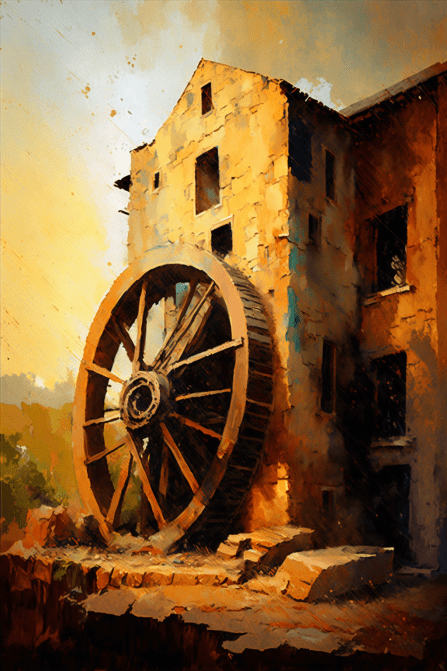
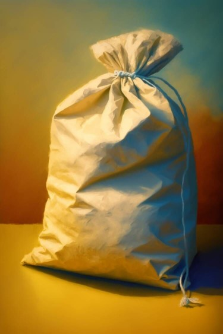
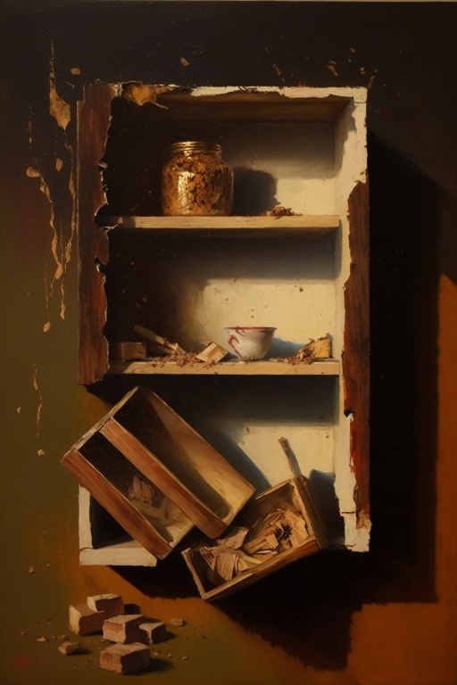

# 破败轮船(COD-废城)  
> 一个破败的轮船  
  

<a href="cod_Exp_锯木厂.md" style="color:black">破败轮船</a>

<a href="cod_Nc_OrdinaryZombie.md" style="color:black">僵尸x2</a>

<a href="cod_Nc_FilthyZombie.md" style="color:black">污秽</a>

  
  
<table class="table table-bordered" data-toggle="table"  data-show-header="false"><thead style="display:none"><tr ><th  style="width:50%;text-align:left;vertical-align:top;"  >title</th><th  style="width:50%;text-align:left;vertical-align:top;"  data-sortable="true"  ></th></tr></thead><tr ><td  style="width:50%;text-align:left;vertical-align:top;"  >** 区域唯一 **  ** 不可删除 **  **环境：**[破败轮船(环境)](cod_Env_锯木厂.md)  ** 环境效果: ** [

[光亮](Light.md)](Light.md)<b>+10</b> [Ruins_MapCount](cod_Gs_Ruins_MapCount.md)<b>+1</b></td><td  style="width:50%;text-align:left;vertical-align:top;"  ></td></tr></tbody></table>  
  
## 探索  
<table class="table table-bordered" data-toggle="table"  ><thead style=""><tr ><th  style="text-align:left;vertical-align:top;"  >进度</th><th  style="text-align:left;vertical-align:top;"  >目的地</th></tr></thead><tr ><td  style="text-align:left;vertical-align:top;"  >25%</td><td  style="text-align:left;vertical-align:top;"  >[铁箱(破败轮船)](cod_Nc_ScavengingSupplies_Location_Box_TypeOne.md)</td></tr><tr ><td  style="text-align:left;vertical-align:top;"  >100%</td><td  style="text-align:left;vertical-align:top;"  >[地区探索完毕(事件)(基地)](cod_探索地区完毕.md)</td></tr><tr ><td  style="text-align:left;vertical-align:top;"  >50%</td><td  style="text-align:left;vertical-align:top;"  >[破箱子](cod_废弃的机械.md)</td></tr><tr ><td  style="text-align:left;vertical-align:top;"  >75%</td><td  style="text-align:left;vertical-align:top;"  >[破箱子](cod_废弃的机械.md)</td></tr></tbody></table>  
  
## 动作  

<table><tr><td rowspan="2" style="width:200px;text-align:center;font-size:1.3em;font-weight:bold">

随便逛逛

15分

</td><td>[“腿部动作(组)”](LegAction.md)</td></tr><tr><td></td></tr><tr><td colspan="2"><b>需求：</b>[

[光亮](Light.md)](Light.md): <b>10-100</b></td></tr><tr><td colspan="2"><b>状态变化：</b>[

[足部损伤](FootDamage.md)](FootDamage.md)<b>+15</b>, [

[耐力](Stamina.md)](Stamina.md)<b>-2</b>, [

[压力](Stress.md)](Stress.md)<b>-10</b></td></tr><tr><td colspan="2">

<table style="margin-bottom:3px;"><tr><td rowspan=2 style="text-align:center" width="80px">
基础权重

25
</td><td style="font-size:0.6em;line-height:0.6em;font-weight:bold">Nothing</td></tr><tr><td></td></tr></table>

<table style="margin-bottom:3px;"><tr><td rowspan=2 style="text-align:center" width="80px">
基础权重

25
</td><td style="font-size:0.6em;line-height:0.6em;font-weight:bold">Exp_Sawmill_CardDrop_1</td></tr><tr><td>[

[破箱子](cod_伐木厂木材堆.md)](cod_伐木厂木材堆.md)(<b>+1</b>)</td></tr></table>

<table style="margin-bottom:3px;"><tr><td rowspan=2 style="text-align:center" width="80px">
基础权重

100
</td><td style="font-size:0.6em;line-height:0.6em;font-weight:bold">Exp_Sawmill_CardDrop_2</td></tr><tr><td>[

[木材](Wood.md)](Wood.md)(<b>+1</b>)</td></tr></table>

<table style="margin-bottom:3px;"><tr><td rowspan=2 style="text-align:center" width="80px">
基础权重

90
</td><td style="font-size:0.6em;line-height:0.6em;font-weight:bold">Exp_Sawmill_CardDrop_3</td></tr><tr><td>[

[小树枝](Sticks.md)](Sticks.md)(<b>+1</b>)</td></tr></table>

<table style="margin-bottom:3px;"><tr><td rowspan=2 style="text-align:center" width="80px">
基础权重

100
</td><td style="font-size:0.6em;line-height:0.6em;font-weight:bold">Exp_Sawmill_CardDrop_4</td></tr><tr><td>[

[原木](Log.md)](Log.md)(<b>+1</b>)</td></tr></table>

<table style="margin-bottom:3px;"><tr><td rowspan=2 style="text-align:center" width="80px">
基础权重

35
</td><td style="font-size:0.6em;line-height:0.6em;font-weight:bold">Exp_Sawmill_CardDrop_5</td></tr><tr><td>[

[倒下的棕榈树](PalmTreeFelled.md)](PalmTreeFelled.md)(<b>+1</b>)</td></tr></table>

<table style="margin-bottom:3px;"><tr><td rowspan=2 style="text-align:center" width="80px">
基础权重

30
</td><td style="font-size:0.6em;line-height:0.6em;font-weight:bold">Exp_Sawmill_CardDrop_6</td></tr><tr><td>[

[倒下的大树](LargeTreeFelled.md)](LargeTreeFelled.md)(<b>+1</b>)</td></tr></table>

<table style="margin-bottom:3px;"><tr><td rowspan=2 style="text-align:center" width="80px">
基础权重

30
</td><td style="font-size:0.6em;line-height:0.6em;font-weight:bold">Exp_Sawmill_CardDrop_7</td></tr><tr><td>[

[倒下的西米树](SagoPalmFelled.md)](SagoPalmFelled.md)(<b>+1</b>)</td></tr></table>

<table style="margin-bottom:3px;"><tr><td rowspan=2 style="text-align:center" width="80px">
基础权重

100
</td><td style="font-size:0.6em;line-height:0.6em;font-weight:bold">Exp_Sawmill_CardDrop_8</td></tr><tr><td>[

[铁制材料](cod_Nc_IndustrialMaterials.md)](cod_Nc_IndustrialMaterials.md)(<b>+1</b>)</td></tr></table>

<table style="margin-bottom:3px;"><tr><td rowspan=2 style="text-align:center" width="80px">
基础权重

100
</td><td style="font-size:0.6em;line-height:0.6em;font-weight:bold">Exp_Sawmill_CardDrop_9</td></tr><tr><td>[

[木屑](WoodShavings.md)](WoodShavings.md)(<b>+1</b>)</td></tr></table>

<table style="margin-bottom:3px;"><tr><td rowspan=2 style="text-align:center" width="80px">
基础权重

50
</td><td style="font-size:0.6em;line-height:0.6em;font-weight:bold">Exp_Sawmill_CardDrop_10</td></tr><tr><td>[

[僵尸(破败轮船)](cod_Nc_OrdinaryZombie.md)](cod_Nc_OrdinaryZombie.md)(<b>+1</b>)</td></tr></table>

<table style="margin-bottom:3px;"><tr><td rowspan=2 style="text-align:center" width="80px">
基础权重

50
</td><td style="font-size:0.6em;line-height:0.6em;font-weight:bold">Exp_Sawmill_CardDrop_11</td></tr><tr><td>[

[尖啸(腐败之城)](cod_Nc_ScreamingZombies.md)](cod_Nc_ScreamingZombies.md)(<b>+1</b>)</td></tr></table>

<table style="margin-bottom:3px;"><tr><td rowspan=2 style="text-align:center" width="80px">
基础权重

50
</td><td style="font-size:0.6em;line-height:0.6em;font-weight:bold">Exp_Sawmill_CardDrop_12</td></tr><tr><td>[

[利爪(腐败之城)](cod_Nc_SharpClawZombies.md)](cod_Nc_SharpClawZombies.md)(<b>+1</b>)</td></tr></table>

<table style="margin-bottom:3px;"><tr><td rowspan=2 style="text-align:center" width="80px">
基础权重

50
</td><td style="font-size:0.6em;line-height:0.6em;font-weight:bold">Exp_Sawmill_CardDrop_13</td></tr><tr><td>[

[迅猛(腐败之城)](cod_Nc_SwiftZombie.md)](cod_Nc_SwiftZombie.md)(<b>+1</b>)</td></tr></table>

<table style="margin-bottom:3px;"><tr><td rowspan=2 style="text-align:center" width="80px">
基础权重

50
</td><td style="font-size:0.6em;line-height:0.6em;font-weight:bold">Exp_Sawmill_CardDrop_14</td></tr><tr><td>[

[污秽(破败轮船)](cod_Nc_FilthyZombie.md)](cod_Nc_FilthyZombie.md)(<b>+1</b>)</td></tr></table>

<table style="margin-bottom:3px;"><tr><td rowspan=2 style="text-align:center" width="80px">
基础权重

50
</td><td style="font-size:0.6em;line-height:0.6em;font-weight:bold">Exp_Sawmill_CardDrop_15</td></tr><tr><td>[

[石化(破败轮船)](cod_Nc_PetrifiedZombie.md)](cod_Nc_PetrifiedZombie.md)(<b>+1</b>)</td></tr></table>

<table style="margin-bottom:3px;"><tr><td rowspan=2 style="text-align:center" width="80px">
基础权重

50
</td><td style="font-size:0.6em;line-height:0.6em;font-weight:bold">Exp_Sawmill_CardDrop_16</td></tr><tr><td>[

[巨霸(摩登街道)](cod_Nc_GiantBusterZombie.md)](cod_Nc_GiantBusterZombie.md)(<b>+1</b>)</td></tr></table>

<table style="margin-bottom:3px;"><tr><td rowspan=2 style="text-align:center" width="80px">
基础权重

2
</td><td style="font-size:0.6em;line-height:0.6em;font-weight:bold">Exp_Sawmill_CardDrop_17</td></tr><tr><td>[

[包囊](cod_Nc_ScavengingSupplies_AmmunitionWrapping.md)](cod_Nc_ScavengingSupplies_AmmunitionWrapping.md)(<b>+1</b>)</td></tr></table>

<table style="margin-bottom:3px;"><tr><td rowspan=2 style="text-align:center" width="80px">
基础权重

2
</td><td style="font-size:0.6em;line-height:0.6em;font-weight:bold">Exp_Sawmill_CardDrop_18</td></tr><tr><td>[

[包囊](cod_Nc_ScavengingSupplies_BuildingMaterialWrapping.md)](cod_Nc_ScavengingSupplies_BuildingMaterialWrapping.md)(<b>+1</b>)</td></tr></table>

<table style="margin-bottom:3px;"><tr><td rowspan=2 style="text-align:center" width="80px">
基础权重

2
</td><td style="font-size:0.6em;line-height:0.6em;font-weight:bold">Exp_Sawmill_CardDrop_19</td></tr><tr><td>[

[包囊](cod_Nc_ScavengingSupplies_FoodWrapping.md)](cod_Nc_ScavengingSupplies_FoodWrapping.md)(<b>+1</b>)</td></tr></table>

<table style="margin-bottom:3px;"><tr><td rowspan=2 style="text-align:center" width="80px">
基础权重

2
</td><td style="font-size:0.6em;line-height:0.6em;font-weight:bold">Exp_Sawmill_CardDrop_20</td></tr><tr><td>[

[包囊](cod_Nc_ScavengingSupplies_MaterialWrapping.md)](cod_Nc_ScavengingSupplies_MaterialWrapping.md)(<b>+1</b>)</td></tr></table>

<table style="margin-bottom:3px;"><tr><td rowspan=2 style="text-align:center" width="80px">
基础权重

2
</td><td style="font-size:0.6em;line-height:0.6em;font-weight:bold">Exp_Sawmill_CardDrop_21</td></tr><tr><td>[

[包囊](cod_Nc_ScavengingSupplies_MedicineWrapping.md)](cod_Nc_ScavengingSupplies_MedicineWrapping.md)(<b>+1</b>)</td></tr></table>

<table style="margin-bottom:3px;"><tr><td rowspan=2 style="text-align:center" width="80px">
基础权重

1
</td><td style="font-size:0.6em;line-height:0.6em;font-weight:bold">YoYo</td></tr><tr><td>[

[铁箱(破败轮船)](cod_Nc_ScavengingSupplies_Location_Box_TypeOne.md)](cod_Nc_ScavengingSupplies_Location_Box_TypeOne.md)(<b>+1</b>)</td></tr></table>

<table style="margin-bottom:3px;"><tr><td rowspan=2 style="text-align:center" width="80px">
基础权重

1
</td><td style="font-size:0.6em;line-height:0.6em;font-weight:bold">YoYo</td></tr><tr><td>[

[铁箱](cod_Nc_ScavengingSupplies_Location_Box_TypeTwo.md)](cod_Nc_ScavengingSupplies_Location_Box_TypeTwo.md)(<b>+1</b>)</td></tr></table>

<table style="margin-bottom:3px;"><tr><td rowspan=2 style="text-align:center" width="80px">
基础权重

1
</td><td style="font-size:0.6em;line-height:0.6em;font-weight:bold">YoYo</td></tr><tr><td>[

[铁箱](cod_Nc_ScavengingSupplies_Location_Box_TypeThree.md)](cod_Nc_ScavengingSupplies_Location_Box_TypeThree.md)(<b>+1</b>)</td></tr></table>

<table style="margin-bottom:3px;"><tr><td rowspan=2 style="text-align:center" width="80px">
基础权重

1
</td><td style="font-size:0.6em;line-height:0.6em;font-weight:bold">YoYo</td></tr><tr><td>[

[支架](cod_Nc_ScavengingSupplies_Location_Brackets_TypeOne.md)](cod_Nc_ScavengingSupplies_Location_Brackets_TypeOne.md)(<b>+1</b>)</td></tr></table>

<table style="margin-bottom:3px;"><tr><td rowspan=2 style="text-align:center" width="80px">
基础权重

1
</td><td style="font-size:0.6em;line-height:0.6em;font-weight:bold">YoYo</td></tr><tr><td>[

[支架](cod_Nc_ScavengingSupplies_Location_Brackets_TypeTwo.md)](cod_Nc_ScavengingSupplies_Location_Brackets_TypeTwo.md)(<b>+1</b>)</td></tr></table>

<table style="margin-bottom:3px;"><tr><td rowspan=2 style="text-align:center" width="80px">
基础权重

1
</td><td style="font-size:0.6em;line-height:0.6em;font-weight:bold">YoYo</td></tr><tr><td>[

[支架](cod_Nc_ScavengingSupplies_Location_Brackets_TypeThree.md)](cod_Nc_ScavengingSupplies_Location_Brackets_TypeThree.md)(<b>+1</b>)</td></tr></table>

<table style="margin-bottom:3px;"><tr><td rowspan=2 style="text-align:center" width="80px">
基础权重

1
</td><td style="font-size:0.6em;line-height:0.6em;font-weight:bold">YoYo</td></tr><tr><td>[

[支架](cod_Nc_ScavengingSupplies_Location_Brackets_TypeFour.md)](cod_Nc_ScavengingSupplies_Location_Brackets_TypeFour.md)(<b>+1</b>)</td></tr></table>

<table style="margin-bottom:3px;"><tr><td rowspan=2 style="text-align:center" width="80px">
基础权重

1
</td><td style="font-size:0.6em;line-height:0.6em;font-weight:bold">YoYo</td></tr><tr><td>[

[支架](cod_Nc_ScavengingSupplies_Location_Brackets_TypeFive.md)](cod_Nc_ScavengingSupplies_Location_Brackets_TypeFive.md)(<b>+1</b>)</td></tr></table>

<table style="margin-bottom:3px;"><tr><td rowspan=2 style="text-align:center" width="80px">
基础权重

1
</td><td style="font-size:0.6em;line-height:0.6em;font-weight:bold">YoYo</td></tr><tr><td>[

[铁柜](cod_Nc_ScavengingSupplies_Location_Cabinet_TypeOne.md)](cod_Nc_ScavengingSupplies_Location_Cabinet_TypeOne.md)(<b>+1</b>)</td></tr></table>

<table style="margin-bottom:3px;"><tr><td rowspan=2 style="text-align:center" width="80px">
基础权重

1
</td><td style="font-size:0.6em;line-height:0.6em;font-weight:bold">YoYo</td></tr><tr><td>[

[铁柜](cod_Nc_ScavengingSupplies_Location_Cabinet_TypeTwo.md)](cod_Nc_ScavengingSupplies_Location_Cabinet_TypeTwo.md)(<b>+1</b>)</td></tr></table>

<table style="margin-bottom:3px;"><tr><td rowspan=2 style="text-align:center" width="80px">
基础权重

1
</td><td style="font-size:0.6em;line-height:0.6em;font-weight:bold">YoYo</td></tr><tr><td>[

[铁柜](cod_Nc_ScavengingSupplies_Location_Cabinet_TypeThree.md)](cod_Nc_ScavengingSupplies_Location_Cabinet_TypeThree.md)(<b>+1</b>)</td></tr></table>

</td></tr></table>
  
  
  

