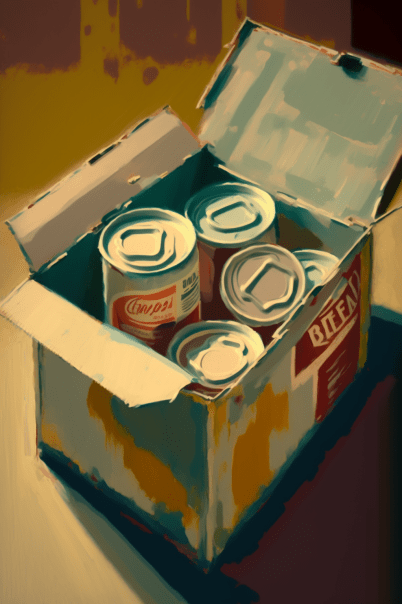

# 鱼肉加工厂(COD-废城)  
> 鱼肉加工厂  
  

<a href="cod_Exp_鱼肉加工厂.md" style="color:black">鱼肉加工厂</a>

<a href="cod_Exp_破败港口.md" style="color:black">破败港口</a>

<a href="cod_Path_鱼肉加工厂到港口.md" style="color:black">返回港口</a>

<a href="cod_Nc_OrdinaryZombie.md" style="color:black">僵尸</a>

  
  
<table class="table table-bordered" data-toggle="table"  data-show-header="false"><thead style="display:none"><tr ><th  style="width:50%;text-align:left;vertical-align:top;"  >title</th><th  style="width:50%;text-align:left;vertical-align:top;"  data-sortable="true"  ></th></tr></thead><tr ><td  style="width:50%;text-align:left;vertical-align:top;"  >**环境：**[鱼肉加工厂(环境)](cod_Env_鱼肉加工厂.md)  ** 环境效果: ** [

[雨水防护](RainProtection.md)](RainProtection.md)<b>+5</b> [

[绝热](InsulationHeat.md)](InsulationHeat.md)<b>+4</b> [

[阳光防护](SunProtection.md)](SunProtection.md)<b>+20</b> [

[遮蔽](Sheltered.md)](Sheltered.md)<b>+1</b> [Ruins_MapCount](cod_Gs_Ruins_MapCount.md)<b>+1</b>  ** 容量： **20000</td><td  style="width:50%;text-align:left;vertical-align:top;"  ></td></tr></tbody></table>  
  
## 探索  
<table class="table table-bordered" data-toggle="table"  ><thead style=""><tr ><th  style="text-align:left;vertical-align:top;"  >进度</th><th  style="text-align:left;vertical-align:top;"  >目的地</th></tr></thead><tr ><td  style="text-align:left;vertical-align:top;"  >95%</td><td  style="text-align:left;vertical-align:top;"  >[钓鱼洞(鱼肉加工厂)](cod_钓鱼洞.md)</td></tr><tr ><td  style="text-align:left;vertical-align:top;"  >100%</td><td  style="text-align:left;vertical-align:top;"  >[Area Explored(事件)(红色砖房)](cod_探索地区完毕.md)</td></tr></tbody></table>  
  
## 动作  

<table><tr><td rowspan="2" style="width:200px;text-align:center;font-size:1.3em;font-weight:bold">

Explore

15分

</td><td>[“腿部动作(组)”](LegAction.md)</td></tr><tr><td></td></tr><tr><td colspan="2"><b>需求：</b>[

[光亮](Light.md)](Light.md): <b>10-100</b></td></tr><tr><td colspan="2"><b>状态变化：</b>[

[足部损伤](FootDamage.md)](FootDamage.md)<b>+20</b>, [

[耐力](Stamina.md)](Stamina.md)<b>-4</b>, [

[压力](Stress.md)](Stress.md)<b>-10</b>, [

[污垢](Filth.md)](Filth.md)<b>+1</b></td></tr><tr><td colspan="2">

<table style="margin-bottom:3px;"><tr><td rowspan=2 style="text-align:center" width="80px">
基础权重

1
</td><td style="font-size:0.6em;line-height:0.6em;font-weight:bold">Nothing</td></tr><tr><td></td></tr></table>

<table style="margin-bottom:3px;"><tr><td rowspan=2 style="text-align:center" width="80px">
基础权重

75
</td><td style="font-size:0.6em;line-height:0.6em;font-weight:bold">fanmaiji</td></tr><tr><td>[

[一箱罐头食品](cod_一箱鱼罐头.md)](cod_一箱鱼罐头.md)(<b>+1</b>)</td></tr></table>

<table style="margin-bottom:3px;"><tr><td rowspan=2 style="text-align:center" width="80px">
基础权重

500
</td><td style="font-size:0.6em;line-height:0.6em;font-weight:bold">nene</td></tr><tr><td>[

[鱼罐头制作机](cod_鱼罐头制造机.md)](cod_鱼罐头制造机.md)(<b>+1</b>)</td></tr></table>

<table style="margin-bottom:3px;"><tr><td rowspan=2 style="text-align:center" width="80px">
基础权重

75
</td><td style="font-size:0.6em;line-height:0.6em;font-weight:bold">Heavy Stone</td></tr><tr><td>[

[钓鱼竿（已添加诱饵）](FishingRodBait.md)](FishingRodBait.md)(<b>+1</b>)</td></tr></table>

<table style="margin-bottom:3px;"><tr><td rowspan=2 style="text-align:center" width="80px">
基础权重

75
</td><td style="font-size:0.6em;line-height:0.6em;font-weight:bold">aaa</td></tr><tr><td>[

[鱼饵](FishBait.md)](FishBait.md)(<b>+2～+3</b>)</td></tr></table>

</td></tr></table>
  
  
  

