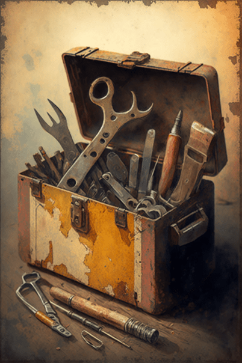
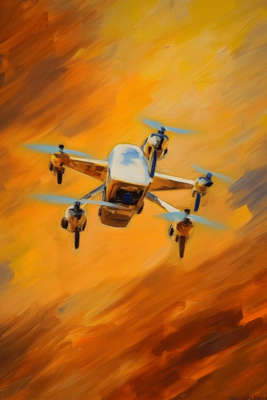
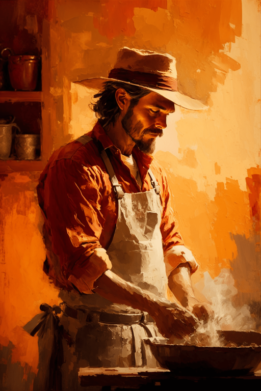
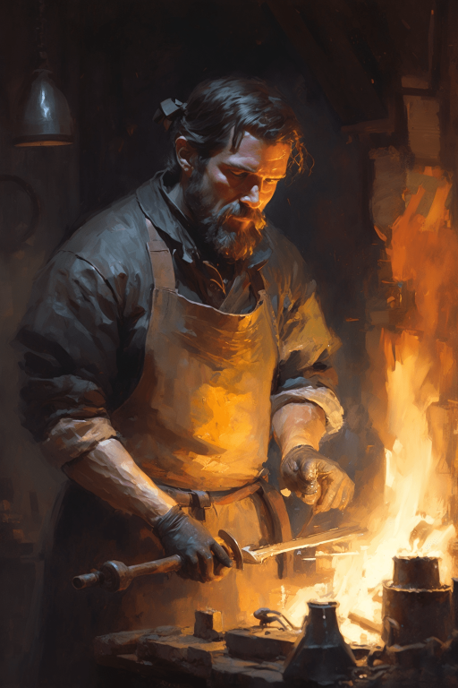

# 加文(COD-废城)  
> 找工作吗  
  
<table class="table table-bordered" data-toggle="table"  data-show-header="false"><thead style="display:none"><tr ><th  style="width:50%;text-align:left;vertical-align:top;"  >title</th><th  style="width:50%;text-align:left;vertical-align:top;"  ></th></tr></thead><tr ><td  style="width:50%;text-align:left;vertical-align:top;"  >**重量：**1500000  **标签：**	[“高级装饰品”](tag_DecorationAdv.md), [“美丽的/好看的”](tag_Pretty.md), </td><td  style="width:50%;text-align:left;vertical-align:top;"  >

<a href="cod_Garvin.md" style="color:black">加文</a>

</td></tr></tbody></table>  
  
## 获取来源  

蓝图制造

[出售煤(蓝图)](cod_出售煤块.md)

蓝图制造

[出售空罐(蓝图)](cod_出售空罐.md)

蓝图制造

[出售红砖(蓝图)](cod_出售红砖.md)

蓝图制造

[出售编织物(蓝图)](cod_出售编制物.md)

蓝图制造

[出售贝壳(蓝图)](cod_出售贝壳.md)

蓝图制造

[购买20张代金券(蓝图)](cod_购买代金券.md)

蓝图制造

[购买外星结节(蓝图)](cod_购买外星种子.md)

蓝图制造

[购买大腰包(蓝图)](cod_购买大腰包.md)

蓝图制造

[购买10发子弹(蓝图)](cod_购买子弹.md)

蓝图制造

[购买小型熔炉(蓝图)](cod_购买小型熔炉.md)

蓝图制造

[购买工作证(蓝图)](cod_购买工作证.md)

蓝图制造

[购买工具箱(蓝图)](cod_购买工具箱.md)

蓝图制造

[购买左轮(蓝图)](cod_购买左轮.md)

蓝图制造

[购买手电(蓝图)](cod_购买手电.md)

蓝图制造

[购买抗生素(蓝图)](cod_购买抗生素.md)

蓝图制造

[购买无人机(蓝图)](cod_购买无人机.md)

蓝图制造

[购买背包(蓝图)](cod_购买末日背包.md)

蓝图制造

[购买六个玻璃罐(蓝图)](cod_购买玻璃罐.md)

蓝图制造

[购买罐装素食秘方(蓝图)](cod_购买罐装食物秘籍.md)

蓝图制造

[购买罐装肉食秘方(蓝图)](cod_购买罐装食物秘籍2.md)

蓝图制造

[购买解毒剂(蓝图)](cod_购买解毒剂.md)

蓝图制造

[购买锯木工具(蓝图)](cod_购买锯木工具.md)

探索

[基地](cod_Exp_基地.md)

蓝图制造

[击鼓工作 (蓝图)](cod_击鼓工作.md)

蓝图制造

[务农工作(蓝图)](cod_务农工作.md)

蓝图制造

[厨师工作(蓝图)](cod_厨师工作.md)

蓝图制造

[弓箭教官(蓝图)](cod_射箭教学工作.md)

蓝图制造

[投石索教官(蓝图)](cod_投石索教练.md)

蓝图制造

[捕兽工作(蓝图)](cod_捕兽工作.md)

蓝图制造

[木工工作(蓝图)](cod_木工工作.md)

蓝图制造

[杂工工作(蓝图)](cod_杂工工作蓝图.md)

蓝图制造

[监工工作(蓝图)](cod_监工工作.md)

蓝图制造

[石匠工作(蓝图)](cod_石匠工作.md)

蓝图制造

[纺织工作(蓝图)](cod_纺织工作.md)

蓝图制造

[钓鱼工作(蓝图)](cod_钓鱼工作.md)

蓝图制造

[铁匠工作(蓝图)](cod_铁匠工作.md)

蓝图制造

[矛战教官(蓝图)](cod_长矛教学工作.md)

  
  
## 动作  

<table><tr><td rowspan="2" style="width:200px;text-align:center;font-size:1.3em;font-weight:bold">

你是谁？

</td><td></td></tr><tr><td></td></tr><tr><td colspan="2">[

[加文(事件)](cod_Eve_Garvin1.md)](cod_Eve_Garvin1.md)(<b>+1</b>)</td></tr></table>
  
  
  
## 可拖入  

<table style="margin-bottom:0px;"><tr><td style="width:40%;text-align:left; background-color:#FEFEFE"><b>拖入：</b></td><td style="width:40%;font-size:1em;font-weight:bold;background-color:#FEFEFE">交易 (3分) </td></tr><tr style="background-color:#FFFFFF"><td style=""><b>使用物：</b>→消失</td><td style=""><b>自身：</b></td></tr><tr><td colspan="2">[

[铸币](cod_铸币.md)](cod_铸币.md)(<b>+1</b>)</td></tr></table>
  

<table style="margin-bottom:0px;"><tr><td style="width:40%;text-align:left; background-color:#FEFEFE"><b>拖入：</b></td><td style="width:40%;font-size:1em;font-weight:bold;background-color:#FEFEFE">交易 (3分) </td></tr><tr style="background-color:#FFFFFF"><td style=""><b>使用物：</b>→消失</td><td style=""><b>自身：</b></td></tr><tr><td colspan="2">[

[铸币](cod_铸币.md)](cod_铸币.md)(<b>+2</b>)</td></tr></table>
  

<table style="margin-bottom:0px;"><tr><td style="width:40%;text-align:left; background-color:#FEFEFE"><b>拖入：</b></td><td style="width:40%;font-size:1em;font-weight:bold;background-color:#FEFEFE">交易 (3分) </td></tr><tr style="background-color:#FFFFFF"><td style=""><b>使用物：</b>→消失</td><td style=""><b>自身：</b></td></tr><tr><td colspan="2">[

[铸币](cod_铸币.md)](cod_铸币.md)(<b>+4～+6</b>)</td></tr></table>
  

<table style="margin-bottom:0px;"><tr><td style="width:40%;text-align:left; background-color:#FEFEFE"><b>拖入：</b></td><td style="width:40%;font-size:1em;font-weight:bold;background-color:#FEFEFE">交易 (3分) </td></tr><tr style="background-color:#FFFFFF"><td style=""><b>使用物：</b>→消失</td><td style=""><b>自身：</b></td></tr><tr><td colspan="2">[

[铸币](cod_铸币.md)](cod_铸币.md)(<b>+8～+12</b>)</td></tr></table>
  

<table style="margin-bottom:0px;"><tr><td style="width:40%;text-align:left; background-color:#FEFEFE"><b>拖入：</b></td><td style="width:40%;font-size:1em;font-weight:bold;background-color:#FEFEFE">交易 (3分) </td></tr><tr style="background-color:#FFFFFF"><td style=""><b>使用物：</b>→消失</td><td style=""><b>自身：</b></td></tr><tr><td colspan="2">[

[铸币](cod_铸币.md)](cod_铸币.md)(<b>+18～+22</b>)</td></tr></table>
  

<table style="margin-bottom:0px;"><tr><td style="width:40%;text-align:left; background-color:#FEFEFE"><b>拖入：</b>[

[山羊尸体(公)](GoatCarcassMale.md)](GoatCarcassMale.md) | [

[山羊尸体(母)](GoatCarcassFemale.md)](GoatCarcassFemale.md)</td><td style="width:40%;font-size:1em;font-weight:bold;background-color:#FEFEFE">交易 (3分) </td></tr><tr style="background-color:#FFFFFF"><td style=""><b>使用物：</b>→消失</td><td style=""><b>自身：</b></td></tr><tr><td colspan="2">[

[一小袋铸币](cod_一小袋铸币.md)](cod_一小袋铸币.md)(<b>+2～+3</b>)</td></tr></table>
  

<table style="margin-bottom:0px;"><tr><td style="width:40%;text-align:left; background-color:#FEFEFE"><b>拖入：</b>[

[猕猴尸体](MacaqueCarcass.md)](MacaqueCarcass.md)</td><td style="width:40%;font-size:1em;font-weight:bold;background-color:#FEFEFE">交易 (3分) </td></tr><tr style="background-color:#FFFFFF"><td style=""><b>使用物：</b>→消失</td><td style=""><b>自身：</b></td></tr><tr><td colspan="2">[

[一小袋铸币](cod_一小袋铸币.md)](cod_一小袋铸币.md)(<b>+1</b>)</td></tr></table>
  
  
## 可用于蓝图  

<a href="cod_出售煤块.md" style="color:black">出售煤</a>

<a href="cod_出售空罐.md" style="color:black">出售空罐</a>

<a href="cod_出售红砖.md" style="color:black">出售红砖</a>

<a href="cod_出售编制物.md" style="color:black">出售编织物</a>

<a href="cod_出售贝壳.md" style="color:black">出售贝壳</a>

<a href="cod_购买代金券.md" style="color:black">购买20张代金券</a>

<a href="cod_购买外星种子.md" style="color:black">购买外星结节</a>

<a href="cod_购买大腰包.md" style="color:black">购买大腰包</a>

<a href="cod_购买子弹.md" style="color:black">购买10发子弹</a>

<a href="cod_购买小型熔炉.md" style="color:black">购买小型熔炉</a>

<a href="cod_购买工作证.md" style="color:black">购买工作证</a>

<a href="cod_购买工具箱.md" style="color:black">购买工具箱</a>

<a href="cod_购买左轮.md" style="color:black">购买左轮</a>

<a href="cod_购买手电.md" style="color:black">购买手电</a>

<a href="cod_购买抗生素.md" style="color:black">购买抗生素</a>

<a href="cod_购买无人机.md" style="color:black">购买无人机</a>

<a href="cod_购买末日背包.md" style="color:black">购买背包</a>

<a href="cod_购买玻璃罐.md" style="color:black">购买六个玻璃罐</a>

<a href="cod_购买罐装食物秘籍.md" style="color:black">购买罐装素食秘方</a>

<a href="cod_购买罐装食物秘籍2.md" style="color:black">购买罐装肉食秘方</a>

<a href="cod_购买解毒剂.md" style="color:black">购买解毒剂</a>

<a href="cod_购买锯木工具.md" style="color:black">购买锯木工具</a>

<a href="cod_击鼓工作.md" style="color:black">击鼓工作 </a>

<a href="cod_务农工作.md" style="color:black">务农工作</a>

<a href="cod_厨师工作.md" style="color:black">厨师工作</a>

<a href="cod_射箭教学工作.md" style="color:black">弓箭教官</a>

<a href="cod_投石索教练.md" style="color:black">投石索教官</a>

<a href="cod_捕兽工作.md" style="color:black">捕兽工作</a>

<a href="cod_木工工作.md" style="color:black">木工工作</a>

<a href="cod_杂工工作蓝图.md" style="color:black">杂工工作</a>

<a href="cod_监工工作.md" style="color:black">监工工作</a>

<a href="cod_石匠工作.md" style="color:black">石匠工作</a>

<a href="cod_纺织工作.md" style="color:black">纺织工作</a>

<a href="cod_钓鱼工作.md" style="color:black">钓鱼工作</a>

<a href="cod_铁匠工作.md" style="color:black">铁匠工作</a>

<a href="cod_长矛教学工作.md" style="color:black">矛战教官</a>

  
  
  

