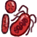

# 血清  
> 身体上绿色的纹路渐渐褪去..  
  

<b>基础值: </b> 0 
  

<b>变化范围: </b> 0 ~ 386 
  

<b>基础变化率: </b> -1 / 每15分钟 
  
## 阶段  

<table><tr style="height:2em;"><td style="background-color:#F0F0F0;text-align:center;width:180px;font-size:1.4em;font-weight:bold;vertical-align:middle;">
1 ～ 388

0% ～ 100%
</td><td colspan=2 style="font-size:1.1em;vertical-align:middle;background-color:#F9F9F9;">
<b>

极高镇痛剂量</b>

</td></tr><tr><td colspan=2><b>影响：</b>[

[疼痛](Pain.md)](Pain.md)<b>-500</b>, [

[发烧](Fever.md)](Fever.md)加成<b>-80</b>, [

[感染度](cod_Gs_Ruins_ZombieInfectivity.md)](cod_Gs_Ruins_ZombieInfectivity.md)加成<b>-10</b>, [

[勇气](Courage.md)](Courage.md)<b>+1600</b>, [

[压力](Stress.md)](Stress.md)加成<b>-5</b>, [

[世界观](Structure.md)](Structure.md)加成<b>+1</b>, [

[感染度](cod_Gs_Ruins_ZombieInfectivity.md)](cod_Gs_Ruins_ZombieInfectivity.md)<b>-1</b>, [

[血疫](cod_Gs_Ruins_BloodPlague.md)](cod_Gs_Ruins_BloodPlague.md)加成<b>-1</b></td></tr><tr><td colspan=2></td></tr></table>
  
## 可被以下操作改变  
<table class="table table-bordered" data-toggle="table"  ><thead style=""><tr ><th  style="text-align:left;vertical-align:top;"  >来源</th><th  style="text-align:left;vertical-align:top;"  >操作</th><th  style="text-align:left;vertical-align:top;"  data-sortable="true"  >值</th></tr></thead><tr ><td  style="text-align:left;vertical-align:top;"  >[

[解毒剂](cod_Nc_Antidote.md)](cod_Nc_Antidote.md)</td><td  style="text-align:left;vertical-align:top;"  >注射</td><td  style="text-align:left;vertical-align:top;"  >96</td></tr></tbody></table>  
  

