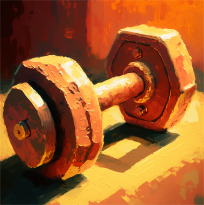
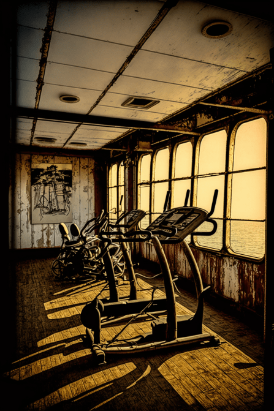

# 锻炼程度  
> 自我塑造的过程。  
  

<b>基础值: </b> 0 
  

<b>变化范围: </b> 0 ~ 64 
  

<b>基础变化率: </b> -1 / 每15分钟 
  
  
## 阶段  

<table><tr style="height:2em;"><td style="background-color:#F0F0F0;text-align:center;width:180px;font-size:1.4em;font-weight:bold;vertical-align:middle;">
1 ～ 16

1% ～ 25%
</td><td colspan=2 style="font-size:1.1em;vertical-align:middle;background-color:#F9F9F9;">
<b>

锻炼适度</b>

</td></tr><tr><td colspan=2><b>影响：</b>[

[身体强度](cod_Gs_Rains_BodyStrength.md)](cod_Gs_Rains_BodyStrength.md)加成<b>+0.25</b></td></tr><tr><td colspan=2></td></tr><tr style="height:2em;"><td style="background-color:#F0F0F0;text-align:center;width:180px;font-size:1.4em;font-weight:bold;vertical-align:middle;">
17 ～ 32

26% ～ 50%
</td><td colspan=2 style="font-size:1.1em;vertical-align:middle;background-color:#F9F9F9;">
<b>

局部酸痛</b>

</td></tr><tr><td colspan=2><b>影响：</b>[

[身体强度](cod_Gs_Rains_BodyStrength.md)](cod_Gs_Rains_BodyStrength.md)加成<b>+0.25</b>, [

[疼痛](Pain.md)](Pain.md)<b>+50</b></td></tr><tr><td colspan=2></td></tr><tr style="height:2em;"><td style="background-color:#F0F0F0;text-align:center;width:180px;font-size:1.4em;font-weight:bold;vertical-align:middle;">
33 ～ 48

51% ～ 75%
</td><td colspan=2 style="font-size:1.1em;vertical-align:middle;background-color:#F9F9F9;">
<b>

锻炼过度</b>

</td></tr><tr><td colspan=2><b>影响：</b>[

[身体强度](cod_Gs_Rains_BodyStrength.md)](cod_Gs_Rains_BodyStrength.md)加成<b>+0.25</b>, [

[疼痛](Pain.md)](Pain.md)<b>+100</b></td></tr><tr><td colspan=2></td></tr><tr style="height:2em;"><td style="background-color:#F0F0F0;text-align:center;width:180px;font-size:1.4em;font-weight:bold;vertical-align:middle;">
49 ～ 64

76% ～ 100%
</td><td colspan=2 style="font-size:1.1em;vertical-align:middle;background-color:#F9F9F9;">
<b>

肌肉拉伤</b>

</td></tr><tr><td colspan=2><b>影响：</b>[

[身体强度](cod_Gs_Rains_BodyStrength.md)](cod_Gs_Rains_BodyStrength.md)加成<b>+0.25</b>, [

[疼痛](Pain.md)](Pain.md)<b>+150</b></td></tr><tr><td colspan=2></td></tr></table>
  
  
## 可被以下操作改变  
<table class="table table-bordered" data-toggle="table"  ><thead style=""><tr ><th  style="text-align:left;vertical-align:top;"  >来源</th><th  style="text-align:left;vertical-align:top;"  >操作</th><th  style="text-align:left;vertical-align:top;"  data-sortable="true"  >值</th></tr></thead><tr ><td  style="text-align:left;vertical-align:top;"  >[

[邮轮健身房(破败轮船)](cod_邮轮健身房.md)](cod_邮轮健身房.md)</td><td  style="text-align:left;vertical-align:top;"  >锻炼</td><td  style="text-align:left;vertical-align:top;"  >16</td></tr></tbody></table>  
  

