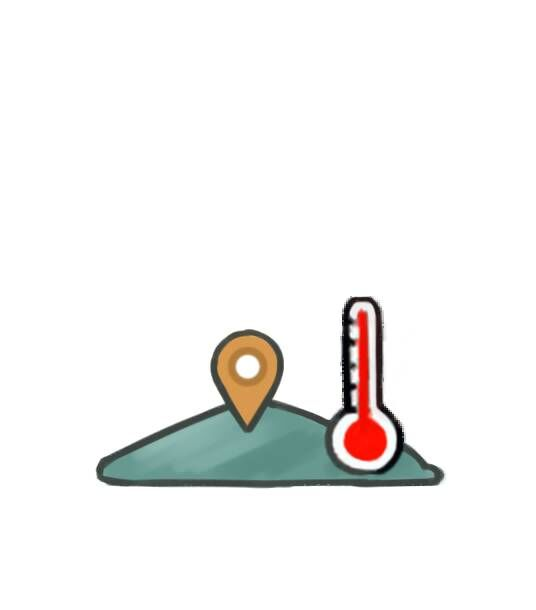

# 区域热度  
> 各类生物在该地区的活跃程度。  
  

<b>基础值: </b> 0 
  

<b>变化范围: </b> 0 ~ 40 
  

<b>基础变化率: </b> -1 / 每15分钟 
  
  
## 阶段  

<table><tr style="height:2em;"><td style="background-color:#F0F0F0;text-align:center;width:180px;font-size:1.4em;font-weight:bold;vertical-align:middle;">
1 ～ 8

2% ～ 20%
</td><td colspan=2 style="font-size:1.1em;vertical-align:middle;background-color:#F9F9F9;">
<b>

区域苏醒</b>

</td></tr><tr><td colspan=2><b>影响：</b>[Noise_OrdinaryZombie_AttackCount](cod_Gs_Noise_OrdinaryZombie_AttackCount.md)加成<b>+2～+3</b>, [Gs_Noise_SwiftZombie_AttackCount](cod_Gs_Noise_SwiftZombie_AttackCount.md)加成<b>+2～+3</b>, [Gs_Noise_FilthyZombie_AttackCount](cod_Gs_Noise_FilthyZombie_AttackCount.md), [Gs_Noise_GiantBusterZombie_AttackCount](cod_Gs_Noise_GiantBusterZombie_AttackCount.md), [Gs_Noise_PetrifiedZombie_AttackCount](cod_Gs_Noise_PetrifiedZombie_AttackCount.md), [Gs_Noise_ScreamingZombies_AttackCount](cod_Gs_Noise_ScreamingZombies_AttackCount..md), [Gs_Noise_SharpClawZombies_AttackCount](cod_Gs_Noise_SharpClawZombies_AttackCount.md)</td></tr><tr><td colspan=2></td></tr><tr style="height:2em;"><td style="background-color:#F0F0F0;text-align:center;width:180px;font-size:1.4em;font-weight:bold;vertical-align:middle;">
9 ～ 16

22% ～ 40%
</td><td colspan=2 style="font-size:1.1em;vertical-align:middle;background-color:#F9F9F9;">
<b>

区域起温</b>

</td></tr><tr><td colspan=2><b>影响：</b>[Noise_OrdinaryZombie_AttackCount](cod_Gs_Noise_OrdinaryZombie_AttackCount.md)加成<b>+2～+3</b>, [Gs_Noise_SwiftZombie_AttackCount](cod_Gs_Noise_SwiftZombie_AttackCount.md)加成<b>+2～+3</b>, [Gs_Noise_FilthyZombie_AttackCount](cod_Gs_Noise_FilthyZombie_AttackCount.md), [Gs_Noise_GiantBusterZombie_AttackCount](cod_Gs_Noise_GiantBusterZombie_AttackCount.md), [Gs_Noise_PetrifiedZombie_AttackCount](cod_Gs_Noise_PetrifiedZombie_AttackCount.md)加成<b>+2～+3</b>, [Gs_Noise_ScreamingZombies_AttackCount](cod_Gs_Noise_ScreamingZombies_AttackCount..md), [Gs_Noise_SharpClawZombies_AttackCount](cod_Gs_Noise_SharpClawZombies_AttackCount.md)</td></tr><tr><td colspan=2></td></tr><tr style="height:2em;"><td style="background-color:#F0F0F0;text-align:center;width:180px;font-size:1.4em;font-weight:bold;vertical-align:middle;">
17 ～ 24

42% ～ 60%
</td><td colspan=2 style="font-size:1.1em;vertical-align:middle;background-color:#F9F9F9;">
<b>

区域活跃</b>

</td></tr><tr><td colspan=2><b>影响：</b>[Noise_OrdinaryZombie_AttackCount](cod_Gs_Noise_OrdinaryZombie_AttackCount.md)加成<b>+1～+3</b>, [Gs_Noise_SwiftZombie_AttackCount](cod_Gs_Noise_SwiftZombie_AttackCount.md)加成<b>+1～+3</b>, [Gs_Noise_FilthyZombie_AttackCount](cod_Gs_Noise_FilthyZombie_AttackCount.md)加成<b>+1～+3</b>, [Gs_Noise_GiantBusterZombie_AttackCount](cod_Gs_Noise_GiantBusterZombie_AttackCount.md), [Gs_Noise_PetrifiedZombie_AttackCount](cod_Gs_Noise_PetrifiedZombie_AttackCount.md)加成<b>+1～+3</b>, [Gs_Noise_ScreamingZombies_AttackCount](cod_Gs_Noise_ScreamingZombies_AttackCount..md), [Gs_Noise_SharpClawZombies_AttackCount](cod_Gs_Noise_SharpClawZombies_AttackCount.md)加成<b>+1～+3</b></td></tr><tr><td colspan=2></td></tr><tr style="height:2em;"><td style="background-color:#F0F0F0;text-align:center;width:180px;font-size:1.4em;font-weight:bold;vertical-align:middle;">
25 ～ 32

62% ～ 80%
</td><td colspan=2 style="font-size:1.1em;vertical-align:middle;background-color:#F9F9F9;">
<b>

群魔乱舞</b>

</td></tr><tr><td colspan=2><b>影响：</b>[Noise_OrdinaryZombie_AttackCount](cod_Gs_Noise_OrdinaryZombie_AttackCount.md)加成<b>+1～+3</b>, [Gs_Noise_SwiftZombie_AttackCount](cod_Gs_Noise_SwiftZombie_AttackCount.md)加成<b>+1～+3</b>, [Gs_Noise_FilthyZombie_AttackCount](cod_Gs_Noise_FilthyZombie_AttackCount.md)加成<b>+1～+3</b>, [Gs_Noise_GiantBusterZombie_AttackCount](cod_Gs_Noise_GiantBusterZombie_AttackCount.md), [Gs_Noise_PetrifiedZombie_AttackCount](cod_Gs_Noise_PetrifiedZombie_AttackCount.md)加成<b>+1～+3</b>, [Gs_Noise_ScreamingZombies_AttackCount](cod_Gs_Noise_ScreamingZombies_AttackCount..md)加成<b>+1～+3</b>, [Gs_Noise_SharpClawZombies_AttackCount](cod_Gs_Noise_SharpClawZombies_AttackCount.md)加成<b>+1～+3</b></td></tr><tr><td colspan=2></td></tr><tr style="height:2em;"><td style="background-color:#F0F0F0;text-align:center;width:180px;font-size:1.4em;font-weight:bold;vertical-align:middle;">
33 ～ 40

82% ～ 100%
</td><td colspan=2 style="font-size:1.1em;vertical-align:middle;background-color:#F9F9F9;">
<b>

世界舞台</b>

</td></tr><tr><td colspan=2><b>影响：</b>[Noise_OrdinaryZombie_AttackCount](cod_Gs_Noise_OrdinaryZombie_AttackCount.md)加成<b>+1～+3</b>, [Gs_Noise_SwiftZombie_AttackCount](cod_Gs_Noise_SwiftZombie_AttackCount.md)加成<b>+1～+3</b>, [Gs_Noise_FilthyZombie_AttackCount](cod_Gs_Noise_FilthyZombie_AttackCount.md)加成<b>+1～+3</b>, [Gs_Noise_GiantBusterZombie_AttackCount](cod_Gs_Noise_GiantBusterZombie_AttackCount.md)加成<b>+1～+3</b>, [Gs_Noise_PetrifiedZombie_AttackCount](cod_Gs_Noise_PetrifiedZombie_AttackCount.md)加成<b>+1～+3</b>, [Gs_Noise_ScreamingZombies_AttackCount](cod_Gs_Noise_ScreamingZombies_AttackCount..md)加成<b>+1～+3</b>, [Gs_Noise_SharpClawZombies_AttackCount](cod_Gs_Noise_SharpClawZombies_AttackCount.md)加成<b>+1～+3</b></td></tr><tr><td colspan=2></td></tr></table>
  
  
## 相关卡牌  
[噪声系数](cod_Gs_NoiseLevel.md)  
  
## 可被以下操作改变  
<table class="table table-bordered" data-toggle="table"  ><thead style=""><tr ><th  style="text-align:left;vertical-align:top;"  >来源</th><th  style="text-align:left;vertical-align:top;"  >操作</th><th  style="text-align:left;vertical-align:top;"  data-sortable="true"  >值</th></tr></thead><tr ><td  style="text-align:left;vertical-align:top;"  >[

[血疫(事件)](cod_Event_BloodHeart_Death.md)](cod_Event_BloodHeart_Death.md)</td><td  style="text-align:left;vertical-align:top;"  >咳咳咳..</td><td  style="text-align:left;vertical-align:top;"  >40</td></tr><tr ><td  style="text-align:left;vertical-align:top;"  >[

[爆发(事件)](cod_Event_BloodHeart_BloodBoom.md)](cod_Event_BloodHeart_BloodBoom.md)</td><td  style="text-align:left;vertical-align:top;"  >咳咳咳..</td><td  style="text-align:left;vertical-align:top;"  >20</td></tr></tbody></table>  
  

