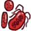

# 血疫  
> 视野一片血色，在一切还来得及之前..  
  

<b>基础值: </b> 0 
  

<b>变化范围: </b> 0 ~ 1000 
  

<b>基础变化率: </b> 无 
  
  
## 阶段  

<table><tr style="height:2em;"><td style="background-color:#F0F0F0;text-align:center;width:180px;font-size:1.4em;font-weight:bold;vertical-align:middle;">
1 ～ 250

0% ～ 25%
</td><td colspan=2 style="font-size:1.1em;vertical-align:middle;background-color:#F9F9F9;">
<b>

轻度感染</b>

&nbsp;&nbsp;感觉自己开始发烧了..
</td></tr><tr><td colspan=2><b>影响：</b>[

[情绪](Morale.md)](Morale.md)加成<b>-0.25</b>, [

[压力](Stress.md)](Stress.md)加成<b>+0.25</b>, [

[世界观](Structure.md)](Structure.md)加成<b>-0.25</b>, [

[发烧](Fever.md)](Fever.md)加成<b>+12.5</b>, [

[饱食](Satiation.md)](Satiation.md)加成<b>-0.25</b>, [

[体重](Weight.md)](Weight.md)加成<b>-0.25</b></td></tr><tr><td colspan=2></td></tr><tr style="height:2em;"><td style="background-color:#F0F0F0;text-align:center;width:180px;font-size:1.4em;font-weight:bold;vertical-align:middle;">
251 ～ 500

25% ～ 50%
</td><td colspan=2 style="font-size:1.1em;vertical-align:middle;background-color:#F9F9F9;">
<b>

中度感染</b>

&nbsp;&nbsp;全身感觉没有力气..
</td></tr><tr><td colspan=2><b>影响：</b>[

[情绪](Morale.md)](Morale.md)加成<b>-0.5</b>, [

[压力](Stress.md)](Stress.md)加成<b>+0.5</b>, [

[世界观](Structure.md)](Structure.md)加成<b>-0.5</b>, [

[发烧](Fever.md)](Fever.md)加成<b>+17.5</b>, [

[饱食](Satiation.md)](Satiation.md)加成<b>-0.5</b>, [

[体重](Weight.md)](Weight.md)加成<b>-0.5</b>, [

[血疫](cod_Gs_Ruins_BloodPlague.md)](cod_Gs_Ruins_BloodPlague.md)加成<b>+0.25</b></td></tr><tr><td colspan=2></td></tr><tr style="height:2em;"><td style="background-color:#F0F0F0;text-align:center;width:180px;font-size:1.4em;font-weight:bold;vertical-align:middle;">
501 ～ 750

50% ～ 75%
</td><td colspan=2 style="font-size:1.1em;vertical-align:middle;background-color:#F9F9F9;">
<b>

高度感染</b>

&nbsp;&nbsp;咳咳咳...
</td></tr><tr><td colspan=2><b>影响：</b>[

[精神失常](MindState.md)](MindState.md)加成<b>+0.5</b>, [

[情绪](Morale.md)](Morale.md)加成<b>-0.75</b>, [

[压力](Stress.md)](Stress.md)加成<b>+0.75</b>, [

[世界观](Structure.md)](Structure.md)加成<b>-0.75</b>, [

[发烧](Fever.md)](Fever.md)加成<b>+22.5</b>, [

[饱食](Satiation.md)](Satiation.md)加成<b>-0.75</b>, [

[体重](Weight.md)](Weight.md)加成<b>-0.75</b>, [

[血疫](cod_Gs_Ruins_BloodPlague.md)](cod_Gs_Ruins_BloodPlague.md)加成<b>+0.5</b></td></tr><tr><td colspan=2></td></tr><tr style="height:2em;"><td style="background-color:#F0F0F0;text-align:center;width:180px;font-size:1.4em;font-weight:bold;vertical-align:middle;">
751 ～ 999

75% ～ 99%
</td><td colspan=2 style="font-size:1.1em;vertical-align:middle;background-color:#F9F9F9;">
<b>

重度感染</b>

&nbsp;&nbsp;身体在燃烧！
</td></tr><tr><td colspan=2><b>影响：</b>[

[情绪](Morale.md)](Morale.md)加成<b>-1</b>, [

[压力](Stress.md)](Stress.md)加成<b>+1</b>, [

[世界观](Structure.md)](Structure.md)加成<b>-1</b>, [

[发烧](Fever.md)](Fever.md)加成<b>+27.5</b>, [

[饱食](Satiation.md)](Satiation.md)加成<b>-1</b>, [

[体重](Weight.md)](Weight.md)加成<b>-1</b>, [

[血疫](cod_Gs_Ruins_BloodPlague.md)](cod_Gs_Ruins_BloodPlague.md)加成<b>+0.75</b></td></tr><tr><td colspan=2></td></tr><tr style="height:2em;"><td style="background-color:#F0F0F0;text-align:center;width:180px;font-size:1.4em;font-weight:bold;vertical-align:middle;">
1000

100%
</td><td colspan=2 style="font-size:1.1em;vertical-align:middle;background-color:#F9F9F9;">
<b>僵尸化</b>

</td></tr><tr><td colspan=2></td></tr></table>
  
  
## 相关卡牌  
[血清](cod_Gs_Antidote.md)  
  
## 加成值影响因素  
<table class="table table-bordered" data-toggle="table"  ><thead style=""><tr ><th  style="text-align:left;vertical-align:top;"  >来源</th><th  style="text-align:left;vertical-align:top;"  >操作</th><th  style="text-align:left;vertical-align:top;"  >值</th></tr></thead><tr ><td  style="text-align:left;vertical-align:top;"  >[血雾(梅西百货)](cod_Nc_BloodHeart_BloodMist.md)</td><td  style="text-align:left;vertical-align:top;"  >被动效果</td><td  style="text-align:left;vertical-align:top;"  >加成+1</td></tr></tbody></table>  
  
  
## 可被以下操作改变  
<table class="table table-bordered" data-toggle="table"  ><thead style=""><tr ><th  style="text-align:left;vertical-align:top;"  >来源</th><th  style="text-align:left;vertical-align:top;"  >操作</th><th  style="text-align:left;vertical-align:top;"  data-sortable="true"  >值</th></tr></thead><tr ><td  style="text-align:left;vertical-align:top;"  >[

[爆发(事件)](cod_Event_BloodHeart_BloodBoom.md)](cod_Event_BloodHeart_BloodBoom.md)</td><td  style="text-align:left;vertical-align:top;"  >咳咳咳..</td><td  style="text-align:left;vertical-align:top;"  >96</td></tr><tr ><td  style="text-align:left;vertical-align:top;"  >[

[血疫(事件)](cod_Event_BloodHeart_Death.md)](cod_Event_BloodHeart_Death.md)</td><td  style="text-align:left;vertical-align:top;"  >咳咳咳..</td><td  style="text-align:left;vertical-align:top;"  >96</td></tr></tbody></table>  
  

