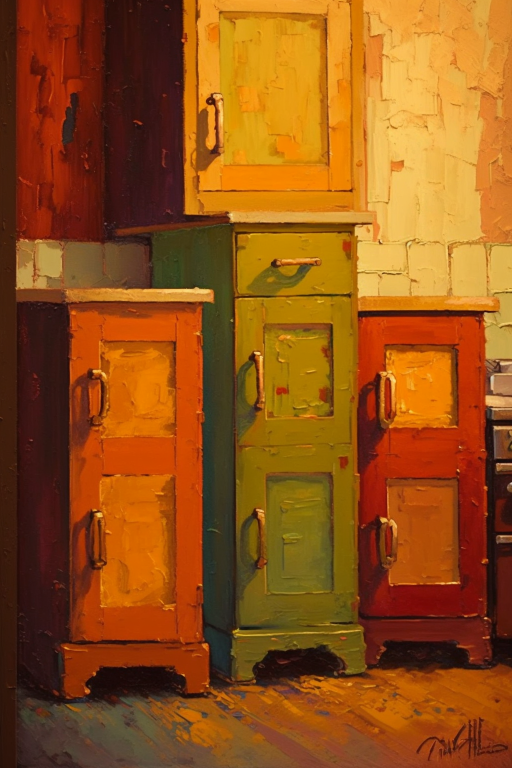

# 开锁  
> 对于各类锁具解法的技术程度。  
  

<b>基础值: </b> 0 
  

<b>变化范围: </b> 0 ~ 150 
  

<b>基础变化率: </b> 无 
  
## 可被以下操作改变  
<table class="table table-bordered" data-toggle="table"  ><thead style=""><tr ><th  style="text-align:left;vertical-align:top;"  >来源</th><th  style="text-align:left;vertical-align:top;"  >操作</th><th  style="text-align:left;vertical-align:top;"  data-sortable="true"  >值</th></tr></thead><tr ><td  style="text-align:left;vertical-align:top;"  >[

[铁箱(破败轮船)](cod_Nc_ScavengingSupplies_Location_Box_TypeOne.md)](cod_Nc_ScavengingSupplies_Location_Box_TypeOne.md)</td><td  style="text-align:left;vertical-align:top;"  >解锁 ** 拖入：**[骨针](BoneNeedle.md) , [铜针](CopperNeedle.md) , [木针](WoodenNeedle.md)</td><td  style="text-align:left;vertical-align:top;"  >0.5</td></tr><tr ><td  style="text-align:left;vertical-align:top;"  >[

[铁箱](cod_Nc_ScavengingSupplies_Location_Box_TypeThree.md)](cod_Nc_ScavengingSupplies_Location_Box_TypeThree.md)</td><td  style="text-align:left;vertical-align:top;"  >解锁 ** 拖入：**[骨针](BoneNeedle.md) , [铜针](CopperNeedle.md) , [木针](WoodenNeedle.md)</td><td  style="text-align:left;vertical-align:top;"  >0.5</td></tr><tr ><td  style="text-align:left;vertical-align:top;"  >[

[铁箱](cod_Nc_ScavengingSupplies_Location_Box_TypeTwo.md)](cod_Nc_ScavengingSupplies_Location_Box_TypeTwo.md)</td><td  style="text-align:left;vertical-align:top;"  >解锁 ** 拖入：**[骨针](BoneNeedle.md) , [铜针](CopperNeedle.md) , [木针](WoodenNeedle.md)</td><td  style="text-align:left;vertical-align:top;"  >0.5</td></tr><tr ><td  style="text-align:left;vertical-align:top;"  >[

[铁柜](cod_Nc_ScavengingSupplies_Location_Cabinet_TypeOne.md)](cod_Nc_ScavengingSupplies_Location_Cabinet_TypeOne.md)</td><td  style="text-align:left;vertical-align:top;"  >解锁 ** 拖入：**[骨针](BoneNeedle.md) , [铜针](CopperNeedle.md) , [木针](WoodenNeedle.md)</td><td  style="text-align:left;vertical-align:top;"  >0.5</td></tr><tr ><td  style="text-align:left;vertical-align:top;"  >[

[铁柜](cod_Nc_ScavengingSupplies_Location_Cabinet_TypeThree.md)](cod_Nc_ScavengingSupplies_Location_Cabinet_TypeThree.md)</td><td  style="text-align:left;vertical-align:top;"  >解锁 ** 拖入：**[骨针](BoneNeedle.md) , [铜针](CopperNeedle.md) , [木针](WoodenNeedle.md)</td><td  style="text-align:left;vertical-align:top;"  >0.5</td></tr><tr ><td  style="text-align:left;vertical-align:top;"  >[

[铁柜](cod_Nc_ScavengingSupplies_Location_Cabinet_TypeTwo.md)](cod_Nc_ScavengingSupplies_Location_Cabinet_TypeTwo.md)</td><td  style="text-align:left;vertical-align:top;"  >解锁 ** 拖入：**[骨针](BoneNeedle.md) , [铜针](CopperNeedle.md) , [木针](WoodenNeedle.md)</td><td  style="text-align:left;vertical-align:top;"  >0.5</td></tr></tbody></table>  
  
## 被以下操作需求  
<table class="table table-bordered" data-toggle="table"  ><thead style=""><tr ><th  style="text-align:left;vertical-align:top;"  >来源</th><th  style="text-align:left;vertical-align:top;"  >操作</th><th  style="text-align:left;vertical-align:top;"  data-sortable="true"  >值</th></tr></thead><tr ><td  style="text-align:left;vertical-align:top;"  >[铁箱(破败轮船)](cod_Nc_ScavengingSupplies_Location_Box_TypeOne.md)</td><td  style="text-align:left;vertical-align:top;"  >影响</td><td  style="text-align:left;vertical-align:top;"  >1 ~ 150</td></tr><tr ><td  style="text-align:left;vertical-align:top;"  >[铁箱](cod_Nc_ScavengingSupplies_Location_Box_TypeThree.md)</td><td  style="text-align:left;vertical-align:top;"  >影响</td><td  style="text-align:left;vertical-align:top;"  >1 ~ 150</td></tr><tr ><td  style="text-align:left;vertical-align:top;"  >[铁箱](cod_Nc_ScavengingSupplies_Location_Box_TypeTwo.md)</td><td  style="text-align:left;vertical-align:top;"  >影响</td><td  style="text-align:left;vertical-align:top;"  >1 ~ 150</td></tr><tr ><td  style="text-align:left;vertical-align:top;"  >[铁柜](cod_Nc_ScavengingSupplies_Location_Cabinet_TypeOne.md)</td><td  style="text-align:left;vertical-align:top;"  >影响</td><td  style="text-align:left;vertical-align:top;"  >1 ~ 150</td></tr><tr ><td  style="text-align:left;vertical-align:top;"  >[铁柜](cod_Nc_ScavengingSupplies_Location_Cabinet_TypeThree.md)</td><td  style="text-align:left;vertical-align:top;"  >影响</td><td  style="text-align:left;vertical-align:top;"  >1 ~ 150</td></tr><tr ><td  style="text-align:left;vertical-align:top;"  >[铁柜](cod_Nc_ScavengingSupplies_Location_Cabinet_TypeTwo.md)</td><td  style="text-align:left;vertical-align:top;"  >影响</td><td  style="text-align:left;vertical-align:top;"  >1 ~ 150</td></tr></tbody></table>  
  

