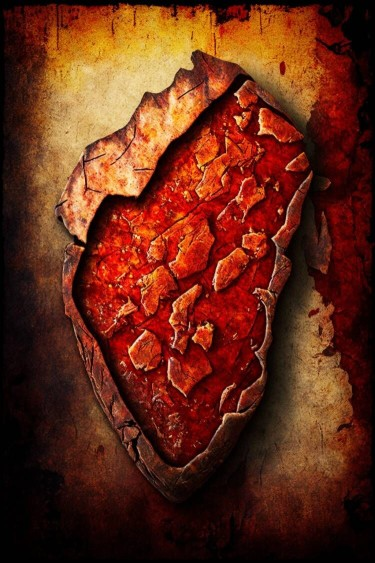

# 血疫样本(COD-废城)  
> 从各类特殊感染生物上取下的样本...呃..  
  
<table class="table table-bordered" data-toggle="table"  data-show-header="false"><thead style="display:none"><tr ><th  style="width:50%;text-align:left;vertical-align:top;"  >title</th><th  style="width:50%;text-align:left;vertical-align:top;"  ></th></tr></thead><tr ><td  style="width:50%;text-align:left;vertical-align:top;"  >**重量：**150  **标签：**	[“沉重的”](tag_Heavy.md), [“美丽的/好看的”](tag_Pretty.md), </td><td  style="width:50%;text-align:left;vertical-align:top;"  >

<a href="cod_Nc_BloodHeart_BloodPlagueSamples.md" style="color:black">血疫样本</a>

</td></tr></tbody></table>  
  
## 获取来源  

挖开..

[残骸](cod_Nc_BloodHeart_Death.md)

  
  

