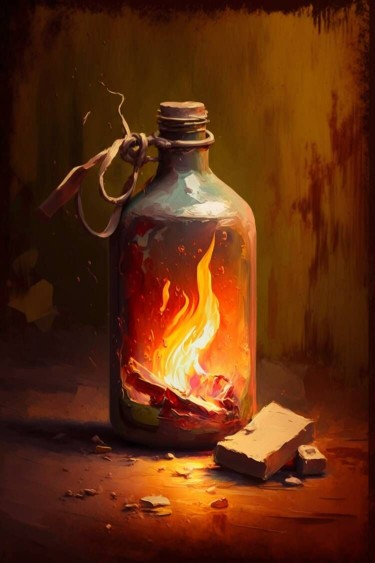

# 燃烧瓶(COD-废城)  
> 简易制作的燃烧瓶。  
  
<table class="table table-bordered" data-toggle="table"  data-show-header="false"><thead style="display:none"><tr ><th  style="width:50%;text-align:left;vertical-align:top;"  >title</th><th  style="width:50%;text-align:left;vertical-align:top;"  ></th></tr></thead><tr ><td  style="width:50%;text-align:left;vertical-align:top;"  >**重量：**100  **标签：**	[“美丽的/好看的”](tag_Pretty.md)</td><td  style="width:50%;text-align:left;vertical-align:top;"  >

<a href="cod_Nc_IncendiaryBottle.md" style="color:black">燃烧瓶</a>

</td></tr></tbody></table>  
  
## 获取来源  

蓝图制造

[燃烧瓶(蓝图)](cod_Bp_IncendiaryBottle.md)

蓝图制造

[燃烧瓶组(蓝图)](cod_Bp_IncendiaryBottle_TypeTwo.md)

  
  
## 可拖入  

<table style="margin-bottom:0px;"><tr><td style="width:40%;text-align:left; background-color:#FEFEFE"><b>拖入：</b>[“火源”](tag_FireSource.md)</td><td style="width:40%;font-size:1em;font-weight:bold;background-color:#FEFEFE">点燃  </td></tr><tr style="background-color:#FFFFFF"><td style=""><b>使用物：</b></td><td style=""><b>自身：</b>→ [

[燃烧瓶（点燃）](cod_Nc_IncendiaryBottle_Fire.md)](cod_Nc_IncendiaryBottle_Fire.md)</td></tr></table>
  
  

