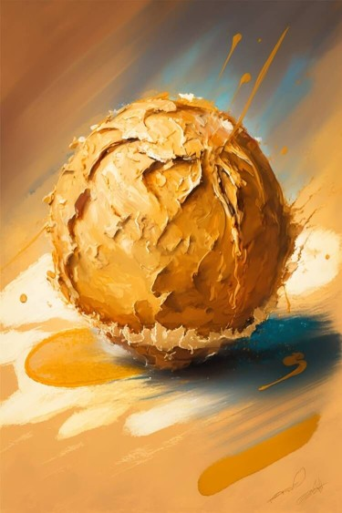
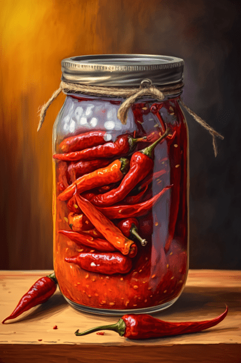
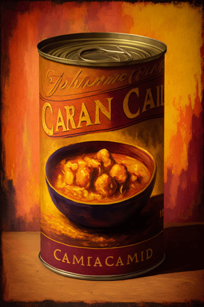

# 包囊(COD-废城)  
> 一大袋被人为密封的物资，分量很重。  
  
<table class="table table-bordered" data-toggle="table"  data-show-header="false"><thead style="display:none"><tr ><th  style="width:50%;text-align:left;vertical-align:top;"  >title</th><th  style="width:50%;text-align:left;vertical-align:top;"  ></th></tr></thead><tr ><td  style="width:50%;text-align:left;vertical-align:top;"  >**重量：**500  **标签：**	[“沉重的”](tag_Heavy.md), [“美丽的/好看的”](tag_Pretty.md)</td><td  style="width:50%;text-align:left;vertical-align:top;"  >

<a href="cod_Nc_ScavengingSupplies_FoodWrapping.md" style="color:black">包囊</a>

</td></tr></tbody></table>  
  
## 获取来源  

探索

[锯木厂(废弃锯木厂)](cod_Exp_锯木厂.md)

打开

[铁箱(废弃锯木厂)](cod_Nc_ScavengingSupplies_Location_Box_TypeOne.md)

打开

[铁箱](cod_Nc_ScavengingSupplies_Location_Box_TypeThree.md)

打开

[铁箱](cod_Nc_ScavengingSupplies_Location_Box_TypeTwo.md)

搜刮

[支架](cod_Nc_ScavengingSupplies_Location_Brackets_TypeFive.md)

搜刮

[支架](cod_Nc_ScavengingSupplies_Location_Brackets_TypeFour.md)

搜刮

[支架](cod_Nc_ScavengingSupplies_Location_Brackets_TypeOne.md)

搜刮

[支架](cod_Nc_ScavengingSupplies_Location_Brackets_TypeThree.md)

搜刮

[支架](cod_Nc_ScavengingSupplies_Location_Brackets_TypeTwo.md)

打开

[铁柜](cod_Nc_ScavengingSupplies_Location_Cabinet_TypeOne.md)

打开

[铁柜](cod_Nc_ScavengingSupplies_Location_Cabinet_TypeThree.md)

打开

[铁柜](cod_Nc_ScavengingSupplies_Location_Cabinet_TypeTwo.md)

搜刮

[物品堆](cod_Nc_ScavengingSupplies_Location_PileItems_TypeFive.md)

搜刮

[物品堆](cod_Nc_ScavengingSupplies_Location_PileItems_TypeFour.md)

搜刮

[物品堆](cod_Nc_ScavengingSupplies_Location_PileItems_TypeOne.md)

搜刮

[物品堆](cod_Nc_ScavengingSupplies_Location_PileItems_TypeThree.md)

搜刮

[物品堆](cod_Nc_ScavengingSupplies_Location_PileItems_TypeTwo.md)

打开

[巨大包囊](cod_Nc_ScavengingSupplies_WrappingBag.md)

打开

[巨大包囊](cod_Nc_ScavengingSupplies_WrappingBag_Random.md)

搜刮

[设施](cod_Nc_Macy_ExploreScene_TypeEight.md)

搜刮

[设施](cod_Nc_Macy_ExploreScene_TypeFive.md)

搜刮

[设施](cod_Nc_Macy_ExploreScene_TypeFour.md)

搜刮

[设施](cod_Nc_Macy_ExploreScene_TypeNine.md)

搜刮

[设施](cod_Nc_Macy_ExploreScene_TypeOne.md)

搜刮

[设施](cod_Nc_Macy_ExploreScene_TypeSeven.md)

搜刮

[设施](cod_Nc_Macy_ExploreScene_TypeSix.md)

搜刮

[设施](cod_Nc_Macy_ExploreScene_TypeTen.md)

搜刮

[设施](cod_Nc_Macy_ExploreScene_TypeThree.md)

搜刮

[设施](cod_Nc_Macy_ExploreScene_TypeTwo.md)

搜刮

[货架(梅西百货)](cod_Nc_Macy_GoodsShelves_TypeFour.md)

搜刮

[货架(梅西百货)](cod_Nc_Macy_GoodsShelves_TypeOne.md)

搜刮

[货架(梅西百货)](cod_Nc_Macy_GoodsShelves_TypeThree.md)

搜刮

[货架(梅西百货)](cod_Nc_Macy_GoodsShelves_TypeTwo.md)

探索

[维生(饭馆)](cod_Exp_Pharmacy.md)

挖开..

[残骸](cod_Nc_BloodHeart_Death.md)

  
  
## 动作  

<table><tr><td rowspan="2" style="width:200px;text-align:center;font-size:1.3em;font-weight:bold">

取出

3分

</td><td></td></tr><tr><td><b>自身：</b>特殊1  <b>-1(-50%)</b></td></tr><tr><td colspan="2">

<table style="margin-bottom:3px;"><tr><td rowspan=2 style="text-align:center" width="80px">
基础权重

1
</td><td style="font-size:0.6em;line-height:0.6em;font-weight:bold">ScavengingSupplies_TypeOne</td></tr><tr><td>[

[糖果](cod_Nc_ScavengingSupplies_Food_Suger_TypeOne.md)](cod_Nc_ScavengingSupplies_Food_Suger_TypeOne.md)(<b>+0～+1</b>), [

[糖果](cod_Nc_ScavengingSupplies_Food_Suger_TypeThree.md)](cod_Nc_ScavengingSupplies_Food_Suger_TypeThree.md)(<b>+0～+1</b>), [

[糖果](cod_Nc_ScavengingSupplies_Food_Suger_TypeFour.md)](cod_Nc_ScavengingSupplies_Food_Suger_TypeFour.md)(<b>+0～+1</b>), [

[糖果](cod_Nc_ScavengingSupplies_Food_Suger_TypeFive.md)](cod_Nc_ScavengingSupplies_Food_Suger_TypeFive.md)(<b>+0～+1</b>), [

[金蒂](cod_Nc_ScavengingSupplies_Food_Suger_TypeTwo.md)](cod_Nc_ScavengingSupplies_Food_Suger_TypeTwo.md)(<b>+0～+1</b>)</td></tr></table>

<table style="margin-bottom:3px;"><tr><td rowspan=2 style="text-align:center" width="80px">
基础权重

1
</td><td style="font-size:0.6em;line-height:0.6em;font-weight:bold">ScavengingSupplies_TypeThree</td></tr><tr><td>[

[莱斯蘑菇](cod_Nc_ScavengingSupplies_Food_CannedGood_TypeSix.md)](cod_Nc_ScavengingSupplies_Food_CannedGood_TypeSix.md)(<b>+0～+1</b>), [

[冰原虾品](cod_Nc_ScavengingSupplies_Food_CannedGood_TypeSeven.md)](cod_Nc_ScavengingSupplies_Food_CannedGood_TypeSeven.md)(<b>+0～+1</b>), [

[罐装蛋](cod_Nc_ScavengingSupplies_Food_CannedGood_TypeEight.md)](cod_Nc_ScavengingSupplies_Food_CannedGood_TypeEight.md)(<b>+0～+1</b>), [

[罐装辣椒](cod_Nc_ScavengingSupplies_Food_CannedGood_TypeNine.md)](cod_Nc_ScavengingSupplies_Food_CannedGood_TypeNine.md)(<b>+0～+1</b>), [

[罐装香蕉片](cod_Nc_ScavengingSupplies_Food_CannedGood_TypeTen.md)](cod_Nc_ScavengingSupplies_Food_CannedGood_TypeTen.md)(<b>+0～+1</b>)</td></tr></table>

<table style="margin-bottom:3px;"><tr><td rowspan=2 style="text-align:center" width="80px">
基础权重

1
</td><td style="font-size:0.6em;line-height:0.6em;font-weight:bold">ScavengingSupplies_TypeFour</td></tr><tr><td>[

[午餐肉罐头](cod_Nc_ScavengingSupplies_Food_CannedGood_TypeEleven.md)](cod_Nc_ScavengingSupplies_Food_CannedGood_TypeEleven.md)(<b>+0～+1</b>), [

[咖喱罐头](cod_Nc_ScavengingSupplies_Food_CannedGood_TypeTwelve.md)](cod_Nc_ScavengingSupplies_Food_CannedGood_TypeTwelve.md)(<b>+0～+1</b>), [

[大马哈鱼罐头](cod_Nc_ScavengingSupplies_Food_CannedGood_TypeThirteen.md)](cod_Nc_ScavengingSupplies_Food_CannedGood_TypeThirteen.md)(<b>+0～+1</b>), [

[椰子罐头](cod_Nc_ScavengingSupplies_Food_CannedGood_TypeFourteen.md)](cod_Nc_ScavengingSupplies_Food_CannedGood_TypeFourteen.md)(<b>+0～+1</b>), [

[陈旧的狗粮罐头](cod_Nc_ScavengingSupplies_Food_CannedGood_TypeFivteen.md)](cod_Nc_ScavengingSupplies_Food_CannedGood_TypeFivteen.md)(<b>+0～+1</b>)</td></tr></table>

<table style="margin-bottom:3px;"><tr><td rowspan=2 style="text-align:center" width="80px">
基础权重

1
</td><td style="font-size:0.6em;line-height:0.6em;font-weight:bold">ScavengingSupplies_TypeFive</td></tr><tr><td>[

[猪肉罐头](cod_Nc_ScavengingSupplies_Food_CannedGood_TypeSixteen.md)](cod_Nc_ScavengingSupplies_Food_CannedGood_TypeSixteen.md)(<b>+0～+1</b>), [

[豆子罐头](cod_Nc_ScavengingSupplies_Food_CannedGood_TypeSeventeen.md)](cod_Nc_ScavengingSupplies_Food_CannedGood_TypeSeventeen.md)(<b>+0～+1</b>), [

[金枪鱼罐头](cod_Nc_ScavengingSupplies_Food_CannedGood_TypeEighteen.md)](cod_Nc_ScavengingSupplies_Food_CannedGood_TypeEighteen.md)(<b>+0～+1</b>), [

[香蕉罐头](cod_Nc_ScavengingSupplies_Food_CannedGood_TypeTwenty.md)](cod_Nc_ScavengingSupplies_Food_CannedGood_TypeTwenty.md)(<b>+0～+1</b>), [

[罐装辣椒](cod_Nc_ScavengingSupplies_Food_CannedGood_TypeNine.md)](cod_Nc_ScavengingSupplies_Food_CannedGood_TypeNine.md)(<b>+0～+1</b>)</td></tr></table>

</td></tr></table>
  
  
  
## 属性   

<table style="margin-bottom:0px;"><tr><td style="width:30%;text-align:left; background-color:#FEFEFE;font-size:1.3em;font-weight:bold;">特殊1</td><td style="font-size:1em;background-color:#FEFEFE">初始：2 , 最大：2 -</td></tr><tr style="background-color:#FFFFFF"><td colspan=2>** 到达0时： ** 自身: →消失</td></tr></table>
  

