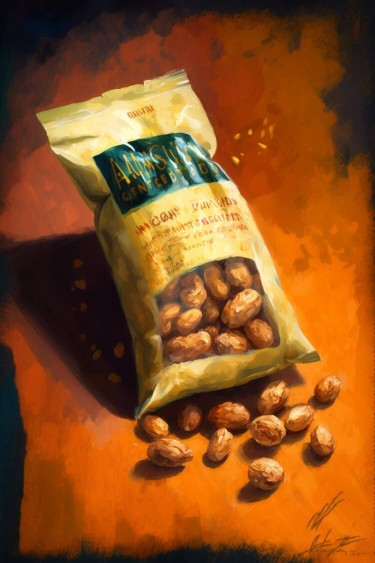

# 袋装食品(COD-废城)  
> 满满一大袋食品。  
  
<table class="table table-bordered" data-toggle="table"  data-show-header="false"><thead style="display:none"><tr ><th  style="width:50%;text-align:left;vertical-align:top;"  >title</th><th  style="width:50%;text-align:left;vertical-align:top;"  ></th></tr></thead><tr ><td  style="width:50%;text-align:left;vertical-align:top;"  >**重量：**250  **标签：**	[“可烹饪的”](tag_Cookable.md), [“杂食饲料”](tag_FeedOmnivorous.md), [“喂食（草食动物）”](tag_FeedHerb.md), [“饲料”](tag_Feed.md), [“人类食物”](tag_HumanFood.md), [“中糖分”](tag_SugarsMedium.md), </td><td  style="width:50%;text-align:left;vertical-align:top;"  >

<a href="cod_Nc_ScavengingSupplies_Food_BaggedFood_TypeFour.md" style="color:black">袋装食品</a>

</td></tr></tbody></table>  
  
## 获取来源  

搜刮

[设施](cod_Nc_Macy_ExploreScene_TypeEight.md)

搜刮

[设施](cod_Nc_Macy_ExploreScene_TypeFive.md)

搜刮

[设施](cod_Nc_Macy_ExploreScene_TypeFour.md)

搜刮

[设施](cod_Nc_Macy_ExploreScene_TypeNine.md)

搜刮

[设施](cod_Nc_Macy_ExploreScene_TypeOne.md)

搜刮

[设施](cod_Nc_Macy_ExploreScene_TypeSeven.md)

搜刮

[设施](cod_Nc_Macy_ExploreScene_TypeSix.md)

搜刮

[设施](cod_Nc_Macy_ExploreScene_TypeTen.md)

搜刮

[设施](cod_Nc_Macy_ExploreScene_TypeThree.md)

搜刮

[设施](cod_Nc_Macy_ExploreScene_TypeTwo.md)

搜刮

[货架(梅西百货)](cod_Nc_Macy_GoodsShelves_TypeFour.md)

搜刮

[货架(梅西百货)](cod_Nc_Macy_GoodsShelves_TypeOne.md)

搜刮

[货架(梅西百货)](cod_Nc_Macy_GoodsShelves_TypeThree.md)

搜刮

[货架(梅西百货)](cod_Nc_Macy_GoodsShelves_TypeTwo.md)

  
  
## 动作  

<table><tr><td rowspan="2" style="width:200px;text-align:center;font-size:1.3em;font-weight:bold">

食用

3分

</td><td>[“进食动作(组)”](EatingAction.md)</td></tr><tr><td><b>自身：</b>特殊1  <b>-1(-20%)</b></td></tr><tr><td colspan="2"><b>状态变化：</b>[

[饱食](Satiation.md)](Satiation.md)<b>+10</b>, [

[胃](Stomach.md)](Stomach.md)<b>+5</b>, [

[水分](Hydration.md)](Hydration.md), [

[压力](Stress.md)](Stress.md)<b>-15</b>, [

[情绪](Morale.md)](Morale.md)<b>+5</b>, [

[污垢](Filth.md)](Filth.md), [

[世界观](Structure.md)](Structure.md)<b>+10</b>, [

[体重](Weight.md)](Weight.md)<b>+5</b></td></tr></table>
  
  
  
## 属性   

<table style="margin-bottom:0px;"><tr><td style="width:30%;text-align:left; background-color:#FEFEFE;font-size:1.3em;font-weight:bold;">特殊1</td><td style="font-size:1em;background-color:#FEFEFE">初始：5 , 最大：5 -</td></tr><tr style="background-color:#FFFFFF"><td colspan=2>** 到达0时： ** 自身: →消失</td></tr></table>
  

