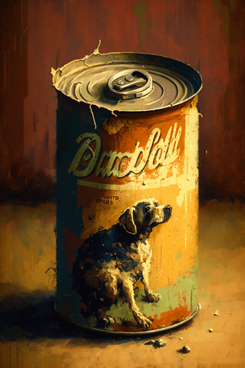
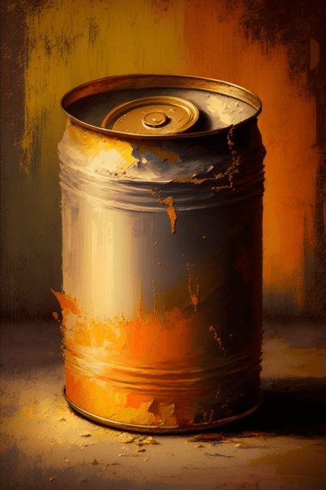

# 陈旧的狗粮罐头(COD-废城)  
> 一罐陈旧的狗粮罐头，但是还能吃  
  
<table class="table table-bordered" data-toggle="table"  data-show-header="false"><thead style="display:none"><tr ><th  style="width:50%;text-align:left;vertical-align:top;"  >title</th><th  style="width:50%;text-align:left;vertical-align:top;"  ></th></tr></thead><tr ><td  style="width:50%;text-align:left;vertical-align:top;"  >**重量：**150  **标签：**	</td><td  style="width:50%;text-align:left;vertical-align:top;"  >

<a href="cod_Nc_ScavengingSupplies_Food_CannedGood_TypeFivteen.md" style="color:black">陈旧的狗粮罐头</a>

</td></tr></tbody></table>  
  
## 获取来源  

取出

[包囊](cod_Nc_ScavengingSupplies_FoodWrapping.md)

打开

[铁箱(废弃锯木厂)](cod_Nc_ScavengingSupplies_Location_Box_TypeOne.md)

打开

[铁箱](cod_Nc_ScavengingSupplies_Location_Box_TypeThree.md)

打开

[铁箱](cod_Nc_ScavengingSupplies_Location_Box_TypeTwo.md)

搜刮

[支架](cod_Nc_ScavengingSupplies_Location_Brackets_TypeFive.md)

搜刮

[支架](cod_Nc_ScavengingSupplies_Location_Brackets_TypeFour.md)

搜刮

[支架](cod_Nc_ScavengingSupplies_Location_Brackets_TypeOne.md)

打开

[铁柜](cod_Nc_ScavengingSupplies_Location_Cabinet_TypeOne.md)

打开

[铁柜](cod_Nc_ScavengingSupplies_Location_Cabinet_TypeThree.md)

打开

[铁柜](cod_Nc_ScavengingSupplies_Location_Cabinet_TypeTwo.md)

搜刮

[物品堆](cod_Nc_ScavengingSupplies_Location_PileItems_TypeFive.md)

搜刮

[物品堆](cod_Nc_ScavengingSupplies_Location_PileItems_TypeFour.md)

搜刮

[物品堆](cod_Nc_ScavengingSupplies_Location_PileItems_TypeOne.md)

搜刮

[物品堆](cod_Nc_ScavengingSupplies_Location_PileItems_TypeThree.md)

搜刮

[物品堆](cod_Nc_ScavengingSupplies_Location_PileItems_TypeTwo.md)

搜刮

[设施](cod_Nc_Macy_ExploreScene_TypeEight.md)

搜刮

[设施](cod_Nc_Macy_ExploreScene_TypeFive.md)

搜刮

[设施](cod_Nc_Macy_ExploreScene_TypeFour.md)

搜刮

[设施](cod_Nc_Macy_ExploreScene_TypeNine.md)

搜刮

[设施](cod_Nc_Macy_ExploreScene_TypeOne.md)

搜刮

[设施](cod_Nc_Macy_ExploreScene_TypeSeven.md)

搜刮

[设施](cod_Nc_Macy_ExploreScene_TypeSix.md)

搜刮

[设施](cod_Nc_Macy_ExploreScene_TypeTen.md)

搜刮

[设施](cod_Nc_Macy_ExploreScene_TypeThree.md)

搜刮

[设施](cod_Nc_Macy_ExploreScene_TypeTwo.md)

搜刮

[货架(梅西百货)](cod_Nc_Macy_GoodsShelves_TypeFour.md)

搜刮

[货架(梅西百货)](cod_Nc_Macy_GoodsShelves_TypeOne.md)

搜刮

[货架(梅西百货)](cod_Nc_Macy_GoodsShelves_TypeThree.md)

搜刮

[货架(梅西百货)](cod_Nc_Macy_GoodsShelves_TypeTwo.md)

挖开..

[残骸](cod_Nc_BloodHeart_Death.md)

  
  
## 动作  

<table><tr><td rowspan="2" style="width:200px;text-align:center;font-size:1.3em;font-weight:bold">

Eat

15分

</td><td>[“进食动作(组)”](EatingAction.md)</td></tr><tr><td><b>自身：</b>→ [

[空锡罐](cod_空锡罐.md)](cod_空锡罐.md)</td></tr><tr><td colspan="2"><b>状态变化：</b>[

[饱食](Satiation.md)](Satiation.md)<b>+25</b>, [

[胃](Stomach.md)](Stomach.md)<b>+10</b>, [

[水分](Hydration.md)](Hydration.md)<b>+5</b>, [

[情绪](Morale.md)](Morale.md)<b>-15</b>, [

[干粮<nobr>厌倦度</nobr>](SaturationRations.md)](SaturationRations.md)<b>+45</b></td></tr></table>
  
  
  

