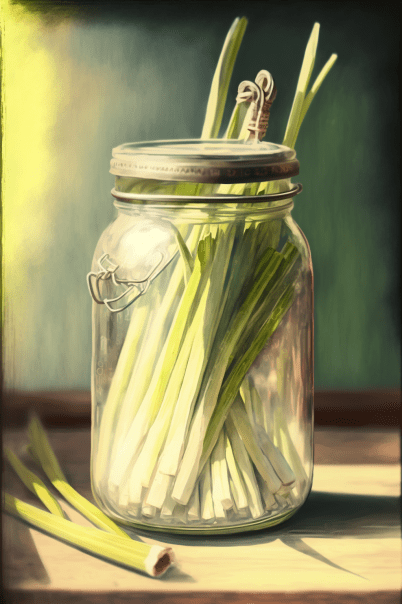

# 世家草本(COD-废城)  
> 入口时传来舌尖的清新，酸涩中带着薄荷的感觉。  
  
<table class="table table-bordered" data-toggle="table"  data-show-header="false"><thead style="display:none"><tr ><th  style="width:50%;text-align:left;vertical-align:top;"  >title</th><th  style="width:50%;text-align:left;vertical-align:top;"  ></th></tr></thead><tr ><td  style="width:50%;text-align:left;vertical-align:top;"  >**重量：**250  **标签：**	[“可烹饪的”](tag_Cookable.md), [“已烹饪的”](tag_MealCookingpot.md), [“可加盐。”](tag_Saltable.md), [“可加辣椒粉。”](tag_Chilliable.md)  **可用次数：**3</td><td  style="width:50%;text-align:left;vertical-align:top;"  >

<a href="cod_Nc_ScavengingSupplies_Food_CannedGood_TypeThree.md" style="color:black">世家草本</a>

</td></tr></tbody></table>  
  
## 动作  

<table><tr><td rowspan="2" style="width:200px;text-align:center;font-size:1.3em;font-weight:bold">

Eat

3分

</td><td>[“进食动作(组)”](EatingAction.md)</td></tr><tr><td><b>自身：</b>使用次数  <b>-1</b></td></tr><tr><td colspan="2"><b>状态变化：</b>[

[饱食](Satiation.md)](Satiation.md)<b>+25</b>, [

[胃](Stomach.md)](Stomach.md)<b>+10</b>, [

[水分](Hydration.md)](Hydration.md)<b>+5</b>, [

[情绪](Morale.md)](Morale.md)<b>+25</b>, [

[蔬菜<nobr>厌倦度</nobr>](SaturationVegetables.md)](SaturationVegetables.md)<b>+15</b>, [

[污垢](Filth.md)](Filth.md)<b>+5</b>, [

[压力](Stress.md)](Stress.md)<b>-25</b></td></tr></table>
  
  
  
## 属性   

<table style="margin-bottom:0px;"><tr><td style="width:30%;text-align:left; background-color:#FEFEFE;font-size:1.3em;font-weight:bold;">使用次数</td><td style="font-size:1em;background-color:#FEFEFE">初始：3 -</td></tr><tr style="background-color:#FFFFFF"><td colspan=2>** 到达0时： ** 自身: → [

[破败轮船](cod_玻璃罐.md)](cod_玻璃罐.md)</td></tr></table>
  

