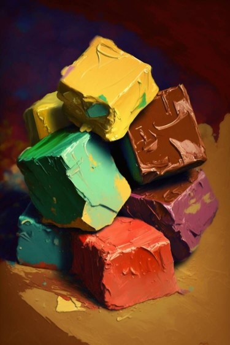

# 糖果盒(COD-废城)  
> 一大盒糖果，零散的糖果落在附近。  
  
<table class="table table-bordered" data-toggle="table"  data-show-header="false"><thead style="display:none"><tr ><th  style="width:50%;text-align:left;vertical-align:top;"  >title</th><th  style="width:50%;text-align:left;vertical-align:top;"  ></th></tr></thead><tr ><td  style="width:50%;text-align:left;vertical-align:top;"  >**重量：**1000  **标签：**	[“沉重的”](tag_Heavy.md), [“美丽的/好看的”](tag_Pretty.md), </td><td  style="width:50%;text-align:left;vertical-align:top;"  >

<a href="cod_Nc_ScavengingSupplies_Food_SugerBag_TypeThree.md" style="color:black">糖果盒</a>

</td></tr></tbody></table>  
  
## 获取来源  

搜刮

[货架(梅西百货)](cod_Nc_Macy_GoodsShelves_TypeFour.md)

搜刮

[货架(梅西百货)](cod_Nc_Macy_GoodsShelves_TypeOne.md)

搜刮

[货架(梅西百货)](cod_Nc_Macy_GoodsShelves_TypeThree.md)

搜刮

[货架(梅西百货)](cod_Nc_Macy_GoodsShelves_TypeTwo.md)

  
  
## 动作  

<table><tr><td rowspan="2" style="width:200px;text-align:center;font-size:1.3em;font-weight:bold">

取出糖果

</td><td></td></tr><tr><td><b>自身：</b>特殊1  <b>-1(-50%)</b></td></tr><tr><td colspan="2"><b>状态变化：</b>[

[情绪](Morale.md)](Morale.md)<b>+1</b></td></tr><tr><td colspan="2">

<table style="margin-bottom:3px;"><tr><td rowspan=2 style="text-align:center" width="80px">
基础权重

1
</td><td style="font-size:0.6em;line-height:0.6em;font-weight:bold">Suger_DropFive_TypeOne</td></tr><tr><td>[

[糖果](cod_Nc_ScavengingSupplies_Food_Suger_TypeOne.md)](cod_Nc_ScavengingSupplies_Food_Suger_TypeOne.md)(<b>+0～+1</b>), [

[糖果](cod_Nc_ScavengingSupplies_Food_Suger_TypeThree.md)](cod_Nc_ScavengingSupplies_Food_Suger_TypeThree.md)(<b>+0～+1</b>), [

[糖果](cod_Nc_ScavengingSupplies_Food_Suger_TypeFour.md)](cod_Nc_ScavengingSupplies_Food_Suger_TypeFour.md)(<b>+0～+1</b>), [

[糖果](cod_Nc_ScavengingSupplies_Food_Suger_TypeFive.md)](cod_Nc_ScavengingSupplies_Food_Suger_TypeFive.md)(<b>+0～+1</b>), [

[金蒂](cod_Nc_ScavengingSupplies_Food_Suger_TypeTwo.md)](cod_Nc_ScavengingSupplies_Food_Suger_TypeTwo.md)(<b>+0～+1</b>)</td></tr></table>

<table style="margin-bottom:3px;"><tr><td rowspan=2 style="text-align:center" width="80px">
基础权重

1
</td><td style="font-size:0.6em;line-height:0.6em;font-weight:bold">Suger_DropFive_TypeTwo</td></tr><tr><td>[

[童心](cod_Nc_ScavengingSupplies_Food_Suger_TypeSix.md)](cod_Nc_ScavengingSupplies_Food_Suger_TypeSix.md)(<b>+0～+1</b>), [

[童年](cod_Nc_ScavengingSupplies_Food_Suger_TypeSeven.md)](cod_Nc_ScavengingSupplies_Food_Suger_TypeSeven.md)(<b>+0～+1</b>), [

[糖果](cod_Nc_ScavengingSupplies_Food_Suger_TypeEight.md)](cod_Nc_ScavengingSupplies_Food_Suger_TypeEight.md)(<b>+0～+1</b>), [

[金蒂](cod_Nc_ScavengingSupplies_Food_Suger_TypeNine.md)](cod_Nc_ScavengingSupplies_Food_Suger_TypeNine.md)(<b>+0～+1</b>), [

[糖果](cod_Nc_ScavengingSupplies_Food_Suger_TypeTen.md)](cod_Nc_ScavengingSupplies_Food_Suger_TypeTen.md)(<b>+0～+1</b>)</td></tr></table>

</td></tr></table>
  
  
  
## 属性   

<table style="margin-bottom:0px;"><tr><td style="width:30%;text-align:left; background-color:#FEFEFE;font-size:1.3em;font-weight:bold;">特殊1</td><td style="font-size:1em;background-color:#FEFEFE">初始：2 , 最大：2 -</td></tr><tr style="background-color:#FFFFFF"><td colspan=2>** 到达0时： ** 自身: →消失</td></tr></table>
  

