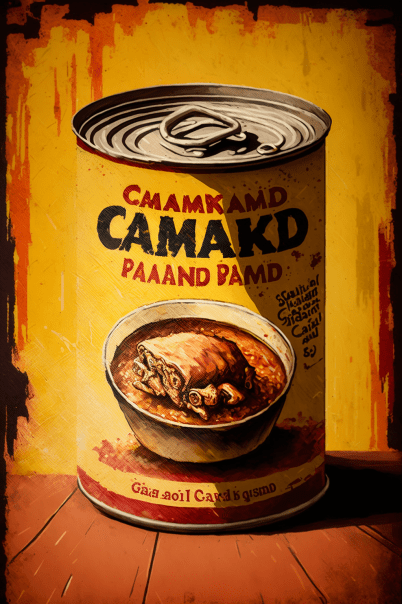
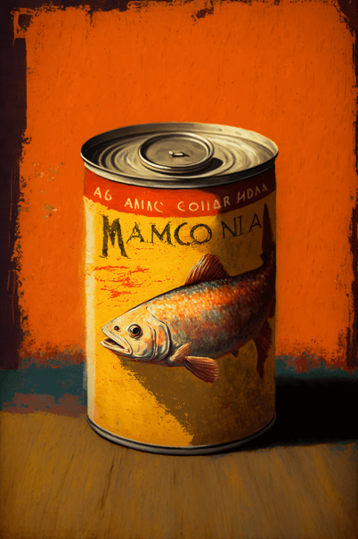
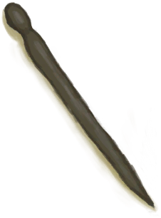
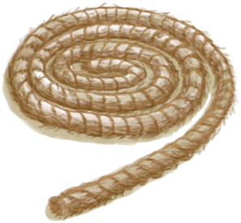

# 支架(COD-废城)  
> 可以看到有零散的物品分布。  
  
<table class="table table-bordered" data-toggle="table"  data-show-header="false"><thead style="display:none"><tr ><th  style="width:50%;text-align:left;vertical-align:top;"  >title</th><th  style="width:50%;text-align:left;vertical-align:top;"  ></th></tr></thead><tr ><td  style="width:50%;text-align:left;vertical-align:top;"  >**重量：**500  **标签：**	[“沉重的”](tag_Heavy.md), [“美丽的/好看的”](tag_Pretty.md)  **可用次数：**1</td><td  style="width:50%;text-align:left;vertical-align:top;"  >

<a href="cod_Nc_ScavengingSupplies_Location_Brackets_TypeFive.md" style="color:black">支架</a>

</td></tr></tbody></table>  
  
## 获取来源  

探索

[锯木厂(废弃锯木厂)](cod_Exp_锯木厂.md)

探索

[设施](cod_Nc_ScavengingSupplies_Location_RandomDrop.md)

探索

[维生(饭馆)](cod_Exp_Pharmacy.md)

  
  
## 动作  

<table><tr><td rowspan="2" style="width:200px;text-align:center;font-size:1.3em;font-weight:bold">

搜刮

15分

</td><td>, </td></tr><tr><td><b>自身：</b>使用次数  <b>-1(-100%)</b></td></tr><tr><td colspan="2"><b>需求：</b>使用次数: <b>1(100%)</b></td></tr><tr><td colspan="2">

<table style="margin-bottom:3px;"><tr><td rowspan=2 style="text-align:center" width="80px">
基础权重

5
</td><td style="font-size:0.6em;line-height:0.6em;font-weight:bold">YoYo</td></tr><tr><td>[

[糖果](cod_Nc_ScavengingSupplies_Food_Suger_TypeOne.md)](cod_Nc_ScavengingSupplies_Food_Suger_TypeOne.md)(<b>+0～+1</b>), [

[糖果](cod_Nc_ScavengingSupplies_Food_Suger_TypeThree.md)](cod_Nc_ScavengingSupplies_Food_Suger_TypeThree.md)(<b>+0～+1</b>), [

[糖果](cod_Nc_ScavengingSupplies_Food_Suger_TypeFour.md)](cod_Nc_ScavengingSupplies_Food_Suger_TypeFour.md)(<b>+0～+1</b>), [

[糖果](cod_Nc_ScavengingSupplies_Food_Suger_TypeFive.md)](cod_Nc_ScavengingSupplies_Food_Suger_TypeFive.md)(<b>+0～+1</b>), [

[金蒂](cod_Nc_ScavengingSupplies_Food_Suger_TypeTwo.md)](cod_Nc_ScavengingSupplies_Food_Suger_TypeTwo.md)(<b>+0～+1</b>)</td></tr></table>

<table style="margin-bottom:3px;"><tr><td rowspan=2 style="text-align:center" width="80px">
基础权重

5
</td><td style="font-size:0.6em;line-height:0.6em;font-weight:bold">YoYo</td></tr><tr><td>[

[莱斯蘑菇](cod_Nc_ScavengingSupplies_Food_CannedGood_TypeSix.md)](cod_Nc_ScavengingSupplies_Food_CannedGood_TypeSix.md)(<b>+0～+1</b>), [

[冰原虾品](cod_Nc_ScavengingSupplies_Food_CannedGood_TypeSeven.md)](cod_Nc_ScavengingSupplies_Food_CannedGood_TypeSeven.md)(<b>+0～+1</b>), [

[罐装蛋](cod_Nc_ScavengingSupplies_Food_CannedGood_TypeEight.md)](cod_Nc_ScavengingSupplies_Food_CannedGood_TypeEight.md)(<b>+0～+1</b>), [

[罐装辣椒](cod_Nc_ScavengingSupplies_Food_CannedGood_TypeNine.md)](cod_Nc_ScavengingSupplies_Food_CannedGood_TypeNine.md)(<b>+0～+1</b>), [

[罐装香蕉片](cod_Nc_ScavengingSupplies_Food_CannedGood_TypeTen.md)](cod_Nc_ScavengingSupplies_Food_CannedGood_TypeTen.md)(<b>+0～+1</b>)</td></tr></table>

<table style="margin-bottom:3px;"><tr><td rowspan=2 style="text-align:center" width="80px">
基础权重

5
</td><td style="font-size:0.6em;line-height:0.6em;font-weight:bold">YoYo</td></tr><tr><td>[

[午餐肉罐头](cod_Nc_ScavengingSupplies_Food_CannedGood_TypeEleven.md)](cod_Nc_ScavengingSupplies_Food_CannedGood_TypeEleven.md)(<b>+0～+1</b>), [

[咖喱罐头](cod_Nc_ScavengingSupplies_Food_CannedGood_TypeTwelve.md)](cod_Nc_ScavengingSupplies_Food_CannedGood_TypeTwelve.md)(<b>+0～+1</b>), [

[大马哈鱼罐头](cod_Nc_ScavengingSupplies_Food_CannedGood_TypeThirteen.md)](cod_Nc_ScavengingSupplies_Food_CannedGood_TypeThirteen.md)(<b>+0～+1</b>), [

[椰子罐头](cod_Nc_ScavengingSupplies_Food_CannedGood_TypeFourteen.md)](cod_Nc_ScavengingSupplies_Food_CannedGood_TypeFourteen.md)(<b>+0～+1</b>), [

[陈旧的狗粮罐头](cod_Nc_ScavengingSupplies_Food_CannedGood_TypeFivteen.md)](cod_Nc_ScavengingSupplies_Food_CannedGood_TypeFivteen.md)(<b>+0～+1</b>)</td></tr></table>

<table style="margin-bottom:3px;"><tr><td rowspan=2 style="text-align:center" width="80px">
基础权重

5
</td><td style="font-size:0.6em;line-height:0.6em;font-weight:bold">YoYo</td></tr><tr><td>[

[猪肉罐头](cod_Nc_ScavengingSupplies_Food_CannedGood_TypeSixteen.md)](cod_Nc_ScavengingSupplies_Food_CannedGood_TypeSixteen.md)(<b>+0～+1</b>), [

[豆子罐头](cod_Nc_ScavengingSupplies_Food_CannedGood_TypeSeventeen.md)](cod_Nc_ScavengingSupplies_Food_CannedGood_TypeSeventeen.md)(<b>+0～+1</b>), [

[金枪鱼罐头](cod_Nc_ScavengingSupplies_Food_CannedGood_TypeEighteen.md)](cod_Nc_ScavengingSupplies_Food_CannedGood_TypeEighteen.md)(<b>+0～+1</b>), [

[香蕉罐头](cod_Nc_ScavengingSupplies_Food_CannedGood_TypeTwenty.md)](cod_Nc_ScavengingSupplies_Food_CannedGood_TypeTwenty.md)(<b>+0～+1</b>), [

[罐装辣椒](cod_Nc_ScavengingSupplies_Food_CannedGood_TypeNine.md)](cod_Nc_ScavengingSupplies_Food_CannedGood_TypeNine.md)(<b>+0～+1</b>)</td></tr></table>

<table style="margin-bottom:3px;"><tr><td rowspan=2 style="text-align:center" width="80px">
基础权重

25
</td><td style="font-size:0.6em;line-height:0.6em;font-weight:bold">YoYo</td></tr><tr><td>[

[木材](Wood.md)](Wood.md)(<b>+0～+1</b>), [

[小树枝](Sticks.md)](Sticks.md)(<b>+0～+1</b>), [

[长木棍](StickLong.md)](StickLong.md)(<b>+0～+1</b>), [

[木板](Plank.md)](Plank.md)(<b>+0～+1</b>), [

[木针](WoodenNeedle.md)](WoodenNeedle.md)(<b>+0～+1</b>)</td></tr></table>

<table style="margin-bottom:3px;"><tr><td rowspan=2 style="text-align:center" width="80px">
基础权重

25
</td><td style="font-size:0.6em;line-height:0.6em;font-weight:bold">YoYo</td></tr><tr><td>[

[椰子皮](CoconutHusk.md)](CoconutHusk.md)(<b>+0～+1</b>), [

[蛇草](SnakeGrass.md)](SnakeGrass.md)(<b>+0～+1</b>), [

[细线](CordFiber.md)](CordFiber.md)(<b>+0～+1</b>), [

[线团](YarnFiber.md)](YarnFiber.md)(<b>+0～+1</b>), [

[绳子](Rope.md)](Rope.md)(<b>+0～+1</b>)</td></tr></table>

<table style="margin-bottom:3px;"><tr><td rowspan=2 style="text-align:center" width="80px">
基础权重

10
</td><td style="font-size:0.6em;line-height:0.6em;font-weight:bold">YoYo</td></tr><tr><td>[

[化学制品](cod_Nc_ScavengingSuppiles_Chemicals_ChemicalProducts_TypeOne.md)](cod_Nc_ScavengingSuppiles_Chemicals_ChemicalProducts_TypeOne.md)(<b>+0～+1</b>), [

[化学制品](cod_Nc_ScavengingSuppiles_Chemicals_ChemicalProducts_TypeTwo.md)](cod_Nc_ScavengingSuppiles_Chemicals_ChemicalProducts_TypeTwo.md)(<b>+0～+1</b>), [

[化学制品](cod_Nc_ScavengingSuppiles_Chemicals_ChemicalProducts_TypeThree.md)](cod_Nc_ScavengingSuppiles_Chemicals_ChemicalProducts_TypeThree.md)(<b>+0～+1</b>), [

[化学制品](cod_Nc_ScavengingSuppiles_Chemicals_ChemicalProducts_TypeFour.md)](cod_Nc_ScavengingSuppiles_Chemicals_ChemicalProducts_TypeFour.md)(<b>+0～+1</b>), [

[化学制品](cod_Nc_ScavengingSuppiles_Chemicals_ChemicalProducts_TypeFive.md)](cod_Nc_ScavengingSuppiles_Chemicals_ChemicalProducts_TypeFive.md)(<b>+0～+1</b>)</td></tr></table>

<table style="margin-bottom:3px;"><tr><td rowspan=2 style="text-align:center" width="80px">
基础权重

10
</td><td style="font-size:0.6em;line-height:0.6em;font-weight:bold">YoYo</td></tr><tr><td>[

[化学制品](cod_Nc_ScavengingSuppiles_Chemicals_ChemicalProducts_TypeSix.md)](cod_Nc_ScavengingSuppiles_Chemicals_ChemicalProducts_TypeSix.md)(<b>+0～+1</b>), [

[化学制品](cod_Nc_ScavengingSuppiles_Chemicals_ChemicalProducts_TypeSeven.md)](cod_Nc_ScavengingSuppiles_Chemicals_ChemicalProducts_TypeSeven.md)(<b>+0～+1</b>), [

[化学制品](cod_Nc_ScavengingSuppiles_Chemicals_ChemicalProducts_TypeEight.md)](cod_Nc_ScavengingSuppiles_Chemicals_ChemicalProducts_TypeEight.md)(<b>+0～+1</b>), [

[化学制品](cod_Nc_ScavengingSuppiles_Chemicals_ChemicalProducts_TypeNine.md)](cod_Nc_ScavengingSuppiles_Chemicals_ChemicalProducts_TypeNine.md)(<b>+0～+1</b>), [

[化学制品](cod_Nc_ScavengingSuppiles_Chemicals_ChemicalProducts_TypeTen.md)](cod_Nc_ScavengingSuppiles_Chemicals_ChemicalProducts_TypeTen.md)(<b>+0～+1</b>)</td></tr></table>

<table style="margin-bottom:3px;"><tr><td rowspan=2 style="text-align:center" width="80px">
基础权重

1
</td><td style="font-size:0.6em;line-height:0.6em;font-weight:bold">YoYo</td></tr><tr><td>[

[包囊](cod_Nc_ScavengingSupplies_FoodWrapping.md)](cod_Nc_ScavengingSupplies_FoodWrapping.md)(<b>+1</b>)</td></tr></table>

<table style="margin-bottom:3px;"><tr><td rowspan=2 style="text-align:center" width="80px">
基础权重

1
</td><td style="font-size:0.6em;line-height:0.6em;font-weight:bold">YoYo</td></tr><tr><td>[

[包囊](cod_Nc_ScavengingSupplies_BuildingMaterialWrapping.md)](cod_Nc_ScavengingSupplies_BuildingMaterialWrapping.md)(<b>+1</b>)</td></tr></table>

<table style="margin-bottom:3px;"><tr><td rowspan=2 style="text-align:center" width="80px">
基础权重

1
</td><td style="font-size:0.6em;line-height:0.6em;font-weight:bold">YoYo</td></tr><tr><td>[

[包囊](cod_Nc_ScavengingSupplies_AmmunitionWrapping.md)](cod_Nc_ScavengingSupplies_AmmunitionWrapping.md)(<b>+1</b>)</td></tr></table>

<table style="margin-bottom:3px;"><tr><td rowspan=2 style="text-align:center" width="80px">
基础权重

1
</td><td style="font-size:0.6em;line-height:0.6em;font-weight:bold">YoYo</td></tr><tr><td>[

[包囊](cod_Nc_ScavengingSupplies_MaterialWrapping.md)](cod_Nc_ScavengingSupplies_MaterialWrapping.md)(<b>+1</b>)</td></tr></table>

<table style="margin-bottom:3px;"><tr><td rowspan=2 style="text-align:center" width="80px">
基础权重

1
</td><td style="font-size:0.6em;line-height:0.6em;font-weight:bold">YoYo</td></tr><tr><td>[

[包囊](cod_Nc_ScavengingSupplies_MedicineWrapping.md)](cod_Nc_ScavengingSupplies_MedicineWrapping.md)(<b>+1</b>)</td></tr></table>

<table style="margin-bottom:3px;"><tr><td rowspan=2 style="text-align:center" width="80px">
基础权重

5
</td><td style="font-size:0.6em;line-height:0.6em;font-weight:bold">YoYo</td></tr><tr><td></td></tr></table>

</td></tr></table>
  
  
  
## 可拖入  

<table style="margin-bottom:0px;"><tr><td style="width:40%;text-align:left; background-color:#FEFEFE"><b>拖入：</b>[“斧”](tag_Axe.md) | [“高级斧”](tag_AxeAdv.md)</td><td style="width:40%;font-size:1em;font-weight:bold;background-color:#FEFEFE">拆解 (15分) [“手部动作(组)”](HandAction.md), </td></tr><tr><td colspan="2"><b>需求：</b>[

[光亮](Light.md)](Light.md): <b>10-100</b></td></tr><tr style="background-color:#FFFFFF"><td style=""><b>使用物：</b>使用次数  <b>-3(-6%)</b></td><td style=""><b>自身：</b>→消失</td></tr><tr><td colspan="2">[

[木材](Wood.md)](Wood.md)(<b>+0～+1</b>), [

[小树枝](Sticks.md)](Sticks.md)(<b>+0～+1</b>), [

[长木棍](StickLong.md)](StickLong.md)(<b>+0～+1</b>), [

[木板](Plank.md)](Plank.md)(<b>+0～+1</b>), [

[木针](WoodenNeedle.md)](WoodenNeedle.md)(<b>+0～+1</b>)</td></tr></table>
  
  
## 属性   

<table style="margin-bottom:0px;"><tr><td style="width:30%;text-align:left; background-color:#FEFEFE;font-size:1.3em;font-weight:bold;">使用次数</td><td style="font-size:1em;background-color:#FEFEFE">初始：1 , 最大：1 -</td></tr><tr style="background-color:#FFFFFF"><td colspan=2></td></tr></table>
  

