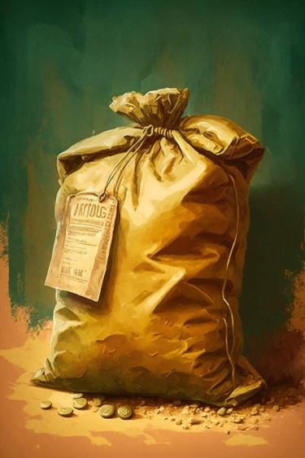
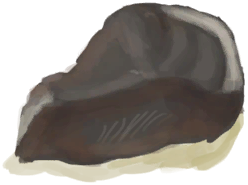
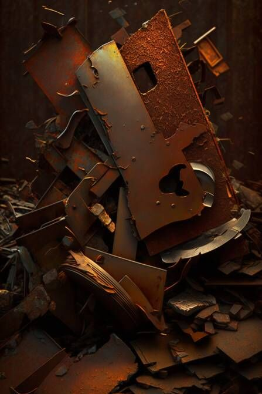
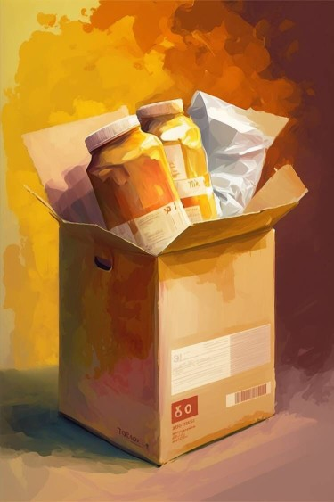
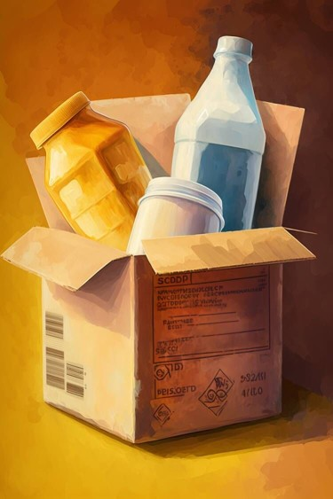
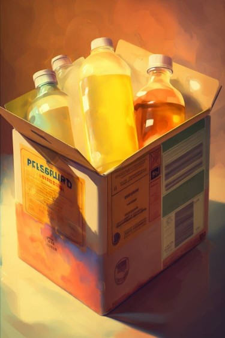

# 包囊(COD-废城)  
> 一大袋被人为密封的物资，分量很重。  
  
<table class="table table-bordered" data-toggle="table"  data-show-header="false"><thead style="display:none"><tr ><th  style="width:50%;text-align:left;vertical-align:top;"  >title</th><th  style="width:50%;text-align:left;vertical-align:top;"  ></th></tr></thead><tr ><td  style="width:50%;text-align:left;vertical-align:top;"  >**重量：**500  **标签：**	[“沉重的”](tag_Heavy.md), [“美丽的/好看的”](tag_Pretty.md)</td><td  style="width:50%;text-align:left;vertical-align:top;"  >

<a href="cod_Nc_ScavengingSupplies_MaterialWrapping.md" style="color:black">包囊</a>

</td></tr></tbody></table>  
  
## 获取来源  

探索

[锯木厂(废弃锯木厂)](cod_Exp_锯木厂.md)

打开

[铁箱(废弃锯木厂)](cod_Nc_ScavengingSupplies_Location_Box_TypeOne.md)

打开

[铁箱](cod_Nc_ScavengingSupplies_Location_Box_TypeThree.md)

打开

[铁箱](cod_Nc_ScavengingSupplies_Location_Box_TypeTwo.md)

搜刮

[支架](cod_Nc_ScavengingSupplies_Location_Brackets_TypeFive.md)

搜刮

[支架](cod_Nc_ScavengingSupplies_Location_Brackets_TypeFour.md)

搜刮

[支架](cod_Nc_ScavengingSupplies_Location_Brackets_TypeOne.md)

搜刮

[支架](cod_Nc_ScavengingSupplies_Location_Brackets_TypeThree.md)

搜刮

[支架](cod_Nc_ScavengingSupplies_Location_Brackets_TypeTwo.md)

打开

[铁柜](cod_Nc_ScavengingSupplies_Location_Cabinet_TypeOne.md)

打开

[铁柜](cod_Nc_ScavengingSupplies_Location_Cabinet_TypeThree.md)

打开

[铁柜](cod_Nc_ScavengingSupplies_Location_Cabinet_TypeTwo.md)

搜刮

[物品堆](cod_Nc_ScavengingSupplies_Location_PileItems_TypeFive.md)

搜刮

[物品堆](cod_Nc_ScavengingSupplies_Location_PileItems_TypeFour.md)

搜刮

[物品堆](cod_Nc_ScavengingSupplies_Location_PileItems_TypeOne.md)

搜刮

[物品堆](cod_Nc_ScavengingSupplies_Location_PileItems_TypeThree.md)

搜刮

[物品堆](cod_Nc_ScavengingSupplies_Location_PileItems_TypeTwo.md)

打开

[巨大包囊](cod_Nc_ScavengingSupplies_WrappingBag.md)

打开

[巨大包囊](cod_Nc_ScavengingSupplies_WrappingBag_Random.md)

搜刮

[设施](cod_Nc_Macy_ExploreScene_TypeEight.md)

搜刮

[设施](cod_Nc_Macy_ExploreScene_TypeFive.md)

搜刮

[设施](cod_Nc_Macy_ExploreScene_TypeFour.md)

搜刮

[设施](cod_Nc_Macy_ExploreScene_TypeNine.md)

搜刮

[设施](cod_Nc_Macy_ExploreScene_TypeOne.md)

搜刮

[设施](cod_Nc_Macy_ExploreScene_TypeSeven.md)

搜刮

[设施](cod_Nc_Macy_ExploreScene_TypeSix.md)

搜刮

[设施](cod_Nc_Macy_ExploreScene_TypeTen.md)

搜刮

[设施](cod_Nc_Macy_ExploreScene_TypeThree.md)

搜刮

[设施](cod_Nc_Macy_ExploreScene_TypeTwo.md)

搜刮

[货架(梅西百货)](cod_Nc_Macy_GoodsShelves_TypeFour.md)

搜刮

[货架(梅西百货)](cod_Nc_Macy_GoodsShelves_TypeOne.md)

搜刮

[货架(梅西百货)](cod_Nc_Macy_GoodsShelves_TypeThree.md)

搜刮

[货架(梅西百货)](cod_Nc_Macy_GoodsShelves_TypeTwo.md)

探索

[维生(饭馆)](cod_Exp_Pharmacy.md)

挖开..

[残骸](cod_Nc_BloodHeart_Death.md)

  
  
## 动作  

<table><tr><td rowspan="2" style="width:200px;text-align:center;font-size:1.3em;font-weight:bold">

打开

3分

</td><td></td></tr><tr><td><b>自身：</b>特殊1  <b>-1(-33.33%)</b></td></tr><tr><td colspan="2">

<table style="margin-bottom:3px;"><tr><td rowspan=2 style="text-align:center" width="80px">
基础权重

2
</td><td style="font-size:0.6em;line-height:0.6em;font-weight:bold">ScavengingSupplies_TypeOne</td></tr><tr><td>[

[木材](Wood.md)](Wood.md)(<b>+0～+1</b>), [

[小树枝](Sticks.md)](Sticks.md)(<b>+0～+1</b>), [

[长木棍](StickLong.md)](StickLong.md)(<b>+0～+1</b>), [

[木板](Plank.md)](Plank.md)(<b>+0～+1</b>), [

[木针](WoodenNeedle.md)](WoodenNeedle.md)(<b>+0～+1</b>)</td></tr></table>

<table style="margin-bottom:3px;"><tr><td rowspan=2 style="text-align:center" width="80px">
基础权重

2
</td><td style="font-size:0.6em;line-height:0.6em;font-weight:bold">ScavengingSupplies_TypeTwo</td></tr><tr><td>[

[石头](Stone.md)](Stone.md)(<b>+0～+1</b>), [

[大石块](StoneHeavy.md)](StoneHeavy.md)(<b>+0～+1</b>), [

[黑曜石](Obsidian.md)](Obsidian.md)(<b>+0～+1</b>), [

[燧石](Flint.md)](Flint.md)(<b>+0～+1</b>), [

[铜矿石](CopperOre.md)](CopperOre.md)(<b>+0～+1</b>)</td></tr></table>

<table style="margin-bottom:3px;"><tr><td rowspan=2 style="text-align:center" width="80px">
基础权重

2
</td><td style="font-size:0.6em;line-height:0.6em;font-weight:bold">ScavengingSupplies_TypeThree</td></tr><tr><td>[

[晶洞](Geode.md)](Geode.md)(<b>+0～+1</b>), [

[铁钉](cod_Nc_BasicMaterials_Iron_MetalParts.md)](cod_Nc_BasicMaterials_Iron_MetalParts.md)(<b>+0～+1</b>), [

[铁钉](cod_Nc_BasicMaterials_Iron_Nails.md)](cod_Nc_BasicMaterials_Iron_Nails.md)(<b>+0～+1</b>), [

[铁制材料](cod_Nc_IndustrialMaterials.md)](cod_Nc_IndustrialMaterials.md)(<b>+0～+1</b>)</td></tr></table>

<table style="margin-bottom:3px;"><tr><td rowspan=2 style="text-align:center" width="80px">
基础权重

2
</td><td style="font-size:0.6em;line-height:0.6em;font-weight:bold">ScavengingSupplies_TypeFour</td></tr><tr><td>[

[椰子皮](CoconutHusk.md)](CoconutHusk.md)(<b>+0～+1</b>), [

[蛇草](SnakeGrass.md)](SnakeGrass.md)(<b>+0～+1</b>), [

[细线](CordFiber.md)](CordFiber.md)(<b>+0～+1</b>), [

[线团](YarnFiber.md)](YarnFiber.md)(<b>+0～+1</b>), [

[绳子](Rope.md)](Rope.md)(<b>+0～+1</b>)</td></tr></table>

<table style="margin-bottom:3px;"><tr><td rowspan=2 style="text-align:center" width="80px">
基础权重

1
</td><td style="font-size:0.6em;line-height:0.6em;font-weight:bold">ScavengingSupplies_TypeFive</td></tr><tr><td>[

[化学制品](cod_Nc_ScavengingSuppiles_Chemicals_ChemicalProducts_TypeOne.md)](cod_Nc_ScavengingSuppiles_Chemicals_ChemicalProducts_TypeOne.md)(<b>+0～+1</b>), [

[化学制品](cod_Nc_ScavengingSuppiles_Chemicals_ChemicalProducts_TypeTwo.md)](cod_Nc_ScavengingSuppiles_Chemicals_ChemicalProducts_TypeTwo.md)(<b>+0～+1</b>), [

[化学制品](cod_Nc_ScavengingSuppiles_Chemicals_ChemicalProducts_TypeThree.md)](cod_Nc_ScavengingSuppiles_Chemicals_ChemicalProducts_TypeThree.md)(<b>+0～+1</b>), [

[化学制品](cod_Nc_ScavengingSuppiles_Chemicals_ChemicalProducts_TypeFour.md)](cod_Nc_ScavengingSuppiles_Chemicals_ChemicalProducts_TypeFour.md)(<b>+0～+1</b>), [

[化学制品](cod_Nc_ScavengingSuppiles_Chemicals_ChemicalProducts_TypeFive.md)](cod_Nc_ScavengingSuppiles_Chemicals_ChemicalProducts_TypeFive.md)(<b>+0～+1</b>)</td></tr></table>

<table style="margin-bottom:3px;"><tr><td rowspan=2 style="text-align:center" width="80px">
基础权重

1
</td><td style="font-size:0.6em;line-height:0.6em;font-weight:bold">ScavengingSupplies_TypeSix</td></tr><tr><td>[

[化学制品](cod_Nc_ScavengingSuppiles_Chemicals_ChemicalProducts_TypeSix.md)](cod_Nc_ScavengingSuppiles_Chemicals_ChemicalProducts_TypeSix.md)(<b>+0～+1</b>), [

[化学制品](cod_Nc_ScavengingSuppiles_Chemicals_ChemicalProducts_TypeSeven.md)](cod_Nc_ScavengingSuppiles_Chemicals_ChemicalProducts_TypeSeven.md)(<b>+0～+1</b>), [

[化学制品](cod_Nc_ScavengingSuppiles_Chemicals_ChemicalProducts_TypeEight.md)](cod_Nc_ScavengingSuppiles_Chemicals_ChemicalProducts_TypeEight.md)(<b>+0～+1</b>), [

[化学制品](cod_Nc_ScavengingSuppiles_Chemicals_ChemicalProducts_TypeNine.md)](cod_Nc_ScavengingSuppiles_Chemicals_ChemicalProducts_TypeNine.md)(<b>+0～+1</b>), [

[化学制品](cod_Nc_ScavengingSuppiles_Chemicals_ChemicalProducts_TypeTen.md)](cod_Nc_ScavengingSuppiles_Chemicals_ChemicalProducts_TypeTen.md)(<b>+0～+1</b>)</td></tr></table>

<table style="margin-bottom:3px;"><tr><td rowspan=2 style="text-align:center" width="80px">
基础权重

0
</td><td style="font-size:0.6em;line-height:0.6em;font-weight:bold">ScavengingSupplies_TypeSeven</td></tr><tr><td>[

[暴风雪](tq_Wather_Hail.md)](tq_Wather_Hail.md)(<b>+1</b>)</td></tr></table>

<table style="margin-bottom:3px;"><tr><td rowspan=2 style="text-align:center" width="80px">
基础权重

0
</td><td style="font-size:0.6em;line-height:0.6em;font-weight:bold">ScavengingSupplies_TypeEight</td></tr><tr><td>[

[暴风雪](tq_Wather_Hail.md)](tq_Wather_Hail.md)(<b>+1</b>)</td></tr></table>

<table style="margin-bottom:3px;"><tr><td rowspan=2 style="text-align:center" width="80px">
基础权重

0
</td><td style="font-size:0.6em;line-height:0.6em;font-weight:bold">ScavengingSupplies_TypeNine</td></tr><tr><td>[

[暴风雪](tq_Wather_Hail.md)](tq_Wather_Hail.md)(<b>+1</b>)</td></tr></table>

<table style="margin-bottom:3px;"><tr><td rowspan=2 style="text-align:center" width="80px">
基础权重

0
</td><td style="font-size:0.6em;line-height:0.6em;font-weight:bold">ScavengingSupplies_TypeTen</td></tr><tr><td>[

[暴风雪](tq_Wather_Hail.md)](tq_Wather_Hail.md)(<b>+1</b>)</td></tr></table>

</td></tr></table>
  
  
  
## 属性   

<table style="margin-bottom:0px;"><tr><td style="width:30%;text-align:left; background-color:#FEFEFE;font-size:1.3em;font-weight:bold;">特殊1</td><td style="font-size:1em;background-color:#FEFEFE">初始：3 , 最大：3 -</td></tr><tr style="background-color:#FFFFFF"><td colspan=2>** 到达0时： ** 自身: →消失</td></tr></table>
  

