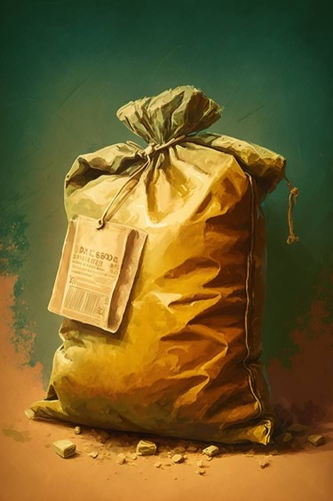

# 巨大包囊(COD-废城)  
> 一大袋被人为密封的物资，分量很重。  
  
<table class="table table-bordered" data-toggle="table"  data-show-header="false"><thead style="display:none"><tr ><th  style="width:50%;text-align:left;vertical-align:top;"  >title</th><th  style="width:50%;text-align:left;vertical-align:top;"  ></th></tr></thead><tr ><td  style="width:50%;text-align:left;vertical-align:top;"  >**重量：**1500  **标签：**	[“沉重的”](tag_Heavy.md), [“美丽的/好看的”](tag_Pretty.md)</td><td  style="width:50%;text-align:left;vertical-align:top;"  >

<a href="cod_Nc_ScavengingSupplies_WrappingBag.md" style="color:black">巨大包囊</a>

</td></tr></tbody></table>  
  
## 获取来源  

探索

[锯木厂(废弃锯木厂)](cod_Exp_锯木厂.md)

  
  
## 动作  

<table><tr><td rowspan="2" style="width:200px;text-align:center;font-size:1.3em;font-weight:bold">

打开

3分

</td><td></td></tr><tr><td><b>自身：</b>特殊1  <b>-1(-100%)</b></td></tr><tr><td colspan="2">[

[包囊](cod_Nc_ScavengingSupplies_AmmunitionWrapping.md)](cod_Nc_ScavengingSupplies_AmmunitionWrapping.md)(<b>+1</b>), [

[包囊](cod_Nc_ScavengingSupplies_BuildingMaterialWrapping.md)](cod_Nc_ScavengingSupplies_BuildingMaterialWrapping.md)(<b>+1</b>), [

[包囊](cod_Nc_ScavengingSupplies_FoodWrapping.md)](cod_Nc_ScavengingSupplies_FoodWrapping.md)(<b>+1</b>), [

[包囊](cod_Nc_ScavengingSupplies_MaterialWrapping.md)](cod_Nc_ScavengingSupplies_MaterialWrapping.md)(<b>+1</b>), [

[包囊](cod_Nc_ScavengingSupplies_MedicineWrapping.md)](cod_Nc_ScavengingSupplies_MedicineWrapping.md)(<b>+1</b>)</td></tr></table>
  
  
  
## 属性   

<table style="margin-bottom:0px;"><tr><td style="width:30%;text-align:left; background-color:#FEFEFE;font-size:1.3em;font-weight:bold;">特殊1</td><td style="font-size:1em;background-color:#FEFEFE">初始：1 , 最大：1 -</td></tr><tr style="background-color:#FFFFFF"><td colspan=2>** 到达0时： ** 自身: →消失</td></tr></table>
  

