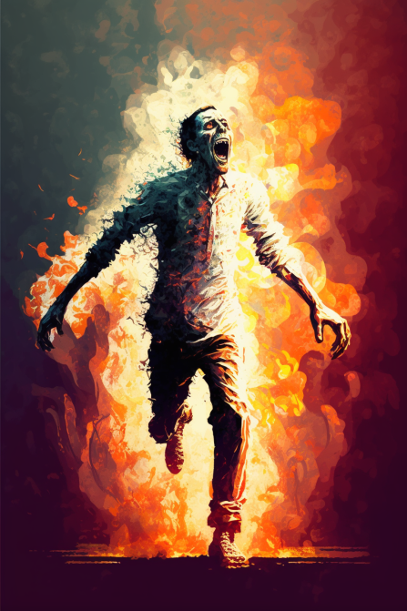
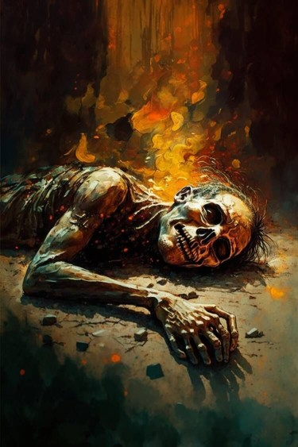
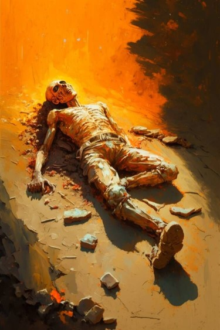
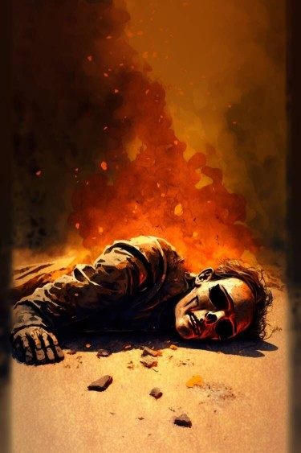

# 燃烧僵尸(COD-废城)  
> 它正在剧烈的燃烧！  
  
<table class="table table-bordered" data-toggle="table"  data-show-header="false"><thead style="display:none"><tr ><th  style="width:50%;text-align:left;vertical-align:top;"  >title</th><th  style="width:50%;text-align:left;vertical-align:top;"  ></th></tr></thead><tr ><td  style="width:50%;text-align:left;vertical-align:top;"  >**重量：**250  **标签：**	[“沉重的”](tag_Heavy.md)  ** 效果: ** [

[噪声系数](cod_Gs_NoiseLevel.md)](cod_Gs_NoiseLevel.md)加成<b>+1</b></td><td  style="width:50%;text-align:left;vertical-align:top;"  >

<a href="cod_Nc_ZombieBurn_TypeOne.md" style="color:black">燃烧僵尸</a>

</td></tr></tbody></table>  
  
## 属性   

<table style="margin-bottom:0px;"><tr><td style="width:30%;text-align:left; background-color:#FEFEFE;font-size:1.3em;font-weight:bold;">特殊1</td><td style="font-size:1em;background-color:#FEFEFE">初始：2 , 最大：2 每15分钟-1 , 最多需要：30分</td></tr><tr style="background-color:#FFFFFF"><td colspan=2>** 到达0时： ** 自身: →消失 

<table style="margin-bottom:3px;"><tr><td rowspan=2 style="text-align:center" width="80px">
基础权重

1
</td><td style="font-size:0.6em;line-height:0.6em;font-weight:bold">YoYo</td></tr><tr><td>[

[烧焦尸体](cod_Nc_ZombieCorpse_Burn_TypeOne.md)](cod_Nc_ZombieCorpse_Burn_TypeOne.md)(<b>+1</b>)</td></tr></table>

<table style="margin-bottom:3px;"><tr><td rowspan=2 style="text-align:center" width="80px">
基础权重

1
</td><td style="font-size:0.6em;line-height:0.6em;font-weight:bold">YoYo</td></tr><tr><td>[

[烧焦尸体](cod_Nc_ZombieCorpse_Burn_TypeTwo.md)](cod_Nc_ZombieCorpse_Burn_TypeTwo.md)(<b>+1</b>)</td></tr></table>

<table style="margin-bottom:3px;"><tr><td rowspan=2 style="text-align:center" width="80px">
基础权重

1
</td><td style="font-size:0.6em;line-height:0.6em;font-weight:bold">YoYo</td></tr><tr><td>[

[烧焦尸体](cod_Nc_ZombieCorpse_Burn_TypeThree.md)](cod_Nc_ZombieCorpse_Burn_TypeThree.md)(<b>+1</b>)</td></tr></table>

</td></tr></table>
  

