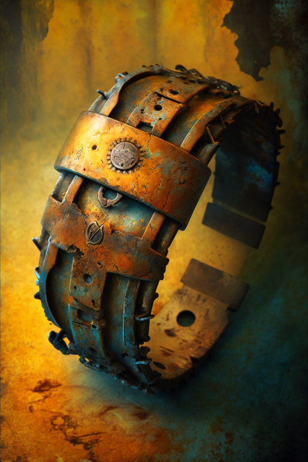
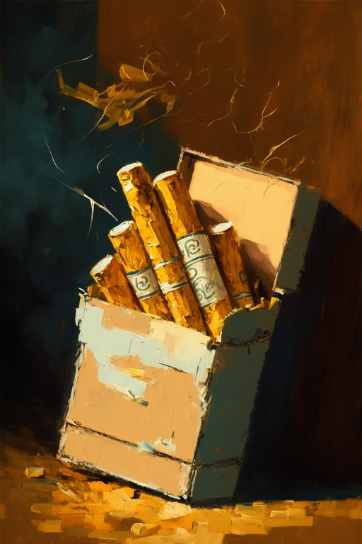

# 烧焦尸体(COD-废城)  
> 散发着强烈的气味，只剩下了惨败的黑色。  
  
<table class="table table-bordered" data-toggle="table"  data-show-header="false"><thead style="display:none"><tr ><th  style="width:50%;text-align:left;vertical-align:top;"  >title</th><th  style="width:50%;text-align:left;vertical-align:top;"  ></th></tr></thead><tr ><td  style="width:50%;text-align:left;vertical-align:top;"  >**重量：**250  **可用次数：**288  ** 效果: ** [

[孤独感](Loneliness.md)](Loneliness.md)加成<b>-0.05</b> [

[压力](Stress.md)](Stress.md)加成<b>+0.1</b> [

[不适](Discomfort.md)](Discomfort.md)<b>+50</b> [

[世界观](Structure.md)](Structure.md)加成<b>-0.1</b> [Vultures_FlyDownCount](cod_Gs_Vultures_FlyDownCount.md)加成<b>+1</b></td><td  style="width:50%;text-align:left;vertical-align:top;"  >

<a href="cod_Nc_ZombieCorpse_Burn_TypeTwo.md" style="color:black">烧焦尸体</a>

</td></tr></tbody></table>  
  
## 获取来源  

转化

[燃烧僵尸](cod_Nc_ZombieBurn_TypeOne.md)

转化

[燃烧僵尸](cod_Nc_ZombieBurn_TypeThree.md)

转化

[燃烧僵尸](cod_Nc_ZombieBurn_TypeTwo.md)

  
  
## 动作  

<table><tr><td rowspan="2" style="width:200px;text-align:center;font-size:1.3em;font-weight:bold">

搜刮

3分

</td><td></td></tr><tr><td><b>自身：</b>→消失</td></tr><tr><td colspan="2"><b>状态变化：</b>[

[污垢](Filth.md)](Filth.md)<b>+5</b></td></tr><tr><td colspan="2">

<table style="margin-bottom:3px;"><tr><td rowspan=2 style="text-align:center" width="80px">
基础权重

1
</td><td style="font-size:0.6em;line-height:0.6em;font-weight:bold">YoYo</td></tr><tr><td>[

[饰品](cod_Nc_ZombieDeathDrop_Accessories_TypeOne.md)](cod_Nc_ZombieDeathDrop_Accessories_TypeOne.md)(<b>+1</b>)</td></tr></table>

<table style="margin-bottom:3px;"><tr><td rowspan=2 style="text-align:center" width="80px">
基础权重

1
</td><td style="font-size:0.6em;line-height:0.6em;font-weight:bold">YoYo</td></tr><tr><td>[

[饰品](cod_Nc_ZombieDeathDrop_Accessories_TypeTwo.md)](cod_Nc_ZombieDeathDrop_Accessories_TypeTwo.md)(<b>+1</b>)</td></tr></table>

<table style="margin-bottom:3px;"><tr><td rowspan=2 style="text-align:center" width="80px">
基础权重

1
</td><td style="font-size:0.6em;line-height:0.6em;font-weight:bold">YoYo</td></tr><tr><td>[

[饰品](cod_Nc_ZombieDeathDrop_Accessories_TypeThree.md)](cod_Nc_ZombieDeathDrop_Accessories_TypeThree.md)(<b>+1</b>)</td></tr></table>

<table style="margin-bottom:3px;"><tr><td rowspan=2 style="text-align:center" width="80px">
基础权重

1
</td><td style="font-size:0.6em;line-height:0.6em;font-weight:bold">YoYo</td></tr><tr><td>[

[饰品](cod_Nc_ZombieDeathDrop_Accessories_TypeFour.md)](cod_Nc_ZombieDeathDrop_Accessories_TypeFour.md)(<b>+1</b>)</td></tr></table>

<table style="margin-bottom:3px;"><tr><td rowspan=2 style="text-align:center" width="80px">
基础权重

1
</td><td style="font-size:0.6em;line-height:0.6em;font-weight:bold">YoYo</td></tr><tr><td>[

[饰品](cod_Nc_ZombieDeathDrop_Accessories_TypeFive.md)](cod_Nc_ZombieDeathDrop_Accessories_TypeFive.md)(<b>+1</b>)</td></tr></table>

<table style="margin-bottom:3px;"><tr><td rowspan=2 style="text-align:center" width="80px">
基础权重

1
</td><td style="font-size:0.6em;line-height:0.6em;font-weight:bold">YoYo</td></tr><tr><td>[

[饰品](cod_Nc_ZombieDeathDrop_Accessories_TypeSix.md)](cod_Nc_ZombieDeathDrop_Accessories_TypeSix.md)(<b>+1</b>)</td></tr></table>

<table style="margin-bottom:3px;"><tr><td rowspan=2 style="text-align:center" width="80px">
基础权重

2
</td><td style="font-size:0.6em;line-height:0.6em;font-weight:bold">YoYo</td></tr><tr><td>[

[香烟](cod_Nc_ZombieDeathDrop_Cigarettes_TypeOne.md)](cod_Nc_ZombieDeathDrop_Cigarettes_TypeOne.md)(<b>+1</b>)</td></tr></table>

<table style="margin-bottom:3px;"><tr><td rowspan=2 style="text-align:center" width="80px">
基础权重

2
</td><td style="font-size:0.6em;line-height:0.6em;font-weight:bold">YoYo</td></tr><tr><td>[

[香烟](cod_Nc_ZombieDeathDrop_Cigarettes_TypeTwo.md)](cod_Nc_ZombieDeathDrop_Cigarettes_TypeTwo.md)(<b>+1</b>)</td></tr></table>

<table style="margin-bottom:3px;"><tr><td rowspan=2 style="text-align:center" width="80px">
基础权重

2
</td><td style="font-size:0.6em;line-height:0.6em;font-weight:bold">YoYo</td></tr><tr><td>[

[香烟](cod_Nc_ZombieDeathDrop_Cigarettes_TypeThree.md)](cod_Nc_ZombieDeathDrop_Cigarettes_TypeThree.md)(<b>+1</b>)</td></tr></table>

<table style="margin-bottom:3px;"><tr><td rowspan=2 style="text-align:center" width="80px">
基础权重

2
</td><td style="font-size:0.6em;line-height:0.6em;font-weight:bold">YoYo</td></tr><tr><td>[

[灰烬](Ash.md)](Ash.md)(<b>+1</b>)</td></tr></table>

<table style="margin-bottom:3px;"><tr><td rowspan=2 style="text-align:center" width="80px">
基础权重

6
</td><td style="font-size:0.6em;line-height:0.6em;font-weight:bold">YoYo</td></tr><tr><td>[

[铸币](cod_铸币.md)](cod_铸币.md)(<b>+1</b>)</td></tr></table>

<table style="margin-bottom:3px;"><tr><td rowspan=2 style="text-align:center" width="80px">
基础权重

2
</td><td style="font-size:0.6em;line-height:0.6em;font-weight:bold">YoYo</td></tr><tr><td>[

[灰烬](Ash.md)](Ash.md)(<b>+1</b>)</td></tr></table>

<table style="margin-bottom:3px;"><tr><td rowspan=2 style="text-align:center" width="80px">
基础权重

2
</td><td style="font-size:0.6em;line-height:0.6em;font-weight:bold">YoYo</td></tr><tr><td>[

[灰烬](Ash.md)](Ash.md)(<b>+1</b>)</td></tr></table>

</td></tr></table>
  
  
  
## 属性   

<table style="margin-bottom:0px;"><tr><td style="width:30%;text-align:left; background-color:#FEFEFE;font-size:1.3em;font-weight:bold;">使用次数</td><td style="font-size:1em;background-color:#FEFEFE">初始：288 , 最大：288 每15分钟-1 , 最多需要：3天</td></tr><tr style="background-color:#FFFFFF"><td colspan=2>** 到达0时： ** 自身: →消失</td></tr></table>
  

