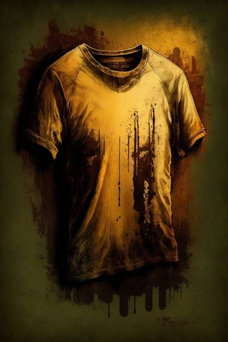

# 破烂衣服(COD-废城)  
> 破烂如同碎絮，一个人类的信物。  
  
<table class="table table-bordered" data-toggle="table"  data-show-header="false"><thead style="display:none"><tr ><th  style="width:50%;text-align:left;vertical-align:top;"  >title</th><th  style="width:50%;text-align:left;vertical-align:top;"  ></th></tr></thead><tr ><td  style="width:50%;text-align:left;vertical-align:top;"  >**重量：**10  **标签：**	[“抗裂剂”](tag_Temper.md), [“火绒”](tag_Tinder.md)</td><td  style="width:50%;text-align:left;vertical-align:top;"  >

<a href="cod_Nc_ZombieDeathDrop_TatteredClothes_TypeThree.md" style="color:black">破烂衣服</a>

</td></tr></tbody></table>  
  
## 获取来源  

搜刮

[僵尸尸体](cod_Nc_ZombieCorpse.md)

  
  
## 动作  

<table><tr><td rowspan="2" style="width:200px;text-align:center;font-size:1.3em;font-weight:bold">

撕开

3分

</td><td></td></tr><tr><td><b>自身：</b>→消失</td></tr><tr><td colspan="2"><b>状态变化：</b>[

[情绪](Morale.md)](Morale.md)<b>+1</b>, [

[世界观](Structure.md)](Structure.md)<b>+5</b>, [

[压力](Stress.md)](Stress.md)<b>-5</b></td></tr><tr><td colspan="2">[

[布片](ClothSmall.md)](ClothSmall.md)(<b>+1</b>)</td></tr></table>
  
  
  

