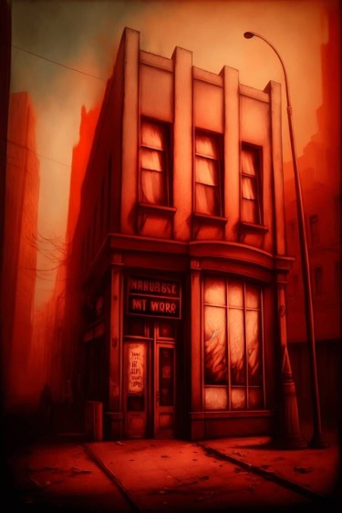
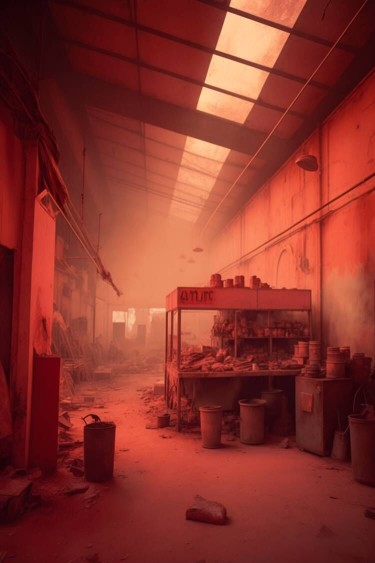

# 梅西百货(COD-废城)  
> 遍地凌乱的包装，随处可见遗弃的推车。  
  
<table class="table table-bordered" data-toggle="table"  data-show-header="false"><thead style="display:none"><tr ><th  style="width:50%;text-align:left;vertical-align:top;"  >title</th><th  style="width:50%;text-align:left;vertical-align:top;"  ></th></tr></thead><tr ><td  style="width:50%;text-align:left;vertical-align:top;"  >** 区域唯一 **  ** 不可删除 **  **环境：**[摩登街道(环境)](cod_Env_ModernStreet.md)</td><td  style="width:50%;text-align:left;vertical-align:top;"  >

<a href="cod_Path_ModernStreetToMacy.md" style="color:black">梅西百货</a>

</td></tr></tbody></table>  
  
## 获取来源  

探索

[摩登街道](cod_Exp_ModernStreet.md)

  
  
## 动作  

<table><tr><td rowspan="2" style="width:200px;text-align:center;font-size:1.3em;font-weight:bold">

Go

15分

</td><td>[“旅行动作(组)”](TravelAction.md)</td></tr><tr><td></td></tr><tr><td colspan="2">[

[梅西百货(环境)](cod_Env_Macy.md)](cod_Env_Macy.md)(<b>+1</b>)</td></tr></table>
  
  
  

