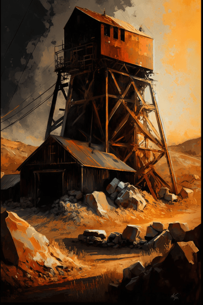

# 废弃矿洞(COD-废城)  
> 废弃矿洞，未知情况  
  
<table class="table table-bordered" data-toggle="table"  data-show-header="false"><thead style="display:none"><tr ><th  style="width:50%;text-align:left;vertical-align:top;"  >title</th><th  style="width:50%;text-align:left;vertical-align:top;"  ></th></tr></thead><tr ><td  style="width:50%;text-align:left;vertical-align:top;"  >** 区域唯一 **  **环境：**[废弃矿区(环境)](cod_Env_矿区.md)</td><td  style="width:50%;text-align:left;vertical-align:top;"  >

<a href="cod_Path_矿区到矿洞.md" style="color:black">废弃矿洞</a>

</td></tr></tbody></table>  
  
## 获取来源  

探索

[矿区(废弃矿区)](cod_Exp_矿区.md)

Go

[前往废弃矿区(废弃矿洞)](cod_Path_矿洞到矿区.md)

  
  
## 动作  

<table><tr><td rowspan="2" style="width:200px;text-align:center;font-size:1.3em;font-weight:bold">

Go

3分

</td><td>[“腿部动作(组)”](LegAction.md), [“探索动作(组)”](SlipperyAction.md), [“旅行动作(组)”](TravelAction.md)</td></tr><tr><td></td></tr><tr><td colspan="2"><b>状态变化：</b>[

[压力](Stress.md)](Stress.md)<b>-10</b></td></tr><tr><td colspan="2">[

[废弃矿洞(环境)](cod_Env_矿洞.md)](cod_Env_矿洞.md)(<b>+1</b>), [

[前往废弃矿区(废弃矿洞)](cod_Path_矿洞到矿区.md)](cod_Path_矿洞到矿区.md)(<b>+1</b>)</td></tr></table>
  
  
  

