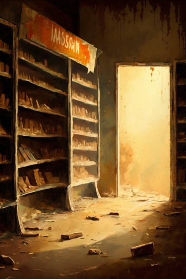

# 货架(COD-废城)  
> 上面分布着零星的物资。  
  
<table class="table table-bordered" data-toggle="table"  data-show-header="false"><thead style="display:none"><tr ><th  style="width:50%;text-align:left;vertical-align:top;"  >title</th><th  style="width:50%;text-align:left;vertical-align:top;"  ></th></tr></thead><tr ><td  style="width:50%;text-align:left;vertical-align:top;"  >**环境：**[饭馆(环境)](cod_Env_Pharmacy.md)  **重量：**100</td><td  style="width:50%;text-align:left;vertical-align:top;"  >

<a href="cod_Pharmacy_GoodsShelves_TypeThree.md" style="color:black">货架</a>

</td></tr></tbody></table>  
  
## 获取来源  

探索

[维生(饭馆)](cod_Exp_Pharmacy.md)

  
  
## 动作  

<table><tr><td rowspan="2" style="width:200px;text-align:center;font-size:1.3em;font-weight:bold">

搜刮

15分

</td><td>, </td></tr><tr><td></td></tr><tr><td colspan="2">

<table style="margin-bottom:3px;"><tr><td rowspan=2 style="text-align:center" width="80px">
基础权重

1
</td><td style="font-size:0.6em;line-height:0.6em;font-weight:bold">Pharmacy_GoodsShelves_TypeThree_Search_One</td></tr><tr><td>[

[阿莫西林](cod_Pharmacy_Pharmaceuticals_TypeOne.md)](cod_Pharmacy_Pharmaceuticals_TypeOne.md)(<b>+1</b>)</td></tr></table>

<table style="margin-bottom:3px;"><tr><td rowspan=2 style="text-align:center" width="80px">
基础权重

1
</td><td style="font-size:0.6em;line-height:0.6em;font-weight:bold">Pharmacy_GoodsShelves_TypeThree_Search_Two</td></tr><tr><td>[

[阿司匹林](cod_Pharmacy_Pharmaceuticals_TypeTwo.md)](cod_Pharmacy_Pharmaceuticals_TypeTwo.md)(<b>+1</b>)</td></tr></table>

<table style="margin-bottom:3px;"><tr><td rowspan=2 style="text-align:center" width="80px">
基础权重

1
</td><td style="font-size:0.6em;line-height:0.6em;font-weight:bold">Pharmacy_GoodsShelves_TypeThree_Search_Three</td></tr><tr><td>[

[哌拉西林](cod_Pharmacy_Pharmaceuticals_TypeThree.md)](cod_Pharmacy_Pharmaceuticals_TypeThree.md)(<b>+1</b>)</td></tr></table>

<table style="margin-bottom:3px;"><tr><td rowspan=2 style="text-align:center" width="80px">
基础权重

1
</td><td style="font-size:0.6em;line-height:0.6em;font-weight:bold">Pharmacy_GoodsShelves_TypeThree_Search_Four</td></tr><tr><td>[

[美洛西林](cod_Pharmacy_Pharmaceuticals_TypeFour.md)](cod_Pharmacy_Pharmaceuticals_TypeFour.md)(<b>+1</b>)</td></tr></table>

</td></tr></table>
  
  
  

