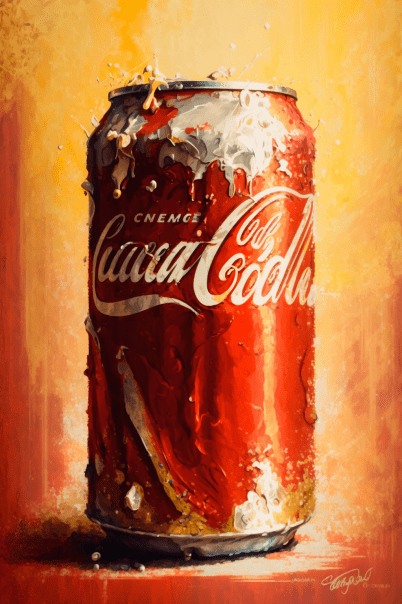

# V我50套餐(COD-废城)  
> 购买腰包  
  
<table class="table table-bordered" data-toggle="table"  data-show-header="false"><thead style="display:none"><tr ><th  style="width:50%;text-align:left;vertical-align:top;"  >title</th><th  style="width:50%;text-align:left;vertical-align:top;"  ></th></tr></thead><tr ><td  style="width:50%;text-align:left;vertical-align:top;"  >** 解锁需求: ** [饭馆服务员](cod_饭馆服务员.md)  ** 动作分类: ** [“手部动作(组)”](HandAction.md) [“制造动作(组)”](CraftAction.md)  ** 制作条件: ** ~~[

[V我50套餐(蓝图)](cod_V我50套餐.md)](cod_V我50套餐.md)存在于手中/面板~~</td><td  style="width:50%;text-align:left;vertical-align:top;"  >

<a href="cod_V我50套餐.md" style="color:black">V我50套餐</a>

</td></tr></tbody></table>  
  
## 制作  

<table><tr><td style="width:100px;"><b>材料总计：</b></td><td>[

[饭馆服务员](cod_饭馆服务员.md)](cod_饭馆服务员.md) x 1 , [

[一小袋铸币](cod_一小袋铸币.md)](cod_一小袋铸币.md) x 5</td></tr><tr><td><b>耗时：</b></td><td>15分</td></tr><tr><td><b>需求：</b></td><td>[

[光亮](Light.md)](Light.md): <b>10-100</b></td></tr><tr><td><b>状态变化：</b></td><td>[

[情绪](Morale.md)](Morale.md)<b>+15</b>, [

[压力](Stress.md)](Stress.md)<b>-20</b>, [

[餐馆好感度](cod_餐馆好感度.md)](cod_餐馆好感度.md)<b>+1.5</b></td></tr><tr><td colspan=2><b>步骤：</b></td></tr><tr><td style="text-align:right"><b>1.</b></td><td>[

[饭馆服务员](cod_饭馆服务员.md)](cod_饭馆服务员.md) x 1 + [

[一小袋铸币](cod_一小袋铸币.md)](cod_一小袋铸币.md) x 5</td></tr><tr style="background-color:#fff;font-size:1.2em;"><td></td><td style="text-align:right"><b>成品：</b>[

[饭馆服务员](cod_饭馆服务员.md)](cod_饭馆服务员.md)(<b>+1</b>) , [

[炸鸡薯条](cod_炸鸡薯条.md)](cod_炸鸡薯条.md)(<b>+1</b>) , [

[巨无霸汉堡](cod_巨无霸汉堡.md)](cod_巨无霸汉堡.md)(<b>+1</b>) , [

[可口可乐](cod_可口可乐.md)](cod_可口可乐.md)(<b>+1</b>)</td></tr></table>
  
  

