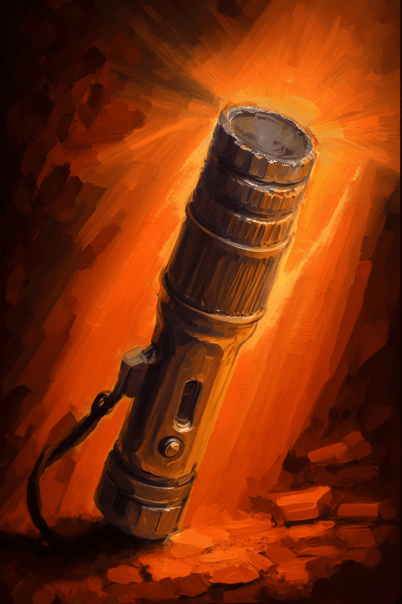

# 关闭的手电(COD-废城)  
> 关闭的手电  
  
<table class="table table-bordered" data-toggle="table"  data-show-header="false"><thead style="display:none"><tr ><th  style="width:50%;text-align:left;vertical-align:top;"  >title</th><th  style="width:50%;text-align:left;vertical-align:top;"  ></th></tr></thead><tr ><td  style="width:50%;text-align:left;vertical-align:top;"  >**重量：**25</td><td  style="width:50%;text-align:left;vertical-align:top;"  >

<a href="cod_al_flashlight_off.md" style="color:black">关闭的手电</a>

</td></tr></tbody></table>  
  
## 获取来源  

蓝图制造

[购买10个蛇草(蓝图)](cod_购买手电.md)

关闭

[开启的手电](cod_al_flashlight_on.md)

电量耗尽

[开启的手电](cod_al_flashlight_on.md)

  
  
## 动作  

<table><tr><td rowspan="2" style="width:200px;text-align:center;font-size:1.3em;font-weight:bold">

关闭

</td><td></td></tr><tr><td><b>自身：</b>→ [

[开启的手电](cod_al_flashlight_on.md)](cod_al_flashlight_on.md)</td></tr><tr><td colspan="2"><b>需求：</b>燃料: <b>7(1.02%)</b></td></tr></table>
  

<table><tr><td rowspan="2" style="width:200px;text-align:center;font-size:1.3em;font-weight:bold">

手动发电

4小时

</td><td></td></tr><tr><td><b>自身：</b>燃料  <b>+688(100%)</b></td></tr></table>
  
  
  
## 属性   

<table style="margin-bottom:0px;"><tr><td style="width:30%;text-align:left; background-color:#FEFEFE;font-size:1.3em;font-weight:bold;">燃料</td><td style="font-size:1em;background-color:#FEFEFE">初始：688 , 最大：688 -</td></tr><tr style="background-color:#FFFFFF"><td colspan=2></td></tr></table>
  

