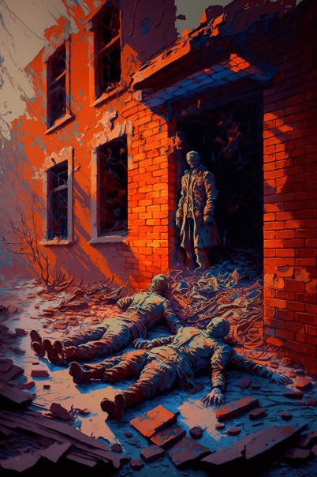

# 站在墙后的僵尸(COD-废城)  
> 这个僵尸好像对我有敌意  
  
<table class="table table-bordered" data-toggle="table"  data-show-header="false"><thead style="display:none"><tr ><th  style="width:50%;text-align:left;vertical-align:top;"  data-sortable="true"  >title</th><th  style="width:50%;text-align:left;vertical-align:top;"  ></th></tr></thead><tr ><td  style="width:50%;text-align:left;vertical-align:top;"  ></td><td  style="width:50%;text-align:left;vertical-align:top;"  >

<a href="cod_eve_小镇僵尸埋伏事件.md" style="color:black">站在墙后的僵尸</a>

</td></tr></tbody></table>  
  
## 获取来源  

Explore

[深入小镇](cod_Exp_深入小镇.md)

  
  
## 动作  

<table><tr><td rowspan="2" style="width:200px;text-align:center;font-size:1.3em;font-weight:bold">

他走过来

</td><td></td></tr><tr><td><b>自身：</b>→消失</td></tr><tr><td colspan="2"><b>状态变化：</b>[

[情绪](Morale.md)](Morale.md)<b>-10</b>, [

[污垢](Filth.md)](Filth.md)<b>+50</b></td></tr><tr><td colspan="2">[

[尖啸(腐败之城)](cod_Nc_ScreamingZombies.md)](cod_Nc_ScreamingZombies.md)(<b>+1</b>), [

[僵尸(废弃锯木厂)](cod_Nc_OrdinaryZombie.md)](cod_Nc_OrdinaryZombie.md)(<b>+0～+1</b>)</td></tr></table>
  
  
  

