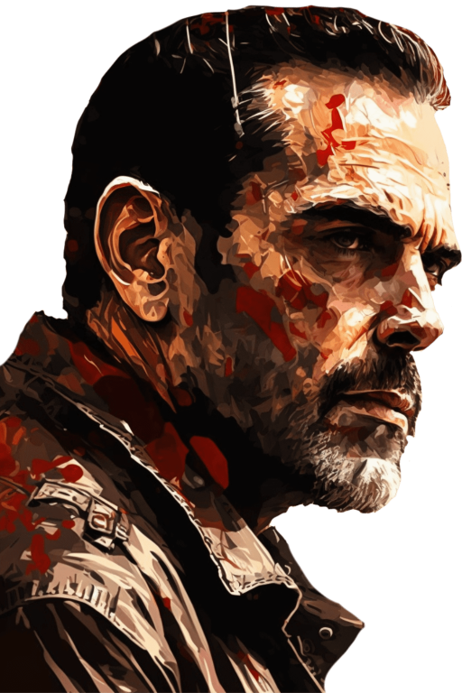

# 加文(COD-废城)  
> I‘m 尼根  
  
<table class="table table-bordered" data-toggle="table"  data-show-header="false"><thead style="display:none"><tr ><th  style="width:50%;text-align:left;vertical-align:top;"  data-sortable="true"  >title</th><th  style="width:50%;text-align:left;vertical-align:top;"  ></th></tr></thead><tr ><td  style="width:50%;text-align:left;vertical-align:top;"  ></td><td  style="width:50%;text-align:left;vertical-align:top;"  >

<a href="cod_eve_尼根的试验.md" style="color:black">加文</a>

</td></tr></tbody></table>  
  
## 获取来源  

搜索

[破败轮船](cod_尼根任务箱子1.md)

  
  
## 动作  

<table><tr><td rowspan="2" style="width:200px;text-align:center;font-size:1.3em;font-weight:bold">

奇怪

</td><td></td></tr><tr><td><b>自身：</b>→消失</td></tr><tr><td colspan="2">[

[餐馆好感度](cod_救世军信任度.md)](cod_救世军信任度.md)<b>-50</b></td></tr></table>
  
  
  

