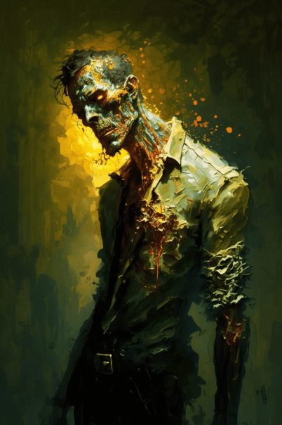

# Ouch!(COD-废城)  
> 僵尸倒下了，身上为此留下了一些伤口。  
  
<table class="table table-bordered" data-toggle="table"  data-show-header="false"><thead style="display:none"><tr ><th  style="width:50%;text-align:left;vertical-align:top;"  data-sortable="true"  >title</th><th  style="width:50%;text-align:left;vertical-align:top;"  ></th></tr></thead><tr ><td  style="width:50%;text-align:left;vertical-align:top;"  ></td><td  style="width:50%;text-align:left;vertical-align:top;"  >

<a href="cod_eve_我受伤了擦伤.md" style="color:black">Ouch!</a>

</td></tr></tbody></table>  
  
## 获取来源  

Attack with Spear!

[僵尸(事件)](cod_eve_普通僵尸攻击.md)

Attack with Bow!

[僵尸(事件)](cod_eve_普通僵尸攻击.md)

Attack with Sling!

[僵尸(事件)](cod_eve_普通僵尸攻击.md)

用长矛攻击！

[僵尸(废弃锯木厂)](cod_Nc_OrdinaryZombie.md)

用弓箭攻击！

[僵尸(废弃锯木厂)](cod_Nc_OrdinaryZombie.md)

用投石索攻击

[僵尸(废弃锯木厂)](cod_Nc_OrdinaryZombie.md)

  
  
## 动作  

<table><tr><td rowspan="2" style="width:200px;text-align:center;font-size:1.3em;font-weight:bold">

Continue

</td><td></td></tr><tr><td><b>自身：</b>→消失</td></tr><tr><td colspan="2"><b>相关卡牌变化：</b>所有[僵尸(废弃锯木厂)](cod_Nc_OrdinaryZombie.md)  <b>-1</b></td></tr><tr><td colspan="2"><b>状态变化：</b>[

[情绪](Morale.md)](Morale.md)<b>-10</b>, [

[污垢](Filth.md)](Filth.md)<b>+50</b>, [

[血压](Blood.md)](Blood.md)<b>-5</b></td></tr><tr><td colspan="2">

<table style="margin-bottom:3px;"><tr><td rowspan=2 style="text-align:center" width="80px">
基础权重

1
</td><td style="font-size:0.6em;line-height:0.6em;font-weight:bold">YoYo</td></tr><tr><td>[

[僵尸咬伤](cod_W_ZombieScratch.md)](cod_W_ZombieScratch.md)(<b>+1</b>)</td></tr></table>

<table style="margin-bottom:3px;"><tr><td rowspan=2 style="text-align:center" width="80px">
基础权重

1
</td><td style="font-size:0.6em;line-height:0.6em;font-weight:bold">YoYo</td></tr><tr><td>[

[僵尸咬伤](cod_W_ZombieBites.md)](cod_W_ZombieBites.md)(<b>+1</b>)</td></tr></table>

</td></tr></table>
  
  
  

