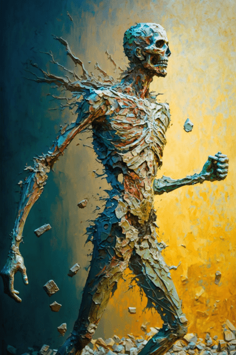

# 石头(COD-废城)  
> 武器打在石头般的躯体上，武器猛然回弹。下一刻身体传来一阵剧痛。  
  
<table class="table table-bordered" data-toggle="table"  data-show-header="false"><thead style="display:none"><tr ><th  style="width:50%;text-align:left;vertical-align:top;"  data-sortable="true"  >title</th><th  style="width:50%;text-align:left;vertical-align:top;"  ></th></tr></thead><tr ><td  style="width:50%;text-align:left;vertical-align:top;"  ></td><td  style="width:50%;text-align:left;vertical-align:top;"  >

<a href="cod_eve_我受到了石化僵尸伤.md" style="color:black">石头</a>

</td></tr></tbody></table>  
  
## 获取来源  

Attack with Spear!

[石化僵尸(事件)(废弃矿洞)](cod_eve_石化僵尸攻击.md)

Attack with Bow!

[石化僵尸(事件)(废弃矿洞)](cod_eve_石化僵尸攻击.md)

Attack with Sling!

[石化僵尸(事件)(废弃矿洞)](cod_eve_石化僵尸攻击.md)

躲避

[石化僵尸(事件)(废弃矿洞)](cod_eve_石化僵尸攻击.md)

Attack with Spear!

[石化(废弃矿区)](cod_Nc_PetrifiedZombie.md)

Attack with Bow!

[石化(废弃矿区)](cod_Nc_PetrifiedZombie.md)

Attack with Sling!

[石化(废弃矿区)](cod_Nc_PetrifiedZombie.md)

  
  
## 动作  

<table><tr><td rowspan="2" style="width:200px;text-align:center;font-size:1.3em;font-weight:bold">

啊！

</td><td></td></tr><tr><td><b>自身：</b>→消失</td></tr><tr><td colspan="2"><b>相关卡牌变化：</b>装备中的[眼镜](Glasses.md)可用次数  <b>-3</b></td></tr><tr><td colspan="2"><b>状态变化：</b>[

[血压](Blood.md)](Blood.md)<b>-10～-15</b>, [

[污垢](Filth.md)](Filth.md)<b>+50</b></td></tr><tr><td colspan="2">[

[僵尸咬伤](cod_W_ZombieBites.md)](cod_W_ZombieBites.md)(<b>+1～+2</b>), [

[轻微撕裂伤](W_MinorLaceration.md)](W_MinorLaceration.md)(<b>+1</b>)</td></tr></table>
  
  
  

