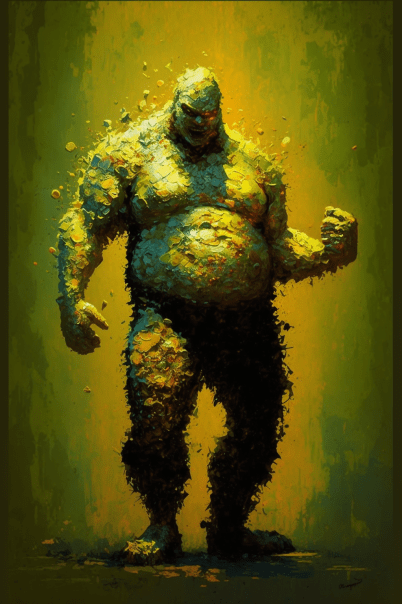

# 污秽僵尸(COD-废城)  
> 它周边的地面已经腐蚀的溃不成形，而现在它将嘴巴对准了另一个方向。  
  
<table class="table table-bordered" data-toggle="table"  data-show-header="false"><thead style="display:none"><tr ><th  style="width:50%;text-align:left;vertical-align:top;"  >title</th><th  style="width:50%;text-align:left;vertical-align:top;"  ></th></tr></thead><tr ><td  style="width:50%;text-align:left;vertical-align:top;"  >** 不可删除 **  **标签：**	[“战斗事件”](tag_FightEvent.md)</td><td  style="width:50%;text-align:left;vertical-align:top;"  >

<a href="cod_eve_污秽僵尸攻击.md" style="color:black">污秽僵尸</a>

</td></tr></tbody></table>  
  
## 获取来源  

** 使用**[“铲子”](tag_Shovel.md) , [“斧”](tag_Axe.md)深度挖掘

[建筑废墟](cod_废墟4.md)

转化

[污秽(废弃锯木厂)](cod_Nc_FilthyZombie.md)

  
  
## 动作  

<table><tr><td rowspan="2" style="width:200px;text-align:center;font-size:1.3em;font-weight:bold">

Attack with Spear!

3分

</td><td></td></tr><tr><td><b>自身：</b>→消失</td></tr><tr><td colspan="2"><b>需求：</b>[“一级矛”](tag_Spear.md)存在于手中/身上(部分)</td></tr><tr><td colspan="2"><b>相关卡牌变化：</b>手牌中的一个[“一级矛”](tag_Spear.md)使用次数  <b>-5</b>, 手牌中的一个[盾牌](Shield.md)可用次数  <b>-5</b></td></tr><tr><td colspan="2"><b>状态变化：</b>[

[枪术(技能)](Skill_SpearFighting.md)](Skill_SpearFighting.md)<b>+1</b></td></tr><tr><td colspan="2">

<table style="margin-bottom:3px;"><tr><td rowspan=2 style="text-align:center" width="80px">
基础权重

75
</td><td style="font-size:0.6em;line-height:0.6em;font-weight:bold">Success</td></tr><tr><td>[

[污秽(事件)](cod_eve_污秽僵尸解决掉了.md)](cod_eve_污秽僵尸解决掉了.md)(<b>+1</b>)</td></tr><tr><td colspan=2><li>[

[枪术(技能)](Skill_SpearFighting.md)](Skill_SpearFighting.md)为<b>0～150(0%～100%)</b>时权重限定为<b>+0～+300</b></li><li>[攀爬动作受限](ModifierClimb.md)为<b>0～3</b>时权重限定为<b>+0～-125</b></li><li>[

[身体强度](cod_Gs_Rains_BodyStrength.md)](cod_Gs_Rains_BodyStrength.md)为<b>0～1000</b>时权重限定为<b>+0～+150</b></li><li>[

[护甲](Armor.md)](Armor.md)为<b>0～100</b>时权重限定为<b>+0～+30</b></li>以下取最高1个：<li>[

[燧石长矛](SpearFlint.md)](SpearFlint.md)存在于*手中/身上*，权重<b>+15</b>,</li><li>[

[铜长矛](SpearCopper.md)](SpearCopper.md)存在于*手中/身上*，权重<b>+30</b>,</li><li>[

[废金属长矛](SpearScrap.md)](SpearScrap.md)存在于*手中/身上*，权重<b>+45</b>,</li><li>[

[黑曜石长矛](SpearObsidian.md)](SpearObsidian.md)存在于*手中/身上*，权重<b>+60</b>,</li></td></tr></table>

<table style="margin-bottom:3px;"><tr><td rowspan=2 style="text-align:center" width="80px">
基础权重

112
</td><td style="font-size:0.6em;line-height:0.6em;font-weight:bold">Bad Failure</td></tr><tr><td>[

[污秽(事件)](cod_Event_FilthyZombie_AttackFail_Injured.md)](cod_Event_FilthyZombie_AttackFail_Injured.md)(<b>+1</b>)</td></tr><tr><td colspan=2><li>[

[腿部防护](LegProtection.md)](LegProtection.md)为<b>1～10</b>时权重<b>-1～-15</b></li><li>[

[盾牌](Shield.md)](Shield.md)存在于*手中/身上*，权重<b>-10</b>,</li></td></tr></table>

<table style="margin-bottom:3px;"><tr><td rowspan=2 style="text-align:center" width="80px">
基础权重

113
</td><td style="font-size:0.6em;line-height:0.6em;font-weight:bold">YoYo</td></tr><tr><td>[

[Ouch!(事件)](cod_eve_我受了污秽僵尸伤.md)](cod_eve_我受了污秽僵尸伤.md)(<b>+1</b>)</td></tr></table>
<button class="btn btn-secondary btn-sm" style="" data-toggle="modal" onclick="setCollectionDataBase64('eyJ0aXRsZSI6IuamgueOh+aooeaLnzogQXR0YWNrIHdpdGggU3BlYXIhICjmsaHnp73lg7XlsLgpIiwiY29sbGVjdGlvbnMiOlt7ImRyb3AiOiI8ZGl2IHN0eWxlPVwid2lkdGg6MjVweDtkaXNwbGF5OmlubGluZS1ibG9jazt0ZXh0LWFsaWduOmNlbnRlclwiPjxpbWcgZGVjb2Rpbmc9XCJhc3luY1wiIHNyYz1cIlNwcml0ZS9jb2QvYWxf5rGh56e95YO15bC4LnBuZ1wiIGhyZWY9XCJhLm1kXCIgc3R5bGU9XCJtYXgtd2lkdGg6MjVweDttYXgtaGVpZ2h0OjI1cHg7XCI+PC9kaXY+5rGh56e9KOS6i+S7tikoY29kX2V2ZV/msaHnp73lg7XlsLjop6PlhrPmjonkuoYubWQpKGNvZF9ldmVf5rGh56e95YO15bC46Kej5Yaz5o6J5LqGLm1kKSIsImJhc2UiOjc1LCJjb25kaXRpb24iOlt7ImtleSI6IlNraWxsX1NwZWFyRmlnaHRpbmciLCJ0aXRsZSI6IuaequacryjmioDog70pIiwidHlwZSI6InJhbmdlIiwibWF4IjpbMCwxNTBdLCJyYW5nZSI6WzAsMTUwXSwid2VpZ2h0IjpbMCwzMDBdLCJkZWZhdWx0VmFsdWUiOjAsIndoZW5PdXRPZlJhbmdlIjoxfSx7ImtleSI6Ik1vZGlmaWVyQ2xpbWIiLCJ0aXRsZSI6IuaUgOeIrOWKqOS9nOWPl+mZkCIsInR5cGUiOiJyYW5nZSIsIm1heCI6WzAsM10sInJhbmdlIjpbMCwzXSwid2VpZ2h0IjpbMCwtMTI1XSwiZGVmYXVsdFZhbHVlIjowLCJ3aGVuT3V0T2ZSYW5nZSI6MX0seyJrZXkiOiJjb2RfR3NfUmFpbnNfQm9keVN0cmVuZ3RoIiwidGl0bGUiOiLouqvkvZPlvLrluqYiLCJ0eXBlIjoicmFuZ2UiLCJtYXgiOlswLDEwMDBdLCJyYW5nZSI6WzAsMTAwMF0sIndlaWdodCI6WzAsMTUwXSwiZGVmYXVsdFZhbHVlIjowLCJ3aGVuT3V0T2ZSYW5nZSI6MX0seyJrZXkiOiJBcm1vciIsInRpdGxlIjoi5oqk55SyIiwidHlwZSI6InJhbmdlIiwibWF4IjpbMCwyNDVdLCJyYW5nZSI6WzAsMTAwXSwid2VpZ2h0IjpbMCwzMF0sImRlZmF1bHRWYWx1ZSI6MCwid2hlbk91dE9mUmFuZ2UiOjF9LHsia2V5IjoiU3BlYXJGbGludCIsInRpdGxlIjoiPGRpdiBzdHlsZT1cIndpZHRoOjIwcHg7ZGlzcGxheTppbmxpbmUtYmxvY2s7dGV4dC1hbGlnbjpjZW50ZXJcIj48aW1nIGRlY29kaW5nPVwiYXN5bmNcIiBzcmM9XCJTcHJpdGUvU3BlYXJGbGludC5wbmdcIiBocmVmPVwiYS5tZFwiIHN0eWxlPVwibWF4LXdpZHRoOjIwcHg7bWF4LWhlaWdodDoyMHB4O1wiPjwvZGl2PueHp+efs+mVv+efm+WtmOWcqOS6jirmiYvkuK0v6Lqr5LiKKu+8jCIsInR5cGUiOiJ0b2dnbGUiLCJyYW5nZSI6WzAsMV0sIm1heCI6WzAsMV0sIndlaWdodCI6WzAsMTVdLCJkZWZhdWx0VmFsdWUiOjAsIndoZW5PdXRPZlJhbmdlIjowLCJtYXhTdGFja0dyb3VwIjoiTUFYX1NUQUNLX1N1Y2Nlc3MifSx7ImtleSI6IlNwZWFyQ29wcGVyIiwidGl0bGUiOiI8ZGl2IHN0eWxlPVwid2lkdGg6MjBweDtkaXNwbGF5OmlubGluZS1ibG9jazt0ZXh0LWFsaWduOmNlbnRlclwiPjxpbWcgZGVjb2Rpbmc9XCJhc3luY1wiIHNyYz1cIlNwcml0ZS9TcGVhckNvcHBlci5wbmdcIiBocmVmPVwiYS5tZFwiIHN0eWxlPVwibWF4LXdpZHRoOjIwcHg7bWF4LWhlaWdodDoyMHB4O1wiPjwvZGl2PumTnOmVv+efm+WtmOWcqOS6jirmiYvkuK0v6Lqr5LiKKu+8jCIsInR5cGUiOiJ0b2dnbGUiLCJyYW5nZSI6WzAsMV0sIm1heCI6WzAsMV0sIndlaWdodCI6WzAsMzBdLCJkZWZhdWx0VmFsdWUiOjAsIndoZW5PdXRPZlJhbmdlIjowLCJtYXhTdGFja0dyb3VwIjoiTUFYX1NUQUNLX1N1Y2Nlc3MifSx7ImtleSI6IlNwZWFyU2NyYXAiLCJ0aXRsZSI6IjxkaXYgc3R5bGU9XCJ3aWR0aDoyMHB4O2Rpc3BsYXk6aW5saW5lLWJsb2NrO3RleHQtYWxpZ246Y2VudGVyXCI+PGltZyBkZWNvZGluZz1cImFzeW5jXCIgc3JjPVwiU3ByaXRlL1NwZWFyU2NyYXAucG5nXCIgaHJlZj1cImEubWRcIiBzdHlsZT1cIm1heC13aWR0aDoyMHB4O21heC1oZWlnaHQ6MjBweDtcIj48L2Rpdj7lup/ph5HlsZ7plb/nn5vlrZjlnKjkuo4q5omL5LitL+i6q+S4iirvvIwiLCJ0eXBlIjoidG9nZ2xlIiwicmFuZ2UiOlswLDFdLCJtYXgiOlswLDFdLCJ3ZWlnaHQiOlswLDQ1XSwiZGVmYXVsdFZhbHVlIjowLCJ3aGVuT3V0T2ZSYW5nZSI6MCwibWF4U3RhY2tHcm91cCI6Ik1BWF9TVEFDS19TdWNjZXNzIn0seyJrZXkiOiJTcGVhck9ic2lkaWFuIiwidGl0bGUiOiI8ZGl2IHN0eWxlPVwid2lkdGg6MjBweDtkaXNwbGF5OmlubGluZS1ibG9jazt0ZXh0LWFsaWduOmNlbnRlclwiPjxpbWcgZGVjb2Rpbmc9XCJhc3luY1wiIHNyYz1cIlNwcml0ZS9TcGVhck9ic2lkaWFuLnBuZ1wiIGhyZWY9XCJhLm1kXCIgc3R5bGU9XCJtYXgtd2lkdGg6MjBweDttYXgtaGVpZ2h0OjIwcHg7XCI+PC9kaXY+6buR5puc55+z6ZW/55+b5a2Y5Zyo5LqOKuaJi+S4rS/ouqvkuIoq77yMIiwidHlwZSI6InRvZ2dsZSIsInJhbmdlIjpbMCwxXSwibWF4IjpbMCwxXSwid2VpZ2h0IjpbMCw2MF0sImRlZmF1bHRWYWx1ZSI6MCwid2hlbk91dE9mUmFuZ2UiOjAsIm1heFN0YWNrR3JvdXAiOiJNQVhfU1RBQ0tfU3VjY2VzcyJ9XX0seyJkcm9wIjoiPGRpdiBzdHlsZT1cIndpZHRoOjI1cHg7ZGlzcGxheTppbmxpbmUtYmxvY2s7dGV4dC1hbGlnbjpjZW50ZXJcIj48aW1nIGRlY29kaW5nPVwiYXN5bmNcIiBzcmM9XCJTcHJpdGUvY29kL2FsX+axoeenveWDteWwuC5wbmdcIiBocmVmPVwiYS5tZFwiIHN0eWxlPVwibWF4LXdpZHRoOjI1cHg7bWF4LWhlaWdodDoyNXB4O1wiPjwvZGl2PuaxoeenvSjkuovku7YpIiwiYmFzZSI6MTEyLCJjb25kaXRpb24iOlt7ImtleSI6IkxlZ1Byb3RlY3Rpb24iLCJ0aXRsZSI6IuiFv+mDqOmYsuaKpCIsInR5cGUiOiJyYW5nZSIsIm1heCI6WzAsMTBdLCJyYW5nZSI6WzEsMTBdLCJ3ZWlnaHQiOlstMSwtMTVdLCJkZWZhdWx0VmFsdWUiOjAsIndoZW5PdXRPZlJhbmdlIjowfSx7ImtleSI6IlNoaWVsZCIsInRpdGxlIjoiPGRpdiBzdHlsZT1cIndpZHRoOjIwcHg7ZGlzcGxheTppbmxpbmUtYmxvY2s7dGV4dC1hbGlnbjpjZW50ZXJcIj48aW1nIGRlY29kaW5nPVwiYXN5bmNcIiBzcmM9XCJTcHJpdGUvU2hpZWxkLnBuZ1wiIGhyZWY9XCJhLm1kXCIgc3R5bGU9XCJtYXgtd2lkdGg6MjBweDttYXgtaGVpZ2h0OjIwcHg7XCI+PC9kaXY+55u+54mM5a2Y5Zyo5LqOKuaJi+S4rS/ouqvkuIoq77yMIiwidHlwZSI6InRvZ2dsZSIsInJhbmdlIjpbMCwxXSwibWF4IjpbMCwxXSwid2VpZ2h0IjpbMCwtMTBdLCJkZWZhdWx0VmFsdWUiOjAsIndoZW5PdXRPZlJhbmdlIjowLCJtYXhTdGFja0dyb3VwIjoiIn1dfSx7ImRyb3AiOiI8ZGl2IHN0eWxlPVwid2lkdGg6MjVweDtkaXNwbGF5OmlubGluZS1ibG9jazt0ZXh0LWFsaWduOmNlbnRlclwiPjxpbWcgZGVjb2Rpbmc9XCJhc3luY1wiIHNyYz1cIlNwcml0ZS9jb2QvYWxf5rGh56e95YO15bC4LnBuZ1wiIGhyZWY9XCJhLm1kXCIgc3R5bGU9XCJtYXgtd2lkdGg6MjVweDttYXgtaGVpZ2h0OjI1cHg7XCI+PC9kaXY+T3VjaCEo5LqL5Lu2KShjb2RfZXZlX+aIkeWPl+S6huaxoeenveWDteWwuOS8pC5tZCkoY29kX2V2ZV/miJHlj5fkuobmsaHnp73lg7XlsLjkvKQubWQpIiwiYmFzZSI6MTEzLCJjb25kaXRpb24iOltdfV19')" data-target="#modelCollectionSimulator">概率模拟</button>
</td></tr></table>
  

<table><tr><td rowspan="2" style="width:200px;text-align:center;font-size:1.3em;font-weight:bold">

Attack with Bow!

3分

</td><td></td></tr><tr><td><b>自身：</b>→消失</td></tr><tr><td colspan="2"><b>需求：</b>[

[简易的弓](BowRustic.md)](BowRustic.md)存在于手中/身上, [

[简易箭矢](ArrowSimple.md)](ArrowSimple.md)存在于手中</td></tr><tr><td colspan="2"><b>相关卡牌变化：</b>手牌中的一个[简易的弓](BowRustic.md)可用次数  <b>-1</b>, 手牌中的一个[简易箭矢](ArrowSimple.md)可用次数  <b>-3～-1</b></td></tr><tr><td colspan="2"><b>状态变化：</b>[

[箭术(技能)](Skill_Archery.md)](Skill_Archery.md)<b>+1</b></td></tr><tr><td colspan="2">

<table style="margin-bottom:3px;"><tr><td rowspan=2 style="text-align:center" width="80px">
基础权重

35
</td><td style="font-size:0.6em;line-height:0.6em;font-weight:bold">Success</td></tr><tr><td>[

[污秽(事件)](cod_eve_污秽僵尸解决掉了.md)](cod_eve_污秽僵尸解决掉了.md)(<b>+1</b>)</td></tr><tr><td colspan=2><li>[

[箭术(技能)](Skill_Archery.md)](Skill_Archery.md)为<b>0～150(0%～100%)</b>时权重限定为<b>+0～+407</b></li><li>[攀爬动作受限](ModifierClimb.md)为<b>0～3</b>时权重限定为<b>+0～-125</b></li><li>[

[视力](Myopia.md)](Myopia.md)为<b>0～3</b>时权重限定为<b>+0～-100</b></li><li>[

[身体强度](cod_Gs_Rains_BodyStrength.md)](cod_Gs_Rains_BodyStrength.md)为<b>0～1000</b>时权重限定为<b>+0～+203</b></li><li>[

[护甲](Armor.md)](Armor.md)为<b>0～100</b>时权重限定为<b>+0～+41</b></li></td></tr></table>

<table style="margin-bottom:3px;"><tr><td rowspan=2 style="text-align:center" width="80px">
基础权重

15
</td><td style="font-size:0.6em;line-height:0.6em;font-weight:bold">Bad Failure</td></tr><tr><td>[

[污秽(事件)](cod_Event_FilthyZombie_AttackFail_Injured.md)](cod_Event_FilthyZombie_AttackFail_Injured.md)(<b>+1</b>)</td></tr><tr><td colspan=2><li>[

[箭术(技能)](Skill_Archery.md)](Skill_Archery.md)为<b>1～150(0.67%～100%)</b>时权重<b>+35～+0</b></li></td></tr></table>

<table style="margin-bottom:3px;"><tr><td rowspan=2 style="text-align:center" width="80px">
基础权重

100
</td><td style="font-size:0.6em;line-height:0.6em;font-weight:bold">YoYo</td></tr><tr><td>[

[进攻(事件)](cod_Event_FilthyZombie_ShootingBlank.md)](cod_Event_FilthyZombie_ShootingBlank.md)(<b>+1</b>)</td></tr></table>
<button class="btn btn-secondary btn-sm" style="" data-toggle="modal" onclick="setCollectionDataBase64('eyJ0aXRsZSI6IuamgueOh+aooeaLnzogQXR0YWNrIHdpdGggQm93ISAo5rGh56e95YO15bC4KSIsImNvbGxlY3Rpb25zIjpbeyJkcm9wIjoiPGRpdiBzdHlsZT1cIndpZHRoOjI1cHg7ZGlzcGxheTppbmxpbmUtYmxvY2s7dGV4dC1hbGlnbjpjZW50ZXJcIj48aW1nIGRlY29kaW5nPVwiYXN5bmNcIiBzcmM9XCJTcHJpdGUvY29kL2FsX+axoeenveWDteWwuC5wbmdcIiBocmVmPVwiYS5tZFwiIHN0eWxlPVwibWF4LXdpZHRoOjI1cHg7bWF4LWhlaWdodDoyNXB4O1wiPjwvZGl2PuaxoeenvSjkuovku7YpKGNvZF9ldmVf5rGh56e95YO15bC46Kej5Yaz5o6J5LqGLm1kKShjb2RfZXZlX+axoeenveWDteWwuOino+WGs+aOieS6hi5tZCkiLCJiYXNlIjozNSwiY29uZGl0aW9uIjpbeyJrZXkiOiJTa2lsbF9BcmNoZXJ5IiwidGl0bGUiOiLnrq3mnK8o5oqA6IO9KSIsInR5cGUiOiJyYW5nZSIsIm1heCI6WzAsMTUwXSwicmFuZ2UiOlswLDE1MF0sIndlaWdodCI6WzAsNDA3XSwiZGVmYXVsdFZhbHVlIjowLCJ3aGVuT3V0T2ZSYW5nZSI6MX0seyJrZXkiOiJNb2RpZmllckNsaW1iIiwidGl0bGUiOiLmlIDniKzliqjkvZzlj5fpmZAiLCJ0eXBlIjoicmFuZ2UiLCJtYXgiOlswLDNdLCJyYW5nZSI6WzAsM10sIndlaWdodCI6WzAsLTEyNV0sImRlZmF1bHRWYWx1ZSI6MCwid2hlbk91dE9mUmFuZ2UiOjF9LHsia2V5IjoiTXlvcGlhIiwidGl0bGUiOiLop4blipsiLCJ0eXBlIjoicmFuZ2UiLCJtYXgiOlswLDNdLCJyYW5nZSI6WzAsM10sIndlaWdodCI6WzAsLTEwMF0sImRlZmF1bHRWYWx1ZSI6MCwid2hlbk91dE9mUmFuZ2UiOjF9LHsia2V5IjoiY29kX0dzX1JhaW5zX0JvZHlTdHJlbmd0aCIsInRpdGxlIjoi6Lqr5L2T5by65bqmIiwidHlwZSI6InJhbmdlIiwibWF4IjpbMCwxMDAwXSwicmFuZ2UiOlswLDEwMDBdLCJ3ZWlnaHQiOlswLDIwM10sImRlZmF1bHRWYWx1ZSI6MCwid2hlbk91dE9mUmFuZ2UiOjF9LHsia2V5IjoiQXJtb3IiLCJ0aXRsZSI6IuaKpOeUsiIsInR5cGUiOiJyYW5nZSIsIm1heCI6WzAsMjQ1XSwicmFuZ2UiOlswLDEwMF0sIndlaWdodCI6WzAsNDFdLCJkZWZhdWx0VmFsdWUiOjAsIndoZW5PdXRPZlJhbmdlIjoxfV19LHsiZHJvcCI6IjxkaXYgc3R5bGU9XCJ3aWR0aDoyNXB4O2Rpc3BsYXk6aW5saW5lLWJsb2NrO3RleHQtYWxpZ246Y2VudGVyXCI+PGltZyBkZWNvZGluZz1cImFzeW5jXCIgc3JjPVwiU3ByaXRlL2NvZC9hbF/msaHnp73lg7XlsLgucG5nXCIgaHJlZj1cImEubWRcIiBzdHlsZT1cIm1heC13aWR0aDoyNXB4O21heC1oZWlnaHQ6MjVweDtcIj48L2Rpdj7msaHnp70o5LqL5Lu2KSIsImJhc2UiOjE1LCJjb25kaXRpb24iOlt7ImtleSI6IlNraWxsX0FyY2hlcnkiLCJ0aXRsZSI6IueureacryjmioDog70pIiwidHlwZSI6InJhbmdlIiwibWF4IjpbMCwxNTBdLCJyYW5nZSI6WzEsMTUwXSwid2VpZ2h0IjpbMzUsMF0sImRlZmF1bHRWYWx1ZSI6MCwid2hlbk91dE9mUmFuZ2UiOjB9XX0seyJkcm9wIjoiPGRpdiBzdHlsZT1cIndpZHRoOjI1cHg7ZGlzcGxheTppbmxpbmUtYmxvY2s7dGV4dC1hbGlnbjpjZW50ZXJcIj48aW1nIGRlY29kaW5nPVwiYXN5bmNcIiBzcmM9XCJTcHJpdGUvY29kL2FsX+axoeenveWDteWwuC5wbmdcIiBocmVmPVwiYS5tZFwiIHN0eWxlPVwibWF4LXdpZHRoOjI1cHg7bWF4LWhlaWdodDoyNXB4O1wiPjwvZGl2Pui/m+aUuyjkuovku7YpIiwiYmFzZSI6MTAwLCJjb25kaXRpb24iOltdfV19')" data-target="#modelCollectionSimulator">概率模拟</button>
</td></tr></table>
  

<table><tr><td rowspan="2" style="width:200px;text-align:center;font-size:1.3em;font-weight:bold">

Attack with Sling!

15分

</td><td></td></tr><tr><td><b>自身：</b>→消失</td></tr><tr><td colspan="2"><b>需求：</b>[

[投石索](Sling.md)](Sling.md)存在于手中</td></tr><tr><td colspan="2"><b>相关卡牌变化：</b>手牌中的一个[投石索](Sling.md)可用次数  <b>-1</b></td></tr><tr><td colspan="2"><b>状态变化：</b>[

[投石索(技能)](Skill_Sling.md)](Skill_Sling.md)<b>+1</b></td></tr><tr><td colspan="2">

<table style="margin-bottom:3px;"><tr><td rowspan=2 style="text-align:center" width="80px">
基础权重

20
</td><td style="font-size:0.6em;line-height:0.6em;font-weight:bold">Success</td></tr><tr><td>[

[污秽(事件)](cod_eve_污秽僵尸解决掉了.md)](cod_eve_污秽僵尸解决掉了.md)(<b>+1</b>)</td></tr><tr><td colspan=2><li>[

[投石索(技能)](Skill_Sling.md)](Skill_Sling.md)为<b>0～150(0%～100%)</b>时权重限定为<b>+0～+350</b></li><li>[手部动作受限](ModifierHand.md)为<b>0～3</b>时权重限定为<b>+0～-125</b></li><li>[

[视力](Myopia.md)](Myopia.md)为<b>0～3</b>时权重限定为<b>+0～-100</b></li><li>[

[身体强度](cod_Gs_Rains_BodyStrength.md)](cod_Gs_Rains_BodyStrength.md)为<b>0～1000</b>时权重限定为<b>+0～+245</b></li><li>[

[护甲](Armor.md)](Armor.md)为<b>0～100</b>时权重限定为<b>+0～+35</b></li></td></tr></table>

<table style="margin-bottom:3px;"><tr><td rowspan=2 style="text-align:center" width="80px">
基础权重

110
</td><td style="font-size:0.6em;line-height:0.6em;font-weight:bold">Bad Failure</td></tr><tr><td>[

[污秽(事件)](cod_Event_FilthyZombie_AttackFail_Injured.md)](cod_Event_FilthyZombie_AttackFail_Injured.md)(<b>+1</b>)</td></tr><tr><td colspan=2><li>[

[腿部防护](LegProtection.md)](LegProtection.md)为<b>1～10</b>时权重<b>-1～-15</b></li></td></tr></table>

<table style="margin-bottom:3px;"><tr><td rowspan=2 style="text-align:center" width="80px">
基础权重

110
</td><td style="font-size:0.6em;line-height:0.6em;font-weight:bold">YoYo</td></tr><tr><td>[

[Ouch!(事件)](cod_eve_我受了污秽僵尸伤.md)](cod_eve_我受了污秽僵尸伤.md)(<b>+1</b>)</td></tr></table>
<button class="btn btn-secondary btn-sm" style="" data-toggle="modal" onclick="setCollectionDataBase64('eyJ0aXRsZSI6IuamgueOh+aooeaLnzogQXR0YWNrIHdpdGggU2xpbmchICjmsaHnp73lg7XlsLgpIiwiY29sbGVjdGlvbnMiOlt7ImRyb3AiOiI8ZGl2IHN0eWxlPVwid2lkdGg6MjVweDtkaXNwbGF5OmlubGluZS1ibG9jazt0ZXh0LWFsaWduOmNlbnRlclwiPjxpbWcgZGVjb2Rpbmc9XCJhc3luY1wiIHNyYz1cIlNwcml0ZS9jb2QvYWxf5rGh56e95YO15bC4LnBuZ1wiIGhyZWY9XCJhLm1kXCIgc3R5bGU9XCJtYXgtd2lkdGg6MjVweDttYXgtaGVpZ2h0OjI1cHg7XCI+PC9kaXY+5rGh56e9KOS6i+S7tikoY29kX2V2ZV/msaHnp73lg7XlsLjop6PlhrPmjonkuoYubWQpKGNvZF9ldmVf5rGh56e95YO15bC46Kej5Yaz5o6J5LqGLm1kKSIsImJhc2UiOjIwLCJjb25kaXRpb24iOlt7ImtleSI6IlNraWxsX1NsaW5nIiwidGl0bGUiOiLmipXnn7PntKIo5oqA6IO9KSIsInR5cGUiOiJyYW5nZSIsIm1heCI6WzAsMTUwXSwicmFuZ2UiOlswLDE1MF0sIndlaWdodCI6WzAsMzUwXSwiZGVmYXVsdFZhbHVlIjowLCJ3aGVuT3V0T2ZSYW5nZSI6MX0seyJrZXkiOiJNb2RpZmllckhhbmQiLCJ0aXRsZSI6IuaJi+mDqOWKqOS9nOWPl+mZkCIsInR5cGUiOiJyYW5nZSIsIm1heCI6WzAsM10sInJhbmdlIjpbMCwzXSwid2VpZ2h0IjpbMCwtMTI1XSwiZGVmYXVsdFZhbHVlIjowLCJ3aGVuT3V0T2ZSYW5nZSI6MX0seyJrZXkiOiJNeW9waWEiLCJ0aXRsZSI6IuinhuWKmyIsInR5cGUiOiJyYW5nZSIsIm1heCI6WzAsM10sInJhbmdlIjpbMCwzXSwid2VpZ2h0IjpbMCwtMTAwXSwiZGVmYXVsdFZhbHVlIjowLCJ3aGVuT3V0T2ZSYW5nZSI6MX0seyJrZXkiOiJjb2RfR3NfUmFpbnNfQm9keVN0cmVuZ3RoIiwidGl0bGUiOiLouqvkvZPlvLrluqYiLCJ0eXBlIjoicmFuZ2UiLCJtYXgiOlswLDEwMDBdLCJyYW5nZSI6WzAsMTAwMF0sIndlaWdodCI6WzAsMjQ1XSwiZGVmYXVsdFZhbHVlIjowLCJ3aGVuT3V0T2ZSYW5nZSI6MX0seyJrZXkiOiJBcm1vciIsInRpdGxlIjoi5oqk55SyIiwidHlwZSI6InJhbmdlIiwibWF4IjpbMCwyNDVdLCJyYW5nZSI6WzAsMTAwXSwid2VpZ2h0IjpbMCwzNV0sImRlZmF1bHRWYWx1ZSI6MCwid2hlbk91dE9mUmFuZ2UiOjF9XX0seyJkcm9wIjoiPGRpdiBzdHlsZT1cIndpZHRoOjI1cHg7ZGlzcGxheTppbmxpbmUtYmxvY2s7dGV4dC1hbGlnbjpjZW50ZXJcIj48aW1nIGRlY29kaW5nPVwiYXN5bmNcIiBzcmM9XCJTcHJpdGUvY29kL2FsX+axoeenveWDteWwuC5wbmdcIiBocmVmPVwiYS5tZFwiIHN0eWxlPVwibWF4LXdpZHRoOjI1cHg7bWF4LWhlaWdodDoyNXB4O1wiPjwvZGl2PuaxoeenvSjkuovku7YpIiwiYmFzZSI6MTEwLCJjb25kaXRpb24iOlt7ImtleSI6IkxlZ1Byb3RlY3Rpb24iLCJ0aXRsZSI6IuiFv+mDqOmYsuaKpCIsInR5cGUiOiJyYW5nZSIsIm1heCI6WzAsMTBdLCJyYW5nZSI6WzEsMTBdLCJ3ZWlnaHQiOlstMSwtMTVdLCJkZWZhdWx0VmFsdWUiOjAsIndoZW5PdXRPZlJhbmdlIjowfV19LHsiZHJvcCI6IjxkaXYgc3R5bGU9XCJ3aWR0aDoyNXB4O2Rpc3BsYXk6aW5saW5lLWJsb2NrO3RleHQtYWxpZ246Y2VudGVyXCI+PGltZyBkZWNvZGluZz1cImFzeW5jXCIgc3JjPVwiU3ByaXRlL2NvZC9hbF/msaHnp73lg7XlsLgucG5nXCIgaHJlZj1cImEubWRcIiBzdHlsZT1cIm1heC13aWR0aDoyNXB4O21heC1oZWlnaHQ6MjVweDtcIj48L2Rpdj5PdWNoISjkuovku7YpKGNvZF9ldmVf5oiR5Y+X5LqG5rGh56e95YO15bC45LykLm1kKShjb2RfZXZlX+aIkeWPl+S6huaxoeenveWDteWwuOS8pC5tZCkiLCJiYXNlIjoxMTAsImNvbmRpdGlvbiI6W119XX0=')" data-target="#modelCollectionSimulator">概率模拟</button>
</td></tr></table>
  

<table><tr><td rowspan="2" style="width:200px;text-align:center;font-size:1.3em;font-weight:bold">

躲避

3分

</td><td></td></tr><tr><td><b>自身：</b>→消失</td></tr><tr><td colspan="2"><b>状态变化：</b>[

[潜行(技能)](Skill_Stealth.md)](Skill_Stealth.md)<b>+1</b></td></tr><tr><td colspan="2">

<table style="margin-bottom:3px;"><tr><td rowspan=2 style="text-align:center" width="80px">
基础权重

100
</td><td style="font-size:0.6em;line-height:0.6em;font-weight:bold">Success</td></tr><tr><td></td></tr><tr><td colspan=2><li>[

[护甲](Armor.md)](Armor.md)为<b>1～100</b>时权重<b>+1～+120</b></li><li>[

[潜行(技能)](Skill_Stealth.md)](Skill_Stealth.md)为<b>1～150(0.67%～100%)</b>时权重<b>+1～+400</b></li><li>[

[身体强度](cod_Gs_Rains_BodyStrength.md)](cod_Gs_Rains_BodyStrength.md)为<b>0～1000</b>时权重限定为<b>+0～+280</b></li></td></tr></table>

<table style="margin-bottom:3px;"><tr><td rowspan=2 style="text-align:center" width="80px">
基础权重

100
</td><td style="font-size:0.6em;line-height:0.6em;font-weight:bold">YoYo</td></tr><tr><td>[

[Ouch!(事件)](cod_eve_我受了污秽僵尸伤.md)](cod_eve_我受了污秽僵尸伤.md)(<b>+1</b>)</td></tr></table>
<button class="btn btn-secondary btn-sm" style="" data-toggle="modal" onclick="setCollectionDataBase64('eyJ0aXRsZSI6IuamgueOh+aooeaLnzog6Lqy6YG/ICjmsaHnp73lg7XlsLgpIiwiY29sbGVjdGlvbnMiOlt7ImRyb3AiOiLml6AiLCJiYXNlIjoxMDAsImNvbmRpdGlvbiI6W3sia2V5IjoiQXJtb3IiLCJ0aXRsZSI6IuaKpOeUsiIsInR5cGUiOiJyYW5nZSIsIm1heCI6WzAsMjQ1XSwicmFuZ2UiOlsxLDEwMF0sIndlaWdodCI6WzEsMTIwXSwiZGVmYXVsdFZhbHVlIjowLCJ3aGVuT3V0T2ZSYW5nZSI6MH0seyJrZXkiOiJTa2lsbF9TdGVhbHRoIiwidGl0bGUiOiLmvZzooYwo5oqA6IO9KSIsInR5cGUiOiJyYW5nZSIsIm1heCI6WzAsMTUwXSwicmFuZ2UiOlsxLDE1MF0sIndlaWdodCI6WzEsNDAwXSwiZGVmYXVsdFZhbHVlIjowLCJ3aGVuT3V0T2ZSYW5nZSI6MH0seyJrZXkiOiJjb2RfR3NfUmFpbnNfQm9keVN0cmVuZ3RoIiwidGl0bGUiOiLouqvkvZPlvLrluqYiLCJ0eXBlIjoicmFuZ2UiLCJtYXgiOlswLDEwMDBdLCJyYW5nZSI6WzAsMTAwMF0sIndlaWdodCI6WzAsMjgwXSwiZGVmYXVsdFZhbHVlIjowLCJ3aGVuT3V0T2ZSYW5nZSI6MX1dfSx7ImRyb3AiOiI8ZGl2IHN0eWxlPVwid2lkdGg6MjVweDtkaXNwbGF5OmlubGluZS1ibG9jazt0ZXh0LWFsaWduOmNlbnRlclwiPjxpbWcgZGVjb2Rpbmc9XCJhc3luY1wiIHNyYz1cIlNwcml0ZS9jb2QvYWxf5rGh56e95YO15bC4LnBuZ1wiIGhyZWY9XCJhLm1kXCIgc3R5bGU9XCJtYXgtd2lkdGg6MjVweDttYXgtaGVpZ2h0OjI1cHg7XCI+PC9kaXY+T3VjaCEo5LqL5Lu2KShjb2RfZXZlX+aIkeWPl+S6huaxoeenveWDteWwuOS8pC5tZCkoY29kX2V2ZV/miJHlj5fkuobmsaHnp73lg7XlsLjkvKQubWQpIiwiYmFzZSI6MTAwLCJjb25kaXRpb24iOltdfV19')" data-target="#modelCollectionSimulator">概率模拟</button>
</td></tr></table>
  

<table><tr><td rowspan="2" style="width:200px;text-align:center;font-size:1.3em;font-weight:bold">

左轮攻击

3分

</td><td></td></tr><tr><td><b>自身：</b>→消失</td></tr><tr><td colspan="2"><b>需求：</b>[

[左轮手枪](cod_左轮手枪.md)](cod_左轮手枪.md)存在于手中</td></tr><tr><td colspan="2"><b>相关卡牌变化：</b>手牌中的一个[左轮手枪](cod_左轮手枪.md)可用次数  <b>-1</b></td></tr><tr><td colspan="2"><b>状态变化：</b>[

[手枪(技能)](Skill_Handguns.md)](Skill_Handguns.md)<b>+1</b></td></tr><tr><td colspan="2">

<table style="margin-bottom:3px;"><tr><td rowspan=2 style="text-align:center" width="80px">
基础权重

80
</td><td style="font-size:0.6em;line-height:0.6em;font-weight:bold">Success</td></tr><tr><td>[

[污秽(事件)](cod_eve_污秽僵尸解决掉了.md)](cod_eve_污秽僵尸解决掉了.md)(<b>+1</b>)</td></tr><tr><td colspan=2><li>[

[手枪(技能)](Skill_Handguns.md)](Skill_Handguns.md)为<b>0～150(0%～100%)</b>时权重限定为<b>+0～+300</b></li><li>[手部动作受限](ModifierHand.md)为<b>0～3</b>时权重限定为<b>+0～-125</b></li><li>[

[视力](Myopia.md)](Myopia.md)为<b>0～3</b>时权重限定为<b>+0～-100</b></li></td></tr></table>

<table style="margin-bottom:3px;"><tr><td rowspan=2 style="text-align:center" width="80px">
基础权重

20
</td><td style="font-size:0.6em;line-height:0.6em;font-weight:bold">Mixed Success</td></tr><tr><td>[

[进攻(事件)](cod_Event_FilthyZombie_ShootingBlank.md)](cod_Event_FilthyZombie_ShootingBlank.md)(<b>+1</b>)</td></tr></table>
<button class="btn btn-secondary btn-sm" style="" data-toggle="modal" onclick="setCollectionDataBase64('eyJ0aXRsZSI6IuamgueOh+aooeaLnzog5bem6L2u5pS75Ye7ICjmsaHnp73lg7XlsLgpIiwiY29sbGVjdGlvbnMiOlt7ImRyb3AiOiI8ZGl2IHN0eWxlPVwid2lkdGg6MjVweDtkaXNwbGF5OmlubGluZS1ibG9jazt0ZXh0LWFsaWduOmNlbnRlclwiPjxpbWcgZGVjb2Rpbmc9XCJhc3luY1wiIHNyYz1cIlNwcml0ZS9jb2QvYWxf5rGh56e95YO15bC4LnBuZ1wiIGhyZWY9XCJhLm1kXCIgc3R5bGU9XCJtYXgtd2lkdGg6MjVweDttYXgtaGVpZ2h0OjI1cHg7XCI+PC9kaXY+5rGh56e9KOS6i+S7tikoY29kX2V2ZV/msaHnp73lg7XlsLjop6PlhrPmjonkuoYubWQpKGNvZF9ldmVf5rGh56e95YO15bC46Kej5Yaz5o6J5LqGLm1kKSIsImJhc2UiOjgwLCJjb25kaXRpb24iOlt7ImtleSI6IlNraWxsX0hhbmRndW5zIiwidGl0bGUiOiLmiYvmnqoo5oqA6IO9KSIsInR5cGUiOiJyYW5nZSIsIm1heCI6WzAsMTUwXSwicmFuZ2UiOlswLDE1MF0sIndlaWdodCI6WzAsMzAwXSwiZGVmYXVsdFZhbHVlIjowLCJ3aGVuT3V0T2ZSYW5nZSI6MX0seyJrZXkiOiJNb2RpZmllckhhbmQiLCJ0aXRsZSI6IuaJi+mDqOWKqOS9nOWPl+mZkCIsInR5cGUiOiJyYW5nZSIsIm1heCI6WzAsM10sInJhbmdlIjpbMCwzXSwid2VpZ2h0IjpbMCwtMTI1XSwiZGVmYXVsdFZhbHVlIjowLCJ3aGVuT3V0T2ZSYW5nZSI6MX0seyJrZXkiOiJNeW9waWEiLCJ0aXRsZSI6IuinhuWKmyIsInR5cGUiOiJyYW5nZSIsIm1heCI6WzAsM10sInJhbmdlIjpbMCwzXSwid2VpZ2h0IjpbMCwtMTAwXSwiZGVmYXVsdFZhbHVlIjowLCJ3aGVuT3V0T2ZSYW5nZSI6MX1dfSx7ImRyb3AiOiI8ZGl2IHN0eWxlPVwid2lkdGg6MjVweDtkaXNwbGF5OmlubGluZS1ibG9jazt0ZXh0LWFsaWduOmNlbnRlclwiPjxpbWcgZGVjb2Rpbmc9XCJhc3luY1wiIHNyYz1cIlNwcml0ZS9jb2QvYWxf5rGh56e95YO15bC4LnBuZ1wiIGhyZWY9XCJhLm1kXCIgc3R5bGU9XCJtYXgtd2lkdGg6MjVweDttYXgtaGVpZ2h0OjI1cHg7XCI+PC9kaXY+6L+b5pS7KOS6i+S7tikiLCJiYXNlIjoyMCwiY29uZGl0aW9uIjpbXX1dfQ==')" data-target="#modelCollectionSimulator">概率模拟</button>
</td></tr></table>
  

<table><tr><td rowspan="2" style="width:200px;text-align:center;font-size:1.3em;font-weight:bold">

Attack with Gun!

3分

</td><td></td></tr><tr><td><b>自身：</b>→消失</td></tr><tr><td colspan="2"><b>需求：</b>存在于手中/身上</td></tr><tr><td colspan="2"><b>相关卡牌变化：</b>手牌中的一个可用次数  <b>-1</b></td></tr><tr><td colspan="2"><b>状态变化：</b>[

[手枪(技能)](Skill_Handguns.md)](Skill_Handguns.md)<b>+1</b></td></tr><tr><td colspan="2">

<table style="margin-bottom:3px;"><tr><td rowspan=2 style="text-align:center" width="80px">
基础权重

250
</td><td style="font-size:0.6em;line-height:0.6em;font-weight:bold">Success</td></tr><tr><td>[

[污秽(事件)](cod_eve_污秽僵尸解决掉了.md)](cod_eve_污秽僵尸解决掉了.md)(<b>+1</b>)</td></tr><tr><td colspan=2><li>[

[手枪(技能)](Skill_Handguns.md)](Skill_Handguns.md)为<b>0～150(0%～100%)</b>时权重限定为<b>+0～+300</b></li><li>[手部动作受限](ModifierHand.md)为<b>0～3</b>时权重限定为<b>+0～-125</b></li><li>[

[视力](Myopia.md)](Myopia.md)为<b>0～3</b>时权重限定为<b>+0～-100</b></li><li>[

[身体强度](cod_Gs_Rains_BodyStrength.md)](cod_Gs_Rains_BodyStrength.md)为<b>0～1000</b>时权重限定为<b>+0～+150</b></li><li>[

[护甲](Armor.md)](Armor.md)为<b>0～100</b>时权重限定为<b>+0～+50</b></li></td></tr></table>

<table style="margin-bottom:3px;"><tr><td rowspan=2 style="text-align:center" width="80px">
基础权重

250
</td><td style="font-size:0.6em;line-height:0.6em;font-weight:bold">Mixed Success</td></tr><tr><td>[

[进攻(事件)](cod_Event_FilthyZombie_ShootingBlank.md)](cod_Event_FilthyZombie_ShootingBlank.md)(<b>+1</b>)</td></tr></table>
<button class="btn btn-secondary btn-sm" style="" data-toggle="modal" onclick="setCollectionDataBase64('eyJ0aXRsZSI6IuamgueOh+aooeaLnzogQXR0YWNrIHdpdGggR3VuISAo5rGh56e95YO15bC4KSIsImNvbGxlY3Rpb25zIjpbeyJkcm9wIjoiPGRpdiBzdHlsZT1cIndpZHRoOjI1cHg7ZGlzcGxheTppbmxpbmUtYmxvY2s7dGV4dC1hbGlnbjpjZW50ZXJcIj48aW1nIGRlY29kaW5nPVwiYXN5bmNcIiBzcmM9XCJTcHJpdGUvY29kL2FsX+axoeenveWDteWwuC5wbmdcIiBocmVmPVwiYS5tZFwiIHN0eWxlPVwibWF4LXdpZHRoOjI1cHg7bWF4LWhlaWdodDoyNXB4O1wiPjwvZGl2PuaxoeenvSjkuovku7YpKGNvZF9ldmVf5rGh56e95YO15bC46Kej5Yaz5o6J5LqGLm1kKShjb2RfZXZlX+axoeenveWDteWwuOino+WGs+aOieS6hi5tZCkiLCJiYXNlIjoyNTAsImNvbmRpdGlvbiI6W3sia2V5IjoiU2tpbGxfSGFuZGd1bnMiLCJ0aXRsZSI6IuaJi+aeqijmioDog70pIiwidHlwZSI6InJhbmdlIiwibWF4IjpbMCwxNTBdLCJyYW5nZSI6WzAsMTUwXSwid2VpZ2h0IjpbMCwzMDBdLCJkZWZhdWx0VmFsdWUiOjAsIndoZW5PdXRPZlJhbmdlIjoxfSx7ImtleSI6Ik1vZGlmaWVySGFuZCIsInRpdGxlIjoi5omL6YOo5Yqo5L2c5Y+X6ZmQIiwidHlwZSI6InJhbmdlIiwibWF4IjpbMCwzXSwicmFuZ2UiOlswLDNdLCJ3ZWlnaHQiOlswLC0xMjVdLCJkZWZhdWx0VmFsdWUiOjAsIndoZW5PdXRPZlJhbmdlIjoxfSx7ImtleSI6Ik15b3BpYSIsInRpdGxlIjoi6KeG5YqbIiwidHlwZSI6InJhbmdlIiwibWF4IjpbMCwzXSwicmFuZ2UiOlswLDNdLCJ3ZWlnaHQiOlswLC0xMDBdLCJkZWZhdWx0VmFsdWUiOjAsIndoZW5PdXRPZlJhbmdlIjoxfSx7ImtleSI6ImNvZF9Hc19SYWluc19Cb2R5U3RyZW5ndGgiLCJ0aXRsZSI6Iui6q+S9k+W8uuW6piIsInR5cGUiOiJyYW5nZSIsIm1heCI6WzAsMTAwMF0sInJhbmdlIjpbMCwxMDAwXSwid2VpZ2h0IjpbMCwxNTBdLCJkZWZhdWx0VmFsdWUiOjAsIndoZW5PdXRPZlJhbmdlIjoxfSx7ImtleSI6IkFybW9yIiwidGl0bGUiOiLmiqTnlLIiLCJ0eXBlIjoicmFuZ2UiLCJtYXgiOlswLDI0NV0sInJhbmdlIjpbMCwxMDBdLCJ3ZWlnaHQiOlswLDUwXSwiZGVmYXVsdFZhbHVlIjowLCJ3aGVuT3V0T2ZSYW5nZSI6MX1dfSx7ImRyb3AiOiI8ZGl2IHN0eWxlPVwid2lkdGg6MjVweDtkaXNwbGF5OmlubGluZS1ibG9jazt0ZXh0LWFsaWduOmNlbnRlclwiPjxpbWcgZGVjb2Rpbmc9XCJhc3luY1wiIHNyYz1cIlNwcml0ZS9jb2QvYWxf5rGh56e95YO15bC4LnBuZ1wiIGhyZWY9XCJhLm1kXCIgc3R5bGU9XCJtYXgtd2lkdGg6MjVweDttYXgtaGVpZ2h0OjI1cHg7XCI+PC9kaXY+6L+b5pS7KOS6i+S7tikiLCJiYXNlIjoyNTAsImNvbmRpdGlvbiI6W119XX0=')" data-target="#modelCollectionSimulator">概率模拟</button>
</td></tr></table>
  
  
  

