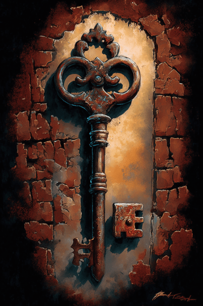

# 钥匙(COD-废城)  
> 一把钥匙，需要宝箱  
  
<table class="table table-bordered" data-toggle="table"  data-show-header="false"><thead style="display:none"><tr ><th  style="width:50%;text-align:left;vertical-align:top;"  >title</th><th  style="width:50%;text-align:left;vertical-align:top;"  ></th></tr></thead><tr ><td  style="width:50%;text-align:left;vertical-align:top;"  >**重量：**100  **标签：**	[“装饰品”](tag_Decoration.md), [“高级装饰品”](tag_DecorationAdv.md), [“美丽的/好看的”](tag_Pretty.md), </td><td  style="width:50%;text-align:left;vertical-align:top;"  >

<a href="cod_town一把钥匙.md" style="color:black">钥匙</a>

</td></tr></tbody></table>  
  
## 获取来源  

搜索

[破箱子](cod_废墟3箱子.md)

  
  

