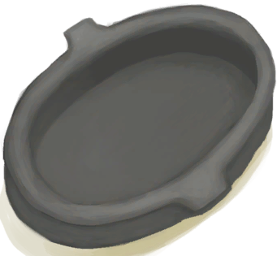
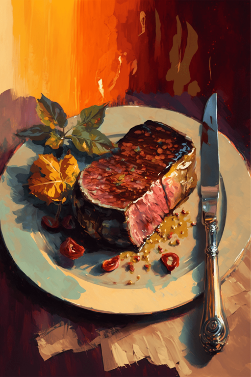

# 破箱子(COD-废城)  
> 破旧的箱子  
  
<table class="table table-bordered" data-toggle="table"  data-show-header="false"><thead style="display:none"><tr ><th  style="width:50%;text-align:left;vertical-align:top;"  >title</th><th  style="width:50%;text-align:left;vertical-align:top;"  ></th></tr></thead><tr ><td  style="width:50%;text-align:left;vertical-align:top;"  >**重量：**25  **可用次数：**10</td><td  style="width:50%;text-align:left;vertical-align:top;"  >

<a href="cod_一小袋铸币.md" style="color:black">破箱子</a>

</td></tr></tbody></table>  
  
## 获取来源  

搜索

[破箱子](cod_废墟3箱子.md)

蓝图制造

[购买10个蛇草(蓝图)](cod_50铸币蓝图.md)

蓝图制造

[购买10个蛇草(蓝图)](cod_出售红砖.md)

蓝图制造

[购买10个蛇草(蓝图)](cod_出售公山羊.md)

蓝图制造

[购买10个蛇草(蓝图)](cod_出售公野猪.md)

蓝图制造

[购买10个蛇草(蓝图)](cod_出售山羊.md)

蓝图制造

[购买10个蛇草(蓝图)](cod_出售巨蜥.md)

** 使用**[山羊尸体(公)](GoatCarcassMale.md) , [山羊尸体(母)](GoatCarcassFemale.md)交易

[破败轮船](cod_Garvin.md)

** 使用**[猕猴尸体](MacaqueCarcass.md)交易

[破败轮船](cod_Garvin.md)

  
  
## 动作  

<table><tr><td rowspan="2" style="width:200px;text-align:center;font-size:1.3em;font-weight:bold">

搜索

</td><td></td></tr><tr><td><b>自身：</b>使用次数  <b>-10(-100%)</b></td></tr><tr><td colspan="2">[

[铸币](cod_铸币.md)](cod_铸币.md)(<b>+10</b>)</td></tr></table>
  
  
  
## 可用于蓝图  

<a href="cod_购买代金券.md" style="color:black">购买10个蛇草</a>

<a href="cod_购买外星种子.md" style="color:black">购买10个蛇草</a>

<a href="cod_购买大腰包.md" style="color:black">购买10个蛇草</a>

<a href="cod_购买小型熔炉.md" style="color:black">购买10个蛇草</a>

<a href="cod_购买工具箱.md" style="color:black">购买10个蛇草</a>

<a href="cod_购买左轮.md" style="color:black">购买10个蛇草</a>

<a href="cod_购买无人机.md" style="color:black">购买10个蛇草</a>

<a href="cod_购买泥锅.md" style="color:black">购买10个蛇草</a>

<a href="cod_购买鱼罐头配方.md" style="color:black">购买10个蛇草</a>

<a href="cod_V我50套餐.md" style="color:black">购买10个蛇草</a>

<a href="cod_沙拉套餐.md" style="color:black">购买10个蛇草</a>

<a href="cod_火鸡菜谱.md" style="color:black">购买10个蛇草</a>

<a href="cod_牛排套餐.md" style="color:black">购买10个蛇草</a>

<a href="cod_猪排豆子套餐.md" style="color:black">购买10个蛇草</a>

<a href="cod_红烧鱼菜谱.md" style="color:black">购买10个蛇草</a>

<a href="cod_面包套餐.md" style="color:black">购买10个蛇草</a>

  
  
  
## 属性   

<table style="margin-bottom:0px;"><tr><td style="width:30%;text-align:left; background-color:#FEFEFE;font-size:1.3em;font-weight:bold;">使用次数</td><td style="font-size:1em;background-color:#FEFEFE">初始：10 , 最大：10 -</td></tr><tr style="background-color:#FFFFFF"><td colspan=2>** 到达0时： ** 自身: →消失</td></tr></table>
  

