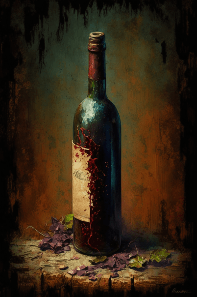

# 一瓶红酒(COD-废城)  
> 什么？82年的？  
  
<table class="table table-bordered" data-toggle="table"  data-show-header="false"><thead style="display:none"><tr ><th  style="width:50%;text-align:left;vertical-align:top;"  >title</th><th  style="width:50%;text-align:left;vertical-align:top;"  ></th></tr></thead><tr ><td  style="width:50%;text-align:left;vertical-align:top;"  >**重量：**150  **标签：**	</td><td  style="width:50%;text-align:left;vertical-align:top;"  >

<a href="cod_一瓶红酒.md" style="color:black">一瓶红酒</a>

</td></tr></tbody></table>  
  
## 获取来源  

search

[Shabby cabinet(红色砖房)](cod_红砖房柜子.md)

蓝图制造

[红酒猪肉(蓝图)](cod_购买零食7.md)

蓝图制造

[木箱任务(蓝图)](cod_尼根任务蓝图1.md)

搜索

[柜子(船舱)](cod_船舱柜子.md)

搜索

[破旧邮轮酒吧(破败轮船)](cod_邮轮酒吧.md)

  
  
## 动作  

<table><tr><td rowspan="2" style="width:200px;text-align:center;font-size:1.3em;font-weight:bold">

饮用

15分

</td><td>[“进食动作(组)”](EatingAction.md)</td></tr><tr><td><b>自身：</b>→消失</td></tr><tr><td colspan="2"><b>状态变化：</b>[

[饱食](Satiation.md)](Satiation.md)<b>+25</b>, [

[胃](Stomach.md)](Stomach.md)<b>+10</b>, [

[水分](Hydration.md)](Hydration.md)<b>+50</b>, [

[镇痛](Analgesia.md)](Analgesia.md)<b>+192</b>, [

[酒精](Alcohol.md)](Alcohol.md)<b>+48</b>, [

[压力](Stress.md)](Stress.md)<b>-50</b>, [

[情绪](Morale.md)](Morale.md)<b>+50</b>, [

[世界观](Structure.md)](Structure.md)<b>+100</b></td></tr></table>
  
  
  

